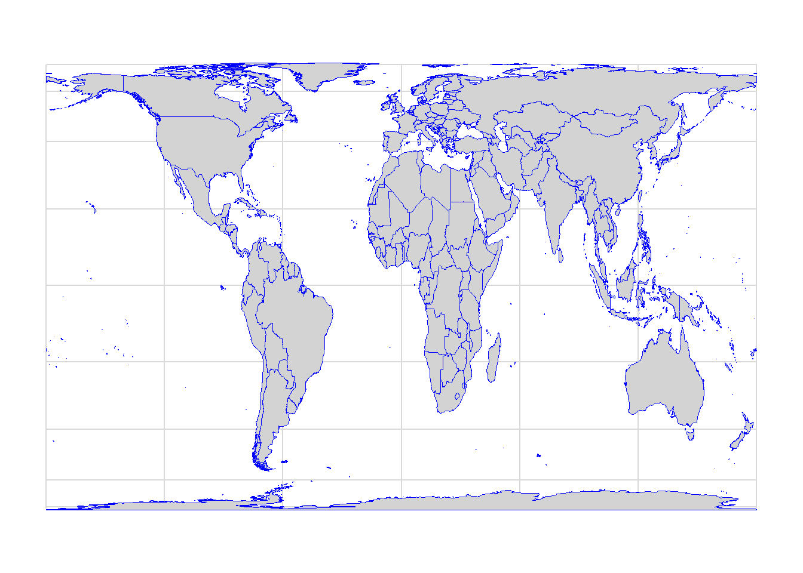

# Introduction to Cartography {.unnumbered}


Cartography is the study and practice of creating charts and maps based
on geographical layout.

It combines science and art to represent reality (or an imagined
reality) so that spatial information can be communicated effectively.

Cartography is most often associated with the paper map, but it may also
refer to the creation of globes, and increasingly it refers to the use
of digital computers to display of geographic information.

## History {.unnumbered}

Before jumping into the art of map making, let's explore the history of
cartography through some notable maps.

**Çatalhöyük Map**

The oldest existing map was created around 6200 BC in Turkey. It may
depict a volcanic eruption 8,900 years ago.

<center></center>

<center>Çatalhöyük Map (Source: Cartography blog)</center>

<br>

**Babylonian Map of the World**

The Babylonian Map of the World or *Imago Mundi* is a Babylonian clay
tablet containing a labelled illustration of the known world dated to
roughly the 6th century BC.

<center></center>

<center>Imago Mundi (Source: Wikipedia)</center>

<br>

**Anaximander map**

This map was one of the first maps of the world which was circular in
form and showed the known lands grouped around the Aegean Sea at the
center, surrounded by the ocean.

<center></center>

<center>Reconstruction of Anaximander’s Map (Source: Digital Maps of the
Ancient World)</center>

<br>

**Ptolemy map**

Ptolemy's world map represents how the world was known to the
Hellenistic society in the 2nd century. Ptolemy's book *Geographica* was
written around the year 150 AD and contains the first reference to the
latitude and longitude system which had a significant impact on the work
of later cartographers.

<center></center>

<center>Ptolemy map of the world (Source: Wikipedia)</center>

<br>

**Tabula Rogeriana**

*Tabula Rogeriana* is a world map created by the Arab geographer
Muhammad al-Idrisi in 1154. The map was later used by Christopher
Columbus and Vasco Da Gama for their voyages in America and India.

<center></center>

<center>Tabula Rogeriana (Source: Wikipedia)</center>

<br>

**Mappa mundi**

*Mappa mundi* is the largest and most elaborately drawn and coloured
medieval map. It is displayed at Hereford Cathedral in England.

<center></center>

<center>Mappa mundi (Source: Wikipedia)</center>

<br>

**Cantino planisphere**

Made by an anonymous cartographer, this map depicts the world as it
became known to the Europeans after the great exploration voyages at the
end of the 15th and beginning of the 16th century.

<center></center>

<center>Cantino world map (Source: Wikipedia)</center>

<br>

**Mercator map**

The Mercator map was created by Flemish geographer and cartographer
Gerardus Mercator in 1569. This was the first attempt to project Earth
on a flat surface.

<center></center>

<center>Mercator map (Source: Wikipedia)</center>

<br>

**John Snow's map**

In 1854 Doctor John Snow mapped the cases of the deadly cholera epidemic
in London's Broad Street region and was able to trace the cholera
outbreak to a single infected water pump. Snow's research was the first
example of combining public health research and geography.

<center></center>

<center>John Snow's cholera map - the black circles stacked show the the
number of cases (Source: NG)</center>

<br>

**Hurricane map**

Thanks to the advance of computer technology since the 1970s, maps
nowadays are predominantly made with computer software. The map below
was made using one of the ArcGIS products. It shows all the hurricane
tracks since 1851, symbolised as fireflies, utilising lightsaber
colours. *(Find out more about how this map was made
[here](https://www.arcgis.com/apps/Cascade/index.html?appid=3e04cf33cd9747f2b553e14b92a188b9){target="_blank"}.)*

<center></center>

<center>Hurricane map (Source: Esri/John Nelson)</center>

<br>

**Interactive story maps**

The use of interactive maps to tell stories is increasingly common,
especially in journalism. The interactive story map below was made by
The New York Times and it tells the story of how the SARS-CoV-2 virus
got out of Wuhan, China.

<center><a target="_blank" href="https://www.nytimes.com/interactive/2020/03/22/world/coronavirus-spread.html"></a></center>

<center>How the Virus Got Out (Source: The New York Times) <br> *Click
on the image to see the map*</center>

<br>

**Real-time maps**

Earth Wind Map

The Earth Wind Map was developed by [Cameron
Beccario](https://twitter.com/cambecc?lang=en){target="_blank"} in 2013.
It combines computer science and cartography to visualise real-time
data.

<center><a target="_blank" href="https://earth.nullschool.net/#current/wind/surface/level/orthographic=-24.56,27.33,325"></a></center>

<center>Earth Wind Map<br> *Click on the image to see the map*</center>

<br>

Surfers Against Sewage

<center><a target="_blank" href="https://www.sas.org.uk/map/"></a></center>

<center>Sewage alerts<br> *Click on the image to see the map*</center>

<br>

The Rivers Trust

<center><a target="_blank" href="https://experience.arcgis.com/experience/e834e261b53740eba2fe6736e37bbc7b"></a></center>

<center>Is your river fit to play in?<br> *Click on the image to see the
map*</center>

<br>

## Map making process {.unnumbered}

Let's now think about the process of making maps and some of the things
that should be considered.

-   Purpose of the map: Why am I making this map? What is the story that
    I want to tell?

-   Audience: Who is it for? Novices? Experts? Why are they interested?

-   Map type: What do I want to show with the map? What kind of data am
    I using?

-   Map design: Is my map easy to read and interpret? Am I using visual
    variables and hierarchy in a right way? Is my map the right scale?

Also, keep in mind that maps act as a communication tool so it is very
important to remain truthful and impartial during the map making
process.

**Terminology:**

**Map**: A map is a graphic summary of the world around us. A map is
scaled down, simplified and the objects are presented as symbols.

**Mapping**: Mapping refers to all of the processes of producing a map:
collecting data, designing and preparing for distribution in hardcopy or
for the Internet.

**Cartography**: Cartography is a broader discipline than mapping as it
also includes the study of the philosophical and theoretical bases of
the rules for mapmaking. Many cartographers now prefer the term
*geovisualisation* and many GIS professionals consider themselves expert
in the design of maps.

## Map types {.unnumbered}

There are many different types of maps, which are usually classified
according to what kind of information they want to show.

### General or reference maps {.unnumbered}

Reference maps are for a general audience to emphasize a variety of
natural and man-made features. It is used for a wide variety of
activities.


```{=html}
<div class="leaflet html-widget html-fill-item" id="htmlwidget-a65613a0bdf7dcc1dc69" style="width:100%;height:480px;"></div>
<script type="application/json" data-for="htmlwidget-a65613a0bdf7dcc1dc69">{"x":{"options":{"crs":{"crsClass":"L.CRS.EPSG3857","code":null,"proj4def":null,"projectedBounds":null,"options":{}}},"calls":[{"method":"addTiles","args":["https://{s}.tile.openstreetmap.org/{z}/{x}/{y}.png",null,null,{"errorTileUrl":"","noWrap":false,"detectRetina":false,"minZoom":10,"maxZoom":18,"attribution":"&copy; <a href=\"https://openstreetmap.org/copyright/\">OpenStreetMap<\/a>,  <a href=\"https://opendatacommons.org/licenses/odbl/\">ODbL<\/a>"}]}],"setView":[[51.52,-0.1],14,[]]},"evals":[],"jsHooks":[]}</script>
```


<center>Reference map</center>

<br>

### Thematic maps {.unnumbered}

Thematic maps highlight features, data (qualitative, quantitative or
both) or concepts related to single subject.

-   Qualitative maps show the spatial distribution of single theme of
    nominal data (e.g. time zones).

<center></center>

<center>Time zones</center>

<br>

-   Quantitative maps display the spatial aspects of numerical data
    (single, multiple). These can be choropleth and isopleth maps (for
    showing continuous data), dot density and proportional/graduated
    symbol maps (for showing discrete data).


<center>Population per state in 2019 - choropleth map</center>

<br>

<center></center>

<center>2011 Tōhoku tsunami (Source: Esri) - isopleth map</center>

<br>

<center></center>

<center>Spread of SARS-CoV-2 in London (March 2020) - dot density
map</center>

<br>


<center>The 1000 biggest cities in mainland US - proportional/graduated
symbol map</center>

<br>

Cartogram is a type of thematic map (a variant of the
proportional/graduated symbol maps) where data is mapped by altering the
shape and size of an area based on the data associated with the area.


<center>Population per state in 2019 - cartogram</center>

<br>

Other cartogram types include *gridmap*, *dorling* and *tilegram*.


<center>US Election 2020 - gridmap</center>

<br>


```{=html}
<div class="plotly html-widget html-fill-item" id="htmlwidget-f7e144d8b9b1fe125b2f" style="width:100%;height:480px;"></div>
<script type="application/json" data-for="htmlwidget-f7e144d8b9b1fe125b2f">{"x":{"data":[{"x":[-17811118.526923772,-17811118.526923772,-17811118.526923772,-17811118.526923772,-17811118.526923772,-17811118.526923772,-17811118.526923772,-17811118.526923772,-17811118.526923772,-17811118.526923772,-17811118.526923772,-17811118.526923772,-17811118.526923772,-17811118.526923772,-17811118.526923772,-17811118.526923772,-17811118.526923772,-17811118.526923772,-17811118.526923772,-17811118.526923772,-17811118.526923772,-17811118.526923772,-17811118.526923772,-17811118.526923772,-17811118.526923772,-17811118.526923772,-17811118.526923772,-17811118.526923772,-17811118.526923772,-17811118.526923772,-17811118.526923772,-17811118.526923772,-17811118.526923772,-17811118.526923772,-17811118.526923772,-17811118.526923772,-17811118.526923772,-17811118.526923772,-17811118.526923772,-17811118.526923772,-17811118.526923772,-17811118.526923772,-17811118.526923772,-17811118.526923772,-17811118.526923772,-17811118.526923772,-17811118.526923772,-17811118.526923772,-17811118.526923772,-17811118.526923772,-17811118.526923772,-17811118.526923772,-17811118.526923772,-17811118.526923772,-17811118.526923772,-17811118.526923772,-17811118.526923772,-17811118.526923772,-17811118.526923772,-17811118.526923772,-17811118.526923772,-17811118.526923772,-17811118.526923772,-17811118.526923772,-17811118.526923772,-17811118.526923772,-17811118.526923772,-17811118.526923772,-17811118.526923772,-17811118.526923772,-17811118.526923772,-17811118.526923772,-17811118.526923772,-17811118.526923772,-17811118.526923772,-17811118.526923772,-17811118.526923772,-17811118.526923772,-17811118.526923772,-17811118.526923772,-17811118.526923772,-17811118.526923772,-17811118.526923772,-17811118.526923772,-17811118.526923772,-17811118.526923772,-17811118.526923772,-17811118.526923772,-17811118.526923772,-17811118.526923772,-17811118.526923772,null,-15584728.711058298,-15584728.711058298,-15584728.711058298,-15584728.711058298,-15584728.711058298,-15584728.711058298,-15584728.711058298,-15584728.711058298,-15584728.711058298,-15584728.711058298,-15584728.711058298,-15584728.711058298,-15584728.711058298,-15584728.711058298,-15584728.711058298,-15584728.711058298,-15584728.711058298,-15584728.711058298,-15584728.711058298,-15584728.711058298,-15584728.711058298,-15584728.711058298,-15584728.711058298,-15584728.711058298,-15584728.711058298,-15584728.711058298,-15584728.711058298,-15584728.711058298,-15584728.711058298,-15584728.711058298,-15584728.711058298,-15584728.711058298,-15584728.711058298,-15584728.711058298,-15584728.711058298,-15584728.711058298,-15584728.711058298,-15584728.711058298,-15584728.711058298,-15584728.711058298,-15584728.711058298,-15584728.711058298,-15584728.711058298,-15584728.711058298,-15584728.711058298,-15584728.711058298,-15584728.711058298,-15584728.711058298,-15584728.711058298,-15584728.711058298,-15584728.711058298,-15584728.711058298,-15584728.711058298,-15584728.711058298,-15584728.711058298,-15584728.711058298,-15584728.711058298,-15584728.711058298,-15584728.711058298,-15584728.711058298,-15584728.711058298,-15584728.711058298,-15584728.711058298,-15584728.711058298,-15584728.711058298,-15584728.711058298,-15584728.711058298,-15584728.711058298,-15584728.711058298,-15584728.711058298,-15584728.711058298,-15584728.711058298,-15584728.711058298,-15584728.711058298,-15584728.711058298,-15584728.711058298,-15584728.711058298,-15584728.711058298,-15584728.711058298,-15584728.711058298,-15584728.711058298,-15584728.711058298,-15584728.711058298,-15584728.711058298,-15584728.711058298,-15584728.711058298,-15584728.711058298,-15584728.711058298,-15584728.711058298,-15584728.711058298,-15584728.711058298,null,-13358338.895192828,-13358338.895192828,-13358338.895192828,-13358338.895192828,-13358338.895192828,-13358338.895192828,-13358338.895192828,-13358338.895192828,-13358338.895192828,-13358338.895192828,-13358338.895192828,-13358338.895192828,-13358338.895192828,-13358338.895192828,-13358338.895192828,-13358338.895192828,-13358338.895192828,-13358338.895192828,-13358338.895192828,-13358338.895192828,-13358338.895192828,-13358338.895192828,-13358338.895192828,-13358338.895192828,-13358338.895192828,-13358338.895192828,-13358338.895192828,-13358338.895192828,-13358338.895192828,-13358338.895192828,-13358338.895192828,-13358338.895192828,-13358338.895192828,-13358338.895192828,-13358338.895192828,-13358338.895192828,-13358338.895192828,-13358338.895192828,-13358338.895192828,-13358338.895192828,-13358338.895192828,-13358338.895192828,-13358338.895192828,-13358338.895192828,-13358338.895192828,-13358338.895192828,-13358338.895192828,-13358338.895192828,-13358338.895192828,-13358338.895192828,-13358338.895192828,-13358338.895192828,-13358338.895192828,-13358338.895192828,-13358338.895192828,-13358338.895192828,-13358338.895192828,-13358338.895192828,-13358338.895192828,-13358338.895192828,-13358338.895192828,-13358338.895192828,-13358338.895192828,-13358338.895192828,-13358338.895192828,-13358338.895192828,-13358338.895192828,-13358338.895192828,-13358338.895192828,-13358338.895192828,-13358338.895192828,-13358338.895192828,-13358338.895192828,-13358338.895192828,-13358338.895192828,-13358338.895192828,-13358338.895192828,-13358338.895192828,-13358338.895192828,-13358338.895192828,-13358338.895192828,-13358338.895192828,-13358338.895192828,-13358338.895192828,-13358338.895192828,-13358338.895192828,-13358338.895192828,-13358338.895192828,-13358338.895192828,-13358338.895192828,-13358338.895192828,null,-11131949.079327356,-11131949.079327356,-11131949.079327356,-11131949.079327356,-11131949.079327356,-11131949.079327356,-11131949.079327356,-11131949.079327356,-11131949.079327356,-11131949.079327356,-11131949.079327356,-11131949.079327356,-11131949.079327356,-11131949.079327356,-11131949.079327356,-11131949.079327356,-11131949.079327356,-11131949.079327356,-11131949.079327356,-11131949.079327356,-11131949.079327356,-11131949.079327356,-11131949.079327356,-11131949.079327356,-11131949.079327356,-11131949.079327356,-11131949.079327356,-11131949.079327356,-11131949.079327356,-11131949.079327356,-11131949.079327356,-11131949.079327356,-11131949.079327356,-11131949.079327356,-11131949.079327356,-11131949.079327356,-11131949.079327356,-11131949.079327356,-11131949.079327356,-11131949.079327356,-11131949.079327356,-11131949.079327356,-11131949.079327356,-11131949.079327356,-11131949.079327356,-11131949.079327356,-11131949.079327356,-11131949.079327356,-11131949.079327356,-11131949.079327356,-11131949.079327356,-11131949.079327356,-11131949.079327356,-11131949.079327356,-11131949.079327356,-11131949.079327356,-11131949.079327356,-11131949.079327356,-11131949.079327356,-11131949.079327356,-11131949.079327356,-11131949.079327356,-11131949.079327356,-11131949.079327356,-11131949.079327356,-11131949.079327356,-11131949.079327356,-11131949.079327356,-11131949.079327356,-11131949.079327356,-11131949.079327356,-11131949.079327356,-11131949.079327356,-11131949.079327356,-11131949.079327356,-11131949.079327356,-11131949.079327356,-11131949.079327356,-11131949.079327356,-11131949.079327356,-11131949.079327356,-11131949.079327356,-11131949.079327356,-11131949.079327356,-11131949.079327356,-11131949.079327356,-11131949.079327356,-11131949.079327356,-11131949.079327356,-11131949.079327356,-11131949.079327356,null,-8905559.263461886,-8905559.263461886,-8905559.263461886,-8905559.263461886,-8905559.263461886,-8905559.263461886,-8905559.263461886,-8905559.263461886,-8905559.263461886,-8905559.263461886,-8905559.263461886,-8905559.263461886,-8905559.263461886,-8905559.263461886,-8905559.263461886,-8905559.263461886,-8905559.263461886,-8905559.263461886,-8905559.263461886,-8905559.263461886,-8905559.263461886,-8905559.263461886,-8905559.263461886,-8905559.263461886,-8905559.263461886,-8905559.263461886,-8905559.263461886,-8905559.263461886,-8905559.263461886,-8905559.263461886,-8905559.263461886,-8905559.263461886,-8905559.263461886,-8905559.263461886,-8905559.263461886,-8905559.263461886,-8905559.263461886,-8905559.263461886,-8905559.263461886,-8905559.263461886,-8905559.263461886,-8905559.263461886,-8905559.263461886,-8905559.263461886,-8905559.263461886,-8905559.263461886,-8905559.263461886,-8905559.263461886,-8905559.263461886,-8905559.263461886,-8905559.263461886,-8905559.263461886,-8905559.263461886,-8905559.263461886,-8905559.263461886,-8905559.263461886,-8905559.263461886,-8905559.263461886,-8905559.263461886,-8905559.263461886,-8905559.263461886,-8905559.263461886,-8905559.263461886,-8905559.263461886,-8905559.263461886,-8905559.263461886,-8905559.263461886,-8905559.263461886,-8905559.263461886,-8905559.263461886,-8905559.263461886,-8905559.263461886,-8905559.263461886,-8905559.263461886,-8905559.263461886,-8905559.263461886,-8905559.263461886,-8905559.263461886,-8905559.263461886,-8905559.263461886,-8905559.263461886,-8905559.263461886,-8905559.263461886,-8905559.263461886,-8905559.263461886,-8905559.263461886,-8905559.263461886,-8905559.263461886,-8905559.263461886,-8905559.263461886,-8905559.263461886,null,-6679169.447596414,-6679169.447596414,-6679169.447596414,-6679169.447596414,-6679169.447596414,-6679169.447596414,-6679169.447596414,-6679169.447596414,-6679169.447596414,-6679169.447596414,-6679169.447596414,-6679169.447596414,-6679169.447596414,-6679169.447596414,-6679169.447596414,-6679169.447596414,-6679169.447596414,-6679169.447596414,-6679169.447596414,-6679169.447596414,-6679169.447596414,-6679169.447596414,-6679169.447596414,-6679169.447596414,-6679169.447596414,-6679169.447596414,-6679169.447596414,-6679169.447596414,-6679169.447596414,-6679169.447596414,-6679169.447596414,-6679169.447596414,-6679169.447596414,-6679169.447596414,-6679169.447596414,-6679169.447596414,-6679169.447596414,-6679169.447596414,-6679169.447596414,-6679169.447596414,-6679169.447596414,-6679169.447596414,-6679169.447596414,-6679169.447596414,-6679169.447596414,-6679169.447596414,-6679169.447596414,-6679169.447596414,-6679169.447596414,-6679169.447596414,-6679169.447596414,-6679169.447596414,-6679169.447596414,-6679169.447596414,-6679169.447596414,-6679169.447596414,-6679169.447596414,-6679169.447596414,-6679169.447596414,-6679169.447596414,-6679169.447596414,-6679169.447596414,-6679169.447596414,-6679169.447596414,-6679169.447596414,-6679169.447596414,-6679169.447596414,-6679169.447596414,-6679169.447596414,-6679169.447596414,-6679169.447596414,-6679169.447596414,-6679169.447596414,-6679169.447596414,-6679169.447596414,-6679169.447596414,-6679169.447596414,-6679169.447596414,-6679169.447596414,-6679169.447596414,-6679169.447596414,-6679169.447596414,-6679169.447596414,-6679169.447596414,-6679169.447596414,-6679169.447596414,-6679169.447596414,-6679169.447596414,-6679169.447596414,-6679169.447596414,-6679169.447596414,null,-18276149.747260328,-18148450.31720642,-17991028.815074515,-17833607.312942617,-17676185.810810711,-17518764.308678813,-17361342.806546908,-17203921.304415006,-17046499.802283105,-16889078.300151203,-16731656.798019301,-16574235.295887398,-16416813.793755494,-16259392.291623594,-16101970.789491691,-15944549.287359789,-15787127.785227887,-15629706.283095989,-15472284.780964086,-15314863.278832182,-15157441.776700282,-15000020.274568379,-14842598.772436477,-14685177.270304574,-14527755.768172674,-14370334.26604077,-14212912.763908867,-14055491.261776965,-13898069.759645063,-13740648.257513164,-13583226.75538126,-13425805.253249358,-13268383.751117457,-13110962.248985553,-12953540.746853651,-12796119.244721748,-12638697.742589848,-12481276.240457945,-12323854.738326043,-12166433.236194141,-12009011.73406224,-11851590.231930338,-11694168.729798436,-11536747.227666531,-11379325.725534633,-11221904.223402729,-11064482.721270826,-10907061.219138926,-10749639.717007022,-10592218.214875123,-10434796.712743221,-10277375.210611317,-10119953.708479416,-9962532.2063475139,-9805110.7042156104,-9647689.2020837106,-9490267.699951807,-9332846.1978199054,-9175424.6956880037,-9018003.193556102,-8860581.6914241984,-8703160.1892922986,-8545738.6871603951,-8388317.1850284915,-8230895.6828965917,-8073474.18076469,-7916052.6786327884,-7758631.1765008867,-7601209.6743689831,-7443788.1722370815,-7286366.6701051779,-7128945.1679732762,-6971523.6658413727,-6814102.1637094729,-6656680.6615775693,-6499259.1594456695,-6341837.6573137678,-6184416.1551818661,-6026994.6530499645,-5869573.1509180609,-5712151.6487861611,-5554730.1466542557,-5397308.644522354,-5366702.8386935033,null,-18276149.747260328,-18148450.31720642,-17991028.815074515,-17833607.312942617,-17676185.810810711,-17518764.308678813,-17361342.806546908,-17203921.304415006,-17046499.802283105,-16889078.300151203,-16731656.798019301,-16574235.295887398,-16416813.793755494,-16259392.291623594,-16101970.789491691,-15944549.287359789,-15787127.785227887,-15629706.283095989,-15472284.780964086,-15314863.278832182,-15157441.776700282,-15000020.274568379,-14842598.772436477,-14685177.270304574,-14527755.768172674,-14370334.26604077,-14212912.763908867,-14055491.261776965,-13898069.759645063,-13740648.257513164,-13583226.75538126,-13425805.253249358,-13268383.751117457,-13110962.248985553,-12953540.746853651,-12796119.244721748,-12638697.742589848,-12481276.240457945,-12323854.738326043,-12166433.236194141,-12009011.73406224,-11851590.231930338,-11694168.729798436,-11536747.227666531,-11379325.725534633,-11221904.223402729,-11064482.721270826,-10907061.219138926,-10749639.717007022,-10592218.214875123,-10434796.712743221,-10277375.210611317,-10119953.708479416,-9962532.2063475139,-9805110.7042156104,-9647689.2020837106,-9490267.699951807,-9332846.1978199054,-9175424.6956880037,-9018003.193556102,-8860581.6914241984,-8703160.1892922986,-8545738.6871603951,-8388317.1850284915,-8230895.6828965917,-8073474.18076469,-7916052.6786327884,-7758631.1765008867,-7601209.6743689831,-7443788.1722370815,-7286366.6701051779,-7128945.1679732762,-6971523.6658413727,-6814102.1637094729,-6656680.6615775693,-6499259.1594456695,-6341837.6573137678,-6184416.1551818661,-6026994.6530499645,-5869573.1509180609,-5712151.6487861611,-5554730.1466542557,-5397308.644522354,-5366702.8386935033,null,-18276149.747260328,-18148450.31720642,-17991028.815074515,-17833607.312942617,-17676185.810810711,-17518764.308678813,-17361342.806546908,-17203921.304415006,-17046499.802283105,-16889078.300151203,-16731656.798019301,-16574235.295887398,-16416813.793755494,-16259392.291623594,-16101970.789491691,-15944549.287359789,-15787127.785227887,-15629706.283095989,-15472284.780964086,-15314863.278832182,-15157441.776700282,-15000020.274568379,-14842598.772436477,-14685177.270304574,-14527755.768172674,-14370334.26604077,-14212912.763908867,-14055491.261776965,-13898069.759645063,-13740648.257513164,-13583226.75538126,-13425805.253249358,-13268383.751117457,-13110962.248985553,-12953540.746853651,-12796119.244721748,-12638697.742589848,-12481276.240457945,-12323854.738326043,-12166433.236194141,-12009011.73406224,-11851590.231930338,-11694168.729798436,-11536747.227666531,-11379325.725534633,-11221904.223402729,-11064482.721270826,-10907061.219138926,-10749639.717007022,-10592218.214875123,-10434796.712743221,-10277375.210611317,-10119953.708479416,-9962532.2063475139,-9805110.7042156104,-9647689.2020837106,-9490267.699951807,-9332846.1978199054,-9175424.6956880037,-9018003.193556102,-8860581.6914241984,-8703160.1892922986,-8545738.6871603951,-8388317.1850284915,-8230895.6828965917,-8073474.18076469,-7916052.6786327884,-7758631.1765008867,-7601209.6743689831,-7443788.1722370815,-7286366.6701051779,-7128945.1679732762,-6971523.6658413727,-6814102.1637094729,-6656680.6615775693,-6499259.1594456695,-6341837.6573137678,-6184416.1551818661,-6026994.6530499645,-5869573.1509180609,-5712151.6487861611,-5554730.1466542557,-5397308.644522354,-5366702.8386935033,null,-18276149.747260328,-18148450.31720642,-17991028.815074515,-17833607.312942617,-17676185.810810711,-17518764.308678813,-17361342.806546908,-17203921.304415006,-17046499.802283105,-16889078.300151203,-16731656.798019301,-16574235.295887398,-16416813.793755494,-16259392.291623594,-16101970.789491691,-15944549.287359789,-15787127.785227887,-15629706.283095989,-15472284.780964086,-15314863.278832182,-15157441.776700282,-15000020.274568379,-14842598.772436477,-14685177.270304574,-14527755.768172674,-14370334.26604077,-14212912.763908867,-14055491.261776965,-13898069.759645063,-13740648.257513164,-13583226.75538126,-13425805.253249358,-13268383.751117457,-13110962.248985553,-12953540.746853651,-12796119.244721748,-12638697.742589848,-12481276.240457945,-12323854.738326043,-12166433.236194141,-12009011.73406224,-11851590.231930338,-11694168.729798436,-11536747.227666531,-11379325.725534633,-11221904.223402729,-11064482.721270826,-10907061.219138926,-10749639.717007022,-10592218.214875123,-10434796.712743221,-10277375.210611317,-10119953.708479416,-9962532.2063475139,-9805110.7042156104,-9647689.2020837106,-9490267.699951807,-9332846.1978199054,-9175424.6956880037,-9018003.193556102,-8860581.6914241984,-8703160.1892922986,-8545738.6871603951,-8388317.1850284915,-8230895.6828965917,-8073474.18076469,-7916052.6786327884,-7758631.1765008867,-7601209.6743689831,-7443788.1722370815,-7286366.6701051779,-7128945.1679732762,-6971523.6658413727,-6814102.1637094729,-6656680.6615775693,-6499259.1594456695,-6341837.6573137678,-6184416.1551818661,-6026994.6530499645,-5869573.1509180609,-5712151.6487861611,-5554730.1466542557,-5397308.644522354,-5366702.8386935033,null,-18276149.747260328,-18148450.31720642,-17991028.815074515,-17833607.312942617,-17676185.810810711,-17518764.308678813,-17361342.806546908,-17203921.304415006,-17046499.802283105,-16889078.300151203,-16731656.798019301,-16574235.295887398,-16416813.793755494,-16259392.291623594,-16101970.789491691,-15944549.287359789,-15787127.785227887,-15629706.283095989,-15472284.780964086,-15314863.278832182,-15157441.776700282,-15000020.274568379,-14842598.772436477,-14685177.270304574,-14527755.768172674,-14370334.26604077,-14212912.763908867,-14055491.261776965,-13898069.759645063,-13740648.257513164,-13583226.75538126,-13425805.253249358,-13268383.751117457,-13110962.248985553,-12953540.746853651,-12796119.244721748,-12638697.742589848,-12481276.240457945,-12323854.738326043,-12166433.236194141,-12009011.73406224,-11851590.231930338,-11694168.729798436,-11536747.227666531,-11379325.725534633,-11221904.223402729,-11064482.721270826,-10907061.219138926,-10749639.717007022,-10592218.214875123,-10434796.712743221,-10277375.210611317,-10119953.708479416,-9962532.2063475139,-9805110.7042156104,-9647689.2020837106,-9490267.699951807,-9332846.1978199054,-9175424.6956880037,-9018003.193556102,-8860581.6914241984,-8703160.1892922986,-8545738.6871603951,-8388317.1850284915,-8230895.6828965917,-8073474.18076469,-7916052.6786327884,-7758631.1765008867,-7601209.6743689831,-7443788.1722370815,-7286366.6701051779,-7128945.1679732762,-6971523.6658413727,-6814102.1637094729,-6656680.6615775693,-6499259.1594456695,-6341837.6573137678,-6184416.1551818661,-6026994.6530499645,-5869573.1509180609,-5712151.6487861611,-5554730.1466542557,-5397308.644522354,-5366702.8386935033,null,-18276149.747260328,-18148450.31720642,-17991028.815074515,-17833607.312942617,-17676185.810810711,-17518764.308678813,-17361342.806546908,-17203921.304415006,-17046499.802283105,-16889078.300151203,-16731656.798019301,-16574235.295887398,-16416813.793755494,-16259392.291623594,-16101970.789491691,-15944549.287359789,-15787127.785227887,-15629706.283095989,-15472284.780964086,-15314863.278832182,-15157441.776700282,-15000020.274568379,-14842598.772436477,-14685177.270304574,-14527755.768172674,-14370334.26604077,-14212912.763908867,-14055491.261776965,-13898069.759645063,-13740648.257513164,-13583226.75538126,-13425805.253249358,-13268383.751117457,-13110962.248985553,-12953540.746853651,-12796119.244721748,-12638697.742589848,-12481276.240457945,-12323854.738326043,-12166433.236194141,-12009011.73406224,-11851590.231930338,-11694168.729798436,-11536747.227666531,-11379325.725534633,-11221904.223402729,-11064482.721270826,-10907061.219138926,-10749639.717007022,-10592218.214875123,-10434796.712743221,-10277375.210611317,-10119953.708479416,-9962532.2063475139,-9805110.7042156104,-9647689.2020837106,-9490267.699951807,-9332846.1978199054,-9175424.6956880037,-9018003.193556102,-8860581.6914241984,-8703160.1892922986,-8545738.6871603951,-8388317.1850284915,-8230895.6828965917,-8073474.18076469,-7916052.6786327884,-7758631.1765008867,-7601209.6743689831,-7443788.1722370815,-7286366.6701051779,-7128945.1679732762,-6971523.6658413727,-6814102.1637094729,-6656680.6615775693,-6499259.1594456695,-6341837.6573137678,-6184416.1551818661,-6026994.6530499645,-5869573.1509180609,-5712151.6487861611,-5554730.1466542557,-5397308.644522354,-5366702.8386935033],"y":[484945.50595011201,547977.88853797724,626502.80382120924,705125.03821256466,783856.99228921009,862711.15079923416,941700.09256844362,1020836.5005869536,1100133.1722959699,1179603.030095859,1259259.1320974226,1339114.6831391768,1419183.0460944292,1499477.7534930226,1580012.5194838005,1660801.2521651639,1741858.066312491,1823197.2965327445,1904833.5108783189,1986781.5249539455,2069056.416552545,2151673.5408580741,2234648.5462557729,2317997.3907927903,2401736.3593350174,2485882.0814689388,2570451.5502006849,2655462.141508047,2740931.6348051643,2826878.2343838639,2913320.591900296,3000277.8299806216,3087769.5670250007,3175815.94329528,3264437.6483782949,3353655.9501240351,3443492.7251658002,3533970.4911381449,3625112.4407179775,3716942.47762457,3809485.2547257468,3902766.2144101257,3996811.6313991696,4091648.6581881377,4187305.3733218545,4283810.8327299608,4381195.1243668552,4479489.4264244158,4578726.0694108913,4678938.6024175193,4780161.8639255734,4882432.0575414505,4985786.8330860967,5090265.3735083928,5195908.4881405728,5302758.7128678635,5410860.4178454597,5520259.9234641986,5631005.6253432017,5743148.129214501,5856740.3966625491,5971837.9027923886,6088498.8070258731,6206784.1383681735,6326757.9966492727,6448487.7714307113,6572044.3804797651,6697502.5299564423,6824940.9987377487,6954442.9496252667,7086096.2705532815,7219993.9493443929,7356234.48605836,7494922.3475604383,7636168.4696133966,7780090.8125910936,7926814.977844025,8076474.8928463422,8229213.5745540271,8385183.9819468753,8544549.9705659412,8707487.3640575521,8874185.1603771113,9044846.8934932519,9219692.1752951872,9398958.4471091256,9582902.975984117,9771805.1379868183,9965969.0395006258,10165726.538418697,10282133.296467518,null,484945.50595011201,547977.88853797724,626502.80382120924,705125.03821256466,783856.99228921009,862711.15079923416,941700.09256844362,1020836.5005869536,1100133.1722959699,1179603.030095859,1259259.1320974226,1339114.6831391768,1419183.0460944292,1499477.7534930226,1580012.5194838005,1660801.2521651639,1741858.066312491,1823197.2965327445,1904833.5108783189,1986781.5249539455,2069056.416552545,2151673.5408580741,2234648.5462557729,2317997.3907927903,2401736.3593350174,2485882.0814689388,2570451.5502006849,2655462.141508047,2740931.6348051643,2826878.2343838639,2913320.591900296,3000277.8299806216,3087769.5670250007,3175815.94329528,3264437.6483782949,3353655.9501240351,3443492.7251658002,3533970.4911381449,3625112.4407179775,3716942.47762457,3809485.2547257468,3902766.2144101257,3996811.6313991696,4091648.6581881377,4187305.3733218545,4283810.8327299608,4381195.1243668552,4479489.4264244158,4578726.0694108913,4678938.6024175193,4780161.8639255734,4882432.0575414505,4985786.8330860967,5090265.3735083928,5195908.4881405728,5302758.7128678635,5410860.4178454597,5520259.9234641986,5631005.6253432017,5743148.129214501,5856740.3966625491,5971837.9027923886,6088498.8070258731,6206784.1383681735,6326757.9966492727,6448487.7714307113,6572044.3804797651,6697502.5299564423,6824940.9987377487,6954442.9496252667,7086096.2705532815,7219993.9493443929,7356234.48605836,7494922.3475604383,7636168.4696133966,7780090.8125910936,7926814.977844025,8076474.8928463422,8229213.5745540271,8385183.9819468753,8544549.9705659412,8707487.3640575521,8874185.1603771113,9044846.8934932519,9219692.1752951872,9398958.4471091256,9582902.975984117,9771805.1379868183,9965969.0395006258,10165726.538418697,10282133.296467518,null,484945.50595011201,547977.88853797724,626502.80382120924,705125.03821256466,783856.99228921009,862711.15079923416,941700.09256844362,1020836.5005869536,1100133.1722959699,1179603.030095859,1259259.1320974226,1339114.6831391768,1419183.0460944292,1499477.7534930226,1580012.5194838005,1660801.2521651639,1741858.066312491,1823197.2965327445,1904833.5108783189,1986781.5249539455,2069056.416552545,2151673.5408580741,2234648.5462557729,2317997.3907927903,2401736.3593350174,2485882.0814689388,2570451.5502006849,2655462.141508047,2740931.6348051643,2826878.2343838639,2913320.591900296,3000277.8299806216,3087769.5670250007,3175815.94329528,3264437.6483782949,3353655.9501240351,3443492.7251658002,3533970.4911381449,3625112.4407179775,3716942.47762457,3809485.2547257468,3902766.2144101257,3996811.6313991696,4091648.6581881377,4187305.3733218545,4283810.8327299608,4381195.1243668552,4479489.4264244158,4578726.0694108913,4678938.6024175193,4780161.8639255734,4882432.0575414505,4985786.8330860967,5090265.3735083928,5195908.4881405728,5302758.7128678635,5410860.4178454597,5520259.9234641986,5631005.6253432017,5743148.129214501,5856740.3966625491,5971837.9027923886,6088498.8070258731,6206784.1383681735,6326757.9966492727,6448487.7714307113,6572044.3804797651,6697502.5299564423,6824940.9987377487,6954442.9496252667,7086096.2705532815,7219993.9493443929,7356234.48605836,7494922.3475604383,7636168.4696133966,7780090.8125910936,7926814.977844025,8076474.8928463422,8229213.5745540271,8385183.9819468753,8544549.9705659412,8707487.3640575521,8874185.1603771113,9044846.8934932519,9219692.1752951872,9398958.4471091256,9582902.975984117,9771805.1379868183,9965969.0395006258,10165726.538418697,10282133.296467518,null,484945.50595011201,547977.88853797724,626502.80382120924,705125.03821256466,783856.99228921009,862711.15079923416,941700.09256844362,1020836.5005869536,1100133.1722959699,1179603.030095859,1259259.1320974226,1339114.6831391768,1419183.0460944292,1499477.7534930226,1580012.5194838005,1660801.2521651639,1741858.066312491,1823197.2965327445,1904833.5108783189,1986781.5249539455,2069056.416552545,2151673.5408580741,2234648.5462557729,2317997.3907927903,2401736.3593350174,2485882.0814689388,2570451.5502006849,2655462.141508047,2740931.6348051643,2826878.2343838639,2913320.591900296,3000277.8299806216,3087769.5670250007,3175815.94329528,3264437.6483782949,3353655.9501240351,3443492.7251658002,3533970.4911381449,3625112.4407179775,3716942.47762457,3809485.2547257468,3902766.2144101257,3996811.6313991696,4091648.6581881377,4187305.3733218545,4283810.8327299608,4381195.1243668552,4479489.4264244158,4578726.0694108913,4678938.6024175193,4780161.8639255734,4882432.0575414505,4985786.8330860967,5090265.3735083928,5195908.4881405728,5302758.7128678635,5410860.4178454597,5520259.9234641986,5631005.6253432017,5743148.129214501,5856740.3966625491,5971837.9027923886,6088498.8070258731,6206784.1383681735,6326757.9966492727,6448487.7714307113,6572044.3804797651,6697502.5299564423,6824940.9987377487,6954442.9496252667,7086096.2705532815,7219993.9493443929,7356234.48605836,7494922.3475604383,7636168.4696133966,7780090.8125910936,7926814.977844025,8076474.8928463422,8229213.5745540271,8385183.9819468753,8544549.9705659412,8707487.3640575521,8874185.1603771113,9044846.8934932519,9219692.1752951872,9398958.4471091256,9582902.975984117,9771805.1379868183,9965969.0395006258,10165726.538418697,10282133.296467518,null,484945.50595011201,547977.88853797724,626502.80382120924,705125.03821256466,783856.99228921009,862711.15079923416,941700.09256844362,1020836.5005869536,1100133.1722959699,1179603.030095859,1259259.1320974226,1339114.6831391768,1419183.0460944292,1499477.7534930226,1580012.5194838005,1660801.2521651639,1741858.066312491,1823197.2965327445,1904833.5108783189,1986781.5249539455,2069056.416552545,2151673.5408580741,2234648.5462557729,2317997.3907927903,2401736.3593350174,2485882.0814689388,2570451.5502006849,2655462.141508047,2740931.6348051643,2826878.2343838639,2913320.591900296,3000277.8299806216,3087769.5670250007,3175815.94329528,3264437.6483782949,3353655.9501240351,3443492.7251658002,3533970.4911381449,3625112.4407179775,3716942.47762457,3809485.2547257468,3902766.2144101257,3996811.6313991696,4091648.6581881377,4187305.3733218545,4283810.8327299608,4381195.1243668552,4479489.4264244158,4578726.0694108913,4678938.6024175193,4780161.8639255734,4882432.0575414505,4985786.8330860967,5090265.3735083928,5195908.4881405728,5302758.7128678635,5410860.4178454597,5520259.9234641986,5631005.6253432017,5743148.129214501,5856740.3966625491,5971837.9027923886,6088498.8070258731,6206784.1383681735,6326757.9966492727,6448487.7714307113,6572044.3804797651,6697502.5299564423,6824940.9987377487,6954442.9496252667,7086096.2705532815,7219993.9493443929,7356234.48605836,7494922.3475604383,7636168.4696133966,7780090.8125910936,7926814.977844025,8076474.8928463422,8229213.5745540271,8385183.9819468753,8544549.9705659412,8707487.3640575521,8874185.1603771113,9044846.8934932519,9219692.1752951872,9398958.4471091256,9582902.975984117,9771805.1379868183,9965969.0395006258,10165726.538418697,10282133.296467518,null,484945.50595011201,547977.88853797724,626502.80382120924,705125.03821256466,783856.99228921009,862711.15079923416,941700.09256844362,1020836.5005869536,1100133.1722959699,1179603.030095859,1259259.1320974226,1339114.6831391768,1419183.0460944292,1499477.7534930226,1580012.5194838005,1660801.2521651639,1741858.066312491,1823197.2965327445,1904833.5108783189,1986781.5249539455,2069056.416552545,2151673.5408580741,2234648.5462557729,2317997.3907927903,2401736.3593350174,2485882.0814689388,2570451.5502006849,2655462.141508047,2740931.6348051643,2826878.2343838639,2913320.591900296,3000277.8299806216,3087769.5670250007,3175815.94329528,3264437.6483782949,3353655.9501240351,3443492.7251658002,3533970.4911381449,3625112.4407179775,3716942.47762457,3809485.2547257468,3902766.2144101257,3996811.6313991696,4091648.6581881377,4187305.3733218545,4283810.8327299608,4381195.1243668552,4479489.4264244158,4578726.0694108913,4678938.6024175193,4780161.8639255734,4882432.0575414505,4985786.8330860967,5090265.3735083928,5195908.4881405728,5302758.7128678635,5410860.4178454597,5520259.9234641986,5631005.6253432017,5743148.129214501,5856740.3966625491,5971837.9027923886,6088498.8070258731,6206784.1383681735,6326757.9966492727,6448487.7714307113,6572044.3804797651,6697502.5299564423,6824940.9987377487,6954442.9496252667,7086096.2705532815,7219993.9493443929,7356234.48605836,7494922.3475604383,7636168.4696133966,7780090.8125910936,7926814.977844025,8076474.8928463422,8229213.5745540271,8385183.9819468753,8544549.9705659412,8707487.3640575521,8874185.1603771113,9044846.8934932519,9219692.1752951872,9398958.4471091256,9582902.975984117,9771805.1379868183,9965969.0395006258,10165726.538418697,10282133.296467518,null,1111475.1028522244,1111475.1028522244,1111475.1028522244,1111475.1028522244,1111475.1028522244,1111475.1028522244,1111475.1028522244,1111475.1028522244,1111475.1028522244,1111475.1028522244,1111475.1028522244,1111475.1028522244,1111475.1028522244,1111475.1028522244,1111475.1028522244,1111475.1028522244,1111475.1028522244,1111475.1028522244,1111475.1028522244,1111475.1028522244,1111475.1028522244,1111475.1028522244,1111475.1028522244,1111475.1028522244,1111475.1028522244,1111475.1028522244,1111475.1028522244,1111475.1028522244,1111475.1028522244,1111475.1028522244,1111475.1028522244,1111475.1028522244,1111475.1028522244,1111475.1028522244,1111475.1028522244,1111475.1028522244,1111475.1028522244,1111475.1028522244,1111475.1028522244,1111475.1028522244,1111475.1028522244,1111475.1028522244,1111475.1028522244,1111475.1028522244,1111475.1028522244,1111475.1028522244,1111475.1028522244,1111475.1028522244,1111475.1028522244,1111475.1028522244,1111475.1028522244,1111475.1028522244,1111475.1028522244,1111475.1028522244,1111475.1028522244,1111475.1028522244,1111475.1028522244,1111475.1028522244,1111475.1028522244,1111475.1028522244,1111475.1028522244,1111475.1028522244,1111475.1028522244,1111475.1028522244,1111475.1028522244,1111475.1028522244,1111475.1028522244,1111475.1028522244,1111475.1028522244,1111475.1028522244,1111475.1028522244,1111475.1028522244,1111475.1028522244,1111475.1028522244,1111475.1028522244,1111475.1028522244,1111475.1028522244,1111475.1028522244,1111475.1028522244,1111475.1028522244,1111475.1028522244,1111475.1028522244,1111475.1028522244,1111475.1028522244,null,2258423.64909638,2258423.64909638,2258423.64909638,2258423.64909638,2258423.64909638,2258423.64909638,2258423.64909638,2258423.64909638,2258423.64909638,2258423.64909638,2258423.64909638,2258423.64909638,2258423.64909638,2258423.64909638,2258423.64909638,2258423.64909638,2258423.64909638,2258423.64909638,2258423.64909638,2258423.64909638,2258423.64909638,2258423.64909638,2258423.64909638,2258423.64909638,2258423.64909638,2258423.64909638,2258423.64909638,2258423.64909638,2258423.64909638,2258423.64909638,2258423.64909638,2258423.64909638,2258423.64909638,2258423.64909638,2258423.64909638,2258423.64909638,2258423.64909638,2258423.64909638,2258423.64909638,2258423.64909638,2258423.64909638,2258423.64909638,2258423.64909638,2258423.64909638,2258423.64909638,2258423.64909638,2258423.64909638,2258423.64909638,2258423.64909638,2258423.64909638,2258423.64909638,2258423.64909638,2258423.64909638,2258423.64909638,2258423.64909638,2258423.64909638,2258423.64909638,2258423.64909638,2258423.64909638,2258423.64909638,2258423.64909638,2258423.64909638,2258423.64909638,2258423.64909638,2258423.64909638,2258423.64909638,2258423.64909638,2258423.64909638,2258423.64909638,2258423.64909638,2258423.64909638,2258423.64909638,2258423.64909638,2258423.64909638,2258423.64909638,2258423.64909638,2258423.64909638,2258423.64909638,2258423.64909638,2258423.64909638,2258423.64909638,2258423.64909638,2258423.64909638,2258423.64909638,null,3482189.0854086182,3482189.0854086182,3482189.0854086182,3482189.0854086182,3482189.0854086182,3482189.0854086182,3482189.0854086182,3482189.0854086182,3482189.0854086182,3482189.0854086182,3482189.0854086182,3482189.0854086182,3482189.0854086182,3482189.0854086182,3482189.0854086182,3482189.0854086182,3482189.0854086182,3482189.0854086182,3482189.0854086182,3482189.0854086182,3482189.0854086182,3482189.0854086182,3482189.0854086182,3482189.0854086182,3482189.0854086182,3482189.0854086182,3482189.0854086182,3482189.0854086182,3482189.0854086182,3482189.0854086182,3482189.0854086182,3482189.0854086182,3482189.0854086182,3482189.0854086182,3482189.0854086182,3482189.0854086182,3482189.0854086182,3482189.0854086182,3482189.0854086182,3482189.0854086182,3482189.0854086182,3482189.0854086182,3482189.0854086182,3482189.0854086182,3482189.0854086182,3482189.0854086182,3482189.0854086182,3482189.0854086182,3482189.0854086182,3482189.0854086182,3482189.0854086182,3482189.0854086182,3482189.0854086182,3482189.0854086182,3482189.0854086182,3482189.0854086182,3482189.0854086182,3482189.0854086182,3482189.0854086182,3482189.0854086182,3482189.0854086182,3482189.0854086182,3482189.0854086182,3482189.0854086182,3482189.0854086182,3482189.0854086182,3482189.0854086182,3482189.0854086182,3482189.0854086182,3482189.0854086182,3482189.0854086182,3482189.0854086182,3482189.0854086182,3482189.0854086182,3482189.0854086182,3482189.0854086182,3482189.0854086182,3482189.0854086182,3482189.0854086182,3482189.0854086182,3482189.0854086182,3482189.0854086182,3482189.0854086182,3482189.0854086182,null,4838471.3980611358,4838471.3980611358,4838471.3980611358,4838471.3980611358,4838471.3980611358,4838471.3980611358,4838471.3980611358,4838471.3980611358,4838471.3980611358,4838471.3980611358,4838471.3980611358,4838471.3980611358,4838471.3980611358,4838471.3980611358,4838471.3980611358,4838471.3980611358,4838471.3980611358,4838471.3980611358,4838471.3980611358,4838471.3980611358,4838471.3980611358,4838471.3980611358,4838471.3980611358,4838471.3980611358,4838471.3980611358,4838471.3980611358,4838471.3980611358,4838471.3980611358,4838471.3980611358,4838471.3980611358,4838471.3980611358,4838471.3980611358,4838471.3980611358,4838471.3980611358,4838471.3980611358,4838471.3980611358,4838471.3980611358,4838471.3980611358,4838471.3980611358,4838471.3980611358,4838471.3980611358,4838471.3980611358,4838471.3980611358,4838471.3980611358,4838471.3980611358,4838471.3980611358,4838471.3980611358,4838471.3980611358,4838471.3980611358,4838471.3980611358,4838471.3980611358,4838471.3980611358,4838471.3980611358,4838471.3980611358,4838471.3980611358,4838471.3980611358,4838471.3980611358,4838471.3980611358,4838471.3980611358,4838471.3980611358,4838471.3980611358,4838471.3980611358,4838471.3980611358,4838471.3980611358,4838471.3980611358,4838471.3980611358,4838471.3980611358,4838471.3980611358,4838471.3980611358,4838471.3980611358,4838471.3980611358,4838471.3980611358,4838471.3980611358,4838471.3980611358,4838471.3980611358,4838471.3980611358,4838471.3980611358,4838471.3980611358,4838471.3980611358,4838471.3980611358,4838471.3980611358,4838471.3980611358,4838471.3980611358,4838471.3980611358,null,6413524.5941636404,6413524.5941636404,6413524.5941636404,6413524.5941636404,6413524.5941636404,6413524.5941636404,6413524.5941636404,6413524.5941636404,6413524.5941636404,6413524.5941636404,6413524.5941636404,6413524.5941636404,6413524.5941636404,6413524.5941636404,6413524.5941636404,6413524.5941636404,6413524.5941636404,6413524.5941636404,6413524.5941636404,6413524.5941636404,6413524.5941636404,6413524.5941636404,6413524.5941636404,6413524.5941636404,6413524.5941636404,6413524.5941636404,6413524.5941636404,6413524.5941636404,6413524.5941636404,6413524.5941636404,6413524.5941636404,6413524.5941636404,6413524.5941636404,6413524.5941636404,6413524.5941636404,6413524.5941636404,6413524.5941636404,6413524.5941636404,6413524.5941636404,6413524.5941636404,6413524.5941636404,6413524.5941636404,6413524.5941636404,6413524.5941636404,6413524.5941636404,6413524.5941636404,6413524.5941636404,6413524.5941636404,6413524.5941636404,6413524.5941636404,6413524.5941636404,6413524.5941636404,6413524.5941636404,6413524.5941636404,6413524.5941636404,6413524.5941636404,6413524.5941636404,6413524.5941636404,6413524.5941636404,6413524.5941636404,6413524.5941636404,6413524.5941636404,6413524.5941636404,6413524.5941636404,6413524.5941636404,6413524.5941636404,6413524.5941636404,6413524.5941636404,6413524.5941636404,6413524.5941636404,6413524.5941636404,6413524.5941636404,6413524.5941636404,6413524.5941636404,6413524.5941636404,6413524.5941636404,6413524.5941636404,6413524.5941636404,6413524.5941636404,6413524.5941636404,6413524.5941636404,6413524.5941636404,6413524.5941636404,6413524.5941636404,null,8362698.5485007474,8362698.5485007474,8362698.5485007474,8362698.5485007474,8362698.5485007474,8362698.5485007474,8362698.5485007474,8362698.5485007474,8362698.5485007474,8362698.5485007474,8362698.5485007474,8362698.5485007474,8362698.5485007474,8362698.5485007474,8362698.5485007474,8362698.5485007474,8362698.5485007474,8362698.5485007474,8362698.5485007474,8362698.5485007474,8362698.5485007474,8362698.5485007474,8362698.5485007474,8362698.5485007474,8362698.5485007474,8362698.5485007474,8362698.5485007474,8362698.5485007474,8362698.5485007474,8362698.5485007474,8362698.5485007474,8362698.5485007474,8362698.5485007474,8362698.5485007474,8362698.5485007474,8362698.5485007474,8362698.5485007474,8362698.5485007474,8362698.5485007474,8362698.5485007474,8362698.5485007474,8362698.5485007474,8362698.5485007474,8362698.5485007474,8362698.5485007474,8362698.5485007474,8362698.5485007474,8362698.5485007474,8362698.5485007474,8362698.5485007474,8362698.5485007474,8362698.5485007474,8362698.5485007474,8362698.5485007474,8362698.5485007474,8362698.5485007474,8362698.5485007474,8362698.5485007474,8362698.5485007474,8362698.5485007474,8362698.5485007474,8362698.5485007474,8362698.5485007474,8362698.5485007474,8362698.5485007474,8362698.5485007474,8362698.5485007474,8362698.5485007474,8362698.5485007474,8362698.5485007474,8362698.5485007474,8362698.5485007474,8362698.5485007474,8362698.5485007474,8362698.5485007474,8362698.5485007474,8362698.5485007474,8362698.5485007474,8362698.5485007474,8362698.5485007474,8362698.5485007474,8362698.5485007474,8362698.5485007474,8362698.5485007474],"type":"scatter","mode":"lines","line":{"width":null,"color":"transparent","dash":null},"hoveron":"points","hoverinfo":"none","showlegend":false,"_isGraticule":true,"xaxis":"x","yaxis":"y","frame":null},{"x":[-8805364.6213807147,-8806149.2485609259,-8808500.9794929996,-8812413.3682459164,-8817875.6912340522,-8824872.9766097758,-8833386.0453002509,-8843391.5635759309,-8854862.1070066988,-8867766.2356303167,-8882068.5801271833,-8897729.9387651775,-8914707.3848488778,-8932954.3843786567,-8952420.9235971402,-8973053.6460734289,-8994795.9989493787,-9017588.3879470527,-9041368.340712484,-9066070.6780480668,-9091627.6925642043,-9117969.334260555,-9145023.4025282115,-9172715.7440465596,-9200970.4560323674,-9229710.0942840446,-9258855.8854508083,-9288327.94294497,-9318045.4859055169,-9347927.0606128369,-9377890.7637476958,-9407854.4668825548,-9437736.0415898748,-9467453.5845504217,-9496925.6420445833,-9526071.4332113471,-9554811.0714630242,-9583065.7834488321,-9610758.1249671802,-9637812.1932348367,-9664153.8349311873,-9689710.8494473249,-9714413.1867829077,-9738193.1395483389,-9760985.5285460129,-9782727.8814219628,-9803360.6038982514,-9822827.1431167349,-9841074.1426465139,-9858051.5887302142,-9873712.9473682083,-9888015.291865075,-9900919.4204886928,-9912389.9639194608,-9922395.4821951408,-9930908.5508856159,-9937905.8362613395,-9943368.1592494752,-9947280.5480023921,-9949632.2789344657,-9950416.906114677,-9949632.2789344657,-9947280.5480023921,-9943368.1592494752,-9937905.8362613395,-9930908.5508856159,-9922395.4821951408,-9912389.9639194608,-9900919.4204886928,-9888015.291865075,-9873712.9473682083,-9858051.588730216,-9841074.1426465139,-9822827.1431167349,-9803360.6038982533,-9782727.8814219628,-9760985.5285460129,-9738193.1395483389,-9714413.1867829077,-9689710.8494473249,-9664153.8349311873,-9637812.1932348367,-9610758.1249671802,-9583065.7834488321,-9554811.0714630242,-9526071.433211349,-9496925.6420445852,-9467453.5845504217,-9437736.0415898748,-9407854.4668825567,-9377890.7637476958,-9347927.0606128369,-9318045.4859055169,-9288327.94294497,-9258855.8854508083,-9229710.0942840446,-9200970.4560323674,-9172715.7440465596,-9145023.4025282115,-9117969.334260555,-9091627.6925642062,-9066070.6780480668,-9041368.340712484,-9017588.3879470527,-8994795.9989493806,-8973053.6460734289,-8952420.9235971402,-8932954.3843786567,-8914707.3848488778,-8897729.9387651775,-8882068.5801271833,-8867766.2356303167,-8854862.1070066988,-8843391.5635759309,-8833386.0453002509,-8824872.9766097758,-8817875.6912340522,-8812413.3682459164,-8808500.9794929996,-8806149.2485609259,-8805364.6213807147,-8805364.6213807147,null,-17116830.563594852,-17117222.877184957,-17118398.742650993,-17120354.937027454,-17123086.098521519,-17126584.741209384,-17130841.27555462,-17135844.034692463,-17141579.306407843,-17148031.370719653,-17155182.542968087,-17163013.222287085,-17171501.945328932,-17180625.445093825,-17190358.714703064,-17200675.075941209,-17211546.252379186,-17222942.44687802,-17234832.423260737,-17247183.59192853,-17259962.099186599,-17273132.920034774,-17286659.954168603,-17300506.124927774,-17314633.48092068,-17329003.300046518,-17343576.195629898,-17358312.22437698,-17373170.995857254,-17388111.783210915,-17403093.634778343,-17418075.486345772,-17433016.273699433,-17447875.045179706,-17462611.073926788,-17477183.969510168,-17491553.788636006,-17505681.144628912,-17519527.315388083,-17533054.349521913,-17546225.170370087,-17559003.677628156,-17571354.846295949,-17583244.822678667,-17594641.0171775,-17605512.193615478,-17615828.554853622,-17625561.824462861,-17634685.324227754,-17643174.047269601,-17651004.726588599,-17658155.898837034,-17664607.96314884,-17670343.234864224,-17675345.994002067,-17679602.528347302,-17683101.171035167,-17685832.332529232,-17687788.526905693,-17688964.392371729,-17689356.705961835,-17688964.392371729,-17687788.526905693,-17685832.332529232,-17683101.171035167,-17679602.528347302,-17675345.994002067,-17670343.234864224,-17664607.963148843,-17658155.898837034,-17651004.726588599,-17643174.047269601,-17634685.324227754,-17625561.824462861,-17615828.554853622,-17605512.193615478,-17594641.0171775,-17583244.822678667,-17571354.846295949,-17559003.67762816,-17546225.170370087,-17533054.349521913,-17519527.315388083,-17505681.144628912,-17491553.788636006,-17477183.969510168,-17462611.073926788,-17447875.045179706,-17433016.273699433,-17418075.486345772,-17403093.634778343,-17388111.783210915,-17373170.995857254,-17358312.22437698,-17343576.195629898,-17329003.300046518,-17314633.48092068,-17300506.124927774,-17286659.954168603,-17273132.920034774,-17259962.099186599,-17247183.59192853,-17234832.423260737,-17222942.44687802,-17211546.252379186,-17200675.075941209,-17190358.714703064,-17180625.445093825,-17171501.945328932,-17163013.222287085,-17155182.542968087,-17148031.370719653,-17141579.306407847,-17135844.034692463,-17130841.27555462,-17126584.741209384,-17123086.098521519,-17120354.937027454,-17118398.742650993,-17117222.877184957,-17116830.563594852,-17116830.563594852,null,-10161958.46954974,-10162835.709405713,-10165465.024520166,-10169839.208123129,-10175946.270881396,-10183769.473760437,-10193287.373904951,-10204473.88341222,-10217298.34083725,-10231725.595233655,-10247716.102499962,-10265226.03376724,-10284207.395530986,-10304608.161197983,-10326372.413687579,-10349440.498696513,-10373749.188207222,-10399231.853791429,-10425818.649234047,-10453436.701976797,-10482010.312856812,-10511461.163592804,-10541708.531450003,-10572669.510495586,-10604259.23883806,-10636391.13122781,-10668977.116381258,-10701927.878378123,-10735153.10147015,-10768561.717630301,-10802062.156163886,-10835562.594697472,-10868971.210857622,-10902196.433949649,-10935147.195946515,-10967733.181099962,-10999865.073489713,-11031454.801832186,-11062415.780877769,-11092663.148734968,-11122113.999470958,-11150687.610350976,-11178305.663093725,-11204892.458536344,-11230375.12412055,-11254683.813631257,-11277751.898640193,-11299516.151129788,-11319916.916796787,-11338898.278560532,-11356408.209827811,-11372398.717094118,-11386825.971490523,-11399650.428915553,-11410836.938422821,-11420354.838567335,-11428178.041446377,-11434285.104204644,-11438659.287807606,-11441288.60292206,-11442165.842778033,-11441288.60292206,-11438659.287807606,-11434285.104204644,-11428178.041446377,-11420354.838567335,-11410836.938422821,-11399650.428915553,-11386825.971490523,-11372398.717094118,-11356408.209827811,-11338898.278560532,-11319916.916796787,-11299516.15112979,-11277751.898640193,-11254683.813631259,-11230375.12412055,-11204892.458536344,-11178305.663093725,-11150687.610350978,-11122113.99947096,-11092663.148734968,-11062415.780877769,-11031454.801832186,-10999865.073489713,-10967733.181099962,-10935147.195946515,-10902196.433949649,-10868971.210857622,-10835562.594697472,-10802062.156163886,-10768561.717630303,-10735153.10147015,-10701927.878378123,-10668977.116381258,-10636391.13122781,-10604259.23883806,-10572669.510495588,-10541708.531450005,-10511461.163592804,-10482010.312856814,-10453436.701976797,-10425818.649234047,-10399231.853791429,-10373749.188207222,-10349440.498696515,-10326372.413687579,-10304608.161197985,-10284207.395530986,-10265226.03376724,-10247716.102499962,-10231725.595233655,-10217298.34083725,-10204473.88341222,-10193287.373904951,-10183769.473760437,-10175946.270881396,-10169839.208123129,-10165465.024520166,-10162835.709405713,-10161958.46954974,-10161958.46954974,null,-6587660.3258123761,-6588052.6394024817,-6589228.5048685186,-6591184.699244977,-6593915.8607390448,-6597414.5034269067,-6601671.0377721442,-6606673.7969099842,-6612409.0686253682,-6618861.1329371771,-6626012.3051856104,-6633842.9845046075,-6642331.7075464576,-6651455.2073113471,-6661188.4769205889,-6671504.8381587332,-6682376.0145967081,-6693772.2090955451,-6705662.1854782607,-6718013.3541460522,-6730791.8614041209,-6743962.6822522962,-6757489.7163861245,-6771335.8871452985,-6785463.2431382025,-6799833.062264041,-6814405.9578474229,-6829141.9865945037,-6844000.7580747772,-6858941.5454284372,-6873923.3969958667,-6888905.2485632962,-6903846.0359169561,-6918704.8073972296,-6933440.8361443104,-6948013.7317276923,-6962383.5508535309,-6976510.9068464348,-6990357.0776056089,-7003884.1117394371,-7017054.9325876124,-7029833.4398456812,-7042184.6085134726,-7054074.5848961882,-7065470.7793950252,-7076341.9558330001,-7086658.3170711445,-7096391.5866803862,-7105515.0864452757,-7114003.8094871258,-7121834.4888061229,-7128985.6610545563,-7135437.7253663652,-7141172.9970817491,-7146175.7562195892,-7150432.2905648267,-7153930.9332526885,-7156662.0947467564,-7158618.2891232148,-7159794.1545892516,-7160186.4681793572,-7159794.1545892516,-7158618.2891232148,-7156662.0947467564,-7153930.9332526885,-7150432.2905648267,-7146175.7562195892,-7141172.9970817491,-7135437.7253663652,-7128985.6610545563,-7121834.4888061229,-7114003.8094871268,-7105515.0864452757,-7096391.5866803862,-7086658.3170711454,-7076341.9558330001,-7065470.7793950252,-7054074.5848961882,-7042184.6085134726,-7029833.4398456812,-7017054.9325876124,-7003884.1117394371,-6990357.0776056089,-6976510.9068464348,-6962383.5508535309,-6948013.7317276932,-6933440.8361443114,-6918704.8073972296,-6903846.0359169561,-6888905.2485632971,-6873923.3969958667,-6858941.5454284372,-6844000.7580747772,-6829141.9865945037,-6814405.9578474229,-6799833.062264041,-6785463.2431382025,-6771335.8871452985,-6757489.7163861245,-6743962.6822522962,-6730791.8614041219,-6718013.3541460522,-6705662.1854782607,-6693772.2090955451,-6682376.0145967091,-6671504.8381587332,-6661188.4769205889,-6651455.2073113471,-6642331.7075464576,-6633842.9845046075,-6626012.3051856104,-6618861.1329371771,-6612409.0686253682,-6606673.7969099842,-6601671.0377721442,-6597414.5034269067,-6593915.8607390448,-6591184.699244977,-6589228.5048685186,-6588052.6394024817,-6587660.3258123761,-6587660.3258123761,null,-7532103.5942955557,-7532723.8965464421,-7534583.103093748,-7537676.1179815587,-7541994.4634710597,-7547526.3032774292,-7554256.4750122707,-7562166.5317426678,-7571234.7925529452,-7581436.4019705467,-7592743.3980931649,-7605124.7892303681,-7618546.6388496673,-7632972.1585941995,-7648361.809117049,-7664673.4084558543,-7681862.2476506336,-7699881.2132879356,-7718680.9166354313,-7738209.8290129956,-7758414.4230292412,-7779239.3192963731,-7800627.4382212441,-7822520.1564565506,-7844857.4675833536,-7867578.1465845024,-7890619.9176581493,-7913919.6249113968,-7937413.4054662045,-7961036.8645031061,-7984725.2517629275,-8008413.6390227489,-8032037.0980596505,-8055530.8786144583,-8078830.5858677058,-8101872.3569413526,-8124593.0359425014,-8146930.3470693044,-8168823.0653046109,-8190211.184229482,-8211036.0804966129,-8231240.6745128585,-8250769.5868904237,-8269569.2902379194,-8287588.2558752215,-8304777.0950700007,-8321088.694408806,-8336478.3449316556,-8350903.8646761877,-8364325.7142954869,-8376707.1054326901,-8388014.1015553083,-8398215.7109729107,-8407283.9717831872,-8415194.0285135843,-8421924.2002484258,-8427456.0400547963,-8431774.3855442964,-8434867.400432108,-8436726.606979413,-8437346.9092302993,-8436726.606979413,-8434867.400432108,-8431774.3855442964,-8427456.0400547963,-8421924.2002484258,-8415194.0285135843,-8407283.9717831872,-8398215.7109729107,-8388014.1015553083,-8376707.1054326901,-8364325.7142954879,-8350903.8646761877,-8336478.3449316556,-8321088.694408807,-8304777.0950700007,-8287588.2558752215,-8269569.2902379194,-8250769.5868904237,-8231240.6745128594,-8211036.0804966139,-8190211.184229482,-8168823.0653046109,-8146930.3470693054,-8124593.0359425014,-8101872.3569413535,-8078830.5858677058,-8055530.8786144583,-8032037.0980596505,-8008413.6390227489,-7984725.2517629275,-7961036.864503107,-7937413.4054662054,-7913919.6249113968,-7890619.9176581502,-7867578.1465845024,-7844857.4675833536,-7822520.1564565506,-7800627.4382212441,-7779239.3192963731,-7758414.4230292421,-7738209.8290129965,-7718680.9166354313,-7699881.2132879356,-7681862.2476506336,-7664673.4084558543,-7648361.809117049,-7632972.1585941995,-7618546.6388496673,-7605124.7892303681,-7592743.3980931649,-7581436.4019705467,-7571234.7925529452,-7562166.5317426687,-7554256.4750122707,-7547526.3032774292,-7541994.4634710597,-7537676.1179815587,-7534583.103093748,-7532723.8965464421,-7532103.5942955557,-7532103.5942955557,null,-6148422.4129151069,-6149072.9914043769,-6151022.9436817663,-6154266.925063624,-6158796.0440224689,-6164597.8865580484,-6171656.5502232555,-6179952.6877116244,-6189463.5598869575,-6200163.0981097138,-6212021.9756893413,-6225007.6882666955,-6239084.6429062262,-6254214.2556537446,-6270355.0572923552,-6287462.8070067009,-6305490.6136439592,-6324389.0642392356,-6344106.3594530625,-6364588.4555497924,-6385779.2125277165,-6407620.5479949098,-6430052.59636903,-6453013.8729647147,-6476441.4425188359,-6500271.0916916737,-6524437.5050712265,-6548874.4441982061,-6573514.9291210575,-6598291.4219833445,-6623136.0121403262,-6647980.6022973079,-6672757.0951595949,-6697397.5800824463,-6721834.5192094259,-6746000.9325889777,-6769830.5817618165,-6793258.1513159368,-6816219.4279116224,-6838651.4762857426,-6860492.8117529359,-6881683.56873086,-6902165.6648275899,-6921882.9600414168,-6940781.4106366932,-6958809.2172739515,-6975916.9669882972,-6992057.7686269078,-7007187.3813744262,-7021264.3360139569,-7034250.0485913102,-7046108.9261709386,-7056808.4643936949,-7066319.336569028,-7074615.4740573969,-7081674.137722603,-7087475.9802581836,-7092005.0992170284,-7095249.0805988861,-7097199.0328762755,-7097849.6113655455,-7097199.0328762755,-7095249.0805988861,-7092005.0992170284,-7087475.9802581836,-7081674.137722604,-7074615.4740573969,-7066319.336569028,-7056808.4643936949,-7046108.9261709386,-7034250.0485913111,-7021264.3360139569,-7007187.3813744262,-6992057.7686269078,-6975916.9669882972,-6958809.2172739515,-6940781.4106366932,-6921882.9600414168,-6902165.6648275899,-6881683.56873086,-6860492.8117529359,-6838651.4762857426,-6816219.4279116224,-6793258.1513159378,-6769830.5817618165,-6746000.9325889787,-6721834.5192094259,-6697397.5800824463,-6672757.0951595958,-6647980.6022973079,-6623136.0121403262,-6598291.4219833454,-6573514.9291210575,-6548874.444198207,-6524437.5050712274,-6500271.0916916747,-6476441.4425188359,-6453013.8729647156,-6430052.59636903,-6407620.5479949098,-6385779.2125277165,-6364588.4555497924,-6344106.3594530625,-6324389.0642392356,-6305490.6136439592,-6287462.8070067009,-6270355.0572923552,-6254214.2556537446,-6239084.6429062262,-6225007.6882666955,-6212021.9756893422,-6200163.0981097138,-6189463.5598869575,-6179952.6877116244,-6171656.5502232555,-6164597.8865580494,-6158796.0440224689,-6154266.925063624,-6151022.9436817663,-6149072.9914043769,-6148422.4129151069,-6148422.4129151069,null,-8414765.1573558562,-8415549.7845360674,-8417901.5154681411,-8421813.9042210579,-8427276.2272091936,-8434273.5125849172,-8442786.5812753923,-8452792.0995510723,-8464262.6429818403,-8477166.7716054581,-8491469.1161023248,-8507130.474740319,-8524107.9208240192,-8542354.9203537982,-8561821.4595722817,-8582454.1820485704,-8604196.5349245202,-8626988.9239221942,-8650768.8766876254,-8675471.2140232082,-8701028.2285393458,-8727369.8702356964,-8754423.9385033529,-8782116.280021701,-8810370.9920075089,-8839110.630259186,-8868256.4214259498,-8897728.4789201114,-8927446.0218806583,-8957327.5965879783,-8987291.2997228373,-9017255.0028576963,-9047136.5775650162,-9076854.1205255631,-9106326.1780197248,-9135471.9691864885,-9164211.6074381657,-9192466.3194239736,-9220158.6609423216,-9247212.7292099781,-9273554.3709063288,-9299111.3854224663,-9323813.7227580491,-9347593.6755234804,-9370386.0645211544,-9392128.4173971042,-9412761.1398733929,-9432227.6790918764,-9450474.6786216553,-9467452.1247053556,-9483113.4833433498,-9497415.8278402165,-9510319.9564638343,-9521790.4998946022,-9531796.0181702822,-9540309.0868607573,-9547306.3722364809,-9552768.6952246167,-9556681.0839775335,-9559032.8149096072,-9559817.4420898184,-9559032.8149096072,-9556681.0839775335,-9552768.6952246167,-9547306.3722364809,-9540309.0868607573,-9531796.0181702822,-9521790.4998946022,-9510319.9564638343,-9497415.8278402165,-9483113.4833433498,-9467452.1247053575,-9450474.6786216553,-9432227.6790918764,-9412761.1398733929,-9392128.4173971042,-9370386.0645211544,-9347593.6755234804,-9323813.7227580491,-9299111.3854224663,-9273554.3709063288,-9247212.7292099781,-9220158.6609423216,-9192466.3194239736,-9164211.6074381657,-9135471.9691864904,-9106326.1780197266,-9076854.1205255631,-9047136.5775650162,-9017255.0028576981,-8987291.2997228373,-8957327.5965879783,-8927446.0218806583,-8897728.4789201114,-8868256.4214259498,-8839110.630259186,-8810370.9920075089,-8782116.280021701,-8754423.9385033529,-8727369.8702356964,-8701028.2285393476,-8675471.2140232082,-8650768.8766876254,-8626988.9239221942,-8604196.534924522,-8582454.1820485704,-8561821.4595722817,-8542354.9203537982,-8524107.9208240192,-8507130.474740319,-8491469.1161023248,-8477166.7716054581,-8464262.6429818403,-8452792.0995510723,-8442786.5812753923,-8434273.5125849172,-8427276.2272091936,-8421813.9042210579,-8417901.5154681411,-8415549.7845360674,-8414765.1573558562,-8414765.1573558562,null,-10943861.68791124,-10944481.990162125,-10946341.196709432,-10949434.211597241,-10953752.557086743,-10959284.396893112,-10966014.568627954,-10973924.625358352,-10982992.886168629,-10993194.495586229,-11004501.491708849,-11016882.882846052,-11030304.732465351,-11044730.252209883,-11060119.902732732,-11076431.502071537,-11093620.341266317,-11111639.306903619,-11130439.010251114,-11149967.92262868,-11170172.516644925,-11190997.412912058,-11212385.531836927,-11234278.250072233,-11256615.561199037,-11279336.240200186,-11302378.011273833,-11325677.71852708,-11349171.499081889,-11372794.958118791,-11396483.345378611,-11420171.732638432,-11443795.191675333,-11467288.972230142,-11490588.679483389,-11513630.450557036,-11536351.129558185,-11558688.440684989,-11580581.158920296,-11601969.277845165,-11622794.174112298,-11642998.768128542,-11662527.680506108,-11681327.383853603,-11699346.349490905,-11716535.188685685,-11732846.788024491,-11748236.438547339,-11762661.958291871,-11776083.807911171,-11788465.199048374,-11799772.195170993,-11809973.804588594,-11819042.06539887,-11826952.122129269,-11833682.29386411,-11839214.133670479,-11843532.479159981,-11846625.494047791,-11848484.700595098,-11849105.002845982,-11848484.700595098,-11846625.494047791,-11843532.479159981,-11839214.133670479,-11833682.29386411,-11826952.122129269,-11819042.06539887,-11809973.804588594,-11799772.195170993,-11788465.199048374,-11776083.807911171,-11762661.958291871,-11748236.438547339,-11732846.788024491,-11716535.188685685,-11699346.349490905,-11681327.383853603,-11662527.680506108,-11642998.768128542,-11622794.174112298,-11601969.277845165,-11580581.158920296,-11558688.440684989,-11536351.129558185,-11513630.450557036,-11490588.679483389,-11467288.972230142,-11443795.191675333,-11420171.732638432,-11396483.345378611,-11372794.958118791,-11349171.499081889,-11325677.71852708,-11302378.011273833,-11279336.240200186,-11256615.561199037,-11234278.250072233,-11212385.531836929,-11190997.412912058,-11170172.516644925,-11149967.92262868,-11130439.010251114,-11111639.306903619,-11093620.341266317,-11076431.502071537,-11060119.902732732,-11044730.252209883,-11030304.732465351,-11016882.882846052,-11004501.491708849,-10993194.495586229,-10982992.886168629,-10973924.625358352,-10966014.568627954,-10959284.396893112,-10953752.557086743,-10949434.211597241,-10946341.196709432,-10944481.990162125,-10943861.68791124,-10943861.68791124,null,-12461047.605009263,-12461528.089066723,-12462968.224265698,-12465364.063295711,-12468709.039328512,-12472993.984017303,-12478207.152626535,-12484334.256223412,-12491358.500842866,-12499260.633518642,-12508018.995054349,-12517609.579389801,-12528006.099399971,-12539180.058946162,-12551100.830981953,-12563735.741499793,-12577050.159088196,-12591007.589854028,-12605569.777449725,-12620696.807931297,-12636347.219159655,-12652478.114445476,-12669045.280126022,-12686003.306751732,-12703305.713550365,-12720905.075827559,-12738753.154954631,-12756801.030587297,-12774999.234752942,-12793297.88743889,-12811646.833310049,-12829995.779181208,-12848294.431867156,-12866492.636032801,-12884540.511665467,-12902388.590792539,-12919987.953069733,-12937290.359868366,-12954248.386494076,-12970815.552174622,-12986946.447460441,-13002596.858688802,-13017723.889170373,-13032286.07676607,-13046243.507531902,-13059557.925120305,-13072192.835638145,-13084113.607673936,-13095287.567220127,-13105684.087230297,-13115274.671565749,-13124033.033101456,-13131935.165777232,-13138959.410396686,-13145086.513993563,-13150299.682602795,-13154584.627291586,-13157929.603324387,-13160325.4423544,-13161765.577553375,-13162246.061610835,-13161765.577553375,-13160325.4423544,-13157929.603324387,-13154584.627291586,-13150299.682602795,-13145086.513993563,-13138959.410396686,-13131935.165777232,-13124033.033101456,-13115274.671565749,-13105684.087230297,-13095287.567220127,-13084113.607673936,-13072192.835638145,-13059557.925120305,-13046243.507531902,-13032286.07676607,-13017723.889170373,-13002596.858688802,-12986946.447460443,-12970815.552174622,-12954248.386494078,-12937290.359868366,-12919987.953069733,-12902388.590792539,-12884540.511665467,-12866492.636032801,-12848294.431867156,-12829995.779181208,-12811646.833310049,-12793297.88743889,-12774999.234752944,-12756801.030587299,-12738753.154954631,-12720905.075827559,-12703305.713550365,-12686003.306751732,-12669045.280126022,-12652478.114445476,-12636347.219159657,-12620696.807931297,-12605569.777449725,-12591007.589854028,-12577050.159088196,-12563735.741499793,-12551100.830981953,-12539180.058946162,-12528006.099399971,-12517609.579389801,-12508018.995054349,-12499260.633518642,-12491358.500842866,-12484334.256223412,-12478207.152626535,-12472993.984017303,-12468709.039328512,-12465364.063295711,-12462968.224265698,-12461528.089066723,-12461047.605009263,-12461047.605009263,null,-12388623.335478842,-12389273.913968112,-12391223.866245503,-12394467.84762736,-12398996.966586204,-12404798.809121784,-12411857.472786991,-12420153.61027536,-12429664.482450692,-12440364.02067345,-12452222.898253078,-12465208.61083043,-12479285.565469962,-12494415.17821748,-12510555.979856091,-12527663.729570435,-12545691.536207695,-12564589.986802971,-12584307.282016799,-12604789.378113529,-12625980.135091452,-12647821.470558645,-12670253.518932765,-12693214.795528451,-12716642.365082571,-12740472.01425541,-12764638.427634962,-12789075.366761941,-12813715.851684792,-12838492.34454708,-12863336.934704062,-12888181.524861043,-12912958.017723331,-12937598.502646182,-12962035.441773161,-12986201.855152713,-13010031.504325552,-13033459.073879672,-13056420.350475358,-13078852.398849478,-13100693.734316671,-13121884.491294594,-13142366.587391324,-13162083.882605152,-13180982.333200429,-13199010.139837688,-13216117.889552033,-13232258.691190643,-13247388.303938162,-13261465.258577693,-13274450.971155046,-13286309.848734673,-13297009.386957431,-13306520.259132763,-13314816.396621132,-13321875.060286339,-13327676.902821919,-13332206.021780763,-13335450.003162621,-13337399.955440011,-13338050.533929281,-13337399.955440011,-13335450.003162621,-13332206.021780763,-13327676.902821919,-13321875.060286339,-13314816.396621132,-13306520.259132763,-13297009.386957431,-13286309.848734673,-13274450.971155046,-13261465.258577693,-13247388.303938162,-13232258.691190643,-13216117.889552033,-13199010.139837688,-13180982.333200429,-13162083.882605152,-13142366.587391324,-13121884.491294596,-13100693.734316671,-13078852.398849478,-13056420.350475358,-13033459.073879672,-13010031.504325552,-12986201.855152713,-12962035.441773161,-12937598.502646182,-12912958.017723331,-12888181.524861043,-12863336.934704062,-12838492.34454708,-12813715.851684794,-12789075.366761941,-12764638.427634962,-12740472.01425541,-12716642.365082571,-12693214.795528451,-12670253.518932765,-12647821.470558645,-12625980.135091452,-12604789.378113529,-12584307.282016799,-12564589.986802971,-12545691.536207695,-12527663.729570437,-12510555.979856091,-12494415.17821748,-12479285.565469962,-12465208.610830432,-12452222.898253078,-12440364.02067345,-12429664.482450692,-12420153.61027536,-12411857.472786991,-12404798.809121784,-12398996.966586204,-12394467.84762736,-12391223.866245503,-12389273.913968112,-12388623.335478842,-12388623.335478842,null,-7985285.1960912645,-7985677.5096813701,-7986853.3751474069,-7988809.5695238654,-7991540.7310179332,-7995039.373705795,-7999295.9080510326,-8004298.6671888726,-8010033.9389042566,-8016486.0032160655,-8023637.1754644988,-8031467.8547834959,-8039956.577825346,-8049080.0775902355,-8058813.3471994773,-8069129.7084376216,-8080000.8848755965,-8091397.0793744335,-8103287.0557571491,-8115638.2244249405,-8128416.7316830093,-8141587.5525311846,-8155114.5866650129,-8168960.7574241869,-8183088.1134170908,-8197457.9325429294,-8212030.8281263113,-8226766.8568733921,-8241625.6283536656,-8256566.4157073256,-8271548.2672747551,-8286530.1188421845,-8301470.9061958445,-8316329.677676118,-8331065.7064231988,-8345638.6020065807,-8360008.4211324193,-8374135.7771253232,-8387981.9478844972,-8401508.9820183255,-8414679.8028664999,-8427458.3101245686,-8439809.4787923619,-8451699.4551750775,-8463095.6496739127,-8473966.8261118885,-8484283.1873500329,-8494016.4569592737,-8503139.956724165,-8511628.6797660142,-8519459.3590850104,-8526610.5313334446,-8533062.5956452526,-8538797.8673606366,-8543800.6264984775,-8548057.1608437151,-8551555.8035315778,-8554286.9650256447,-8556243.1594021041,-8557419.02486814,-8557811.3384582456,-8557419.02486814,-8556243.1594021041,-8554286.9650256447,-8551555.8035315778,-8548057.1608437151,-8543800.6264984775,-8538797.8673606366,-8533062.5956452545,-8526610.5313334446,-8519459.3590850104,-8511628.6797660142,-8503139.956724165,-8494016.4569592737,-8484283.1873500329,-8473966.8261118885,-8463095.6496739127,-8451699.4551750775,-8439809.4787923619,-8427458.3101245705,-8414679.8028664999,-8401508.9820183255,-8387981.9478844972,-8374135.7771253232,-8360008.4211324193,-8345638.6020065816,-8331065.7064231997,-8316329.677676118,-8301470.9061958445,-8286530.1188421855,-8271548.2672747551,-8256566.4157073256,-8241625.6283536656,-8226766.8568733921,-8212030.8281263113,-8197457.9325429294,-8183088.1134170908,-8168960.7574241869,-8155114.5866650129,-8141587.5525311846,-8128416.7316830102,-8115638.2244249405,-8103287.0557571491,-8091397.0793744335,-8080000.8848755974,-8069129.7084376216,-8058813.3471994773,-8049080.0775902355,-8039956.577825346,-8031467.8547834959,-8023637.1754644988,-8016486.0032160655,-8010033.9389042566,-8004298.6671888726,-7999295.9080510326,-7995039.373705795,-7991540.7310179332,-7988809.5695238654,-7986853.3751474069,-7985677.5096813701,-7985285.1960912645,-7985285.1960912645,null,-9882258.482670635,-9882992.4341918118,-9885192.277045235,-9888851.9816145562,-9893961.5169039313,-9900506.8780322932,-9908470.1246197503,-9917829.4299609251,-9928559.1408504359,-9940629.8478965461,-9954008.4661302678,-9968658.32568896,-9984539.2723258678,-10001607.777470134,-10019817.057535574,-10039117.202151239,-10059455.310962277,-10080775.638626117,-10103019.747606596,-10126126.668347163,-10150033.066384211,-10174673.415942436,-10199980.179536428,-10225883.993086226,-10252313.856039444,-10279197.325978842,-10306460.717181966,-10334029.30258858,-10361827.518622356,-10389779.172305375,-10417807.650097787,-10445836.127890199,-10473787.781573219,-10501585.997606995,-10529154.583013609,-10556417.974216733,-10583301.444156131,-10609731.307109348,-10635635.120659146,-10660941.884253139,-10685582.233811364,-10709488.631848412,-10732595.552588979,-10754839.661569458,-10776159.989233298,-10796498.098044336,-10815798.242660001,-10834007.522725441,-10851076.027869707,-10866956.974506615,-10881606.834065307,-10894985.452299029,-10907056.159345139,-10917785.87023465,-10927145.175575824,-10935108.422163282,-10941653.783291643,-10946763.318581019,-10950423.02315034,-10952622.866003763,-10953356.81752494,-10952622.866003763,-10950423.02315034,-10946763.318581019,-10941653.783291643,-10935108.422163282,-10927145.175575824,-10917785.87023465,-10907056.159345139,-10894985.452299029,-10881606.834065307,-10866956.974506615,-10851076.027869707,-10834007.522725441,-10815798.242660001,-10796498.098044336,-10776159.989233298,-10754839.661569458,-10732595.552588979,-10709488.631848413,-10685582.233811364,-10660941.884253139,-10635635.120659146,-10609731.307109348,-10583301.444156131,-10556417.974216733,-10529154.583013609,-10501585.997606995,-10473787.781573219,-10445836.127890199,-10417807.650097787,-10389779.172305375,-10361827.518622356,-10334029.30258858,-10306460.717181966,-10279197.325978842,-10252313.856039444,-10225883.993086226,-10199980.179536428,-10174673.415942436,-10150033.066384211,-10126126.668347163,-10103019.747606596,-10080775.638626117,-10059455.310962277,-10039117.202151239,-10019817.057535574,-10001607.777470134,-9984539.2723258678,-9968658.32568896,-9954008.4661302678,-9940629.8478965461,-9928559.1408504359,-9917829.429960927,-9908470.1246197503,-9900506.8780322932,-9893961.5169039313,-9888851.9816145562,-9885192.277045235,-9882992.4341918118,-9882258.482670635,-9882258.482670635,null,-11930797.66757125,-11931236.287499238,-11932550.945056465,-11934738.036857946,-11937791.568237079,-11941703.1696766,-11946462.119748857,-11952055.374502491,-11958467.603215007,-11965681.23041321,-11973676.484046362,-11982431.449680001,-11991922.130561875,-12002122.513395373,-12013004.639640171,-12024538.682144638,-12036693.026899992,-12049434.359692097,-12062727.757413406,-12076536.783784779,-12090823.589224787,-12105549.014592784,-12120672.698521383,-12136153.188044176,-12151948.05221541,-12168013.998410286,-12184306.99098701,-12200782.371985443,-12217394.983531456,-12234099.291611532,-12250849.510878325,-12267599.730145117,-12284304.038225193,-12300916.649771206,-12317392.030769639,-12333685.023346363,-12349750.969541239,-12365545.833712474,-12381026.323235266,-12396150.007163865,-12410875.432531862,-12425162.23797187,-12438971.264343243,-12452264.662064552,-12465005.994856657,-12477160.339612011,-12488694.382116478,-12499576.508361276,-12509776.891194774,-12519267.572076647,-12528022.537710287,-12536017.791343439,-12543231.418541642,-12549643.647254158,-12555236.902007792,-12559995.852080049,-12563907.45351957,-12566960.984898703,-12569148.076700184,-12570462.734257411,-12570901.354185399,-12570462.734257411,-12569148.076700184,-12566960.984898703,-12563907.45351957,-12559995.852080049,-12555236.902007792,-12549643.647254158,-12543231.418541644,-12536017.791343439,-12528022.537710287,-12519267.572076648,-12509776.891194774,-12499576.508361276,-12488694.382116478,-12477160.339612011,-12465005.994856657,-12452264.662064554,-12438971.264343243,-12425162.23797187,-12410875.432531862,-12396150.007163865,-12381026.323235266,-12365545.833712474,-12349750.969541239,-12333685.023346363,-12317392.030769639,-12300916.649771206,-12284304.038225193,-12267599.730145117,-12250849.510878325,-12234099.291611532,-12217394.983531456,-12200782.371985443,-12184306.99098701,-12168013.998410286,-12151948.05221541,-12136153.188044176,-12120672.698521383,-12105549.014592784,-12090823.589224787,-12076536.783784779,-12062727.757413406,-12049434.359692097,-12036693.026899992,-12024538.682144638,-12013004.639640171,-12002122.513395373,-11991922.130561875,-11982431.449680002,-11973676.484046362,-11965681.23041321,-11958467.603215007,-11952055.374502491,-11946462.119748857,-11941703.1696766,-11937791.568237079,-11934738.036857946,-11932550.945056465,-11931236.287499238,-11930797.66757125,-11930797.66757125,null,-6850568.2390686814,-6851624.5757380808,-6854790.6904008929,-6860057.9049569024,-6867411.7823371291,-6876832.1660748366,-6888293.2355530029,-6901763.5767768361,-6917206.2684773551,-6934578.9833100168,-6953834.103871027,-6974918.8532133354,-6997775.4395045768,-7022341.21443047,-7048548.8449094882,-7076326.497648159,-7105598.036031127,-7136283.2288063234,-7168297.9699932542,-7201554.5094116414,-7235961.6931985747,-7271425.2136549074,-7307847.8677361077,-7345129.823479047,-7383168.8936344702,-7421860.8157551456,-7461099.5379719827,-7500777.509674835,-7540785.9763012463,-7581015.2774251495,-7621355.147328468,-7661695.0172317857,-7701924.3183556888,-7741932.7849821011,-7781610.7566849533,-7820849.4789017905,-7859541.4010224659,-7897580.471177889,-7934862.4269208284,-7971285.0810020287,-8006748.6014583614,-8041155.7852452947,-8074412.3246636819,-8106427.0658506118,-8137112.2586258091,-8166383.797008777,-8194161.4497474479,-8220369.0802264661,-8244934.8551523592,-8267791.4414436007,-8288876.1907859091,-8308131.3113469193,-8325504.02617958,-8340946.7178800991,-8354417.0591039332,-8365878.1285820995,-8375298.512319807,-8382652.3897000337,-8387919.6042560432,-8391085.7189188562,-8392142.0555882547,-8391085.7189188562,-8387919.6042560432,-8382652.3897000337,-8375298.512319807,-8365878.1285820995,-8354417.0591039332,-8340946.7178801,-8325504.0261795809,-8308131.3113469193,-8288876.1907859091,-8267791.4414436016,-8244934.8551523592,-8220369.0802264661,-8194161.4497474479,-8166383.797008777,-8137112.2586258091,-8106427.0658506127,-8074412.3246636819,-8041155.7852452956,-8006748.6014583623,-7971285.0810020287,-7934862.4269208293,-7897580.47117789,-7859541.4010224659,-7820849.4789017914,-7781610.7566849543,-7741932.7849821011,-7701924.3183556898,-7661695.0172317866,-7621355.147328468,-7581015.2774251504,-7540785.9763012473,-7500777.509674835,-7461099.5379719827,-7421860.8157551456,-7383168.8936344702,-7345129.823479047,-7307847.8677361077,-7271425.2136549074,-7235961.6931985747,-7201554.5094116414,-7168297.9699932542,-7136283.2288063243,-7105598.036031127,-7076326.497648159,-7048548.8449094892,-7022341.21443047,-6997775.4395045768,-6974918.8532133354,-6953834.103871027,-6934578.9833100168,-6917206.2684773561,-6901763.576776837,-6888293.2355530029,-6876832.1660748366,-6867411.7823371291,-6860057.9049569024,-6854790.6904008929,-6851624.5757380808,-6850568.2390686814,-6850568.2390686814,null,-13102945.565460535,-13103464.54755822,-13105020.071357422,-13107607.873275528,-13111220.860327357,-13115849.129566535,-13121479.995228788,-13128098.023502728,-13135685.074832872,-13144220.353638893,-13153680.465314863,-13164039.480352245,-13175269.005410865,-13187338.261143092,-13200214.166557889,-13213861.429693507,-13228242.644350301,-13243318.392618524,-13259047.352920072,-13275386.413268067,-13292290.789433809,-13309714.147697236,-13327608.731844433,-13345925.494064087,-13364614.229384139,-13383623.713280112,-13402901.842077982,-13422395.775766719,-13442052.082829092,-13461816.886693731,-13481636.013407083,-13501455.140120434,-13521219.943985075,-13540876.251047447,-13560370.184736185,-13579648.313534055,-13598657.797430027,-13617346.532750079,-13635663.294969734,-13653557.87911693,-13670981.237380357,-13687885.6135461,-13704224.673894094,-13719953.634195643,-13735029.382463865,-13749410.597120659,-13763057.860256277,-13775933.765671074,-13788003.021403302,-13799232.546461921,-13809591.561499303,-13819051.673175273,-13827586.951981295,-13835174.003311438,-13841792.031585379,-13847422.897247631,-13852051.166486809,-13855664.153538639,-13858251.955456745,-13859807.479255946,-13860326.461353632,-13859807.479255946,-13858251.955456745,-13855664.153538639,-13852051.166486809,-13847422.897247631,-13841792.031585379,-13835174.003311438,-13827586.951981295,-13819051.673175273,-13809591.561499303,-13799232.546461923,-13788003.021403302,-13775933.765671074,-13763057.860256277,-13749410.597120659,-13735029.382463865,-13719953.634195643,-13704224.673894094,-13687885.6135461,-13670981.237380357,-13653557.87911693,-13635663.294969734,-13617346.532750079,-13598657.797430027,-13579648.313534055,-13560370.184736185,-13540876.251047447,-13521219.943985075,-13501455.140120436,-13481636.013407083,-13461816.886693733,-13442052.082829092,-13422395.775766719,-13402901.842077982,-13383623.713280112,-13364614.229384139,-13345925.494064087,-13327608.731844433,-13309714.147697236,-13292290.789433809,-13275386.413268067,-13259047.352920072,-13243318.392618524,-13228242.644350301,-13213861.429693507,-13200214.166557889,-13187338.261143092,-13175269.005410865,-13164039.480352245,-13153680.465314863,-13144220.353638893,-13135685.074832872,-13128098.023502728,-13121479.995228788,-13115849.129566535,-13111220.860327357,-13107607.873275528,-13105020.071357422,-13103464.54755822,-13102945.565460535,-13102945.565460535,null,-7272672.2059839666,-7273549.4458399406,-7276178.7609543931,-7280552.9445573566,-7286660.0073156217,-7294483.210194665,-7304001.1103391778,-7315187.6198464464,-7328012.0772714764,-7342439.3316678824,-7358429.8389341887,-7375939.770201467,-7394921.1319652125,-7415321.8976322105,-7437086.1501218062,-7460154.2351307413,-7484462.924641449,-7509945.5902256556,-7536532.3856682749,-7564150.4384110225,-7592724.0492910398,-7622174.9000270301,-7652422.2678842312,-7683383.2469298141,-7714972.9752722858,-7747104.8676620359,-7779690.8528154846,-7812641.614812349,-7845866.8379043769,-7879275.4540645275,-7912775.892598113,-7946276.3311316976,-7979684.9472918492,-8012910.1703838762,-8045860.9323807415,-8078446.9175341893,-8110578.8099239394,-8142168.538266412,-8173129.5173119949,-8203376.8851691959,-8232827.7359051863,-8261401.3467852026,-8289019.3995279511,-8315606.1949705705,-8341088.8605547771,-8365397.5500654848,-8388465.6350744199,-8410229.8875640146,-8430630.6532310136,-8449612.0149947591,-8467121.9462620374,-8483112.4535283446,-8497539.7079247497,-8510364.1653497797,-8521550.6748570483,-8531068.575001562,-8538891.7778806034,-8544998.8406388704,-8549373.024241833,-8552002.3393562865,-8552879.5792122595,-8552002.3393562865,-8549373.024241833,-8544998.8406388704,-8538891.7778806053,-8531068.575001562,-8521550.6748570483,-8510364.1653497797,-8497539.7079247497,-8483112.4535283446,-8467121.9462620374,-8449612.0149947591,-8430630.6532310136,-8410229.8875640165,-8388465.6350744199,-8365397.5500654848,-8341088.860554778,-8315606.1949705705,-8289019.3995279511,-8261401.3467852036,-8232827.7359051863,-8203376.8851691959,-8173129.5173119958,-8142168.5382664129,-8110578.8099239403,-8078446.9175341902,-8045860.9323807415,-8012910.1703838771,-7979684.9472918501,-7946276.3311316986,-7912775.892598113,-7879275.4540645285,-7845866.8379043769,-7812641.6148123499,-7779690.8528154856,-7747104.8676620368,-7714972.9752722867,-7683383.2469298141,-7652422.2678842312,-7622174.9000270301,-7592724.0492910398,-7564150.4384110235,-7536532.3856682749,-7509945.5902256565,-7484462.924641449,-7460154.2351307413,-7437086.1501218071,-7415321.8976322105,-7394921.1319652125,-7375939.770201467,-7358429.8389341887,-7342439.3316678824,-7328012.0772714764,-7315187.6198464474,-7304001.1103391778,-7294483.210194665,-7286660.0073156217,-7280552.9445573566,-7276178.7609543931,-7273549.4458399406,-7272672.2059839666,-7272672.2059839666,null,-6701025.059829317,-6701417.3734194227,-6702593.2388854595,-6704549.4332619179,-6707280.5947559858,-6710779.2374438476,-6715035.7717890851,-6720038.5309269251,-6725773.8026423091,-6732225.866954118,-6739377.0392025514,-6747207.7185215484,-6755696.4415633986,-6764819.9413282881,-6774553.2109375298,-6784869.5721756741,-6795740.748613649,-6807136.943112486,-6819026.9194952017,-6831378.0881629931,-6844156.5954210619,-6857327.4162692372,-6870854.4504030654,-6884700.6211622395,-6898827.9771551434,-6913197.796280982,-6927770.6918643638,-6942506.7206114447,-6957365.4920917181,-6972306.2794453781,-6987288.1310128076,-7002269.9825802371,-7017210.7699338971,-7032069.5414141705,-7046805.5701612514,-7061378.4657446332,-7075748.2848704718,-7089875.6408633757,-7103721.8116225498,-7117248.845756378,-7130419.6666045533,-7143198.1738626221,-7155549.3425304135,-7167439.3189131292,-7178835.5134119662,-7189706.6898499411,-7200023.0510880854,-7209756.3206973271,-7218879.8204622166,-7227368.5435040668,-7235199.2228230638,-7242350.3950714972,-7248802.4593833061,-7254537.7310986901,-7259540.4902365301,-7263797.0245817676,-7267295.6672696294,-7270026.8287636973,-7271983.0231401557,-7273158.8886061925,-7273551.2021962982,-7273158.8886061925,-7271983.0231401557,-7270026.8287636973,-7267295.6672696294,-7263797.0245817676,-7259540.4902365301,-7254537.7310986901,-7248802.4593833061,-7242350.3950714972,-7235199.2228230638,-7227368.5435040677,-7218879.8204622166,-7209756.3206973271,-7200023.0510880854,-7189706.6898499411,-7178835.5134119662,-7167439.3189131292,-7155549.3425304135,-7143198.1738626221,-7130419.6666045533,-7117248.845756378,-7103721.8116225498,-7089875.6408633757,-7075748.2848704718,-7061378.4657446342,-7046805.5701612523,-7032069.5414141705,-7017210.7699338971,-7002269.982580238,-6987288.1310128076,-6972306.2794453781,-6957365.4920917181,-6942506.7206114447,-6927770.6918643638,-6913197.796280982,-6898827.9771551434,-6884700.6211622395,-6870854.4504030654,-6857327.4162692372,-6844156.5954210628,-6831378.0881629931,-6819026.9194952017,-6807136.943112486,-6795740.74861365,-6784869.5721756741,-6774553.2109375298,-6764819.9413282881,-6755696.4415633986,-6747207.7185215484,-6739377.0392025514,-6732225.866954118,-6725773.8026423091,-6720038.5309269251,-6715035.7717890851,-6710779.2374438476,-6707280.5947559858,-6704549.4332619179,-6702593.2388854595,-6701417.3734194227,-6701025.059829317,-6701025.059829317,null,-12389674.217960976,-12390154.702018436,-12391594.837217411,-12393990.676247424,-12397335.652280224,-12401620.596969016,-12406833.765578248,-12412960.869175125,-12419985.113794578,-12427887.246470354,-12436645.608006062,-12446236.192341514,-12456632.712351684,-12467806.671897875,-12479727.443933666,-12492362.354451505,-12505676.772039909,-12519634.202805741,-12534196.390401438,-12549323.420883009,-12564973.832111368,-12581104.727397189,-12597671.893077735,-12614629.919703444,-12631932.326502077,-12649531.688779272,-12667379.767906344,-12685427.64353901,-12703625.847704655,-12721924.500390602,-12740273.446261762,-12758622.392132921,-12776921.044818869,-12795119.248984514,-12813167.12461718,-12831015.203744251,-12848614.566021446,-12865916.972820079,-12882874.999445789,-12899442.165126335,-12915573.060412154,-12931223.471640514,-12946350.502122086,-12960912.689717783,-12974870.120483615,-12988184.538072018,-13000819.448589858,-13012740.220625648,-13023914.18017184,-13034310.700182009,-13043901.284517461,-13052659.646053169,-13060561.778728945,-13067586.023348399,-13073713.126945276,-13078926.295554508,-13083211.240243299,-13086556.2162761,-13088952.055306112,-13090392.190505087,-13090872.674562547,-13090392.190505087,-13088952.055306112,-13086556.2162761,-13083211.240243299,-13078926.295554508,-13073713.126945276,-13067586.023348399,-13060561.778728945,-13052659.646053169,-13043901.284517463,-13034310.700182009,-13023914.18017184,-13012740.220625648,-13000819.448589858,-12988184.538072018,-12974870.120483615,-12960912.689717783,-12946350.502122086,-12931223.471640514,-12915573.060412155,-12899442.165126335,-12882874.99944579,-12865916.972820079,-12848614.566021446,-12831015.203744251,-12813167.12461718,-12795119.248984514,-12776921.044818869,-12758622.392132921,-12740273.446261762,-12721924.500390602,-12703625.847704656,-12685427.643539011,-12667379.767906344,-12649531.688779272,-12631932.326502077,-12614629.919703444,-12597671.893077735,-12581104.727397189,-12564973.83211137,-12549323.420883009,-12534196.390401438,-12519634.202805741,-12505676.772039909,-12492362.354451505,-12479727.443933666,-12467806.671897875,-12456632.712351684,-12446236.192341514,-12436645.608006062,-12427887.246470354,-12419985.113794578,-12412960.869175125,-12406833.765578248,-12401620.596969016,-12397335.652280224,-12393990.676247424,-12391594.837217411,-12390154.702018436,-12389674.217960976,-12389674.217960976,null,-7126884.361693182,-7127224.1152284639,-7128242.4445934845,-7129936.5586182373,-7132301.8138539381,-7135331.7273003915,-7139017.9941754481,-7143350.5106778322,-7148317.4016809613,-7153905.053281839,-7160098.1501158206,-7166879.7173349606,-7174231.1671348931,-7182132.3497027094,-7190561.6084461948,-7199495.8393530454,-7208910.5543173552,-7218779.9482598156,-7229076.9698576443,-7239773.3956903787,-7250839.9075983102,-7262246.1730415234,-7273960.9282392785,-7285952.06386186,-7298186.7130400212,-7310631.3414507844,-7323251.8392326916,-7336013.6144785611,-7348881.6880495064,-7361820.7894503167,-7374795.4535034383,-7387770.1175565599,-7400709.2189573701,-7413577.2925283154,-7426339.067774185,-7438959.5655560922,-7451404.1939668553,-7463638.8431450166,-7475629.978767598,-7487344.7339653531,-7498750.9994085664,-7509817.5113164978,-7520513.9371492323,-7530810.958747061,-7540680.3526895214,-7550095.0676538311,-7559029.2985606808,-7567458.5573041672,-7575359.7398719834,-7582711.189671916,-7589492.756891056,-7595685.8537250375,-7601273.5053259153,-7606240.3963290444,-7610572.9128314285,-7614259.179706485,-7617289.0931529384,-7619654.3483886393,-7621348.462413392,-7622366.7917784126,-7622706.5453136945,-7622366.7917784126,-7621348.462413392,-7619654.3483886393,-7617289.0931529384,-7614259.179706485,-7610572.9128314285,-7606240.3963290444,-7601273.5053259153,-7595685.8537250375,-7589492.7568910569,-7582711.189671916,-7575359.7398719834,-7567458.5573041672,-7559029.2985606818,-7550095.0676538311,-7540680.3526895214,-7530810.958747061,-7520513.9371492323,-7509817.5113164978,-7498750.9994085664,-7487344.7339653531,-7475629.978767599,-7463638.8431450166,-7451404.1939668553,-7438959.5655560922,-7426339.0677741859,-7413577.2925283154,-7400709.2189573711,-7387770.1175565608,-7374795.4535034383,-7361820.7894503167,-7348881.6880495064,-7336013.6144785611,-7323251.8392326916,-7310631.3414507844,-7298186.7130400212,-7285952.06386186,-7273960.9282392785,-7262246.1730415234,-7250839.9075983102,-7239773.3956903787,-7229076.9698576443,-7218779.9482598156,-7208910.5543173552,-7199495.8393530454,-7190561.6084461957,-7182132.3497027094,-7174231.1671348931,-7166879.7173349606,-7160098.1501158206,-7153905.053281839,-7148317.4016809613,-7143350.5106778322,-7139017.9941754481,-7135331.7273003915,-7132301.8138539381,-7129936.5586182373,-7128242.4445934845,-7127224.1152284639,-7126884.361693182,-7126884.361693182,null,-7661789.3996033417,-7662496.652985936,-7664616.4746013572,-7668143.0541659053,-7673066.7255701218,-7679373.9933729293,-7687047.5697916932,-7696066.4220868321,-7706405.8302110992,-7718037.4545655083,-7730929.4136762097,-7745046.3715793882,-7760349.6346746897,-7776797.2577816872,-7794344.159108704,-7812942.2438188735,-7832540.5358547419,-7853085.3176600998,-7874520.2774160681,-7896786.6633878816,-7919823.4449593108,-7943567.4799133325,-7967953.6875005681,-7992915.2268210836,-8018383.6800306588,-8044289.2398693338,-8070560.9009982673,-8097126.6546204239,-8123913.6858516885,-8150848.5733013991,-8177857.490315279,-8204866.4073291579,-8231801.2947788695,-8258588.3260101341,-8285154.0796322906,-8311425.7407612232,-8337331.3005998991,-8362799.7538094735,-8387761.2931299899,-8412147.5007172246,-8435891.5356712472,-8458928.3172426764,-8481194.7032144889,-8502629.6629704572,-8523174.4447758161,-8542772.7368116844,-8561370.821521854,-8578917.7228488699,-8595365.3459558673,-8610668.6090511698,-8624785.5669543482,-8637677.5260650497,-8649309.1504194587,-8659648.5585437249,-8668667.4108388647,-8676340.9872576278,-8682648.2550604362,-8687571.9264646526,-8691098.5060291998,-8693218.327644622,-8693925.5810272153,-8693218.327644622,-8691098.5060291998,-8687571.9264646526,-8682648.2550604362,-8676340.9872576296,-8668667.4108388647,-8659648.5585437249,-8649309.1504194587,-8637677.5260650497,-8624785.5669543482,-8610668.6090511698,-8595365.3459558673,-8578917.7228488699,-8561370.821521854,-8542772.7368116844,-8523174.4447758161,-8502629.6629704591,-8481194.7032144889,-8458928.3172426764,-8435891.5356712472,-8412147.5007172246,-8387761.2931299899,-8362799.7538094744,-8337331.3005998991,-8311425.7407612242,-8285154.0796322906,-8258588.3260101341,-8231801.2947788704,-8204866.4073291589,-8177857.490315279,-8150848.5733014001,-8123913.6858516885,-8097126.6546204239,-8070560.9009982673,-8044289.2398693347,-8018383.6800306588,-7992915.2268210845,-7967953.6875005681,-7943567.4799133334,-7919823.4449593108,-7896786.6633878825,-7874520.2774160681,-7853085.3176600998,-7832540.5358547429,-7812942.2438188745,-7794344.1591087049,-7776797.2577816872,-7760349.6346746897,-7745046.3715793882,-7730929.4136762097,-7718037.4545655083,-7706405.8302110992,-7696066.4220868321,-7687047.5697916932,-7679373.9933729293,-7673066.7255701218,-7668143.0541659053,-7664616.4746013572,-7662496.652985936,-7661789.3996033417,-7661789.3996033417,null,-13003720.148660682,-13004399.655731246,-13006436.314461287,-13009824.542510793,-13014555.052982194,-13020614.879875101,-13027987.413625214,-13036652.446629982,-13046586.228636241,-13057761.531837996,-13070147.725505959,-13083710.859944239,-13098413.759544104,-13114216.124679737,-13131074.642166708,-13148943.103980409,-13167772.533909028,-13187511.321793949,-13208105.364989607,-13229498.216655076,-13251631.240470938,-13274443.771357365,-13297873.281752875,-13321855.552998038,-13346324.851354361,-13371214.108175887,-13396455.103739701,-13421978.65423144,-13447714.801373331,-13473593.004174951,-13499542.332281195,-13525491.660387438,-13551369.863189058,-13577106.010330949,-13602629.560822688,-13627870.556386502,-13652759.813208029,-13677229.111564351,-13701211.382809514,-13724640.893205024,-13747453.424091451,-13769586.447907314,-13790979.299572783,-13811573.34276844,-13831312.130653361,-13850141.56058198,-13868010.022395682,-13884868.539882652,-13900670.905018285,-13915373.80461815,-13928936.93905643,-13941323.132724393,-13952498.435926149,-13962432.217932407,-13971097.250937175,-13978469.784687288,-13984529.611580195,-13989260.122051597,-13992648.350101102,-13994685.008831143,-13995364.515901707,-13994685.008831143,-13992648.350101102,-13989260.122051597,-13984529.611580195,-13978469.784687288,-13971097.250937175,-13962432.217932407,-13952498.435926149,-13941323.132724393,-13928936.93905643,-13915373.80461815,-13900670.905018285,-13884868.539882652,-13868010.022395682,-13850141.56058198,-13831312.130653361,-13811573.34276844,-13790979.299572783,-13769586.447907314,-13747453.424091451,-13724640.893205024,-13701211.382809516,-13677229.111564351,-13652759.813208029,-13627870.556386502,-13602629.56082269,-13577106.010330949,-13551369.86318906,-13525491.66038744,-13499542.332281195,-13473593.004174951,-13447714.801373331,-13421978.65423144,-13396455.103739701,-13371214.108175887,-13346324.851354361,-13321855.552998038,-13297873.281752875,-13274443.771357365,-13251631.240470938,-13229498.216655076,-13208105.364989607,-13187511.321793949,-13167772.533909028,-13148943.103980409,-13131074.64216671,-13114216.124679737,-13098413.759544104,-13083710.859944239,-13070147.725505959,-13057761.531837996,-13046586.228636241,-13036652.446629982,-13027987.413625214,-13020614.879875101,-13014555.052982194,-13009824.542510793,-13006436.314461287,-13004399.655731246,-13003720.148660682,-13003720.148660682,null,-13085651.270157984,-13087106.007884689,-13091466.233729813,-13098719.99661739,-13108847.41448755,-13121820.728791857,-13137604.380577566,-13156155.107952245,-13177422.0646616,-13201346.95945554,-13227864.215860436,-13256901.151919672,-13288378.179409845,-13322209.021986542,-13358300.951661816,-13396555.042965146,-13436866.444091279,-13479124.664291738,-13523213.876722286,-13569013.235916257,-13616397.209013574,-13665235.919837596,-13715395.50487669,-13766738.480194818,-13819124.118265435,-13872408.833695874,-13926446.576784914,-13981089.233834865,-14036187.033120919,-14091588.95540503,-14147143.147869164,-14202697.340333296,-14258099.262617409,-14313197.061903464,-14367839.718953414,-14421877.462042453,-14475162.177472893,-14527547.81554351,-14578890.790861638,-14629050.375900732,-14677889.086724754,-14725273.059822071,-14771072.419016041,-14815161.631446591,-14857419.851647049,-14897731.252773182,-14935985.344076511,-14972077.273751786,-15005908.116328483,-15037385.143818654,-15066422.079877893,-15092939.336282788,-15116864.231076729,-15138131.187786084,-15156681.915160762,-15172465.566946471,-15185438.881250778,-15195566.299120938,-15202820.062008515,-15207180.28785364,-15208635.025580345,-15207180.28785364,-15202820.062008515,-15195566.299120938,-15185438.881250778,-15172465.566946471,-15156681.915160762,-15138131.187786084,-15116864.231076729,-15092939.336282788,-15066422.079877893,-15037385.143818656,-15005908.116328483,-14972077.273751786,-14935985.344076512,-14897731.252773182,-14857419.851647049,-14815161.631446591,-14771072.419016043,-14725273.059822071,-14677889.086724754,-14629050.375900734,-14578890.790861638,-14527547.815543512,-14475162.177472893,-14421877.462042455,-14367839.718953414,-14313197.061903464,-14258099.262617411,-14202697.340333298,-14147143.147869164,-14091588.955405032,-14036187.033120919,-13981089.233834866,-13926446.576784914,-13872408.833695875,-13819124.118265435,-13766738.480194818,-13715395.50487669,-13665235.919837596,-13616397.209013574,-13569013.235916257,-13523213.876722287,-13479124.664291738,-13436866.444091279,-13396555.042965146,-13358300.951661818,-13322209.021986542,-13288378.179409845,-13256901.151919674,-13227864.215860438,-13201346.95945554,-13177422.0646616,-13156155.107952245,-13137604.380577566,-13121820.728791857,-13108847.41448755,-13098719.99661739,-13091466.233729813,-13087106.007884689,-13085651.270157984,-13085651.270157984,null,-9453443.5849136524,-9454063.8871645369,-9455923.0937118437,-9459016.1085996535,-9463334.4540891554,-9468866.293895524,-9475596.4656303655,-9483506.5223607644,-9492574.7831710409,-9502776.3925886415,-9514083.3887112606,-9526464.7798484638,-9539886.629467763,-9554312.1492122952,-9569701.7997351438,-9586013.3990739491,-9603202.2382687293,-9621221.2039060313,-9640020.9072535262,-9659549.8196310923,-9679754.4136473369,-9700579.3099144697,-9721967.4288393389,-9743860.1470746454,-9766197.4582014494,-9788918.1372025982,-9811959.908276245,-9835259.6155294925,-9858753.3960843012,-9882376.8551212028,-9906065.2423810232,-9929753.6296408437,-9953377.0886777453,-9976870.869232554,-10000170.576485801,-10023212.347559448,-10045933.026560597,-10068270.337687401,-10090163.055922708,-10111551.174847577,-10132376.07111471,-10152580.665130954,-10172109.57750852,-10190909.280856015,-10208928.246493317,-10226117.085688096,-10242428.685026903,-10257818.335549751,-10272243.855294283,-10285665.704913583,-10298047.096050786,-10309354.092173405,-10319555.701591006,-10328623.962401282,-10336534.019131681,-10343264.190866522,-10348796.030672891,-10353114.376162393,-10356207.391050203,-10358066.59759751,-10358686.899848394,-10358066.59759751,-10356207.391050203,-10353114.376162393,-10348796.030672891,-10343264.190866522,-10336534.019131681,-10328623.962401282,-10319555.701591006,-10309354.092173405,-10298047.096050786,-10285665.704913583,-10272243.855294283,-10257818.335549751,-10242428.685026903,-10226117.085688097,-10208928.246493317,-10190909.280856015,-10172109.57750852,-10152580.665130954,-10132376.07111471,-10111551.174847577,-10090163.055922708,-10068270.337687401,-10045933.026560597,-10023212.347559448,-10000170.576485801,-9976870.869232554,-9953377.0886777453,-9929753.6296408437,-9906065.2423810232,-9882376.8551212028,-9858753.3960843012,-9835259.6155294925,-9811959.908276245,-9788918.1372025982,-9766197.4582014494,-9743860.1470746472,-9721967.4288393408,-9700579.3099144697,-9679754.4136473369,-9659549.8196310923,-9640020.9072535262,-9621221.2039060313,-9603202.2382687293,-9586013.3990739509,-9569701.7997351438,-9554312.1492122952,-9539886.629467763,-9526464.7798484638,-9514083.3887112606,-9502776.3925886415,-9492574.7831710409,-9483506.5223607644,-9475596.4656303655,-9468866.293895524,-9463334.4540891554,-9459016.1085996535,-9455923.0937118437,-9454063.8871645369,-9453443.5849136524,-9453443.5849136524,null,-11701563.579178898,-11702152.049564056,-11703915.84776311,-11706850.139327798,-11710946.881568899,-11716194.845600693,-11722579.64711855,-11730083.78582531,-11738686.693398384,-11748364.789866099,-11759091.548238749,-11770837.567217244,-11783570.651780019,-11797255.901427355,-11811855.805841215,-11827330.347698433,-11843637.112355396,-11860731.40410365,-11878566.368677724,-11897093.121679412,-11916260.882566515,-11936017.113838777,-11956307.665039521,-11977076.921178281,-11998267.955167636,-12019822.683856394,-12041682.027231466,-12063786.070352089,-12086074.227572499,-12108485.408602988,-12130958.185954133,-12153430.963305278,-12175842.144335767,-12198130.301556177,-12220234.3446768,-12242093.688051872,-12263648.41674063,-12284839.450729985,-12305608.706868745,-12325899.258069489,-12345655.489341751,-12364823.250228854,-12383350.003230542,-12401184.967804616,-12418279.25955287,-12434586.024209833,-12450060.566067051,-12464660.470480911,-12478345.720128248,-12491078.804691022,-12502824.823669517,-12513551.582042167,-12523229.67850988,-12531832.586082956,-12539336.724789716,-12545721.526307572,-12550969.490339367,-12555066.232580468,-12558000.524145156,-12559764.32234421,-12560352.792729368,-12559764.32234421,-12558000.524145156,-12555066.232580468,-12550969.490339367,-12545721.526307574,-12539336.724789716,-12531832.586082956,-12523229.678509882,-12513551.582042167,-12502824.823669517,-12491078.804691022,-12478345.720128248,-12464660.470480911,-12450060.566067051,-12434586.024209835,-12418279.25955287,-12401184.967804616,-12383350.003230542,-12364823.250228856,-12345655.489341751,-12325899.258069489,-12305608.706868745,-12284839.450729985,-12263648.41674063,-12242093.688051872,-12220234.3446768,-12198130.301556177,-12175842.144335767,-12153430.963305278,-12130958.185954133,-12108485.408602988,-12086074.227572499,-12063786.070352089,-12041682.027231468,-12019822.683856394,-11998267.955167636,-11977076.921178281,-11956307.665039521,-11936017.113838777,-11916260.882566515,-11897093.121679412,-11878566.368677724,-11860731.40410365,-11843637.112355396,-11827330.347698433,-11811855.805841217,-11797255.901427355,-11783570.651780019,-11770837.567217244,-11759091.548238749,-11748364.789866099,-11738686.693398386,-11730083.78582531,-11722579.64711855,-11716194.845600694,-11710946.881568899,-11706850.139327798,-11703915.84776311,-11702152.049564056,-11701563.579178898,-11701563.579178898,null,-5953495.8799919952,-5954014.8620896805,-5955570.385888882,-5958158.1878069881,-5961771.1748588169,-5966399.4440979967,-5972030.3097602483,-5978648.3380341884,-5986235.389364332,-5994770.6681703534,-6004230.7798463237,-6014589.7948837047,-6025819.3199423244,-6037888.5756745525,-6050764.4810893498,-6064411.7442249674,-6078792.9588817619,-6093868.7071499834,-6109597.6674515316,-6125936.7277995273,-6142841.1039652694,-6160264.4622286968,-6178159.0463758931,-6196475.8085955475,-6215164.5439155987,-6234174.027811572,-6253452.1566094421,-6272946.0902981795,-6292602.3973605512,-6312367.2012251923,-6332186.3279385436,-6352005.454651895,-6371770.2585165352,-6391426.5655789077,-6410920.4992676452,-6430198.6280655153,-6449208.1119614886,-6467896.8472815398,-6486213.6095011942,-6504108.1936483895,-6521531.5519118179,-6538435.9280775599,-6554774.9884255556,-6570503.9487271039,-6585579.6969953254,-6599960.9116521198,-6613608.1747877374,-6626484.0802025348,-6638553.3359347628,-6649782.8609933825,-6660141.8760307636,-6669601.9877067339,-6678137.2665127544,-6685724.3178428989,-6692342.346116839,-6697973.2117790906,-6702601.4810182704,-6706214.4680700991,-6708802.2699882053,-6710357.7937874068,-6710876.7758850921,-6710357.7937874068,-6708802.2699882053,-6706214.4680700991,-6702601.4810182704,-6697973.2117790906,-6692342.346116839,-6685724.3178428989,-6678137.2665127553,-6669601.9877067339,-6660141.8760307636,-6649782.8609933825,-6638553.3359347628,-6626484.0802025348,-6613608.1747877374,-6599960.9116521198,-6585579.6969953254,-6570503.9487271039,-6554774.9884255556,-6538435.9280775608,-6521531.5519118179,-6504108.1936483905,-6486213.6095011942,-6467896.8472815398,-6449208.1119614886,-6430198.6280655153,-6410920.4992676452,-6391426.5655789077,-6371770.2585165361,-6352005.454651895,-6332186.3279385436,-6312367.2012251923,-6292602.3973605521,-6272946.0902981795,-6253452.1566094421,-6234174.027811572,-6215164.5439155987,-6196475.8085955484,-6178159.046375894,-6160264.4622286977,-6142841.1039652694,-6125936.7277995273,-6109597.6674515316,-6093868.7071499843,-6078792.9588817619,-6064411.7442249684,-6050764.4810893498,-6037888.5756745525,-6025819.3199423244,-6014589.7948837047,-6004230.7798463237,-5994770.6681703534,-5986235.3893643329,-5978648.3380341884,-5972030.3097602483,-5966399.4440979967,-5961771.1748588169,-5958158.1878069881,-5955570.385888882,-5954014.8620896805,-5953495.8799919952,-5953495.8799919952,null,-7078336.765297085,-7078676.5188323669,-7079694.8481973875,-7081388.9622221403,-7083754.2174578412,-7086784.1309042946,-7090470.3977793511,-7094802.9142817352,-7099769.8052848643,-7105357.456885742,-7111550.5537197236,-7118332.1209388636,-7125683.5707387961,-7133584.7533066124,-7142014.0120500978,-7150948.2429569485,-7160362.9579212582,-7170232.3518637186,-7180529.3734615473,-7191225.7992942818,-7202292.3112022132,-7213698.5766454265,-7225413.3318431815,-7237404.467465763,-7249639.1166439243,-7262083.7450546874,-7274704.2428365946,-7287466.0180824641,-7300334.0916534094,-7313273.1930542197,-7326247.8571073413,-7339222.5211604629,-7352161.6225612732,-7365029.6961322185,-7377791.471378088,-7390411.9691599952,-7402856.5975707583,-7415091.2467489196,-7427082.3823715011,-7438797.1375692561,-7450203.4030124694,-7461269.9149204008,-7471966.3407531353,-7482263.362350964,-7492132.7562934244,-7501547.4712577341,-7510481.7021645848,-7518910.9609080702,-7526812.1434758864,-7534163.593275819,-7540945.160494959,-7547138.2573289406,-7552725.9089298183,-7557692.7999329474,-7562025.3164353315,-7565711.583310388,-7568741.4967568414,-7571106.7519925423,-7572800.866017295,-7573819.1953823157,-7574158.9489175975,-7573819.1953823157,-7572800.866017295,-7571106.7519925423,-7568741.4967568414,-7565711.583310388,-7562025.3164353315,-7557692.7999329474,-7552725.9089298183,-7547138.2573289406,-7540945.160494959,-7534163.593275819,-7526812.1434758864,-7518910.9609080702,-7510481.7021645848,-7501547.4712577341,-7492132.7562934244,-7482263.362350964,-7471966.3407531353,-7461269.9149204008,-7450203.4030124694,-7438797.1375692561,-7427082.382371502,-7415091.2467489196,-7402856.5975707583,-7390411.9691599952,-7377791.4713780889,-7365029.6961322185,-7352161.6225612741,-7339222.5211604638,-7326247.8571073413,-7313273.1930542197,-7300334.0916534094,-7287466.0180824641,-7274704.2428365946,-7262083.7450546874,-7249639.1166439243,-7237404.467465763,-7225413.3318431815,-7213698.5766454265,-7202292.3112022132,-7191225.7992942818,-7180529.3734615473,-7170232.3518637186,-7160362.9579212582,-7150948.2429569485,-7142014.0120500987,-7133584.7533066124,-7125683.5707387961,-7118332.1209388636,-7111550.5537197236,-7105357.456885742,-7099769.8052848643,-7094802.9142817352,-7090470.3977793511,-7086784.1309042946,-7083754.2174578412,-7081388.9622221403,-7079694.8481973875,-7078676.5188323669,-7078336.765297085,-7078336.765297085,null,-9330575.0258065648,-9330914.7793418467,-9331933.1087068673,-9333627.2227316201,-9335992.47796732,-9339022.3914137743,-9342708.6582888309,-9347041.174791215,-9352008.0657943431,-9357595.7173952218,-9363788.8142292034,-9370570.3814483434,-9377921.8312482759,-9385823.0138160922,-9394252.2725595776,-9403186.5034664273,-9412601.218430737,-9422470.6123731993,-9432767.633971028,-9443464.0598037615,-9454530.571711693,-9465936.8371549062,-9477651.5923526604,-9489642.7279752437,-9501877.3771534041,-9514322.0055641681,-9526942.5033460744,-9539704.2785919439,-9552572.3521628883,-9565511.4535636995,-9578486.1176168211,-9591460.7816699427,-9604399.8830707539,-9617267.9566416983,-9630029.7318875678,-9642650.2296694741,-9655094.8580802381,-9667329.5072583985,-9679320.6428809818,-9691035.3980787359,-9702441.6635219492,-9713508.1754298806,-9724204.6012626141,-9734501.6228604428,-9744371.0168029051,-9753785.7317672148,-9762719.9626740646,-9771149.22141755,-9779050.4039853662,-9786401.8537852988,-9793183.4210044388,-9799376.5178384203,-9804964.169439299,-9809931.0604424272,-9814263.5769448113,-9817949.8438198678,-9820979.7572663222,-9823345.0125020221,-9825039.1265267748,-9826057.4558917955,-9826397.2094270773,-9826057.4558917955,-9825039.1265267748,-9823345.0125020221,-9820979.7572663222,-9817949.8438198678,-9814263.5769448113,-9809931.0604424272,-9804964.169439299,-9799376.5178384203,-9793183.4210044388,-9786401.8537852988,-9779050.4039853662,-9771149.22141755,-9762719.9626740646,-9753785.7317672148,-9744371.0168029051,-9734501.6228604428,-9724204.6012626141,-9713508.1754298806,-9702441.6635219492,-9691035.3980787359,-9679320.6428809818,-9667329.5072583985,-9655094.8580802381,-9642650.2296694759,-9630029.7318875678,-9617267.9566416983,-9604399.8830707539,-9591460.7816699427,-9578486.1176168211,-9565511.4535636995,-9552572.3521628883,-9539704.2785919439,-9526942.5033460744,-9514322.0055641681,-9501877.3771534041,-9489642.7279752437,-9477651.5923526604,-9465936.8371549062,-9454530.571711693,-9443464.0598037615,-9432767.633971028,-9422470.6123731993,-9412601.218430737,-9403186.5034664273,-9394252.2725595776,-9385823.0138160922,-9377921.8312482759,-9370570.3814483434,-9363788.8142292034,-9357595.7173952218,-9352008.0657943431,-9347041.174791215,-9342708.6582888309,-9339022.3914137743,-9335992.47796732,-9333627.2227316201,-9331933.1087068673,-9330914.7793418467,-9330575.0258065648,-9330575.0258065648],"y":[2975486.385531032,2945522.6823961721,2915641.1076888535,2885923.5647283061,2856451.5072341436,2827305.7160673798,2798566.077815704,2770311.3658298962,2742619.0243115481,2715564.9560438911,2689223.3143475414,2663666.2998314034,2638963.9624958192,2615184.0097303884,2592391.6207327158,2570649.2678567646,2550016.5453804759,2530550.0061619934,2512303.0066322135,2495325.5605485127,2479664.20191052,2465361.8574136533,2452457.728790035,2440987.1853592675,2430981.6670835875,2422468.5983931124,2415471.3130173879,2410008.9900292521,2406096.6012763353,2403744.8703442621,2402960.2431640504,2403744.8703442621,2406096.6012763353,2410008.9900292521,2415471.3130173879,2422468.5983931124,2430981.6670835875,2440987.1853592675,2452457.728790035,2465361.8574136533,2479664.20191052,2495325.5605485127,2512303.0066322135,2530550.0061619934,2550016.5453804755,2570649.2678567646,2592391.6207327154,2615184.0097303879,2638963.9624958192,2663666.299831403,2689223.314347541,2715564.9560438911,2742619.0243115481,2770311.3658298957,2798566.077815704,2827305.7160673798,2856451.5072341436,2885923.5647283061,2915641.1076888535,2945522.6823961721,2975486.385531032,3005450.0886658914,3035331.66337321,3065049.2063337578,3094521.26382792,3123667.0549946837,3152406.6932463599,3180661.4052321678,3208353.7467505154,3235407.8150181728,3261749.4567145226,3287306.4712306606,3312008.8085662448,3335788.7613316756,3358581.1503293482,3380323.5032052994,3400956.2256815881,3420422.7649000701,3438669.7644298505,3455647.2105135508,3471308.569151544,3485610.9136484107,3498515.042272029,3509985.5857027965,3519991.1039784765,3528504.1726689516,3535501.4580446761,3540963.7810328119,3544876.1697857287,3547227.9007178019,3548012.5278980136,3547227.9007178019,3544876.1697857287,3540963.7810328119,3535501.4580446761,3528504.1726689516,3519991.1039784765,3509985.5857027965,3498515.042272029,3485610.9136484107,3471308.5691515445,3455647.2105135513,3438669.764429851,3420422.7649000706,3400956.2256815885,3380323.5032052994,3358581.1503293486,3335788.761331676,3312008.8085662448,3287306.4712306615,3261749.456714523,3235407.8150181728,3208353.7467505164,3180661.4052321683,3152406.6932463599,3123667.0549946846,3094521.2638279204,3065049.2063337578,3035331.6633732109,3005450.0886658919,2975486.385531032,2975486.385531032,null,2287752.2965199598,2272770.4449525299,2257829.6575988708,2242970.8861185969,2228234.8573715156,2213661.9617881337,2199292.1426622961,2185164.7866693917,2171318.6159102181,2157791.5817763894,2144620.7609282145,2131842.2536701453,2119491.0850023534,2107601.1086196378,2096204.9141208017,2085333.7376828261,2075017.3764446818,2065284.1068354405,2056160.6070705503,2047671.8840287002,2039841.2047097038,2032690.0324612705,2026237.9681494613,2020502.6964340776,2015499.9372962376,2011243.402951,2007744.7602631378,2005013.5987690701,2003057.4043926117,2001881.5389265749,2001489.225336469,2001881.5389265749,2003057.4043926117,2005013.5987690701,2007744.7602631375,2011243.402951,2015499.9372962373,2020502.6964340776,2026237.9681494613,2032690.0324612702,2039841.2047097036,2047671.8840287002,2056160.6070705503,2065284.1068354405,2075017.3764446815,2085333.7376828261,2096204.9141208015,2107601.1086196378,2119491.0850023534,2131842.2536701453,2144620.7609282145,2157791.5817763894,2171318.6159102181,2185164.7866693917,2199292.1426622961,2213661.9617881337,2228234.8573715156,2242970.8861185969,2257829.6575988703,2272770.4449525299,2287752.2965199598,2302734.1480873898,2317674.9354410488,2332533.7069213227,2347269.735668404,2361842.6312517859,2376212.4503776236,2390339.8063705275,2404185.9771297015,2417713.0112635302,2430883.8321117051,2443662.3393697743,2456013.5080375662,2467903.4844202818,2479299.6789191179,2490170.8553570937,2500487.2165952381,2510220.4862044789,2519343.9859693693,2527832.7090112194,2535663.3883302161,2542814.5605786494,2549266.6248904583,2555001.8966058418,2560004.6557436823,2564261.1900889194,2567759.8327767821,2570490.9942708495,2572447.1886473079,2573623.0541133448,2574015.3677034508,2573623.0541133448,2572447.1886473079,2570490.9942708495,2567759.8327767821,2564261.1900889194,2560004.6557436823,2555001.8966058418,2549266.6248904583,2542814.5605786494,2535663.3883302161,2527832.7090112194,2519343.9859693693,2510220.4862044794,2500487.2165952381,2490170.8553570937,2479299.6789191184,2467903.4844202818,2456013.5080375662,2443662.3393697743,2430883.8321117051,2417713.0112635302,2404185.977129702,2390339.8063705279,2376212.450377624,2361842.6312517859,2347269.735668404,2332533.7069213227,2317674.9354410493,2302734.1480873898,2287752.2965199598,2287752.2965199598,null,6463190.585259432,6429690.1467258474,6396281.5305656958,6363056.3074736688,6330105.5454768036,6297519.5603233557,6265387.6679336056,6233797.939591133,6202836.9605455501,6172589.5926883491,6143138.7419523587,6114565.1310723424,6086947.0783295939,6060360.2828869745,6034877.6173027679,6010568.9277920602,5987500.8427831251,5965736.5902935294,5945335.8246265315,5926354.4628627859,5908844.5315955076,5892854.0243292013,5878426.7699327953,5865602.3125077654,5854415.8030004967,5844897.9028559839,5837074.6999769406,5830967.6372186756,5826593.453615712,5823964.1385012595,5823086.8986452855,5823964.1385012595,5826593.453615712,5830967.6372186756,5837074.6999769406,5844897.9028559839,5854415.8030004967,5865602.3125077654,5878426.7699327953,5892854.0243292013,5908844.5315955076,5926354.4628627859,5945335.8246265315,5965736.5902935294,5987500.8427831251,6010568.9277920602,6034877.617302767,6060360.2828869745,6086947.0783295939,6114565.1310723415,6143138.7419523587,6172589.5926883491,6202836.9605455501,6233797.9395911321,6265387.6679336047,6297519.5603233548,6330105.5454768036,6363056.3074736679,6396281.5305656958,6429690.1467258465,6463190.585259432,6496691.0237930166,6530099.6399531681,6563324.8630451951,6596275.6250420604,6628861.6101955082,6660993.5025852583,6692583.2309277309,6723544.2099733138,6753791.5778305149,6783242.4285665052,6811816.0394465216,6839434.0921892701,6866020.8876318894,6891503.553216096,6915812.2427268038,6938880.3277357388,6960644.5802253345,6981045.3458923325,7000026.707656078,7017536.6389233563,7033527.1461896626,7047954.4005860686,7060778.8580110976,7071965.3675183672,7081483.26766288,7089306.4705419233,7095413.5333001884,7099787.7169031519,7102417.0320176044,7103294.2718735784,7102417.0320176044,7099787.7169031519,7095413.5333001884,7089306.4705419233,7081483.26766288,7071965.3675183672,7060778.8580110986,7047954.4005860686,7033527.1461896626,7017536.6389233563,7000026.707656078,6981045.3458923325,6960644.5802253345,6938880.3277357388,6915812.2427268038,6891503.5532160969,6866020.8876318894,6839434.0921892701,6811816.0394465225,6783242.4285665052,6753791.5778305149,6723544.2099733148,6692583.2309277318,6660993.5025852593,6628861.6101955092,6596275.6250420604,6563324.863045196,6530099.639953169,6496691.0237930175,6463190.585259432,6463190.585259432,null,5826136.0838127937,5811154.2322453642,5796213.4448917042,5781354.6734114308,5766618.64466435,5752045.7490809681,5737675.9299551295,5723548.5739622256,5709702.4032030515,5696175.3690692233,5683004.548221048,5670226.0409629792,5657874.8722951878,5645984.8959124722,5634588.7014136352,5623717.5249756603,5613401.1637375159,5603667.8941282742,5594544.3943633847,5586055.6713215346,5578224.9920025375,5571073.8197541041,5564621.7554422952,5558886.4837269112,5553883.7245890712,5549627.1902438337,5546128.5475559719,5543397.386061904,5541441.1916854456,5540265.3262194088,5539873.0126293031,5540265.3262194088,5541441.1916854456,5543397.386061904,5546128.5475559719,5549627.1902438337,5553883.7245890712,5558886.4837269112,5564621.7554422952,5571073.8197541041,5578224.9920025375,5586055.6713215336,5594544.3943633847,5603667.8941282742,5613401.1637375159,5623717.5249756603,5634588.7014136352,5645984.8959124722,5657874.8722951878,5670226.0409629792,5683004.548221048,5696175.3690692233,5709702.4032030515,5723548.5739622256,5737675.9299551295,5752045.7490809672,5766618.644664349,5781354.6734114308,5796213.4448917042,5811154.2322453633,5826136.0838127937,5841117.9353802232,5856058.7227338832,5870917.4942141566,5885653.5229612375,5900226.4185446193,5914596.2376704579,5928723.5936633619,5942569.7644225359,5956096.7985563641,5969267.6194045395,5982046.1266626082,5994397.2953303996,6006287.2717131153,6017683.4662119523,6028554.6426499272,6038871.0038880715,6048604.2734973133,6057727.7732622027,6066216.4963040529,6074047.17562305,6081198.3478714833,6087650.4121832922,6093385.6838986762,6098388.4430365162,6102644.9773817537,6106143.6200696155,6108874.7815636834,6110830.9759401418,6112006.8414061787,6112399.1549962843,6112006.8414061787,6110830.9759401418,6108874.7815636834,6106143.6200696155,6102644.9773817537,6098388.4430365162,6093385.6838986762,6087650.4121832922,6081198.3478714833,6074047.17562305,6066216.4963040538,6057727.7732622027,6048604.2734973133,6038871.0038880724,6028554.6426499272,6017683.4662119523,6006287.2717131153,5994397.2953303996,5982046.1266626082,5969267.6194045395,5956096.7985563641,5942569.7644225359,5928723.5936633619,5914596.2376704579,5900226.4185446203,5885653.5229612384,5870917.4942141566,5856058.7227338832,5841117.9353802241,5826136.0838127937,5826136.0838127937,null,4173299.4627682101,4149611.0755083892,4125987.6164714876,4102493.8359166794,4079194.1286634323,4056152.3575897845,4033431.6785886358,4011094.3674618327,3989201.6492265267,3967813.5303016561,3946988.6340345242,3926784.0400182786,3907255.1276407135,3888455.4242932182,3870436.4586559162,3853247.6194611369,3836936.0201223311,3821546.369599482,3807120.8498549499,3793699.0002356502,3781317.6090984475,3770010.6129758293,3759809.0035582273,3750740.7427479508,3742830.6860175533,3736100.5142827113,3730568.6744763423,3726250.3289868408,3723157.3140990301,3721298.1075517246,3720677.8053008383,3721298.1075517246,3723157.3140990301,3726250.3289868408,3730568.6744763423,3736100.5142827113,3742830.6860175533,3750740.7427479508,3759809.0035582273,3770010.6129758293,3781317.6090984475,3793699.0002356502,3807120.8498549499,3821546.3695994816,3836936.0201223311,3853247.6194611369,3870436.4586559162,3888455.4242932182,3907255.1276407135,3926784.0400182786,3946988.6340345242,3967813.5303016561,3989201.6492265267,4011094.3674618327,4033431.6785886358,4056152.3575897845,4079194.1286634319,4102493.8359166794,4125987.6164714876,4149611.0755083887,4173299.4627682101,4196987.8500280315,4220611.3090649322,4244105.0896197408,4267404.7968729883,4290446.5679466352,4313167.246947784,4335504.558074587,4357397.2763098935,4378785.3952347646,4399610.2915018955,4419814.8855181411,4439343.7978957063,4458143.501243202,4476162.466880504,4493351.3060752833,4509662.9054140886,4525052.5559369382,4539478.0756814703,4552899.9253007695,4565281.3164379727,4576588.3125605909,4586789.9219781924,4595858.1827884689,4603768.2395188669,4610498.4112537084,4616030.2510600779,4620348.5965495789,4623441.6114373896,4625300.8179846955,4625921.1202355819,4625300.8179846955,4623441.6114373896,4620348.5965495789,4616030.2510600779,4610498.4112537084,4603768.2395188669,4595858.1827884698,4586789.9219781924,4576588.3125605909,4565281.3164379727,4552899.9253007704,4539478.0756814703,4525052.5559369391,4509662.9054140896,4493351.3060752833,4476162.466880504,4458143.501243202,4439343.7978957063,4419814.885518142,4399610.2915018965,4378785.3952347646,4357397.2763098935,4335504.558074588,4313167.246947784,4290446.5679466361,4267404.7968729883,4244105.0896197408,4220611.3090649331,4196987.8500280315,4173299.4627682101,4173299.4627682101,null,4579161.5832962794,4554316.9931392977,4529540.5002770107,4504900.0153541593,4480463.0762271797,4456296.6628476279,4432467.0136747891,4409039.4441206679,4386078.1675249832,4363646.119150863,4341804.7836836698,4320614.0267057456,4300131.9306090157,4280414.6353951888,4261516.1847999124,4243488.3781626541,4226380.6284483084,4210239.8268096978,4195110.2140621794,4181033.2594226487,4168047.546845295,4156188.669265667,4145489.1310429103,4135978.2588675776,4127682.1213792088,4120623.4577140021,4114821.6151784221,4110292.4962195777,4107048.5148377195,4105098.5625603297,4104447.9840710605,4105098.5625603297,4107048.5148377195,4110292.4962195777,4114821.6151784221,4120623.4577140021,4127682.1213792088,4135978.2588675776,4145489.1310429103,4156188.669265667,4168047.546845295,4181033.2594226487,4195110.2140621794,4210239.8268096978,4226380.6284483084,4243488.3781626541,4261516.1847999124,4280414.6353951888,4300131.9306090157,4320614.0267057456,4341804.7836836698,4363646.119150863,4386078.1675249832,4409039.4441206679,4432467.0136747891,4456296.662847627,4480463.0762271797,4504900.0153541593,4529540.5002770107,4554316.9931392977,4579161.5832962794,4604006.1734532611,4628782.6663155481,4653423.1512383986,4677860.0903653791,4702026.503744931,4725856.1529177697,4749283.72247189,4772244.9990675757,4794677.0474416958,4816518.3829088891,4837709.1398868132,4858191.2359835431,4877908.53119737,4896806.9817926465,4914834.7884299047,4931942.5381442504,4948083.3397828611,4963212.9525303794,4977289.9071699101,4990275.6197472634,5002134.4973268919,5012834.0355496481,5022344.9077249812,5030641.0452133501,5037699.7088785563,5043501.5514141368,5048030.6703729816,5051274.6517548393,5053224.6040322296,5053875.1825214988,5053224.6040322296,5051274.6517548393,5048030.6703729816,5043501.5514141368,5037699.7088785572,5030641.0452133501,5022344.9077249812,5012834.0355496481,5002134.4973268919,4990275.6197472643,4977289.9071699101,4963212.9525303794,4948083.339782862,4931942.5381442504,4914834.7884299047,4896806.9817926465,4877908.53119737,4858191.2359835431,4837709.1398868132,4816518.3829088891,4794677.0474416958,4772244.9990675766,4749283.722471891,4725856.1529177697,4702026.5037449319,4677860.0903653791,4653423.1512383996,4628782.6663155491,4604006.1734532611,4579161.5832962794,4579161.5832962794,null,6633947.5717585031,6603983.8686236432,6574102.2939163251,6544384.7509557772,6514912.6934616147,6485766.9022948509,6457027.2640431756,6428772.5520573668,6401080.2105390197,6374026.1422713622,6347684.5005750125,6322127.4860588741,6297425.1487232903,6273645.195957859,6250852.8069601869,6229110.4540842362,6208477.7316079466,6189011.1923894649,6170764.1928596841,6153786.7467759838,6138125.3881379906,6123823.0436411239,6110918.9150175061,6099448.3715867391,6089442.8533110581,6080929.784620584,6073932.4992448585,6068470.1762567237,6064557.7875038069,6062206.0565717332,6061421.429391522,6062206.0565717332,6064557.7875038069,6068470.1762567237,6073932.4992448585,6080929.784620584,6089442.8533110581,6099448.3715867391,6110918.9150175061,6123823.0436411239,6138125.3881379906,6153786.7467759838,6170764.1928596841,6189011.1923894649,6208477.7316079466,6229110.4540842352,6250852.8069601869,6273645.195957859,6297425.1487232903,6322127.4860588741,6347684.5005750125,6374026.1422713622,6401080.2105390187,6428772.5520573668,6457027.2640431747,6485766.9022948509,6514912.6934616147,6544384.7509557772,6574102.2939163242,6603983.8686236432,6633947.5717585031,6663911.274893363,6693792.8496006811,6723510.3925612289,6752982.4500553915,6782128.2412221553,6810867.8794738306,6839122.5914596384,6866814.9329779865,6893869.0012456439,6920210.6429419937,6945767.6574581321,6970469.9947937159,6994249.9475591462,7017042.3365568193,7038784.68943277,7059417.4119090596,7078883.9511275413,7097130.9506573221,7114108.3967410224,7129769.7553790156,7144072.0998758823,7156976.2284995001,7168446.7719302671,7178452.2902059481,7186965.3588964222,7193962.6442721477,7199424.9672602825,7203337.3560131993,7205689.086945273,7206473.7141254842,7205689.086945273,7203337.3560131993,7199424.9672602825,7193962.6442721477,7186965.3588964231,7178452.2902059481,7168446.771930268,7156976.2284995001,7144072.0998758823,7129769.7553790156,7114108.3967410224,7097130.9506573221,7078883.9511275422,7059417.4119090596,7038784.6894327709,7017042.3365568202,6994249.9475591471,6970469.9947937159,6945767.6574581321,6920210.6429419946,6893869.0012456439,6866814.9329779875,6839122.5914596394,6810867.8794738315,6782128.2412221553,6752982.4500553915,6723510.3925612289,6693792.849600682,6663911.274893363,6633947.5717585031,6633947.5717585031,null,7380094.1392942779,7356405.7520344565,7332782.2929975549,7309288.5124427471,7285988.8051894996,7262947.0341158528,7240226.355114704,7217889.043987901,7195996.3257525945,7174608.2068277234,7153783.3105605925,7133578.7165443469,7114049.8041667817,7095250.100819286,7077231.1351819839,7060042.2959872046,7043730.6966483993,7028341.0461255498,7013915.5263810176,7000493.6767617185,6988112.2856245153,6976805.2895018971,6966603.6800842956,6957535.4192740191,6949625.3625436211,6942895.1908087796,6937363.3510024101,6933045.005512909,6929951.9906250983,6928092.7840777924,6927472.4818269061,6928092.7840777924,6929951.9906250983,6933045.005512909,6937363.3510024101,6942895.1908087796,6949625.3625436211,6957535.4192740181,6966603.6800842956,6976805.2895018971,6988112.2856245153,7000493.6767617175,7013915.5263810176,7028341.0461255498,7043730.6966483984,7060042.2959872046,7077231.1351819839,7095250.100819286,7114049.8041667817,7133578.716544346,7153783.3105605915,7174608.2068277234,7195996.3257525945,7217889.0439879,7240226.355114704,7262947.0341158528,7285988.8051894996,7309288.5124427471,7332782.2929975549,7356405.7520344565,7380094.1392942779,7403782.5265540993,7427405.9855909999,7450899.7661458086,7474199.4733990561,7497241.244472703,7519961.9234738518,7542299.2346006548,7564191.9528359612,7585580.0717608323,7606404.9680279633,7626609.5620442089,7646138.474421774,7664938.1777692698,7682957.1434065718,7700145.9826013511,7716457.5819401564,7731847.2324630059,7746272.7522075381,7759694.6018268373,7772075.9929640405,7783382.9890866587,7793584.5985042602,7802652.8593145367,7810562.9160449347,7817293.0877797762,7822824.9275861457,7827143.2730756467,7830236.2879634574,7832095.4945107633,7832715.7967616497,7832095.4945107633,7830236.2879634574,7827143.2730756467,7822824.9275861457,7817293.0877797762,7810562.9160449347,7802652.8593145376,7793584.5985042602,7783382.9890866587,7772075.9929640405,7759694.6018268382,7746272.7522075381,7731847.2324630069,7716457.5819401573,7700145.9826013511,7682957.1434065718,7664938.1777692698,7646138.474421774,7626609.5620442098,7606404.9680279642,7585580.0717608323,7564191.9528359612,7542299.2346006557,7519961.9234738518,7497241.2444727039,7474199.4733990561,7450899.7661458086,7427405.9855910009,7403782.5265540993,7380094.1392942779,7380094.1392942779,null,5254943.845258845,5236594.8993876856,5218296.2467017388,5200098.0425360939,5182050.1669034269,5164202.0877763554,5146602.7254991606,5129300.3187005278,5112342.2920748172,5095775.1263942719,5079644.2311084522,5063993.8198800916,5048866.7893985212,5034304.6018028231,5020347.1710369922,5007032.7534485888,4994397.8429307481,4982477.0708949585,4971303.1113487668,4960906.5913385972,4951316.0070031444,4942557.6454674378,4934655.5127916606,4927631.2681722073,4921504.1645753309,4916290.9959660992,4912006.0512773078,4908661.0752445059,4906265.2362144934,4904825.1010155184,4904344.6169580594,4904825.1010155184,4906265.2362144934,4908661.0752445059,4912006.0512773078,4916290.9959660992,4921504.1645753309,4927631.2681722073,4934655.5127916606,4942557.6454674378,4951316.0070031444,4960906.5913385972,4971303.1113487668,4982477.0708949585,4994397.8429307481,5007032.7534485888,5020347.1710369922,5034304.6018028231,5048866.7893985212,5063993.8198800916,5079644.2311084522,5095775.1263942719,5112342.2920748172,5129300.3187005278,5146602.7254991606,5164202.0877763545,5182050.1669034269,5200098.0425360939,5218296.2467017388,5236594.8993876847,5254943.845258845,5273292.7911300045,5291591.4438159512,5309789.6479815962,5327837.5236142632,5345685.6027413346,5363284.9650185294,5380587.3718171623,5397545.3984428728,5414112.5641234182,5430243.4594092378,5445893.8706375984,5461020.9011191688,5475583.0887148669,5489540.5194806978,5502854.9370691013,5515489.8475869419,5527410.6196227316,5538584.5791689223,5548981.0991790919,5558571.6835145457,5567330.0450502522,5575232.1777260285,5582256.4223454827,5588383.5259423591,5593596.6945515908,5597881.6392403822,5601226.6152731841,5603622.4543031966,5605062.5895021716,5605543.0735596307,5605062.5895021716,5603622.4543031966,5601226.6152731841,5597881.6392403822,5593596.6945515908,5588383.5259423591,5582256.4223454827,5575232.1777260294,5567330.0450502522,5558571.6835145457,5548981.0991790928,5538584.5791689232,5527410.6196227316,5515489.8475869419,5502854.9370691013,5489540.5194806978,5475583.0887148669,5461020.9011191688,5445893.8706375984,5430243.4594092378,5414112.5641234182,5397545.3984428728,5380587.3718171623,5363284.9650185294,5345685.6027413355,5327837.5236142632,5309789.6479815962,5291591.4438159512,5273292.7911300054,5254943.845258845,5254943.845258845,null,3422144.4457441745,3397299.8555871933,3372523.3627249058,3347882.8778020549,3323445.9386750753,3299279.5252955225,3275449.8761226842,3252022.3065685635,3229061.0299728783,3206628.9815987586,3184787.6461315649,3163596.8891536412,3143114.7930569113,3123397.4978430839,3104499.0472478075,3086471.2406105492,3069363.4908962036,3053222.6892575924,3038093.0765100745,3024016.1218705438,3011030.4092931901,2999171.5317135621,2988471.9934908054,2978961.1213154728,2970664.9838271039,2963606.3201618972,2957804.4776263172,2953275.3586674728,2950031.3772856146,2948081.4250082248,2947430.8465189557,2948081.4250082248,2950031.3772856146,2953275.3586674728,2957804.4776263172,2963606.3201618972,2970664.9838271039,2978961.1213154728,2988471.9934908054,2999171.5317135621,3011030.4092931901,3024016.1218705438,3038093.0765100745,3053222.6892575924,3069363.4908962036,3086471.2406105492,3104499.0472478075,3123397.4978430839,3143114.7930569113,3163596.8891536407,3184787.6461315649,3206628.9815987581,3229061.0299728783,3252022.306568563,3275449.8761226838,3299279.5252955225,3323445.9386750748,3347882.8778020549,3372523.3627249054,3397299.8555871928,3422144.4457441745,3446989.0359011558,3471765.5287634432,3496406.0136862942,3520842.9528132738,3545009.3661928261,3568839.0153656648,3592266.5849197856,3615227.8615154708,3637659.9098895905,3659501.2453567837,3680692.0023347079,3701174.0984314377,3720891.3936452651,3739789.8442405411,3757817.6508777998,3774925.4005921455,3791066.2022307562,3806195.8149782745,3820272.7696178053,3833258.482195159,3845117.359774787,3855816.8979975432,3865327.7701728763,3873623.9076612452,3880682.5713264518,3886484.4138620319,3891013.5328208762,3894257.5142027345,3896207.4664801243,3896858.0449693934,3896207.4664801243,3894257.5142027345,3891013.5328208762,3886484.4138620319,3880682.5713264518,3873623.9076612452,3865327.7701728763,3855816.8979975437,3845117.359774787,3833258.4821951594,3820272.7696178053,3806195.8149782745,3791066.2022307566,3774925.400592146,3757817.6508777998,3739789.8442405416,3720891.3936452651,3701174.0984314382,3680692.0023347083,3659501.2453567842,3637659.9098895909,3615227.8615154712,3592266.5849197861,3568839.0153656653,3545009.366192827,3520842.9528132742,3496406.0136862942,3471765.5287634437,3446989.0359011563,3422144.4457441745,3422144.4457441745,null,6159362.6743966024,6144380.8228291729,6129440.035475513,6114581.2639952395,6099845.2352481587,6085272.3396647768,6070902.5205389382,6056775.1645460343,6042928.9937868603,6029401.959653032,6016231.1388048567,6003452.6315467879,5991101.4628789965,5979211.4864962809,5967815.2919974439,5956944.115559469,5946627.7543213246,5936894.4847120829,5927770.9849471934,5919282.2619053433,5911451.5825863462,5904300.4103379129,5897848.3460261039,5892113.07431072,5887110.31517288,5882853.7808276424,5879355.1381397806,5876623.9766457127,5874667.7822692543,5873491.9168032175,5873099.6032131119,5873491.9168032175,5874667.7822692543,5876623.9766457127,5879355.1381397806,5882853.7808276424,5887110.31517288,5892113.07431072,5897848.3460261039,5904300.4103379129,5911451.5825863462,5919282.2619053423,5927770.9849471934,5936894.4847120829,5946627.7543213246,5956944.115559469,5967815.2919974439,5979211.4864962809,5991101.4628789965,6003452.6315467879,6016231.1388048567,6029401.959653032,6042928.9937868603,6056775.1645460343,6070902.5205389382,6085272.3396647759,6099845.2352481578,6114581.2639952395,6129440.035475513,6144380.822829172,6159362.6743966024,6174344.5259640319,6189285.3133176919,6204144.0847979654,6218880.1135450462,6233453.0091284281,6247822.8282542666,6261950.1842471706,6275796.3550063446,6289323.3891401729,6302494.2099883482,6315272.717246417,6327623.8859142084,6339513.862296924,6350910.056795761,6361781.2332337359,6372097.5944718802,6381830.864081122,6390954.3638460115,6399443.0868878616,6407273.7662068587,6414424.938455292,6420877.0027671009,6426612.2744824849,6431615.0336203249,6435871.5679655625,6439370.2106534243,6442101.3721474921,6444057.5665239505,6445233.4319899874,6445625.745580093,6445233.4319899874,6444057.5665239505,6442101.3721474921,6439370.2106534243,6435871.5679655625,6431615.0336203249,6426612.2744824849,6420877.0027671009,6414424.938455292,6407273.7662068587,6399443.0868878625,6390954.3638460115,6381830.864081122,6372097.5944718812,6361781.2332337359,6350910.056795761,6339513.862296924,6327623.8859142084,6315272.717246417,6302494.2099883482,6289323.3891401729,6275796.3550063446,6261950.1842471706,6247822.8282542666,6233453.009128429,6218880.1135450471,6204144.0847979654,6189285.3133176919,6174344.5259640329,6159362.6743966024,6159362.6743966024,null,3358113.8318120437,3330085.3540196312,3302133.7003366123,3274335.484302836,3246766.8988962215,3219503.5076930984,3192620.0377536998,3166190.1748004826,3140286.3612506846,3114979.5976566928,3090339.2480984679,3066432.850061419,3043325.9293208513,3021081.820340374,2999761.4926765324,2979423.3838654952,2960123.2392498297,2941913.95918439,2924845.4540401241,2908964.5074032154,2894314.6478445251,2880936.0296108034,2868865.3225646927,2858135.6116751824,2848776.3063340071,2840813.0597465499,2834267.6986181885,2829158.1633288129,2825498.4587594923,2823298.6159060681,2822564.6643848922,2823298.6159060681,2825498.4587594923,2829158.1633288129,2834267.6986181885,2840813.0597465499,2848776.3063340071,2858135.6116751824,2868865.3225646927,2880936.0296108034,2894314.6478445251,2908964.5074032154,2924845.4540401241,2941913.9591843896,2960123.2392498292,2979423.3838654952,2999761.4926765319,3021081.8203403736,3043325.9293208513,3066432.8500614185,3090339.2480984679,3114979.5976566928,3140286.3612506841,3166190.1748004826,3192620.0377536998,3219503.5076930984,3246766.8988962211,3274335.484302836,3302133.7003366123,3330085.3540196312,3358113.8318120437,3386142.3096044557,3414093.9632874751,3441892.1793212509,3469460.7647278658,3496724.155930989,3523607.6258703875,3550037.4888236043,3575941.3023734028,3601248.0659673945,3625888.4155256194,3649794.8135626684,3672901.734303236,3695145.8432837133,3716466.170947555,3736804.2797585921,3756104.4243742577,3774313.7044396973,3791382.2095839633,3807263.1562208715,3821913.0157795623,3835291.634013284,3847362.3410593946,3858092.051948905,3867451.3572900803,3875414.6038775374,3881959.9650058988,3887069.5002952744,3890729.2048645951,3892929.0477180192,3893662.9992391951,3892929.0477180192,3890729.2048645951,3887069.5002952744,3881959.9650058993,3875414.6038775374,3867451.3572900803,3858092.051948905,3847362.3410593946,3835291.634013284,3821913.0157795628,3807263.156220872,3791382.2095839633,3774313.7044396978,3756104.4243742581,3736804.2797585921,3716466.1709475555,3695145.8432837138,3672901.734303236,3649794.8135626689,3625888.4155256199,3601248.0659673945,3575941.3023734032,3550037.4888236048,3523607.6258703875,3496724.1559309894,3469460.7647278663,3441892.1793212513,3414093.9632874755,3386142.3096044562,3358113.8318120437,3358113.8318120437,null,3928613.8567529498,3911863.6374861575,3895159.3294060817,3878546.7178600682,3862071.3368616356,3845778.3442849116,3829712.3980900366,3813917.5339188003,3798437.0443960088,3783313.3604674083,3768587.9350994132,3754301.129659405,3740492.1032880307,3727198.705566721,3714457.3727746177,3702303.0280192639,3690768.9855147963,3679886.8592699985,3669686.4764364995,3660195.7955546267,3651440.8299209876,3643445.5762878344,3636231.9490896314,3629819.7203771165,3624226.4656234821,3619467.5155512257,3615555.9141117041,3612502.3827325716,3610315.2909310898,3609000.6333738635,3608562.0134458765,3609000.6333738635,3610315.2909310898,3612502.3827325716,3615555.9141117041,3619467.5155512257,3624226.4656234821,3629819.7203771165,3636231.9490896314,3643445.5762878344,3651440.8299209876,3660195.7955546267,3669686.4764364995,3679886.8592699985,3690768.9855147963,3702303.0280192639,3714457.3727746173,3727198.705566721,3740492.1032880307,3754301.1296594045,3768587.9350994132,3783313.3604674083,3798437.0443960088,3813917.5339187998,3829712.3980900361,3845778.3442849112,3862071.3368616356,3878546.7178600677,3895159.3294060817,3911863.637486157,3928613.8567529498,3945364.0760197421,3962068.3840998178,3978680.9956458313,3995156.376644264,4011449.3692209879,4027515.3154158629,4043310.1795870992,4058790.6691098907,4073914.3530384912,4088639.7784064864,4102926.5838464946,4116735.6102178688,4130029.0079391785,4142770.3407312818,4154924.6854866357,4166458.7279911032,4177340.854235901,4187541.2370694,4197031.9179512728,4205786.8835849119,4213782.1372180656,4220995.7644162681,4227407.9931287831,4233001.2478824174,4237760.1979546743,4241671.799394195,4244725.3307733284,4246912.4225748098,4248227.0801320365,4248665.700060023,4248227.0801320365,4246912.4225748098,4244725.3307733284,4241671.7993941959,4237760.1979546743,4233001.2478824174,4227407.9931287831,4220995.7644162681,4213782.1372180656,4205786.8835849119,4197031.9179512728,4187541.2370694,4177340.854235901,4166458.7279911032,4154924.6854866357,4142770.3407312823,4130029.0079391785,4116735.6102178688,4102926.583846495,4088639.7784064864,4073914.3530384912,4058790.6691098912,4043310.1795870997,4027515.3154158634,4011449.3692209884,3995156.376644264,3978680.9956458318,3962068.3840998183,3945364.0760197425,3928613.8567529498,3928613.8567529498,null,7000204.7629575171,6959864.8930541985,6919635.5919302953,6879627.125303884,6839949.1536010318,6800710.4313841946,6762018.5092635192,6723979.4391080961,6686697.4833651567,6650274.8292839564,6614811.3088276237,6580404.1250406904,6547147.5856223032,6515132.8444353724,6484447.651660176,6455176.1132772081,6427398.4605385372,6401190.830059519,6376625.0551336259,6353768.4688423844,6332683.719500076,6313428.5989390658,6296055.8841064041,6280613.1924058851,6267142.8511820519,6255681.7817038856,6246261.3979661781,6238907.5205859514,6233640.3060299419,6230474.1913671298,6229417.8546977304,6230474.1913671298,6233640.3060299419,6238907.5205859514,6246261.3979661781,6255681.7817038856,6267142.8511820519,6280613.1924058851,6296055.8841064041,6313428.5989390658,6332683.719500076,6353768.4688423835,6376625.0551336259,6401190.830059519,6427398.4605385372,6455176.1132772081,6484447.651660176,6515132.8444353724,6547147.5856223032,6580404.1250406904,6614811.3088276237,6650274.8292839564,6686697.4833651567,6723979.4391080951,6762018.5092635192,6800710.4313841946,6839949.1536010318,6879627.125303884,6919635.5919302953,6959864.8930541985,7000204.7629575171,7040544.6328608347,7080773.9339847378,7120782.4006111501,7160460.3723140024,7199699.0945308395,7238391.0166515149,7276430.0868069381,7313712.0425498774,7350134.6966310777,7385598.2170874104,7420005.4008743437,7453261.9402927309,7485276.6814796608,7515961.8742548581,7545233.4126378261,7573011.0653764969,7599218.6958555151,7623784.4707814083,7646641.0570726497,7667725.8064149581,7686980.9269759683,7704353.641808629,7719796.3335091481,7733266.6747329822,7744727.7442111485,7754148.127948856,7761502.0053290827,7766769.2198850922,7769935.3345479043,7770991.6712173037,7769935.3345479043,7766769.2198850922,7761502.0053290827,7754148.127948856,7744727.7442111485,7733266.6747329822,7719796.333509149,7704353.64180863,7686980.9269759683,7667725.8064149581,7646641.0570726506,7623784.4707814083,7599218.695855516,7573011.0653764969,7545233.4126378261,7515961.8742548581,7485276.6814796617,7453261.9402927319,7420005.4008743446,7385598.2170874113,7350134.6966310777,7313712.0425498784,7276430.086806939,7238391.0166515149,7199699.0945308404,7160460.3723140033,7120782.4006111501,7080773.9339847388,7040544.6328608356,7000204.7629575171,7000204.7629575171,null,5543002.7462389171,5523183.6195255658,5503418.8156609247,5483762.508598553,5464268.5749098156,5444990.4461119454,5425980.9622159721,5407292.2268959209,5388975.4646762665,5371080.8805290703,5353657.5222656429,5336753.1460999008,5320414.0857519051,5304685.1254503569,5289609.3771821354,5275228.1625253409,5261580.8993897233,5248704.993974926,5236635.7382426979,5225406.2131840782,5215047.1981466971,5205587.0864707269,5197051.8076647054,5189464.7563345619,5182846.7280606218,5177215.8623983702,5172587.5931591904,5168974.6061073616,5166386.8041892555,5164831.280390054,5164312.2982923687,5164831.280390054,5166386.8041892555,5168974.6061073616,5172587.5931591904,5177215.8623983702,5182846.7280606218,5189464.7563345619,5197051.8076647054,5205587.0864707269,5215047.1981466971,5225406.2131840782,5236635.7382426979,5248704.993974926,5261580.8993897233,5275228.1625253409,5289609.3771821354,5304685.1254503569,5320414.0857519051,5336753.1460999008,5353657.5222656429,5371080.8805290703,5388975.4646762665,5407292.2268959209,5425980.9622159721,5444990.4461119454,5464268.5749098156,5483762.508598553,5503418.8156609247,5523183.6195255658,5543002.7462389171,5562821.8729522685,5582586.6768169086,5602242.9838792812,5621736.9175680187,5641015.0463658888,5660024.5302618621,5678713.2655819133,5697030.0278015668,5714924.611948763,5732347.9702121913,5749252.3463779334,5765591.4067259291,5781320.3670274774,5796396.1152956989,5810777.3299524933,5824424.5930881109,5837300.4985029083,5849369.7542351363,5860599.279293756,5870958.2943311371,5880418.4060071073,5888953.6848131279,5896540.7361432724,5903158.7644172125,5908789.6300794641,5913417.8993186438,5917030.8863704726,5919618.6882885788,5921174.2120877802,5921693.1941854656,5921174.2120877802,5919618.6882885788,5917030.8863704726,5913417.8993186438,5908789.6300794641,5903158.7644172125,5896540.7361432724,5888953.6848131288,5880418.4060071073,5870958.2943311371,5860599.279293756,5849369.7542351363,5837300.4985029083,5824424.5930881109,5810777.3299524933,5796396.1152956989,5781320.3670274774,5765591.4067259291,5749252.3463779343,5732347.9702121913,5714924.611948764,5697030.0278015677,5678713.2655819133,5660024.5302618621,5641015.0463658888,5621736.9175680187,5602242.9838792812,5582586.6768169096,5562821.8729522685,5543002.7462389171,5543002.7462389171,null,5305291.3933487562,5271790.9548151717,5238382.3386550201,5205157.1155629922,5172206.3535661278,5139620.36841268,5107488.476022929,5075898.7476804573,5044937.7686348744,5014690.4007776733,4985239.550041683,4956665.9391616657,4929047.8864189181,4902461.0909762988,4876978.4253920922,4852669.7358813845,4829601.6508724494,4807837.3983828537,4787436.6327158557,4768455.2709521102,4750945.3396848319,4734954.8324185256,4720527.5780221196,4707703.1205970906,4696516.611089821,4686998.7109453082,4679175.5080662649,4673068.4453079998,4668694.2617050363,4666064.9465905838,4665187.7067346098,4666064.9465905838,4668694.2617050363,4673068.4453079998,4679175.5080662649,4686998.7109453082,4696516.611089821,4707703.1205970906,4720527.5780221196,4734954.8324185256,4750945.3396848319,4768455.2709521102,4787436.6327158557,4807837.3983828537,4829601.6508724494,4852669.7358813845,4876978.4253920913,4902461.0909762988,4929047.8864189181,4956665.9391616657,4985239.550041683,5014690.4007776733,5044937.7686348744,5075898.7476804564,5107488.476022929,5139620.3684126791,5172206.3535661278,5205157.1155629922,5238382.3386550201,5271790.9548151707,5305291.3933487562,5338791.8318823408,5372200.4480424924,5405425.6711345194,5438376.4331313847,5470962.4182848325,5503094.3106745826,5534684.0390170552,5565645.0180626381,5595892.3859198391,5625343.2366558295,5653916.8475358458,5681534.9002785943,5708121.6957212137,5733604.3613054203,5757913.050816128,5780981.1358250631,5802745.3883146588,5823146.1539816558,5842127.5157454023,5859637.4470126797,5875627.9542789869,5890055.2086753929,5902879.6661004219,5914066.1756076915,5923584.0757522043,5931407.2786312476,5937514.3413895126,5941888.5249924762,5944517.8401069287,5945395.0799629027,5944517.8401069287,5941888.5249924762,5937514.3413895126,5931407.2786312476,5923584.0757522043,5914066.1756076915,5902879.6661004229,5890055.2086753929,5875627.9542789869,5859637.4470126806,5842127.5157454023,5823146.1539816568,5802745.3883146588,5780981.1358250631,5757913.050816128,5733604.3613054212,5708121.6957212137,5681534.9002785943,5653916.8475358468,5625343.2366558295,5595892.3859198391,5565645.0180626391,5534684.0390170561,5503094.3106745835,5470962.4182848334,5438376.4331313847,5405425.6711345203,5372200.4480424933,5338791.8318823418,5305291.3933487562,5305291.3933487562,null,5264945.7232649866,5249963.8716975572,5235023.0843438972,5220164.3128636237,5205428.2841165429,5190855.388533161,5176485.5694073224,5162358.2134144185,5148512.0426552445,5134985.0085214162,5121814.1876732409,5109035.6804151721,5096684.5117473807,5084794.5353646651,5073398.3408658281,5062527.1644278532,5052210.8031897089,5042477.5335804671,5033354.0338155776,5024865.3107737275,5017034.6314547304,5009883.4592062971,5003431.3948944882,4997696.1231791042,4992693.3640412642,4988436.8296960266,4984938.1870081648,4982207.025514097,4980250.8311376385,4979074.9656716017,4978682.6520814961,4979074.9656716017,4980250.8311376385,4982207.025514097,4984938.1870081648,4988436.8296960266,4992693.3640412642,4997696.1231791042,5003431.3948944882,5009883.4592062971,5017034.6314547304,5024865.3107737266,5033354.0338155776,5042477.5335804671,5052210.8031897089,5062527.1644278532,5073398.3408658281,5084794.5353646651,5096684.5117473807,5109035.6804151721,5121814.1876732409,5134985.0085214162,5148512.0426552445,5162358.2134144185,5176485.5694073224,5190855.3885331601,5205428.284116542,5220164.3128636237,5235023.0843438972,5249963.8716975562,5264945.7232649866,5279927.5748324161,5294868.3621860761,5309727.1336663496,5324463.1624134304,5339036.0579968123,5353405.8771226509,5367533.2331155548,5381379.4038747288,5394906.4380085571,5408077.2588567324,5420855.7661148012,5433206.9347825926,5445096.9111653082,5456493.1056641452,5467364.2821021201,5477680.6433402644,5487413.9129495062,5496537.4127143957,5505026.1357562458,5512856.8150752429,5520007.9873236762,5526460.0516354851,5532195.3233508691,5537198.0824887091,5541454.6168339467,5544953.2595218085,5547684.4210158763,5549640.6153923348,5550816.4808583716,5551208.7944484772,5550816.4808583716,5549640.6153923348,5547684.4210158763,5544953.2595218085,5541454.6168339467,5537198.0824887091,5532195.3233508691,5526460.0516354851,5520007.9873236762,5512856.8150752429,5505026.1357562467,5496537.4127143957,5487413.9129495062,5477680.6433402654,5467364.2821021201,5456493.1056641452,5445096.9111653082,5433206.9347825926,5420855.7661148012,5408077.2588567324,5394906.4380085571,5381379.4038747288,5367533.2331155548,5353405.8771226509,5339036.0579968132,5324463.1624134313,5309727.1336663496,5294868.3621860761,5279927.5748324171,5264945.7232649866,5264945.7232649866,null,4387130.0193062015,4368781.0734350421,4350482.4207490953,4332284.2165834503,4314236.3409507833,4296388.2618237119,4278788.8995465171,4261486.4927478842,4244528.4661221737,4227961.3004416283,4211830.4051558087,4196179.9939274481,4181052.9634458777,4166490.7758501796,4152533.3450843492,4139218.9274959452,4126584.0169781051,4114663.2449423154,4103489.2853961238,4093092.7653859542,4083502.1810505008,4074743.8195147943,4066841.6868390176,4059817.4422195642,4053690.3386226869,4048477.1700134552,4044192.2253246643,4040847.2492918624,4038451.4102618499,4037011.2750628754,4036530.7910054158,4037011.2750628754,4038451.4102618499,4040847.2492918624,4044192.2253246643,4048477.1700134552,4053690.3386226869,4059817.4422195642,4066841.6868390176,4074743.8195147943,4083502.1810505008,4093092.7653859542,4103489.2853961238,4114663.2449423154,4126584.0169781051,4139218.9274959452,4152533.3450843487,4166490.7758501796,4181052.9634458777,4196179.9939274481,4211830.4051558087,4227961.3004416283,4244528.4661221737,4261486.4927478842,4278788.8995465171,4296388.261823711,4314236.3409507833,4332284.2165834503,4350482.4207490953,4368781.0734350411,4387130.0193062015,4405478.9651773609,4423777.6178633077,4441975.8220289527,4460023.6976616196,4477871.7767886911,4495471.1390658859,4512773.5458645187,4529731.5724902293,4546298.7381707747,4562429.6334565943,4578080.0446849549,4593207.0751665253,4607769.2627622234,4621726.6935280543,4635041.1111164577,4647676.0216342984,4659596.7936700881,4670770.7532162787,4681167.2732264483,4690757.8575619021,4699516.2190976087,4707418.351773385,4714442.5963928392,4720569.6999897156,4725782.8685989473,4730067.8132877387,4733412.7893205406,4735808.6283505531,4737248.7635495281,4737729.2476069871,4737248.7635495281,4735808.6283505531,4733412.7893205406,4730067.8132877387,4725782.8685989473,4720569.6999897156,4714442.5963928392,4707418.3517733859,4699516.2190976087,4690757.8575619021,4681167.2732264493,4670770.7532162797,4659596.7936700881,4647676.0216342984,4635041.1111164577,4621726.6935280543,4607769.2627622234,4593207.0751665253,4578080.0446849549,4562429.6334565943,4546298.7381707747,4529731.5724902293,4512773.5458645187,4495471.1390658859,4477871.776788692,4460023.6976616196,4441975.8220289527,4423777.6178633077,4405478.9651773619,4387130.0193062015,4387130.0193062015,null,6011794.9629715728,5998820.2989184512,5985881.1975176409,5973013.1239466956,5960251.3487008261,5947630.8509189188,5935186.2225081557,5922951.5733299945,5910960.437707413,5899245.6825096579,5887839.4170664446,5876772.9051585132,5866076.4793257788,5855779.4577279501,5845910.0637854896,5836495.3488211799,5827561.1179143293,5819131.8591708438,5811230.6766030276,5803879.2268030951,5797097.6595839551,5790904.5627499735,5785316.9111490957,5780350.0201459667,5776017.5036435826,5772331.236768526,5769301.3233220726,5766936.0680863718,5765241.954061619,5764223.6246965984,5763883.8711613165,5764223.6246965984,5765241.954061619,5766936.0680863718,5769301.3233220726,5772331.236768526,5776017.5036435826,5780350.0201459667,5785316.9111490957,5790904.5627499735,5797097.6595839551,5803879.2268030951,5811230.6766030276,5819131.8591708438,5827561.1179143293,5836495.3488211799,5845910.0637854896,5855779.4577279501,5866076.4793257788,5876772.9051585132,5887839.4170664446,5899245.6825096579,5910960.437707413,5922951.5733299945,5935186.2225081557,5947630.8509189188,5960251.3487008251,5973013.1239466956,5985881.1975176409,5998820.2989184503,6011794.9629715728,6024769.6270246943,6037708.7284255046,6050576.8019964499,6063338.5772423195,6075959.0750242267,6088403.7034349898,6100638.3526131511,6112629.4882357325,6124344.2434334876,6135750.5088767009,6146817.0207846323,6157513.4466173667,6167810.4682151955,6177679.8621576559,6187094.5771219656,6196028.8080288153,6204458.0667723017,6212359.2493401179,6219710.6991400504,6226492.2663591905,6232685.363193172,6238273.0147940498,6243239.9057971789,6247572.422299563,6251258.6891746195,6254288.6026210729,6256653.8578567738,6258347.9718815265,6259366.3012465471,6259706.054781829,6259366.3012465471,6258347.9718815265,6256653.8578567738,6254288.6026210729,6251258.6891746195,6247572.422299563,6243239.9057971789,6238273.0147940498,6232685.363193172,6226492.2663591914,6219710.6991400504,6212359.2493401179,6204458.0667723017,6196028.8080288162,6187094.5771219656,6177679.8621576559,6167810.4682151955,6157513.4466173667,6146817.0207846323,6135750.5088767009,6124344.2434334876,6112629.4882357335,6100638.3526131511,6088403.7034349898,6075959.0750242267,6063338.5772423204,6050576.8019964499,6037708.7284255056,6024769.6270246953,6011794.9629715728,6011794.9629715728,null,3179023.6818194273,3152014.7648055479,3125079.8773558363,3098292.8461245722,3071727.0925024156,3045455.4313734826,3019549.8715348067,2994081.4183252323,2969119.8790047164,2944733.6714174813,2920989.6364634586,2897952.8548920304,2875686.4689202164,2854251.5091642481,2833706.7273588907,2814108.4353230223,2795510.3506128527,2777963.449285836,2761515.8261788385,2746212.5630835365,2732095.6051803576,2719203.6460696571,2707572.0217152475,2697232.6135909804,2688213.7612958411,2680540.1848770776,2674232.9170742701,2669309.2456700532,2665782.6661055055,2663662.8444900843,2662955.5911074905,2663662.8444900843,2665782.6661055055,2669309.2456700532,2674232.9170742701,2680540.1848770776,2688213.7612958411,2697232.6135909804,2707572.0217152475,2719203.6460696571,2732095.6051803576,2746212.5630835365,2761515.8261788385,2777963.4492858355,2795510.3506128527,2814108.4353230223,2833706.7273588907,2854251.5091642481,2875686.4689202164,2897952.8548920304,2920989.6364634586,2944733.6714174813,2969119.8790047164,2994081.4183252323,3019549.8715348067,3045455.4313734826,3071727.0925024156,3098292.8461245722,3125079.8773558363,3152014.7648055474,3179023.6818194273,3206032.5988333067,3232967.4862830178,3259754.5175142824,3286320.2711364389,3312591.9322653715,3338497.4921040479,3363965.9453136222,3388927.4846341377,3413313.6922213733,3437057.7271753955,3460094.5087468242,3482360.8947186382,3503795.8544746065,3524340.6362799639,3543938.9283158323,3562537.0130260019,3580083.9143530186,3596531.5374600161,3611834.8005553181,3625951.758458497,3638843.7175691975,3650475.341923607,3660814.7500478742,3669833.6023430135,3677507.178761777,3683814.4465645845,3688738.1179688014,3692264.697533349,3694384.5191487703,3695091.7725313641,3694384.5191487703,3692264.697533349,3688738.1179688014,3683814.4465645845,3677507.178761777,3669833.6023430135,3660814.7500478742,3650475.341923607,3638843.7175691975,3625951.758458497,3611834.8005553181,3596531.5374600166,3580083.9143530191,3562537.0130260019,3543938.9283158323,3524340.6362799644,3503795.8544746069,3482360.8947186382,3460094.5087468247,3437057.7271753959,3413313.6922213733,3388927.4846341386,3363965.9453136222,3338497.4921040479,3312591.9322653725,3286320.2711364394,3259754.5175142828,3232967.4862830187,3206032.5988333072,3179023.6818194273,3179023.6818194273,null,6417332.0357518764,6391382.7076456323,6365504.5048440117,6339768.3577021221,6314244.8072103821,6289003.8116465686,6264114.5548250424,6239645.2564687198,6215662.9852235559,6192233.4748280467,6169420.9439416202,6147287.9201257573,6125895.0684602885,6105301.025264631,6085562.2373797102,6066732.8074510908,6048864.3456373904,6032005.8281504186,6016203.4630147861,6001500.5634149211,5987937.4289766401,5975551.235308677,5964375.9321069214,5954442.1501006642,5945777.117095896,5938404.5833457829,5932344.7564528761,5927614.2459814753,5924226.0179319689,5922189.3592019277,5921509.8521313639,5922189.3592019277,5924226.017931968,5927614.2459814753,5932344.7564528761,5938404.5833457829,5945777.117095896,5954442.1501006642,5964375.9321069214,5975551.235308677,5987937.4289766401,6001500.5634149211,6016203.4630147861,6032005.8281504186,6048864.3456373904,6066732.8074510908,6085562.2373797102,6105301.025264631,6125895.0684602885,6147287.9201257573,6169420.9439416202,6192233.4748280467,6215662.9852235559,6239645.2564687198,6264114.5548250424,6289003.8116465686,6314244.8072103821,6339768.3577021221,6365504.5048440117,6391382.7076456323,6417332.0357518764,6443281.3638581205,6469159.5666597411,6494895.7138016308,6520419.2642933708,6545660.2598571843,6570549.5166787105,6595018.815035033,6619001.086280196,6642430.5966757061,6665243.1275621327,6687376.1513779955,6708769.0030434644,6729363.0462391218,6749101.8341240427,6767931.2640526621,6785799.7258663625,6802658.2433533343,6818460.6084889667,6833163.5080888318,6846726.6425271127,6859112.8361950759,6870288.1393968305,6880221.9214030877,6888886.9544078568,6896259.4881579699,6902319.3150508767,6907049.8255222775,6910438.0535717839,6912474.7123018252,6913154.2193723889,6912474.7123018252,6910438.0535717849,6907049.8255222775,6902319.3150508767,6896259.4881579699,6888886.9544078568,6880221.9214030886,6870288.1393968314,6859112.8361950759,6846726.6425271127,6833163.5080888318,6818460.6084889667,6802658.2433533343,6785799.7258663625,6767931.2640526621,6749101.8341240436,6729363.0462391218,6708769.0030434644,6687376.1513779964,6665243.1275621327,6642430.5966757061,6619001.0862801969,6595018.815035033,6570549.5166787105,6545660.2598571843,6520419.2642933708,6494895.7138016308,6469159.5666597411,6443281.3638581205,6417332.0357518764,6417332.0357518764,null,4265808.4039555872,4210254.2114914544,4154852.2892073416,4099754.4899212886,4045111.8328713374,3991074.0897822976,3937789.3743518586,3885403.7362812404,3834060.7609631135,3783901.175924018,3735062.4650999969,3687678.4920026804,3641879.1328087095,3597789.9203781607,3555531.7001777017,3515220.2990515698,3476966.2077482399,3440874.2780729658,3407043.4354962679,3375566.4080060963,3346529.4719468597,3320012.2155419635,3296087.3207480223,3274820.3640386672,3256269.6366639901,3240485.9848782797,3227512.6705739731,3217385.2527038138,3210131.4898162358,3205771.2639711113,3204316.5262444057,3205771.2639711113,3210131.4898162354,3217385.2527038138,3227512.6705739731,3240485.9848782797,3256269.6366639901,3274820.3640386667,3296087.3207480223,3320012.2155419635,3346529.4719468593,3375566.4080060958,3407043.4354962679,3440874.2780729658,3476966.2077482399,3515220.2990515693,3555531.7001777012,3597789.9203781602,3641879.1328087095,3687678.49200268,3735062.465099996,3783901.175924018,3834060.760963113,3885403.7362812404,3937789.3743518586,3991074.0897822971,4045111.832871337,4099754.4899212881,4154852.2892073411,4210254.2114914544,4265808.4039555872,4321362.59641972,4376764.5187038323,4431862.3179898858,4486504.975039837,4540542.7181288768,4593827.4335593153,4646213.071629934,4697556.0469480604,4747715.6319871563,4796554.3428111775,4843938.3159084935,4889737.6751024649,4933826.8875330137,4976085.1077334723,5016396.5088596046,5054650.6001629345,5090742.5298382081,5124573.3724149065,5156050.3999050781,5185087.3359643146,5211604.5923692109,5235529.4871631516,5256796.4438725077,5275347.1712471843,5291130.8230328942,5304104.1373372013,5314231.5552073605,5321485.318094939,5325845.5439400636,5327300.2816667687,5325845.5439400636,5321485.318094939,5314231.5552073605,5304104.1373372013,5291130.8230328951,5275347.1712471843,5256796.4438725077,5235529.4871631525,5211604.5923692109,5185087.3359643156,5156050.3999050781,5124573.3724149065,5090742.529838209,5054650.6001629345,5016396.5088596046,4976085.1077334732,4933826.8875330146,4889737.6751024649,4843938.3159084944,4796554.3428111784,4747715.6319871563,4697556.0469480613,4646213.071629934,4593827.4335593162,4540542.7181288777,4486504.9750398379,4431862.3179898858,4376764.5187038342,4321362.59641972,4265808.4039555872,4265808.4039555872,null,7088680.9593506856,7064992.5720908642,7041369.1130539626,7017875.3324991548,6994575.6252459073,6971533.8541722605,6948813.1751711117,6926475.8640443087,6904583.1458090022,6883195.0268841311,6862370.1306170002,6842165.5366007546,6822636.6242231894,6803836.9208756937,6785817.9552383916,6768629.1160436124,6752317.5167048071,6736927.8661819575,6722502.3464374254,6709080.4968181262,6696699.105680923,6685392.1095583048,6675190.5001407033,6666122.2393304259,6658212.1826000288,6651482.0108651873,6645950.1710588178,6641631.8255693167,6638538.8106815061,6636679.6041342001,6636059.3018833138,6636679.6041342001,6638538.8106815061,6641631.8255693167,6645950.1710588178,6651482.0108651873,6658212.1826000288,6666122.2393304259,6675190.5001407033,6685392.1095583048,6696699.105680923,6709080.4968181252,6722502.3464374254,6736927.8661819575,6752317.5167048071,6768629.1160436124,6785817.9552383916,6803836.9208756937,6822636.6242231894,6842165.5366007537,6862370.1306169992,6883195.0268841311,6904583.1458090022,6926475.8640443077,6948813.1751711117,6971533.8541722605,6994575.6252459073,7017875.3324991548,7041369.1130539626,7064992.5720908642,7088680.9593506856,7112369.346610507,7135992.8056474077,7159486.5862022163,7182786.2934554638,7205828.0645291107,7228548.7435302595,7250886.0546570625,7272778.772892369,7294166.89181724,7314991.788084371,7335196.3821006166,7354725.2944781817,7373524.9978256775,7391543.9634629795,7408732.8026577588,7425044.4019965641,7440434.0525194136,7454859.5722639458,7468281.421883245,7480662.8130204482,7491969.8091430664,7502171.4185606679,7511239.6793709444,7519149.7361013424,7525879.9078361839,7531411.7476425534,7535730.0931320544,7538823.1080198651,7540682.314567171,7541302.6168180574,7540682.314567171,7538823.1080198651,7535730.0931320544,7531411.7476425534,7525879.9078361839,7519149.7361013424,7511239.6793709453,7502171.4185606679,7491969.8091430664,7480662.8130204482,7468281.4218832459,7454859.5722639458,7440434.0525194146,7425044.4019965651,7408732.8026577588,7391543.9634629795,7373524.9978256775,7354725.2944781817,7335196.3821006175,7314991.7880843719,7294166.89181724,7272778.772892369,7250886.0546570634,7228548.7435302595,7205828.0645291116,7182786.2934554638,7159486.5862022163,7135992.8056474086,7112369.346610507,7088680.9593506856,7088680.9593506856,null,4874085.1469112225,4851612.3695600778,4829201.1885295883,4806913.0313091781,4784808.9881885564,4762949.6448134836,4741394.9161247266,4720203.8821353707,4699434.6259966101,4679144.0747958664,4659387.8435236048,4640220.0826365007,4621693.3296348127,4603858.3650607392,4586764.0733124856,4570457.3086555218,4554982.7667983053,4540382.8623844441,4526697.612737108,4513964.5281743333,4502218.5091958381,4491491.7508231886,4481813.6543554747,4473210.7467823997,4465706.6080756392,4459321.8065577829,4454073.8425259888,4449977.1002848875,4447042.8087202003,4445279.0105211455,4444690.5401359862,4445279.0105211455,4447042.8087202003,4449977.1002848875,4454073.8425259888,4459321.8065577829,4465706.6080756392,4473210.7467823988,4481813.6543554747,4491491.7508231886,4502218.5091958381,4513964.5281743333,4526697.612737108,4540382.8623844432,4554982.7667983053,4570457.3086555218,4586764.0733124856,4603858.3650607392,4621693.3296348127,4640220.0826365007,4659387.8435236039,4679144.0747958664,4699434.6259966092,4720203.8821353707,4741394.9161247266,4762949.6448134836,4784808.9881885564,4806913.0313091781,4829201.1885295883,4851612.3695600778,4874085.1469112225,4896557.9242623672,4918969.1052928558,4941257.2625132669,4963361.3056338886,4985220.6490089614,5006775.3776977183,5027966.4116870742,5048735.6678258348,5069026.2190265786,5088782.4502988402,5107950.2111859443,5126476.9641876323,5144311.9287617048,5161406.2205099594,5177712.9851669231,5193187.5270241397,5207787.4314380009,5221472.681085337,5234205.7656481117,5245951.7846266069,5256678.5429992564,5266356.6394669702,5274959.5470400453,5282463.6857468057,5288848.487264662,5294096.4512964562,5298193.1935375575,5301127.4851022447,5302891.2833012994,5303479.7536864588,5302891.2833012994,5301127.4851022447,5298193.1935375575,5294096.4512964562,5288848.487264662,5282463.6857468057,5274959.5470400462,5266356.6394669702,5256678.5429992564,5245951.7846266069,5234205.7656481117,5221472.681085337,5207787.4314380018,5193187.5270241397,5177712.9851669231,5161406.2205099603,5144311.9287617058,5126476.9641876323,5107950.2111859443,5088782.4502988411,5069026.2190265786,5048735.6678258358,5027966.4116870742,5006775.3776977183,4985220.6490089614,4963361.3056338886,4941257.2625132669,4918969.1052928567,4896557.9242623672,4874085.1469112225,4874085.1469112225,null,5381437.5638534836,5361618.4371401323,5341853.6332754912,5322197.3262131196,5302703.3925243821,5283425.263726512,5264415.7798305387,5245727.0445104875,5227410.2822908331,5209515.6981436368,5192092.3398802094,5175187.9637144674,5158848.9033664716,5143119.9430649234,5128044.1947967019,5113662.9801399074,5100015.7170042899,5087139.8115894925,5075070.5558572644,5063841.0307986448,5053482.0157612637,5044021.9040852934,5035486.625279272,5027899.5739491284,5021281.5456751883,5015650.6800129367,5011022.4107737569,5007409.4237219281,5004821.621803822,5003266.0980046205,5002747.1159069352,5003266.0980046205,5004821.621803822,5007409.4237219281,5011022.4107737569,5015650.6800129367,5021281.5456751883,5027899.5739491284,5035486.625279272,5044021.9040852934,5053482.0157612637,5063841.0307986448,5075070.5558572644,5087139.8115894925,5100015.7170042899,5113662.9801399074,5128044.1947967019,5143119.9430649234,5158848.9033664716,5175187.9637144674,5192092.3398802094,5209515.6981436368,5227410.2822908331,5245727.0445104875,5264415.7798305387,5283425.263726512,5302703.3925243821,5322197.3262131196,5341853.6332754912,5361618.4371401323,5381437.5638534836,5401256.690566835,5421021.4944314752,5440677.8014938477,5460171.7351825852,5479449.8639804553,5498459.3478764286,5517148.0831964798,5535464.8454161333,5553359.4295633296,5570782.7878267579,5587687.1639924999,5604026.2243404957,5619755.1846420439,5634830.9329102654,5649212.1475670598,5662859.4107026774,5675735.3161174748,5687804.5718497029,5699034.0969083225,5709393.1119457036,5718853.2236216739,5727388.5024276944,5734975.5537578389,5741593.582031779,5747224.4476940306,5751852.7169332104,5755465.7039850391,5758053.5059031453,5759609.0297023468,5760128.0118000321,5759609.0297023468,5758053.5059031453,5755465.7039850391,5751852.7169332104,5747224.4476940306,5741593.582031779,5734975.5537578389,5727388.5024276953,5718853.2236216739,5709393.1119457036,5699034.0969083225,5687804.5718497029,5675735.3161174748,5662859.4107026774,5649212.1475670598,5634830.9329102654,5619755.1846420439,5604026.2243404957,5587687.1639925009,5570782.7878267579,5553359.4295633305,5535464.8454161342,5517148.0831964798,5498459.3478764286,5479449.8639804553,5460171.7351825852,5440677.8014938477,5421021.4944314761,5401256.690566835,5381437.5638534836,5381437.5638534836,null,4412367.7658219356,4399393.101768814,4386454.0003680037,4373585.9267970584,4360824.1515511889,4348203.6537692817,4335759.0253585186,4323524.3761803573,4311533.2405577758,4299818.4853600208,4288412.2199168075,4277345.7080088761,4266649.2821761416,4256352.2605783129,4246482.8666358525,4237068.1516715428,4228133.9207646921,4219704.6620212067,4211803.4794533905,4204452.0296534579,4197670.4624343179,4191477.3656003359,4185889.7139994581,4180922.8229963295,4176590.3064939454,4172904.0396188889,4169874.1261724355,4167508.8709367351,4165814.7569119819,4164796.4275469612,4164456.6740116794,4164796.4275469612,4165814.7569119819,4167508.8709367351,4169874.1261724355,4172904.0396188889,4176590.3064939454,4180922.8229963295,4185889.7139994581,4191477.3656003359,4197670.4624343179,4204452.0296534579,4211803.4794533905,4219704.6620212067,4228133.9207646921,4237068.1516715428,4246482.8666358525,4256352.2605783129,4266649.2821761416,4277345.7080088761,4288412.2199168075,4299818.4853600208,4311533.2405577758,4323524.3761803573,4335759.0253585186,4348203.6537692817,4360824.151551188,4373585.9267970584,4386454.0003680037,4399393.1017688131,4412367.7658219356,4425342.4298750572,4438281.5312758675,4451149.6048468128,4463911.3800926823,4476531.8778745895,4488976.5062853526,4501211.1554635139,4513202.2910860954,4524917.0462838504,4536323.3117270637,4547389.8236349951,4558086.2494677296,4568383.2710655583,4578252.6650080187,4587667.3799723284,4596601.6108791791,4605030.8696226645,4612932.0521904808,4620283.5019904133,4627065.0692095533,4633258.1660435349,4638845.8176444126,4643812.7086475417,4648145.2251499258,4651831.4920249823,4654861.4054714357,4657226.6607071366,4658920.7747318894,4659939.10409691,4660278.8576321919,4659939.10409691,4658920.7747318894,4657226.6607071366,4654861.4054714357,4651831.4920249823,4648145.2251499258,4643812.7086475417,4638845.8176444126,4633258.1660435349,4627065.0692095542,4620283.5019904133,4612932.0521904808,4605030.8696226645,4596601.6108791791,4587667.3799723284,4578252.6650080187,4568383.2710655583,4558086.2494677296,4547389.8236349951,4536323.3117270637,4524917.0462838504,4513202.2910860963,4501211.1554635139,4488976.5062853526,4476531.8778745895,4463911.3800926832,4451149.6048468128,4438281.5312758684,4425342.4298750581,4412367.7658219356,4412367.7658219356,null,6025698.6171342228,6012723.9530811012,5999784.8516802909,5986916.7781093456,5974155.0028634761,5961534.5050815688,5949089.8766708057,5936855.2274926445,5924864.091870063,5913149.3366723079,5901743.0712290946,5890676.5593211632,5879980.1334884288,5869683.1118906001,5859813.7179481396,5850399.0029838299,5841464.7720769793,5833035.5133334938,5825134.3307656776,5817782.8809657451,5811001.3137466051,5804808.2169126235,5799220.5653117457,5794253.6743086167,5789921.1578062326,5786234.890931176,5783204.9774847226,5780839.7222490218,5779145.608224269,5778127.2788592484,5777787.5253239665,5778127.2788592484,5779145.608224269,5780839.7222490218,5783204.9774847226,5786234.890931176,5789921.1578062326,5794253.6743086167,5799220.5653117457,5804808.2169126235,5811001.3137466051,5817782.8809657451,5825134.3307656776,5833035.5133334938,5841464.7720769793,5850399.0029838299,5859813.7179481396,5869683.1118906001,5879980.1334884288,5890676.5593211632,5901743.0712290946,5913149.3366723079,5924864.091870063,5936855.2274926445,5949089.8766708057,5961534.5050815688,5974155.0028634751,5986916.7781093456,5999784.8516802909,6012723.9530811002,6025698.6171342228,6038673.2811873443,6051612.3825881546,6064480.4561590999,6077242.2314049695,6089862.7291868767,6102307.3575976398,6114542.0067758011,6126533.1423983825,6138247.8975961376,6149654.1630393509,6160720.6749472823,6171417.1007800167,6181714.1223778455,6191583.5163203059,6200998.2312846156,6209932.4621914662,6218361.7209349517,6226262.9035027679,6233614.3533027004,6240395.9205218405,6246589.017355822,6252176.6689566998,6257143.5599598289,6261476.0764622129,6265162.3433372695,6268192.2567837229,6270557.5120194238,6272251.6260441765,6273269.9554091971,6273609.708944479,6273269.9554091971,6272251.6260441765,6270557.5120194238,6268192.2567837229,6265162.3433372695,6261476.0764622129,6257143.5599598289,6252176.6689566998,6246589.017355822,6240395.9205218414,6233614.3533027004,6226262.9035027679,6218361.7209349517,6209932.4621914662,6200998.2312846156,6191583.5163203059,6181714.1223778455,6171417.1007800167,6160720.6749472823,6149654.1630393509,6138247.8975961376,6126533.1423983835,6114542.0067758011,6102307.3575976398,6089862.7291868767,6077242.2314049704,6064480.4561590999,6051612.3825881556,6038673.2811873453,6025698.6171342228,6025698.6171342228],"text":"Vote: Democrat","type":"scatter","mode":"lines","line":{"width":1.8897637795275593,"color":"rgba(255,255,255,1)","dash":"solid"},"fill":"toself","fillcolor":"rgba(65,105,225,1)","hoveron":"points","name":"Democrat","legendgroup":"Democrat","showlegend":true,"xaxis":"x","yaxis":"y","hoverinfo":"text","frame":null},{"x":[-8917621.399480449,-8918209.8698656075,-8919973.6680646613,-8922907.9596293494,-8927004.7018704507,-8932252.6659022439,-8938637.4674201012,-8946141.6061268616,-8954744.5136999357,-8964422.6101676505,-8975149.3685403001,-8986895.3875187952,-8999628.47208157,-9013313.721728906,-9027913.6261427663,-9043388.1679999847,-9059694.9326569475,-9076789.2244052012,-9094624.1889792755,-9113150.9419809636,-9132318.7028680667,-9152074.9341403283,-9172365.4853410721,-9193134.7414798327,-9214325.7754691876,-9235880.5041579455,-9257739.8475330174,-9279843.89065364,-9302132.0478740502,-9324543.2289045397,-9347016.0062556844,-9369488.7836068291,-9391899.9646373186,-9414188.1218577288,-9436292.1649783514,-9458151.5083534233,-9479706.2370421812,-9500897.2710315362,-9521666.5271702968,-9541957.0783710405,-9561713.3096433021,-9580881.0705304053,-9599407.8235320933,-9617242.7881061677,-9634337.0798544213,-9650643.8445113841,-9666118.3863686025,-9680718.2907824628,-9694403.5404297989,-9707136.6249925736,-9718882.6439710688,-9729609.4023437183,-9739287.4988114312,-9747890.4063845072,-9755394.5450912677,-9761779.3466091231,-9767027.3106409181,-9771124.0528820194,-9774058.3444467075,-9775822.1426457614,-9776410.6130309198,-9775822.1426457614,-9774058.3444467075,-9771124.0528820194,-9767027.3106409181,-9761779.3466091249,-9755394.5450912677,-9747890.4063845072,-9739287.4988114331,-9729609.4023437183,-9718882.6439710688,-9707136.6249925736,-9694403.5404297989,-9680718.2907824628,-9666118.3863686025,-9650643.844511386,-9634337.0798544213,-9617242.7881061677,-9599407.8235320933,-9580881.0705304071,-9561713.3096433021,-9541957.0783710405,-9521666.5271702968,-9500897.2710315362,-9479706.2370421812,-9458151.5083534233,-9436292.1649783514,-9414188.1218577288,-9391899.9646373186,-9369488.7836068291,-9347016.0062556844,-9324543.2289045397,-9302132.0478740502,-9279843.89065364,-9257739.8475330193,-9235880.5041579455,-9214325.7754691876,-9193134.7414798327,-9172365.4853410721,-9152074.9341403283,-9132318.7028680667,-9113150.9419809636,-9094624.1889792755,-9076789.2244052012,-9059694.9326569475,-9043388.1679999847,-9027913.6261427682,-9013313.721728906,-8999628.47208157,-8986895.3875187952,-8975149.3685403001,-8964422.6101676505,-8954744.5136999376,-8946141.6061268616,-8938637.4674201012,-8932252.6659022458,-8927004.7018704507,-8922907.9596293494,-8919973.6680646613,-8918209.8698656075,-8917621.399480449,-8917621.399480449,null,-8182456.7908569481,-8183513.1275263475,-8186679.2421891596,-8191946.4567451691,-8199300.3341253959,-8208720.7178631034,-8220181.7873412697,-8233652.1285651028,-8249094.8202656219,-8266467.5350982836,-8285722.6556592938,-8306807.4050016021,-8329663.9912928436,-8354229.7662187368,-8380437.396697755,-8408215.0494364258,-8437486.5878193937,-8468171.7805945911,-8500186.5217815209,-8533443.0611999072,-8567850.2449868415,-8603313.7654431742,-8639736.4195243735,-8677018.3752673138,-8715057.4454227369,-8753749.3675434124,-8792988.0897602495,-8832666.0614631008,-8872674.528089514,-8912903.8292134162,-8953243.6991167348,-8993583.5690200534,-9033812.8701439556,-9073821.3367703687,-9113499.3084732201,-9152738.0306900572,-9191429.9528107326,-9229469.0229661558,-9266750.9787090961,-9303173.6327902954,-9338637.1532466281,-9373044.3370335605,-9406300.8764519487,-9438315.6176388785,-9469000.8104140759,-9498272.3487970438,-9526050.0015357137,-9552257.6320147328,-9576823.406940626,-9599679.9932318684,-9620764.7425741758,-9640019.8631351851,-9657392.5779678468,-9672835.2696683668,-9686305.610892199,-9697766.6803703662,-9707187.0641080737,-9714540.9414882995,-9719808.15604431,-9722974.270707123,-9724030.6073765215,-9722974.270707123,-9719808.15604431,-9714540.9414883014,-9707187.0641080737,-9697766.6803703662,-9686305.6108922008,-9672835.2696683668,-9657392.5779678468,-9640019.8631351851,-9620764.7425741758,-9599679.9932318684,-9576823.406940626,-9552257.6320147328,-9526050.0015357155,-9498272.3487970438,-9469000.8104140759,-9438315.6176388785,-9406300.8764519487,-9373044.3370335624,-9338637.1532466281,-9303173.6327902954,-9266750.9787090961,-9229469.0229661558,-9191429.9528107326,-9152738.0306900572,-9113499.3084732201,-9073821.3367703687,-9033812.8701439574,-8993583.5690200534,-8953243.6991167348,-8912903.8292134181,-8872674.528089514,-8832666.0614631008,-8792988.0897602495,-8753749.3675434124,-8715057.4454227369,-8677018.3752673138,-8639736.4195243753,-8603313.7654431742,-8567850.2449868415,-8533443.0611999091,-8500186.5217815209,-8468171.7805945911,-8437486.5878193937,-8408215.0494364258,-8380437.3966977559,-8354229.7662187368,-8329663.9912928436,-8306807.4050016021,-8285722.6556592938,-8266467.5350982836,-8249094.8202656228,-8233652.1285651037,-8220181.7873412697,-8208720.7178631034,-8199300.3341253959,-8191946.4567451691,-8186679.2421891596,-8183513.1275263475,-8182456.7908569481,-8182456.7908569481,null,-12463102.920726372,-12463495.234316479,-12464671.099782515,-12466627.294158973,-12469358.455653042,-12472857.098340904,-12477113.632686142,-12482116.391823981,-12487851.663539365,-12494303.727851175,-12501454.900099607,-12509285.579418603,-12517774.302460454,-12526897.802225344,-12536631.071834585,-12546947.433072729,-12557818.609510705,-12569214.804009542,-12581104.780392257,-12593455.949060049,-12606234.456318118,-12619405.277166292,-12632932.311300121,-12646778.482059296,-12660905.8380522,-12675275.657178037,-12689848.552761419,-12704584.581508501,-12719443.352988774,-12734384.140342433,-12749365.991909863,-12764347.843477294,-12779288.630830953,-12794147.402311226,-12808883.431058308,-12823456.32664169,-12837826.145767527,-12851953.501760431,-12865799.672519606,-12879326.706653433,-12892497.527501609,-12905276.034759678,-12917627.203427469,-12929517.179810185,-12940913.374309022,-12951784.550746998,-12962100.911985142,-12971834.181594383,-12980957.681359272,-12989446.404401124,-12997277.08372012,-13004428.255968552,-13010880.320280362,-13016615.591995746,-13021618.351133585,-13025874.885478823,-13029373.528166685,-13032104.689660754,-13034060.884037212,-13035236.749503247,-13035629.063093355,-13035236.749503247,-13034060.884037212,-13032104.689660754,-13029373.528166685,-13025874.885478823,-13021618.351133585,-13016615.591995746,-13010880.320280362,-13004428.255968552,-12997277.08372012,-12989446.404401124,-12980957.681359272,-12971834.181594383,-12962100.911985142,-12951784.550746998,-12940913.374309022,-12929517.179810185,-12917627.203427469,-12905276.034759678,-12892497.527501609,-12879326.706653435,-12865799.672519606,-12851953.501760431,-12837826.145767527,-12823456.32664169,-12808883.431058308,-12794147.402311226,-12779288.630830953,-12764347.843477294,-12749365.991909863,-12734384.140342433,-12719443.352988774,-12704584.581508501,-12689848.552761419,-12675275.657178037,-12660905.8380522,-12646778.482059296,-12632932.311300121,-12619405.277166294,-12606234.456318118,-12593455.949060049,-12581104.780392257,-12569214.804009542,-12557818.609510705,-12546947.433072729,-12536631.071834585,-12526897.802225344,-12517774.302460454,-12509285.579418603,-12501454.900099607,-12494303.727851175,-12487851.663539365,-12482116.391823981,-12477113.632686142,-12472857.098340904,-12469358.455653042,-12466627.294158973,-12464671.099782515,-12463495.234316479,-12463102.920726372,-12463102.920726372,null,-8393054.875416629,-8393705.4539058991,-8395655.4061832894,-8398899.3875651471,-8403428.506523991,-8409230.3490595706,-8416289.0127247777,-8424585.1502131466,-8434096.0223884787,-8444795.5606112368,-8456654.4381908644,-8469640.1507682167,-8483717.1054077484,-8498846.7181552667,-8514987.5197938774,-8532095.2695082221,-8550123.0761454813,-8569021.5267407577,-8588738.8219545856,-8609220.9180513155,-8630411.6750292387,-8652253.010496432,-8674685.0588705521,-8697646.3354662377,-8721073.905020358,-8744903.5541931968,-8769069.9675727487,-8793506.9066997282,-8818147.3916225787,-8842923.8844848666,-8867768.4746418484,-8892613.0647988301,-8917389.557661118,-8942030.0425839685,-8966466.9817109481,-8990633.3950904999,-9014463.0442633387,-9037890.613817459,-9060851.8904131446,-9083283.9387872647,-9105125.274254458,-9126316.0312323812,-9146798.1273291111,-9166515.422542939,-9185413.8731382154,-9203441.6797754746,-9220549.4294898193,-9236690.23112843,-9251819.8438759483,-9265896.79851548,-9278882.5110928323,-9290741.3886724599,-9301440.926895218,-9310951.7990705501,-9319247.936558919,-9326306.6002241261,-9332108.4427597057,-9336637.5617185496,-9339881.5431004073,-9341831.4953777976,-9342482.0738670677,-9341831.4953777976,-9339881.5431004073,-9336637.5617185496,-9332108.4427597057,-9326306.6002241261,-9319247.936558919,-9310951.7990705501,-9301440.926895218,-9290741.3886724599,-9278882.5110928323,-9265896.79851548,-9251819.8438759483,-9236690.23112843,-9220549.4294898193,-9203441.6797754746,-9185413.8731382154,-9166515.422542939,-9146798.1273291111,-9126316.0312323831,-9105125.274254458,-9083283.9387872647,-9060851.8904131446,-9037890.613817459,-9014463.0442633387,-8990633.3950904999,-8966466.9817109481,-8942030.0425839685,-8917389.557661118,-8892613.0647988301,-8867768.4746418484,-8842923.8844848666,-8818147.3916225806,-8793506.9066997282,-8769069.9675727487,-8744903.5541931968,-8721073.905020358,-8697646.3354662377,-8674685.0588705521,-8652253.010496432,-8630411.6750292387,-8609220.9180513155,-8588738.8219545856,-8569021.5267407577,-8550123.0761454813,-8532095.269508224,-8514987.5197938774,-8498846.7181552667,-8483717.1054077484,-8469640.1507682186,-8456654.4381908644,-8444795.5606112368,-8434096.0223884787,-8424585.1502131466,-8416289.0127247777,-8409230.3490595706,-8403428.506523991,-8398899.3875651471,-8395655.4061832894,-8393705.4539058991,-8393054.875416629,-8393054.875416629,null,-11369941.982949847,-11370422.467007307,-11371862.602206282,-11374258.441236295,-11377603.417269096,-11381888.361957887,-11387101.530567119,-11393228.634163996,-11400252.87878345,-11408155.011459226,-11416913.372994933,-11426503.957330385,-11436900.477340555,-11448074.436886746,-11459995.208922537,-11472630.119440377,-11485944.53702878,-11499901.967794612,-11514464.155390309,-11529591.185871881,-11545241.597100239,-11561372.49238606,-11577939.658066606,-11594897.684692316,-11612200.091490949,-11629799.453768143,-11647647.532895215,-11665695.408527881,-11683893.612693526,-11702192.265379474,-11720541.211250633,-11738890.157121792,-11757188.80980774,-11775387.013973385,-11793434.889606051,-11811282.968733123,-11828882.331010317,-11846184.73780895,-11863142.76443466,-11879709.930115206,-11895840.825401025,-11911491.236629386,-11926618.267110957,-11941180.454706654,-11955137.885472486,-11968452.303060889,-11981087.213578729,-11993007.98561452,-12004181.945160711,-12014578.465170881,-12024169.049506333,-12032927.41104204,-12040829.543717816,-12047853.78833727,-12053980.891934147,-12059194.060543379,-12063479.00523217,-12066823.981264971,-12069219.820294984,-12070659.955493959,-12071140.439551419,-12070659.955493959,-12069219.820294984,-12066823.981264971,-12063479.00523217,-12059194.060543379,-12053980.891934147,-12047853.78833727,-12040829.543717816,-12032927.41104204,-12024169.049506333,-12014578.465170881,-12004181.945160711,-11993007.98561452,-11981087.213578729,-11968452.303060889,-11955137.885472486,-11941180.454706654,-11926618.267110957,-11911491.236629386,-11895840.825401027,-11879709.930115206,-11863142.764434662,-11846184.73780895,-11828882.331010317,-11811282.968733123,-11793434.889606051,-11775387.013973385,-11757188.80980774,-11738890.157121792,-11720541.211250633,-11702192.265379474,-11683893.612693528,-11665695.408527883,-11647647.532895215,-11629799.453768143,-11612200.091490949,-11594897.684692316,-11577939.658066606,-11561372.49238606,-11545241.597100241,-11529591.185871881,-11514464.155390309,-11499901.967794612,-11485944.53702878,-11472630.119440377,-11459995.208922537,-11448074.436886746,-11436900.477340555,-11426503.957330385,-11416913.372994933,-11408155.011459226,-11400252.87878345,-11393228.634163996,-11387101.530567119,-11381888.361957887,-11377603.417269096,-11374258.441236295,-11371862.602206282,-11370422.467007307,-11369941.982949847,-11369941.982949847,null,-11311872.02177096,-11312352.50582842,-11313792.641027395,-11316188.480057407,-11319533.456090208,-11323818.400779,-11329031.569388231,-11335158.672985109,-11342182.917604562,-11350085.050280338,-11358843.411816046,-11368433.996151498,-11378830.516161667,-11390004.475707859,-11401925.247743649,-11414560.158261489,-11427874.575849893,-11441832.006615724,-11456394.194211422,-11471521.224692993,-11487171.635921352,-11503302.531207172,-11519869.696887719,-11536827.723513428,-11554130.130312061,-11571729.492589256,-11589577.571716327,-11607625.447348993,-11625823.651514638,-11644122.304200586,-11662471.250071745,-11680820.195942905,-11699118.848628853,-11717317.052794497,-11735364.928427164,-11753213.007554235,-11770812.36983143,-11788114.776630063,-11805072.803255772,-11821639.968936319,-11837770.864222137,-11853421.275450498,-11868548.305932069,-11883110.493527766,-11897067.924293598,-11910382.341882002,-11923017.252399841,-11934938.024435632,-11946111.983981824,-11956508.503991993,-11966099.088327445,-11974857.449863153,-11982759.582538929,-11989783.827158382,-11995910.930755259,-12001124.099364491,-12005409.044053283,-12008754.020086084,-12011149.859116096,-12012589.994315071,-12013070.478372531,-12012589.994315071,-12011149.859116096,-12008754.020086084,-12005409.044053283,-12001124.099364491,-11995910.930755259,-11989783.827158382,-11982759.582538929,-11974857.449863153,-11966099.088327445,-11956508.503991993,-11946111.983981824,-11934938.024435632,-11923017.252399841,-11910382.341882002,-11897067.924293598,-11883110.493527766,-11868548.305932069,-11853421.275450498,-11837770.864222139,-11821639.968936319,-11805072.803255774,-11788114.776630063,-11770812.36983143,-11753213.007554235,-11735364.928427164,-11717317.052794497,-11699118.848628853,-11680820.195942905,-11662471.250071745,-11644122.304200586,-11625823.65151464,-11607625.447348995,-11589577.571716327,-11571729.492589256,-11554130.130312061,-11536827.723513428,-11519869.696887719,-11503302.531207172,-11487171.635921353,-11471521.224692993,-11456394.194211422,-11441832.006615724,-11427874.575849893,-11414560.158261489,-11401925.247743649,-11390004.475707859,-11378830.516161667,-11368433.996151498,-11358843.411816046,-11350085.050280338,-11342182.917604562,-11335158.672985109,-11329031.569388231,-11323818.400779,-11319533.456090208,-11316188.480057407,-11313792.641027395,-11312352.50582842,-11311872.02177096,-11311872.02177096,null,-9334391.0734944213,-9334945.8886942528,-9336608.8135838471,-9339375.2902016733,-9343237.7358276136,-9348185.5637666862,-9354205.2123664282,-9361280.1821884476,-9369391.0812322386,-9378515.6780873016,-9388628.9628679026,-9399703.2157634217,-9411708.0830164347,-9424610.6601202507,-9438375.5820078738,-9452965.1199851967,-9468339.2851427328,-9484455.9379624296,-9501270.9038191605,-9518738.0940603111,-9536809.6323315538,-9555435.98580263,-9574566.1009333748,-9594147.5434079319,-9614126.6418535691,-9634448.6349501777,-9655057.8215272427,-9675897.7132368851,-9696911.1893844903,-9718040.6534925681,-9739228.1911686882,-9760415.7288448084,-9781545.1929528862,-9802558.6691004913,-9823398.5608101338,-9844007.7473871987,-9864329.7404838074,-9884308.8389294446,-9903890.2814040016,-9923020.3965347465,-9941646.7500058226,-9959718.2882770654,-9977185.4785182159,-9994000.4443749469,-10010117.097194644,-10025491.26235218,-10040080.800329503,-10053845.722217126,-10066748.299320942,-10078753.166573955,-10089827.419469474,-10099940.704250075,-10109065.301105138,-10117176.200148929,-10124251.169970948,-10130270.81857069,-10135218.646509763,-10139081.092135703,-10141847.568753529,-10143510.493643124,-10144065.308842955,-10143510.493643124,-10141847.568753529,-10139081.092135703,-10135218.646509763,-10130270.81857069,-10124251.169970948,-10117176.200148929,-10109065.301105138,-10099940.704250075,-10089827.419469474,-10078753.166573955,-10066748.299320942,-10053845.722217126,-10040080.800329503,-10025491.26235218,-10010117.097194644,-9994000.4443749469,-9977185.4785182159,-9959718.2882770672,-9941646.7500058226,-9923020.3965347465,-9903890.2814040035,-9884308.8389294446,-9864329.7404838074,-9844007.7473871987,-9823398.5608101338,-9802558.6691004913,-9781545.1929528862,-9760415.7288448084,-9739228.1911686882,-9718040.6534925681,-9696911.1893844903,-9675897.7132368851,-9655057.8215272427,-9634448.6349501777,-9614126.6418535691,-9594147.5434079319,-9574566.1009333748,-9555435.98580263,-9536809.6323315538,-9518738.0940603111,-9501270.9038191605,-9484455.9379624296,-9468339.2851427328,-9452965.1199851967,-9438375.5820078738,-9424610.6601202507,-9411708.0830164347,-9399703.2157634217,-9388628.9628679026,-9378515.6780873016,-9369391.0812322386,-9361280.1821884476,-9354205.2123664282,-9348185.5637666862,-9343237.7358276136,-9339375.2902016733,-9336608.8135838471,-9334945.8886942528,-9334391.0734944213,-9334391.0734944213,null,-9784894.7167418413,-9785449.5319416709,-9787112.4568312671,-9789878.9334490933,-9793741.3790750336,-9798689.2070141062,-9804708.8556138482,-9811783.8254358675,-9819894.7244796585,-9829019.3213347215,-9839132.6061153226,-9850206.8590108417,-9862211.7262638547,-9875114.3033676706,-9888879.2252552938,-9903468.7632326167,-9918842.9283901528,-9934959.5812098496,-9951774.5470665805,-9969241.7373077311,-9987313.2755789738,-10005939.62905005,-10025069.744180795,-10044651.186655352,-10064630.285100989,-10084952.278197598,-10105561.464774663,-10126401.356484305,-10147414.83263191,-10168544.296739988,-10189731.834416108,-10210919.372092228,-10232048.836200306,-10253062.312347911,-10273902.204057554,-10294511.390634619,-10314833.383731227,-10334812.482176865,-10354393.924651422,-10373524.039782166,-10392150.393253243,-10410221.931524485,-10427689.121765636,-10444504.087622367,-10460620.740442064,-10475994.9055996,-10490584.443576923,-10504349.365464546,-10517251.942568362,-10529256.809821375,-10540331.062716894,-10550444.347497495,-10559568.944352558,-10567679.843396349,-10574754.813218368,-10580774.46181811,-10585722.289757183,-10589584.735383123,-10592351.212000949,-10594014.136890545,-10594568.952090375,-10594014.136890545,-10592351.212000949,-10589584.735383123,-10585722.289757183,-10580774.46181811,-10574754.813218368,-10567679.843396349,-10559568.944352558,-10550444.347497495,-10540331.062716894,-10529256.809821375,-10517251.942568362,-10504349.365464546,-10490584.443576923,-10475994.9055996,-10460620.740442064,-10444504.087622367,-10427689.121765636,-10410221.931524487,-10392150.393253243,-10373524.039782166,-10354393.924651423,-10334812.482176865,-10314833.383731227,-10294511.390634619,-10273902.204057554,-10253062.312347911,-10232048.836200306,-10210919.372092228,-10189731.834416108,-10168544.296739988,-10147414.83263191,-10126401.356484305,-10105561.464774663,-10084952.278197598,-10064630.285100989,-10044651.186655352,-10025069.744180795,-10005939.62905005,-9987313.2755789757,-9969241.7373077311,-9951774.5470665805,-9934959.5812098496,-9918842.9283901528,-9903468.7632326167,-9888879.2252552938,-9875114.3033676706,-9862211.7262638547,-9850206.8590108417,-9839132.6061153226,-9829019.3213347215,-9819894.7244796585,-9811783.8254358675,-9804708.8556138482,-9798689.2070141062,-9793741.3790750336,-9789878.9334490933,-9787112.4568312671,-9785449.5319416709,-9784894.7167418413,-9784894.7167418413,null,-16746959.527580254,-16747299.281115536,-16748317.610480556,-16750011.724505309,-16752376.979741009,-16755406.893187463,-16759093.16006252,-16763425.676564904,-16768392.567568032,-16773980.219168911,-16780173.31600289,-16786954.883222032,-16794306.333021965,-16802207.515589781,-16810636.774333268,-16819571.005240116,-16828985.720204428,-16838855.114146888,-16849152.135744717,-16859848.56157745,-16870915.073485382,-16882321.338928595,-16894036.094126351,-16906027.229748931,-16918261.878927093,-16930706.507337857,-16943327.005119763,-16956088.780365635,-16968956.853936579,-16981895.955337387,-16994870.61939051,-17007845.283443633,-17020784.384844441,-17033652.458415385,-17046414.233661257,-17059034.731443163,-17071479.359853927,-17083714.009032089,-17095705.144654669,-17107419.899852425,-17118826.165295638,-17129892.67720357,-17140589.103036303,-17150886.124634132,-17160755.518576592,-17170170.233540904,-17179104.464447752,-17187533.723191239,-17195434.905759055,-17202786.355558988,-17209567.92277813,-17215761.019612111,-17221348.671212986,-17226315.562216114,-17230648.078718498,-17234334.345593557,-17237364.259040009,-17239729.514275711,-17241423.628300466,-17242441.957665484,-17242781.711200766,-17242441.957665484,-17241423.628300466,-17239729.514275711,-17237364.259040009,-17234334.345593557,-17230648.078718502,-17226315.562216114,-17221348.671212986,-17215761.019612111,-17209567.92277813,-17202786.355558988,-17195434.905759055,-17187533.723191239,-17179104.464447752,-17170170.233540904,-17160755.518576592,-17150886.124634132,-17140589.103036303,-17129892.67720357,-17118826.165295638,-17107419.899852425,-17095705.144654669,-17083714.009032089,-17071479.359853927,-17059034.731443163,-17046414.233661257,-17033652.458415385,-17020784.384844441,-17007845.283443633,-16994870.61939051,-16981895.955337387,-16968956.853936579,-16956088.780365635,-16943327.005119763,-16930706.507337857,-16918261.878927093,-16906027.229748931,-16894036.094126351,-16882321.338928595,-16870915.073485382,-16859848.56157745,-16849152.135744717,-16838855.114146888,-16828985.720204428,-16819571.005240116,-16810636.774333268,-16802207.515589781,-16794306.333021965,-16786954.883222032,-16780173.31600289,-16773980.219168911,-16768392.567568032,-16763425.676564904,-16759093.16006252,-16755406.893187463,-16752376.979741009,-16750011.724505309,-16748317.610480556,-16747299.281115536,-16746959.527580254,-16746959.527580254,null,-9822881.0823030602,-9823361.5663605202,-9824801.7015594952,-9827197.5405895077,-9830542.5166223086,-9834827.4613111001,-9840040.6299203318,-9846167.7335172091,-9853191.9781366624,-9861094.1108124387,-9869852.4723481461,-9879443.0566835981,-9889839.5766937677,-9901013.5362399593,-9912934.3082757499,-9925569.2187935896,-9938883.6363819931,-9952841.0671478249,-9967403.254743522,-9982530.2852250934,-9998180.6964534521,-10014311.591739273,-10030878.757419819,-10047836.784045529,-10065139.190844161,-10082738.553121356,-10100586.632248428,-10118634.507881094,-10136832.712046739,-10155131.364732686,-10173480.310603846,-10191829.256475005,-10210127.909160953,-10228326.113326598,-10246373.988959264,-10264222.068086335,-10281821.43036353,-10299123.837162163,-10316081.863787873,-10332649.029468419,-10348779.924754238,-10364430.335982598,-10379557.36646417,-10394119.554059867,-10408076.984825699,-10421391.402414102,-10434026.312931942,-10445947.084967732,-10457121.044513924,-10467517.564524094,-10477108.148859546,-10485866.510395253,-10493768.643071029,-10500792.887690483,-10506919.99128736,-10512133.159896592,-10516418.104585383,-10519763.080618184,-10522158.919648197,-10523599.054847172,-10524079.538904632,-10523599.054847172,-10522158.919648197,-10519763.080618184,-10516418.104585383,-10512133.159896592,-10506919.99128736,-10500792.887690483,-10493768.643071029,-10485866.510395253,-10477108.148859546,-10467517.564524094,-10457121.044513924,-10445947.084967732,-10434026.312931942,-10421391.402414102,-10408076.984825699,-10394119.554059867,-10379557.36646417,-10364430.335982598,-10348779.92475424,-10332649.029468419,-10316081.863787875,-10299123.837162163,-10281821.43036353,-10264222.068086335,-10246373.988959264,-10228326.113326598,-10210127.909160953,-10191829.256475005,-10173480.310603846,-10155131.364732686,-10136832.712046741,-10118634.507881096,-10100586.632248428,-10082738.553121356,-10065139.190844161,-10047836.784045529,-10030878.757419819,-10014311.591739273,-9998180.696453454,-9982530.2852250934,-9967403.254743522,-9952841.0671478249,-9938883.6363819931,-9925569.2187935896,-9912934.3082757499,-9901013.5362399593,-9889839.5766937677,-9879443.0566835981,-9869852.4723481461,-9861094.1108124387,-9853191.9781366624,-9846167.7335172091,-9840040.6299203318,-9834827.4613111001,-9830542.5166223086,-9827197.5405895077,-9824801.7015594952,-9823361.5663605202,-9822881.0823030602,-9822881.0823030602,null,-10668030.528235909,-10668650.830486793,-10670510.0370341,-10673603.05192191,-10677921.397411412,-10683453.23721778,-10690183.408952622,-10698093.465683021,-10707161.726493297,-10717363.335910898,-10728670.332033517,-10741051.72317072,-10754473.572790019,-10768899.092534551,-10784288.7430574,-10800600.342396205,-10817789.181590986,-10835808.147228288,-10854607.850575782,-10874136.762953348,-10894341.356969593,-10915166.253236726,-10936554.372161595,-10958447.090396902,-10980784.401523706,-11003505.080524854,-11026546.851598501,-11049846.558851749,-11073340.339406557,-11096963.798443459,-11120652.185703279,-11144340.5729631,-11167964.032000002,-11191457.81255481,-11214757.519808058,-11237799.290881705,-11260519.969882853,-11282857.281009657,-11304749.999244964,-11326138.118169833,-11346963.014436966,-11367167.60845321,-11386696.520830777,-11405496.224178271,-11423515.189815573,-11440704.029010352,-11457015.628349159,-11472405.278872008,-11486830.79861654,-11500252.648235839,-11512634.039373042,-11523941.035495661,-11534142.644913262,-11543210.905723538,-11551120.962453937,-11557851.134188779,-11563382.973995147,-11567701.319484649,-11570794.334372459,-11572653.540919766,-11573273.84317065,-11572653.540919766,-11570794.334372459,-11567701.319484649,-11563382.973995147,-11557851.134188779,-11551120.962453937,-11543210.905723538,-11534142.644913262,-11523941.035495661,-11512634.039373042,-11500252.648235839,-11486830.79861654,-11472405.278872008,-11457015.628349159,-11440704.029010354,-11423515.189815573,-11405496.224178271,-11386696.520830777,-11367167.60845321,-11346963.014436966,-11326138.118169833,-11304749.999244964,-11282857.281009657,-11260519.969882853,-11237799.290881705,-11214757.519808058,-11191457.81255481,-11167964.032000002,-11144340.5729631,-11120652.185703279,-11096963.798443459,-11073340.339406557,-11049846.558851749,-11026546.851598501,-11003505.080524854,-10980784.401523706,-10958447.090396903,-10936554.372161597,-10915166.253236726,-10894341.356969593,-10874136.762953348,-10854607.850575782,-10835808.147228288,-10817789.181590986,-10800600.342396207,-10784288.7430574,-10768899.092534551,-10754473.572790019,-10741051.72317072,-10728670.332033517,-10717363.335910898,-10707161.726493297,-10698093.465683021,-10690183.408952622,-10683453.23721778,-10677921.397411412,-10673603.05192191,-10670510.0370341,-10668650.830486793,-10668030.528235909,-10668030.528235909,null,-12062504.592909059,-12062844.34644434,-12063862.675809361,-12065556.789834114,-12067922.045069814,-12070951.958516268,-12074638.225391325,-12078970.741893709,-12083937.632896837,-12089525.284497716,-12095718.381331697,-12102499.948550837,-12109851.39835077,-12117752.580918586,-12126181.839662071,-12135116.070568921,-12144530.785533231,-12154400.179475693,-12164697.201073522,-12175393.626906255,-12186460.138814187,-12197866.4042574,-12209581.159455154,-12221572.295077737,-12233806.944255898,-12246251.572666662,-12258872.070448568,-12271633.845694438,-12284501.919265382,-12297441.020666193,-12310415.684719315,-12323390.348772436,-12336329.450173248,-12349197.523744192,-12361959.298990062,-12374579.796771968,-12387024.425182732,-12399259.074360892,-12411250.209983476,-12422964.96518123,-12434371.230624443,-12445437.742532374,-12456134.168365108,-12466431.189962937,-12476300.583905399,-12485715.298869709,-12494649.529776558,-12503078.788520044,-12510979.97108786,-12518331.420887792,-12525112.988106932,-12531306.084940914,-12536893.736541793,-12541860.627544921,-12546193.144047305,-12549879.410922362,-12552909.324368816,-12555274.579604516,-12556968.693629269,-12557987.022994289,-12558326.776529571,-12557987.022994289,-12556968.693629269,-12555274.579604516,-12552909.324368816,-12549879.410922362,-12546193.144047305,-12541860.627544921,-12536893.736541793,-12531306.084940914,-12525112.988106932,-12518331.420887792,-12510979.97108786,-12503078.788520044,-12494649.529776558,-12485715.298869709,-12476300.583905399,-12466431.189962937,-12456134.168365108,-12445437.742532374,-12434371.230624443,-12422964.96518123,-12411250.209983476,-12399259.074360892,-12387024.425182732,-12374579.79677197,-12361959.298990062,-12349197.523744192,-12336329.450173248,-12323390.348772436,-12310415.684719315,-12297441.020666193,-12284501.919265382,-12271633.845694438,-12258872.070448568,-12246251.572666662,-12233806.944255898,-12221572.295077737,-12209581.159455154,-12197866.4042574,-12186460.138814187,-12175393.626906255,-12164697.201073522,-12154400.179475693,-12144530.785533231,-12135116.070568921,-12126181.839662071,-12117752.580918586,-12109851.39835077,-12102499.948550837,-12095718.381331697,-12089525.284497716,-12083937.632896837,-12078970.741893709,-12074638.225391325,-12070951.958516268,-12067922.045069814,-12065556.789834114,-12063862.675809361,-12062844.34644434,-12062504.592909059,-12062504.592909059,null,-11305971.530660469,-11306410.150588457,-11307724.808145683,-11309911.899947165,-11312965.431326298,-11316877.032765819,-11321635.982838076,-11327229.23759171,-11333641.466304226,-11340855.093502428,-11348850.347135581,-11357605.312769219,-11367095.993651094,-11377296.376484592,-11388178.50272939,-11399712.545233857,-11411866.88998921,-11424608.222781315,-11437901.620502625,-11451710.646873998,-11465997.452314006,-11480722.877682002,-11495846.561610602,-11511327.051133394,-11527121.915304629,-11543187.861499505,-11559480.854076229,-11575956.235074662,-11592568.846620675,-11609273.15470075,-11626023.373967543,-11642773.593234336,-11659477.901314411,-11676090.512860425,-11692565.893858857,-11708858.886435581,-11724924.832630457,-11740719.696801692,-11756200.186324485,-11771323.870253084,-11786049.29562108,-11800336.101061089,-11814145.127432462,-11827438.525153771,-11840179.857945876,-11852334.20270123,-11863868.245205697,-11874750.371450495,-11884950.754283993,-11894441.435165865,-11903196.400799505,-11911191.654432658,-11918405.281630861,-11924817.510343377,-11930410.765097011,-11935169.715169268,-11939081.316608788,-11942134.847987922,-11944321.939789403,-11945636.59734663,-11946075.217274617,-11945636.59734663,-11944321.939789403,-11942134.847987922,-11939081.316608788,-11935169.715169268,-11930410.765097011,-11924817.510343377,-11918405.281630863,-11911191.654432658,-11903196.400799505,-11894441.435165867,-11884950.754283993,-11874750.371450495,-11863868.245205697,-11852334.20270123,-11840179.857945876,-11827438.525153773,-11814145.127432462,-11800336.101061089,-11786049.29562108,-11771323.870253084,-11756200.186324485,-11740719.696801692,-11724924.832630457,-11708858.886435581,-11692565.893858857,-11676090.512860425,-11659477.901314411,-11642773.593234336,-11626023.373967543,-11609273.15470075,-11592568.846620675,-11575956.235074662,-11559480.854076229,-11543187.861499505,-11527121.915304629,-11511327.051133394,-11495846.561610602,-11480722.877682002,-11465997.452314006,-11451710.646873998,-11437901.620502625,-11424608.222781315,-11411866.88998921,-11399712.545233857,-11388178.50272939,-11377296.376484592,-11367095.993651094,-11357605.312769221,-11348850.347135581,-11340855.093502428,-11333641.466304226,-11327229.23759171,-11321635.982838076,-11316877.032765819,-11312965.431326298,-11309911.899947165,-11307724.808145683,-11306410.150588457,-11305971.530660469,-11305971.530660469,null,-6626059.0992275933,-6626818.8112280788,-6629095.864911749,-6632884.0190327335,-6638172.8905238966,-6644947.9829561077,-6653190.7262719395,-6662878.5276849102,-6673984.8336047381,-6686479.2024188861,-6700327.3879309073,-6715491.4332268899,-6731929.7747127162,-6749597.3560369899,-6768445.7515873583,-6788423.299221755,-6809475.2418707358,-6831543.8776228027,-6854568.7178813312,-6878486.6531596091,-6903232.1260595554,-6928737.3109599873,-6954932.2999219354,-6981745.2943014484,-7009102.8015446784,-7036929.8366258703,-7065150.1275760988,-7093686.3245394388,-7122460.2117835395,-7151392.9220835138,-7180405.1528915176,-7209417.3836995214,-7238350.0939994957,-7267123.9812435964,-7295660.1782069365,-7323880.4691571649,-7351707.5042383568,-7379065.0114815868,-7405878.0058610998,-7432072.9948230479,-7457578.1797234798,-7482323.6526234252,-7506241.587901704,-7529266.4281602325,-7551335.0639122995,-7572387.0065612802,-7592364.5541956769,-7611212.9497460453,-7628880.531070319,-7645318.8725561453,-7660482.9178521279,-7674331.1033641491,-7686825.4721782971,-7697931.7780981241,-7707619.5795110958,-7715862.3228269275,-7722637.4152591387,-7727926.2867503017,-7731714.4408712862,-7733991.4945549564,-7734751.206555442,-7733991.4945549564,-7731714.4408712862,-7727926.2867503017,-7722637.4152591387,-7715862.3228269275,-7707619.5795110958,-7697931.778098125,-7686825.4721782971,-7674331.1033641491,-7660482.9178521279,-7645318.8725561453,-7628880.531070319,-7611212.9497460453,-7592364.5541956769,-7572387.0065612802,-7551335.0639122995,-7529266.4281602325,-7506241.587901704,-7482323.6526234262,-7457578.1797234798,-7432072.9948230479,-7405878.0058610998,-7379065.0114815878,-7351707.5042383568,-7323880.4691571658,-7295660.1782069365,-7267123.9812435964,-7238350.0939994957,-7209417.3836995214,-7180405.1528915176,-7151392.9220835147,-7122460.2117835395,-7093686.3245394388,-7065150.1275760988,-7036929.8366258703,-7009102.8015446784,-6981745.2943014484,-6954932.2999219364,-6928737.3109599873,-6903232.1260595564,-6878486.65315961,-6854568.7178813312,-6831543.8776228027,-6809475.2418707358,-6788423.299221755,-6768445.7515873592,-6749597.3560369899,-6731929.7747127162,-6715491.4332268899,-6700327.3879309073,-6686479.2024188861,-6673984.8336047381,-6662878.5276849112,-6653190.7262719395,-6644947.9829561077,-6638172.8905238966,-6632884.0190327335,-6629095.864911749,-6626818.8112280788,-6626059.0992275933,-6626059.0992275933,null,-11413402.945775462,-11413742.699310744,-11414761.028675765,-11416455.142700518,-11418820.397936217,-11421850.311382672,-11425536.578257728,-11429869.094760112,-11434835.985763241,-11440423.637364119,-11446616.734198101,-11453398.301417241,-11460749.751217173,-11468650.93378499,-11477080.192528475,-11486014.423435325,-11495429.138399635,-11505298.532342097,-11515595.553939926,-11526291.979772659,-11537358.49168059,-11548764.757123804,-11560479.512321558,-11572470.647944141,-11584705.297122302,-11597149.925533066,-11609770.423314972,-11622532.198560841,-11635400.272131786,-11648339.373532597,-11661314.037585719,-11674288.70163884,-11687227.803039651,-11700095.876610596,-11712857.651856465,-11725478.149638372,-11737922.778049136,-11750157.427227296,-11762148.562849879,-11773863.318047633,-11785269.583490847,-11796336.095398778,-11807032.521231512,-11817329.54282934,-11827198.936771803,-11836613.651736112,-11845547.882642962,-11853977.141386447,-11861878.323954264,-11869229.773754196,-11876011.340973336,-11882204.437807318,-11887792.089408197,-11892758.980411325,-11897091.496913709,-11900777.763788765,-11903807.67723522,-11906172.93247092,-11907867.046495672,-11908885.375860693,-11909225.129395975,-11908885.375860693,-11907867.046495672,-11906172.93247092,-11903807.67723522,-11900777.763788765,-11897091.496913709,-11892758.980411325,-11887792.089408197,-11882204.437807318,-11876011.340973336,-11869229.773754196,-11861878.323954264,-11853977.141386447,-11845547.882642962,-11836613.651736112,-11827198.936771803,-11817329.54282934,-11807032.521231512,-11796336.095398778,-11785269.583490847,-11773863.318047633,-11762148.562849879,-11750157.427227296,-11737922.778049136,-11725478.149638373,-11712857.651856465,-11700095.876610596,-11687227.803039651,-11674288.70163884,-11661314.037585719,-11648339.373532597,-11635400.272131786,-11622532.198560841,-11609770.423314972,-11597149.925533066,-11584705.297122302,-11572470.647944141,-11560479.512321558,-11548764.757123804,-11537358.49168059,-11526291.979772659,-11515595.553939926,-11505298.532342097,-11495429.138399635,-11486014.423435325,-11477080.192528475,-11468650.93378499,-11460749.751217173,-11453398.301417241,-11446616.734198101,-11440423.637364119,-11434835.985763241,-11429869.094760112,-11425536.578257728,-11421850.311382672,-11418820.397936217,-11416455.142700518,-11414761.028675765,-11413742.699310744,-11413402.945775462,-11413402.945775462,null,-9549524.2362137139,-9550356.4590134602,-9552850.8463478535,-9557000.5612745918,-9562794.2297135033,-9570215.9716221131,-9579245.4445217252,-9589857.8992547542,-9602024.2478204407,-9615711.1431030352,-9630881.0702739358,-9647492.4496172164,-9665499.7504967358,-9684853.6161524598,-9705500.9989838935,-9727385.3059498798,-9750446.5536861829,-9774621.5329157263,-9799843.9817008246,-9826044.7670625485,-9853152.0744694155,-9881091.6046760269,-9909786.7773721442,-9939158.9410839807,-9969127.5887524374,-9999610.5783973485,-10030524.358262947,-10061784.195827411,-10093304.410048818,-10124998.606210936,-10156779.912725115,-10188561.219239295,-10220255.41540141,-10251775.629622819,-10283035.467187284,-10313949.247052882,-10344432.236697793,-10374400.88436625,-10403773.048078086,-10432468.220774204,-10460407.750980815,-10487515.058387682,-10513715.843749406,-10538938.292534504,-10563113.271764047,-10586174.519500351,-10608058.826466337,-10628706.209297771,-10648060.074953495,-10666067.375833014,-10682678.755176295,-10697848.682347195,-10711535.57762979,-10723701.926195476,-10734314.380928505,-10743343.853828117,-10750765.595736727,-10756559.264175639,-10760708.979102377,-10763203.36643677,-10764035.589236517,-10763203.36643677,-10760708.979102377,-10756559.264175639,-10750765.595736727,-10743343.853828117,-10734314.380928505,-10723701.926195476,-10711535.57762979,-10697848.682347195,-10682678.755176295,-10666067.375833014,-10648060.074953495,-10628706.209297771,-10608058.826466337,-10586174.519500351,-10563113.271764047,-10538938.292534504,-10513715.843749406,-10487515.058387682,-10460407.750980817,-10432468.220774204,-10403773.048078086,-10374400.88436625,-10344432.236697793,-10313949.247052882,-10283035.467187284,-10251775.629622819,-10220255.415401412,-10188561.219239295,-10156779.912725115,-10124998.606210936,-10093304.41004882,-10061784.195827411,-10030524.358262949,-9999610.5783973485,-9969127.5887524374,-9939158.9410839807,-9909786.7773721442,-9881091.6046760269,-9853152.0744694155,-9826044.7670625485,-9799843.9817008246,-9774621.5329157263,-9750446.5536861829,-9727385.3059498798,-9705500.9989838935,-9684853.6161524598,-9665499.7504967358,-9647492.4496172164,-9630881.0702739377,-9615711.1431030352,-9602024.2478204407,-9589857.8992547542,-9579245.4445217252,-9570215.9716221131,-9562794.2297135033,-9557000.5612745918,-9552850.8463478535,-9550356.4590134602,-9549524.2362137139,-9549524.2362137139,null,-10015742.111615282,-10016261.093712967,-10017816.617512168,-10020404.419430275,-10024017.406482104,-10028645.675721282,-10034276.541383535,-10040894.569657475,-10048481.620987618,-10057016.89979364,-10066477.01146961,-10076836.02650699,-10088065.551565612,-10100134.807297839,-10113010.712712636,-10126657.975848254,-10141039.190505048,-10156114.938773271,-10171843.899074819,-10188182.959422814,-10205087.335588556,-10222510.693851983,-10240405.277999179,-10258722.040218834,-10277410.775538886,-10296420.259434858,-10315698.388232728,-10335192.321921466,-10354848.628983838,-10374613.432848478,-10394432.55956183,-10414251.68627518,-10434016.490139822,-10453672.797202194,-10473166.730890932,-10492444.859688802,-10511454.343584774,-10530143.078904826,-10548459.841124481,-10566354.425271677,-10583777.783535104,-10600682.159700846,-10617021.220048841,-10632750.180350389,-10647825.928618612,-10662207.143275406,-10675854.406411024,-10688730.311825821,-10700799.567558048,-10712029.092616668,-10722388.10765405,-10731848.21933002,-10740383.498136042,-10747970.549466185,-10754588.577740125,-10760219.443402378,-10764847.712641556,-10768460.699693386,-10771048.501611492,-10772604.025410693,-10773123.007508378,-10772604.025410693,-10771048.501611492,-10768460.699693386,-10764847.712641556,-10760219.443402378,-10754588.577740125,-10747970.549466185,-10740383.498136042,-10731848.21933002,-10722388.10765405,-10712029.09261667,-10700799.56755805,-10688730.311825821,-10675854.406411024,-10662207.143275406,-10647825.928618612,-10632750.180350389,-10617021.220048841,-10600682.159700846,-10583777.783535104,-10566354.425271677,-10548459.841124481,-10530143.078904826,-10511454.343584774,-10492444.859688802,-10473166.730890932,-10453672.797202194,-10434016.490139822,-10414251.686275182,-10394432.55956183,-10374613.43284848,-10354848.628983838,-10335192.321921466,-10315698.388232728,-10296420.259434858,-10277410.775538886,-10258722.040218834,-10240405.277999179,-10222510.693851983,-10205087.335588556,-10188182.959422814,-10171843.899074819,-10156114.938773271,-10141039.190505048,-10126657.975848254,-10113010.712712636,-10100134.807297839,-10088065.551565612,-10076836.026506992,-10066477.01146961,-10057016.89979364,-10048481.620987618,-10040894.569657475,-10034276.541383535,-10028645.675721282,-10024017.406482104,-10020404.419430275,-10017816.617512168,-10016261.093712967,-10015742.111615282,-10015742.111615282,null,-10646731.516277537,-10647212.000334997,-10648652.135533972,-10651047.974563984,-10654392.950596785,-10658677.895285577,-10663891.063894808,-10670018.167491686,-10677042.412111139,-10684944.544786915,-10693702.906322623,-10703293.490658075,-10713690.010668244,-10724863.970214436,-10736784.742250226,-10749419.652768066,-10762734.07035647,-10776691.501122301,-10791253.688717999,-10806380.71919957,-10822031.130427929,-10838162.025713749,-10854729.191394296,-10871687.218020005,-10888989.624818638,-10906588.987095833,-10924437.066222904,-10942484.94185557,-10960683.146021215,-10978981.798707163,-10997330.744578322,-11015679.690449482,-11033978.34313543,-11052176.547301074,-11070224.422933741,-11088072.502060812,-11105671.864338007,-11122974.27113664,-11139932.297762349,-11156499.463442896,-11172630.358728714,-11188280.769957075,-11203407.800438646,-11217969.988034343,-11231927.418800175,-11245241.836388579,-11257876.746906418,-11269797.518942209,-11280971.478488401,-11291367.99849857,-11300958.582834022,-11309716.94436973,-11317619.077045506,-11324643.321664959,-11330770.425261836,-11335983.593871068,-11340268.53855986,-11343613.514592661,-11346009.353622673,-11347449.488821648,-11347929.972879108,-11347449.488821648,-11346009.353622673,-11343613.514592661,-11340268.53855986,-11335983.593871068,-11330770.425261836,-11324643.321664959,-11317619.077045506,-11309716.94436973,-11300958.582834024,-11291367.99849857,-11280971.478488401,-11269797.518942209,-11257876.746906418,-11245241.836388579,-11231927.418800175,-11217969.988034343,-11203407.800438646,-11188280.769957075,-11172630.358728716,-11156499.463442896,-11139932.297762351,-11122974.27113664,-11105671.864338007,-11088072.502060812,-11070224.422933741,-11052176.547301074,-11033978.34313543,-11015679.690449482,-10997330.744578322,-10978981.798707163,-10960683.146021217,-10942484.941855572,-10924437.066222904,-10906588.987095833,-10888989.624818638,-10871687.218020005,-10854729.191394296,-10838162.025713749,-10822031.130427931,-10806380.71919957,-10791253.688717999,-10776691.501122301,-10762734.07035647,-10749419.652768066,-10736784.742250226,-10724863.970214436,-10713690.010668244,-10703293.490658075,-10693702.906322623,-10684944.544786915,-10677042.412111139,-10670018.167491686,-10663891.063894808,-10658677.895285577,-10654392.950596785,-10651047.974563984,-10648652.135533972,-10647212.000334997,-10646731.516277537,-10646731.516277537,null,-7470057.9223505994,-7470646.3927357588,-7472410.1909348136,-7475344.4824995007,-7479441.2247406021,-7484689.1887723962,-7491073.9902902525,-7498578.128997013,-7507181.036570088,-7516859.1330378018,-7527585.8914104514,-7539331.9103889465,-7552064.9949517213,-7565750.2445990564,-7580350.1490129186,-7595824.6908701351,-7612131.4555270988,-7629225.7472753525,-7647060.7118494259,-7665587.464851114,-7684755.2257382181,-7704511.4570104796,-7724802.0082112225,-7745571.264349984,-7766762.2983393399,-7788317.0270280968,-7810176.3704031697,-7832280.4135237914,-7854568.5707442015,-7876979.751774691,-7899452.5291258357,-7921925.3064769804,-7944336.487507469,-7966624.6447278801,-7988728.6878485018,-8010588.0312235747,-8032142.7599123316,-8053333.7939016875,-8074103.0500404481,-8094393.6012411918,-8114149.8325134534,-8133317.5934005575,-8151844.3464022456,-8169679.3109763181,-8186773.6027245726,-8203080.3673815364,-8218554.9092387529,-8233154.8136526141,-8246840.0632999502,-8259573.147862725,-8271319.1668412201,-8282045.9252138697,-8291724.0216815835,-8300326.9292546585,-8307831.067961419,-8314215.8694792753,-8319463.8335110694,-8323560.5757521708,-8326494.8673168579,-8328258.6655159127,-8328847.1359010721,-8328258.6655159127,-8326494.8673168579,-8323560.5757521708,-8319463.8335110694,-8314215.8694792753,-8307831.067961419,-8300326.9292546595,-8291724.0216815835,-8282045.9252138697,-8271319.1668412201,-8259573.147862725,-8246840.0632999502,-8233154.8136526151,-8218554.9092387529,-8203080.3673815364,-8186773.6027245726,-8169679.310976319,-8151844.3464022456,-8133317.5934005575,-8114149.8325134544,-8094393.6012411918,-8074103.050040449,-8053333.7939016875,-8032142.7599123316,-8010588.0312235747,-7988728.6878485018,-7966624.6447278801,-7944336.48750747,-7921925.3064769804,-7899452.5291258357,-7876979.751774691,-7854568.5707442025,-7832280.4135237914,-7810176.3704031697,-7788317.0270280968,-7766762.2983393399,-7745571.264349984,-7724802.0082112234,-7704511.4570104806,-7684755.2257382181,-7665587.464851114,-7647060.7118494259,-7629225.7472753534,-7612131.4555270988,-7595824.6908701351,-7580350.1490129186,-7565750.2445990574,-7552064.9949517213,-7539331.9103889465,-7527585.8914104514,-7516859.1330378018,-7507181.036570088,-7498578.128997013,-7491073.9902902525,-7484689.1887723962,-7479441.2247406021,-7475344.4824995007,-7472410.1909348136,-7470646.3927357588,-7470057.9223505994,-7470057.9223505994,null,-10815677.457757521,-10816017.211292803,-10817035.540657824,-10818729.654682577,-10821094.909918277,-10824124.823364731,-10827811.090239787,-10832143.606742172,-10837110.4977453,-10842698.149346178,-10848891.24618016,-10855672.8133993,-10863024.263199233,-10870925.445767049,-10879354.704510534,-10888288.935417384,-10897703.650381694,-10907573.044324156,-10917870.065921985,-10928566.491754718,-10939633.00366265,-10951039.269105863,-10962754.024303617,-10974745.1599262,-10986979.809104361,-10999424.437515125,-11012044.935297031,-11024806.7105429,-11037674.784113845,-11050613.885514656,-11063588.549567778,-11076563.213620899,-11089502.31502171,-11102370.388592655,-11115132.163838524,-11127752.661620431,-11140197.290031195,-11152431.939209355,-11164423.074831938,-11176137.830029693,-11187544.095472906,-11198610.607380837,-11209307.033213571,-11219604.054811399,-11229473.448753862,-11238888.163718171,-11247822.394625021,-11256251.653368507,-11264152.835936323,-11271504.285736255,-11278285.852955395,-11284478.949789377,-11290066.601390256,-11295033.492393384,-11299366.008895768,-11303052.275770824,-11306082.189217279,-11308447.444452979,-11310141.558477731,-11311159.887842752,-11311499.641378034,-11311159.887842752,-11310141.558477731,-11308447.444452979,-11306082.189217279,-11303052.275770824,-11299366.008895768,-11295033.492393384,-11290066.601390256,-11284478.949789377,-11278285.852955395,-11271504.285736255,-11264152.835936323,-11256251.653368507,-11247822.394625021,-11238888.163718171,-11229473.448753862,-11219604.054811399,-11209307.033213571,-11198610.607380837,-11187544.095472906,-11176137.830029693,-11164423.074831938,-11152431.939209355,-11140197.290031195,-11127752.661620433,-11115132.163838524,-11102370.388592655,-11089502.31502171,-11076563.213620899,-11063588.549567778,-11050613.885514656,-11037674.784113845,-11024806.7105429,-11012044.935297031,-10999424.437515125,-10986979.809104361,-10974745.1599262,-10962754.024303617,-10951039.269105863,-10939633.00366265,-10928566.491754718,-10917870.065921985,-10907573.044324156,-10897703.650381694,-10888288.935417384,-10879354.704510534,-10870925.445767049,-10863024.263199233,-10855672.8133993,-10848891.24618016,-10842698.149346178,-10837110.4977453,-10832143.606742172,-10827811.090239787,-10824124.823364731,-10821094.909918277,-10818729.654682577,-10817035.540657824,-10816017.211292803,-10815677.457757521,-10815677.457757521,null,-8524619.1840137672,-8525269.7625030372,-8527219.7147804275,-8530463.6961622853,-8534992.8151211292,-8540794.6576567087,-8547853.3213219158,-8556149.4588102847,-8565660.3309856169,-8576359.869208375,-8588218.7467880026,-8601204.4593653549,-8615281.4140048865,-8630411.0267524049,-8646551.8283910155,-8663659.5781053603,-8681687.3847426195,-8700585.8353378959,-8720303.1305517238,-8740785.2266484536,-8761975.9836263768,-8783817.3190935701,-8806249.3674676903,-8829210.6440633759,-8852638.2136174962,-8876467.862790335,-8900634.2761698868,-8925071.2152968664,-8949711.7002197169,-8974488.1930820048,-8999332.7832389865,-9024177.3733959682,-9048953.8662582561,-9073594.3511811066,-9098031.2903080862,-9122197.703687638,-9146027.3528604768,-9169454.9224145971,-9192416.1990102828,-9214848.2473844029,-9236689.5828515962,-9257880.3398295194,-9278362.4359262493,-9298079.7311400771,-9316978.1817353535,-9335005.9883726127,-9352113.7380869575,-9368254.5397255681,-9383384.1524730865,-9397461.1071126182,-9410446.8196899705,-9422305.697269598,-9433005.2354923561,-9442516.1076676883,-9450812.2451560572,-9457870.9088212643,-9463672.7513568439,-9468201.8703156877,-9471445.8516975455,-9473395.8039749358,-9474046.3824642058,-9473395.8039749358,-9471445.8516975455,-9468201.8703156877,-9463672.7513568439,-9457870.9088212643,-9450812.2451560572,-9442516.1076676883,-9433005.2354923561,-9422305.697269598,-9410446.8196899705,-9397461.1071126182,-9383384.1524730865,-9368254.5397255681,-9352113.7380869575,-9335005.9883726127,-9316978.1817353535,-9298079.7311400771,-9278362.4359262493,-9257880.3398295213,-9236689.5828515962,-9214848.2473844029,-9192416.1990102828,-9169454.9224145971,-9146027.3528604768,-9122197.703687638,-9098031.2903080862,-9073594.3511811066,-9048953.8662582561,-9024177.3733959682,-8999332.7832389865,-8974488.1930820048,-8949711.7002197187,-8925071.2152968664,-8900634.2761698868,-8876467.862790335,-8852638.2136174962,-8829210.6440633759,-8806249.3674676903,-8783817.3190935701,-8761975.9836263768,-8740785.2266484536,-8720303.1305517238,-8700585.8353378959,-8681687.3847426195,-8663659.5781053603,-8646551.8283910155,-8630411.0267524049,-8615281.4140048865,-8601204.4593653567,-8588218.7467880026,-8576359.869208375,-8565660.3309856169,-8556149.4588102847,-8547853.3213219158,-8540794.6576567087,-8534992.8151211292,-8530463.6961622853,-8527219.7147804275,-8525269.7625030372,-8524619.1840137672,-8524619.1840137672,null,-10809876.210230216,-10811085.401924418,-10814709.662696641,-10820739.058700025,-10829157.063779226,-10839940.604767447,-10853060.124728397,-10868479.663969789,-10886156.958606359,-10906043.556402246,-10928084.949575188,-10952220.72419858,-10978384.725791832,-11006505.240645219,-11036505.192382159,-11068302.353220209,-11101809.569351712,-11136934.999826305,-11173582.368280595,-11211651.226824978,-11251037.231364319,-11291632.427597862,-11333325.546914468,-11376002.311372144,-11419545.746925937,-11463836.50404566,-11508753.184844662,-11554172.675822992,-11599970.48531295,-11646021.084702089,-11692198.252498424,-11738375.420294758,-11784426.019683897,-11830223.829173855,-11875643.320152186,-11920560.000951188,-11964850.75807091,-12008394.193624703,-12051070.958082378,-12092764.077398986,-12133359.273632528,-12172745.278171867,-12210814.136716252,-12247461.505170543,-12282586.935645135,-12316094.151776638,-12347891.312614689,-12377891.264351629,-12406011.779205015,-12432175.780798268,-12456311.555421658,-12478352.948594602,-12498239.546390487,-12515916.841027059,-12531336.380268451,-12544455.9002294,-12555239.441217622,-12563657.446296822,-12569686.842300206,-12573311.103072429,-12574520.294766631,-12573311.103072429,-12569686.842300208,-12563657.446296822,-12555239.441217622,-12544455.9002294,-12531336.380268451,-12515916.841027059,-12498239.546390489,-12478352.948594602,-12456311.55542166,-12432175.780798268,-12406011.779205015,-12377891.264351629,-12347891.312614689,-12316094.151776638,-12282586.935645135,-12247461.505170545,-12210814.136716252,-12172745.278171869,-12133359.273632528,-12092764.077398986,-12051070.95808238,-12008394.193624703,-11964850.75807091,-11920560.000951188,-11875643.320152186,-11830223.829173855,-11784426.019683897,-11738375.420294758,-11692198.252498424,-11646021.084702091,-11599970.48531295,-11554172.675822992,-11508753.184844663,-11463836.504045662,-11419545.746925937,-11376002.311372144,-11333325.546914469,-11291632.427597862,-11251037.231364321,-11211651.22682498,-11173582.368280595,-11136934.999826305,-11101809.569351712,-11068302.353220211,-11036505.192382159,-11006505.240645219,-10978384.725791832,-10952220.72419858,-10928084.94957519,-10906043.556402246,-10886156.95860636,-10868479.663969789,-10853060.124728397,-10839940.604767447,-10829157.063779226,-10820739.058700025,-10814709.662696641,-10811085.401924418,-10809876.210230216,-10809876.210230216,null,-8285358.0000855858,-8285796.6200135723,-8287111.277570799,-8289298.3693722803,-8292351.9007514138,-8296263.5021909345,-8301022.4522631913,-8306615.7070168257,-8313027.9357293407,-8320241.5629275432,-8328236.8165606968,-8336991.7821943359,-8346482.4630762087,-8356682.8459097072,-8367564.9721545056,-8379099.0146589726,-8391253.359414326,-8403994.6922064312,-8417288.0899277404,-8431097.1162991133,-8445383.9217391219,-8460109.347107118,-8475233.0310357176,-8490713.52055851,-8506508.3847297449,-8522574.3309246209,-8538867.3235013448,-8555342.7044997774,-8571955.3160457909,-8588659.6241258662,-8605409.843392659,-8622160.0626594517,-8638864.370739527,-8655476.9822855406,-8671952.3632839732,-8688245.3558606971,-8704311.3020555731,-8720106.166226808,-8735586.6557496004,-8750710.3396782,-8765435.7650461961,-8779722.5704862047,-8793531.5968575776,-8806824.9945788868,-8819566.3273709919,-8831720.6721263453,-8843254.7146308124,-8854136.8408756107,-8864337.2237091083,-8873827.9045909811,-8882582.8702246211,-8890578.1238577738,-8897791.7510559764,-8904203.9797684923,-8909797.2345221266,-8914556.1845943835,-8918467.7860339042,-8921521.3174130376,-8923708.409214519,-8925023.0667717457,-8925461.6866997331,-8925023.0667717457,-8923708.409214519,-8921521.3174130376,-8918467.7860339042,-8914556.1845943835,-8909797.2345221266,-8904203.9797684923,-8897791.7510559782,-8890578.1238577738,-8882582.8702246211,-8873827.9045909829,-8864337.2237091083,-8854136.8408756107,-8843254.7146308124,-8831720.6721263453,-8819566.3273709919,-8806824.9945788886,-8793531.5968575776,-8779722.5704862047,-8765435.7650461961,-8750710.3396782,-8735586.6557496004,-8720106.166226808,-8704311.3020555731,-8688245.3558606971,-8671952.3632839732,-8655476.9822855406,-8638864.370739527,-8622160.0626594517,-8605409.843392659,-8588659.6241258662,-8571955.3160457909,-8555342.7044997774,-8538867.3235013448,-8522574.3309246209,-8506508.3847297449,-8490713.52055851,-8475233.0310357176,-8460109.347107118,-8445383.9217391219,-8431097.1162991133,-8417288.0899277404,-8403994.6922064312,-8391253.359414326,-8379099.0146589736,-8367564.9721545056,-8356682.8459097082,-8346482.4630762087,-8336991.7821943359,-8328236.8165606968,-8320241.5629275432,-8313027.9357293407,-8306615.7070168257,-8301022.4522631913,-8296263.5021909345,-8292351.9007514138,-8289298.3693722803,-8287111.277570799,-8285796.6200135723,-8285358.0000855858,-8285358.0000855858,null,-11978180.913474537,-11978520.667009819,-11979538.99637484,-11981233.110399593,-11983598.365635293,-11986628.279081747,-11990314.545956803,-11994647.062459188,-11999613.953462316,-12005201.605063194,-12011394.701897176,-12018176.269116316,-12025527.718916249,-12033428.901484065,-12041858.16022755,-12050792.3911344,-12060207.10609871,-12070076.500041172,-12080373.521639001,-12091069.947471734,-12102136.459379666,-12113542.724822879,-12125257.480020633,-12137248.615643216,-12149483.264821377,-12161927.893232141,-12174548.391014047,-12187310.166259916,-12200178.239830861,-12213117.341231672,-12226092.005284794,-12239066.669337915,-12252005.770738726,-12264873.844309671,-12277635.61955554,-12290256.117337447,-12302700.745748211,-12314935.394926371,-12326926.530548954,-12338641.285746709,-12350047.551189922,-12361114.063097853,-12371810.488930587,-12382107.510528415,-12391976.904470878,-12401391.619435187,-12410325.850342037,-12418755.109085523,-12426656.291653339,-12434007.741453271,-12440789.308672411,-12446982.405506393,-12452570.057107272,-12457536.9481104,-12461869.464612784,-12465555.73148784,-12468585.644934295,-12470950.900169995,-12472645.014194747,-12473663.343559768,-12474003.09709505,-12473663.343559768,-12472645.014194747,-12470950.900169995,-12468585.644934295,-12465555.73148784,-12461869.464612784,-12457536.9481104,-12452570.057107272,-12446982.405506393,-12440789.308672411,-12434007.741453271,-12426656.291653339,-12418755.109085523,-12410325.850342037,-12401391.619435187,-12391976.904470878,-12382107.510528415,-12371810.488930587,-12361114.063097853,-12350047.551189922,-12338641.285746709,-12326926.530548954,-12314935.394926371,-12302700.745748211,-12290256.117337449,-12277635.61955554,-12264873.844309671,-12252005.770738726,-12239066.669337915,-12226092.005284794,-12213117.341231672,-12200178.239830861,-12187310.166259916,-12174548.391014047,-12161927.893232141,-12149483.264821377,-12137248.615643216,-12125257.480020633,-12113542.724822879,-12102136.459379666,-12091069.947471734,-12080373.521639001,-12070076.500041172,-12060207.10609871,-12050792.3911344,-12041858.16022755,-12033428.901484065,-12025527.718916249,-12018176.269116316,-12011394.701897176,-12005201.605063194,-11999613.953462316,-11994647.062459188,-11990314.545956803,-11986628.279081747,-11983598.365635293,-11981233.110399593,-11979538.99637484,-11978520.667009819,-11978180.913474537,-11978180.913474537],"y":[4748464.2361619398,4725991.4588107951,4703580.2777803056,4681292.1205598954,4659188.0774392737,4637328.7340642009,4615774.005375444,4594582.9713860881,4573813.7152473275,4553523.1640465837,4533766.9327743221,4514599.171887218,4496072.41888553,4478237.4543114565,4461143.1625632029,4444836.3979062391,4429361.8560490226,4414761.9516351614,4401076.7019878253,4388343.6174250506,4376597.5984465554,4365870.8400739059,4356192.7436061921,4347589.836033117,4340085.6973263565,4333700.8958085002,4328452.9317767061,4324356.1895356048,4321421.8979709176,4319658.0997718628,4319069.6293867035,4319658.0997718628,4321421.8979709176,4324356.1895356048,4328452.9317767061,4333700.8958085002,4340085.6973263565,4347589.8360331161,4356192.7436061921,4365870.8400739059,4376597.5984465554,4388343.6174250506,4401076.7019878253,4414761.9516351605,4429361.8560490226,4444836.3979062391,4461143.1625632029,4478237.4543114565,4496072.41888553,4514599.171887218,4533766.9327743212,4553523.1640465837,4573813.7152473265,4594582.9713860881,4615774.005375444,4637328.7340642009,4659188.0774392737,4681292.1205598954,4703580.2777803056,4725991.4588107951,4748464.2361619398,4770937.0135130845,4793348.1945435731,4815636.3517639842,4837740.3948846059,4859599.7382596787,4881154.4669484356,4902345.5009377915,4923114.7570765521,4943405.3082772959,4963161.5395495575,4982329.3004366616,5000856.0534383496,5018691.0180124221,5035785.3097606767,5052092.0744176405,5067566.616274857,5082166.5206887182,5095851.7703360543,5108584.854898829,5120330.8738773242,5131057.6322499737,5140735.7287176875,5149338.6362907626,5156842.7749975231,5163227.5765153794,5168475.5405471735,5172572.2827882748,5175506.574352962,5177270.3725520167,5177858.8429371761,5177270.3725520167,5175506.574352962,5172572.2827882748,5168475.5405471735,5163227.5765153794,5156842.7749975231,5149338.6362907635,5140735.7287176875,5131057.6322499737,5120330.8738773242,5108584.854898829,5095851.7703360543,5082166.5206887191,5067566.616274857,5052092.0744176405,5035785.3097606776,5018691.0180124231,5000856.0534383496,4982329.3004366616,4963161.5395495584,4943405.3082772959,4923114.7570765531,4902345.5009377915,4881154.4669484356,4859599.7382596787,4837740.3948846059,4815636.3517639842,4793348.194543574,4770937.0135130845,4748464.2361619398,4748464.2361619398,null,1701059.1319606903,1660719.2620573721,1620489.960933469,1580481.494307057,1540803.5226042047,1501564.8003873678,1462872.8782666926,1424833.808111269,1387551.8523683297,1351129.1982871294,1315665.6778307967,1281258.4940438638,1248001.9546254759,1215987.2134385458,1185302.0206633494,1156030.4822803815,1128252.8295417107,1102045.199062692,1077479.4241367991,1054622.8378455574,1033538.0885032492,1014282.9679422391,996910.25310957769,981467.56140905875,967997.22018522513,956536.15070705931,947115.76696935168,939761.88958912448,934494.67503311543,931328.56037030276,930272.22370090324,931328.56037030276,934494.67503311543,939761.88958912448,947115.76696935156,956536.15070705919,967997.22018522501,981467.56140905875,996910.25310957758,1014282.967942239,1033538.0885032491,1054622.8378455569,1077479.4241367991,1102045.199062692,1128252.8295417102,1156030.4822803815,1185302.0206633492,1215987.2134385458,1248001.9546254759,1281258.4940438634,1315665.6778307965,1351129.1982871294,1387551.8523683297,1424833.8081112686,1462872.8782666924,1501564.8003873676,1540803.5226042045,1580481.494307057,1620489.9609334688,1660719.2620573717,1701059.1319606903,1741399.0018640081,1781628.3029879113,1821636.7696143235,1861314.7413171756,1900553.4635340122,1939245.3856546879,1977284.4558101115,2014566.4115530504,2050989.0656342511,2086452.5860905836,2120859.7698775167,2154116.3092959044,2186131.0504828342,2216816.2432580311,2246087.781640999,2273865.4343796698,2300073.064858688,2324638.8397845812,2347495.4260758227,2368580.1754181311,2387835.2959791413,2405208.0108118025,2420650.7025123215,2434121.0437361551,2445582.1132143214,2455002.4969520289,2462356.3743322557,2467623.5888882652,2470789.7035510777,2471846.0402204772,2470789.7035510777,2467623.5888882652,2462356.3743322561,2455002.4969520289,2445582.1132143214,2434121.0437361556,2420650.702512322,2405208.0108118029,2387835.2959791413,2368580.1754181315,2347495.4260758236,2324638.8397845817,2300073.064858689,2273865.4343796703,2246087.781640999,2216816.2432580316,2186131.0504828347,2154116.3092959048,2120859.7698775176,2086452.5860905841,2050989.0656342513,2014566.4115530513,1977284.4558101119,1939245.3856546881,1900553.4635340131,1861314.7413171763,1821636.7696143237,1781628.3029879122,1741399.0018640088,1701059.1319606903,1701059.1319606903,null,5888753.5054044789,5873771.6538370494,5858830.8664833894,5843972.0950031159,5829236.0662560351,5814663.1706726532,5800293.3515468147,5786165.9955539107,5772319.8247947367,5758792.7906609084,5745621.9698127331,5732843.4625546644,5720492.2938868729,5708602.3175041573,5697206.1230053203,5686334.9465673454,5676018.5853292011,5666285.3157199593,5657161.8159550698,5648673.0929132197,5640842.4135942226,5633691.2413457893,5627239.1770339804,5621503.9053185964,5616501.1461807564,5612244.6118355189,5608745.969147657,5606014.8076535892,5604058.6132771308,5602882.7478110939,5602490.4342209883,5602882.7478110939,5604058.6132771308,5606014.8076535892,5608745.969147657,5612244.6118355189,5616501.1461807564,5621503.9053185964,5627239.1770339804,5633691.2413457893,5640842.4135942226,5648673.0929132188,5657161.8159550698,5666285.3157199593,5676018.5853292011,5686334.9465673454,5697206.1230053203,5708602.3175041573,5720492.2938868729,5732843.4625546644,5745621.9698127331,5758792.7906609084,5772319.8247947367,5786165.9955539107,5800293.3515468147,5814663.1706726532,5829236.0662560342,5843972.0950031159,5858830.8664833894,5873771.6538370484,5888753.5054044789,5903735.3569719084,5918676.1443255683,5933534.9158058418,5948270.9445529226,5962843.8401363045,5977213.6592621431,5991341.015255047,6005187.186014221,6018714.2201480493,6031885.0409962246,6044663.5482542934,6057014.7169220848,6068904.6933048004,6080300.8878036374,6091172.0642416123,6101488.4254797567,6111221.6950889984,6120345.1948538879,6128833.917895738,6136664.5972147351,6143815.7694631685,6150267.8337749774,6156003.1054903613,6161005.8646282014,6165262.3989734389,6168761.0416613007,6171492.2031553686,6173448.397531827,6174624.2629978638,6175016.5765879694,6174624.2629978638,6173448.397531827,6171492.2031553686,6168761.0416613007,6165262.3989734389,6161005.8646282014,6156003.1054903613,6150267.8337749774,6143815.7694631685,6136664.5972147351,6128833.917895739,6120345.1948538879,6111221.6950889984,6101488.4254797567,6091172.0642416123,6080300.8878036374,6068904.6933048004,6057014.7169220857,6044663.5482542934,6031885.0409962246,6018714.2201480493,6005187.186014221,5991341.015255047,5977213.6592621431,5962843.8401363054,5948270.9445529236,5933534.9158058418,5918676.1443255683,5903735.3569719093,5888753.5054044789,5888753.5054044789,null,3890129.2933894107,3865284.7032324295,3840508.210370142,3815867.725447291,3791430.7863203115,3767264.3729407587,3743434.7237679204,3720007.1542137996,3697045.8776181145,3674613.8292439948,3652772.493776801,3631581.7367988774,3611099.6407021475,3591382.3454883201,3572483.8948930437,3554456.0882557854,3537348.3385414397,3521207.5369028286,3506077.9241553107,3492000.96951578,3479015.2569384263,3467156.3793587983,3456456.8411360416,3446945.9689607089,3438649.83147234,3431591.1678071334,3425789.3252715534,3421260.206312709,3418016.2249308508,3416066.272653461,3415415.6941641918,3416066.272653461,3418016.2249308508,3421260.206312709,3425789.3252715534,3431591.1678071334,3438649.83147234,3446945.9689607089,3456456.8411360416,3467156.3793587983,3479015.2569384263,3492000.96951578,3506077.9241553107,3521207.5369028286,3537348.3385414397,3554456.0882557854,3572483.8948930437,3591382.3454883201,3611099.6407021475,3631581.7367988769,3652772.493776801,3674613.8292439943,3697045.8776181145,3720007.1542137992,3743434.7237679199,3767264.3729407587,3791430.786320311,3815867.725447291,3840508.2103701415,3865284.703232429,3890129.2933894107,3914973.883546392,3939750.3764086794,3964390.8613315304,3988827.8004585099,4012994.2138380622,4036823.863010901,4060251.4325650218,4083212.709160707,4105644.7575348266,4127486.0930020199,4148676.8499799441,4169158.9460766739,4188876.2412905013,4207774.6918857777,4225802.498523036,4242910.2482373817,4259051.0498759924,4274180.6626235107,4288257.6172630414,4301243.3298403947,4313102.2074200232,4323801.7456427794,4333312.6178181125,4341608.7553064814,4348667.4189716876,4354469.2615072681,4358998.3804661129,4362242.3618479706,4364192.3141253609,4364842.8926146301,4364192.3141253609,4362242.3618479706,4358998.3804661129,4354469.2615072681,4348667.4189716885,4341608.7553064814,4333312.6178181125,4323801.7456427794,4313102.2074200232,4301243.3298403956,4288257.6172630414,4274180.6626235107,4259051.0498759933,4242910.2482373817,4225802.498523036,4207774.6918857777,4188876.2412905013,4169158.9460766744,4148676.8499799445,4127486.0930020204,4105644.7575348271,4083212.7091607074,4060251.4325650223,4036823.8630109015,4012994.2138380632,3988827.8004585104,3964390.8613315304,3939750.3764086799,3914973.8835463924,3890129.2933894107,3890129.2933894107,null,6091857.1892553857,6073508.2433842262,6055209.5906982794,6037011.3865326345,6018963.5108999675,6001115.4317728952,5983516.0694957012,5966213.6626970684,5949255.6360713579,5932688.4703908125,5916557.5751049928,5900907.1638766322,5885780.1333950618,5871217.9457993638,5857260.5150335329,5843946.0974451294,5831311.1869272888,5819390.4148914991,5808216.4553453084,5797819.9353351379,5788229.350999685,5779470.9894639784,5771568.8567882013,5764544.6121687479,5758417.5085718716,5753204.3399626398,5748919.3952738484,5745574.4192410465,5743178.580211034,5741738.4450120591,5741257.9609546,5741738.4450120591,5743178.580211034,5745574.4192410465,5748919.3952738484,5753204.3399626398,5758417.5085718706,5764544.6121687479,5771568.8567882013,5779470.9894639784,5788229.350999685,5797819.9353351379,5808216.4553453084,5819390.4148914991,5831311.1869272888,5843946.0974451294,5857260.5150335329,5871217.9457993638,5885780.1333950618,5900907.1638766322,5916557.5751049928,5932688.4703908125,5949255.6360713579,5966213.6626970684,5983516.0694957012,6001115.4317728952,6018963.5108999675,6037011.3865326345,6055209.5906982794,6073508.2433842253,6091857.1892553857,6110206.1351265451,6128504.7878124919,6146702.9919781368,6164750.8676108038,6182598.9467378752,6200198.3090150701,6217500.7158137029,6234458.7424394134,6251025.9081199588,6267156.8034057785,6282807.2146341391,6297934.2451157095,6312496.4327114075,6326453.8634772385,6339768.2810656419,6352403.1915834825,6364323.9636192713,6375497.9231654629,6385894.4431756325,6395485.0275110863,6404243.3890467929,6412145.5217225701,6419169.7663420234,6425296.8699388998,6430510.0385481315,6434794.9832369229,6438139.9592697248,6440535.7982997373,6441975.9334987123,6442456.4175561713,6441975.9334987123,6440535.7982997373,6438139.9592697248,6434794.9832369229,6430510.0385481315,6425296.8699389007,6419169.7663420234,6412145.5217225701,6404243.3890467929,6395485.0275110863,6385894.4431756334,6375497.9231654638,6364323.9636192722,6352403.1915834825,6339768.2810656419,6326453.8634772385,6312496.4327114075,6297934.2451157095,6282807.2146341391,6267156.8034057785,6251025.9081199588,6234458.7424394134,6217500.7158137029,6200198.309015071,6182598.9467378762,6164750.8676108038,6146702.9919781368,6128504.7878124919,6110206.135126546,6091857.1892553857,6091857.1892553857,null,4250458.3565533133,4232109.4106821539,4213810.7579962071,4195612.5538305622,4177564.6781978952,4159716.5990708233,4142117.2367936284,4124814.8299949961,4107856.8033692855,4091289.6376887402,4075158.7424029205,4059508.3311745604,4044381.3006929895,4029819.1130972914,4015861.682331461,4002547.2647430571,3989912.3542252169,3977991.5821894272,3966817.6226432356,3956421.102633066,3946830.5182976127,3938072.1567619061,3930170.0240861294,3923145.7794666761,3917018.6758697988,3911805.507260567,3907520.5625717761,3904175.5865389742,3901779.7475089617,3900339.6123099872,3899859.1282525277,3900339.6123099872,3901779.7475089617,3904175.5865389742,3907520.5625717761,3911805.507260567,3917018.6758697988,3923145.7794666761,3930170.0240861294,3938072.1567619061,3946830.5182976127,3956421.102633066,3966817.6226432356,3977991.5821894272,3989912.3542252169,4002547.2647430571,4015861.6823314605,4029819.1130972914,4044381.3006929895,4059508.3311745599,4075158.7424029205,4091289.6376887402,4107856.8033692855,4124814.8299949961,4142117.2367936284,4159716.5990708233,4177564.6781978952,4195612.5538305622,4213810.7579962071,4232109.410682153,4250458.3565533133,4268807.3024244728,4287105.9551104195,4305304.1592760645,4323352.0349087315,4341200.1140358029,4358799.4763129978,4376101.8831116306,4393059.9097373411,4409627.0754178865,4425757.9707037061,4441408.3819320668,4456535.4124136372,4471097.6000093352,4485055.0307751661,4498369.4483635696,4511004.3588814102,4522925.130917199,4534099.0904633906,4544495.6104735602,4554086.194809014,4562844.5563447205,4570746.6890204977,4577770.9336399511,4583898.0372368274,4589111.2058460591,4593396.1505348505,4596741.1265676524,4599136.9655976649,4600577.1007966399,4601057.584854099,4600577.1007966399,4599136.9655976649,4596741.1265676524,4593396.1505348505,4589111.2058460591,4583898.0372368284,4577770.9336399511,4570746.6890204977,4562844.5563447205,4554086.194809014,4544495.6104735611,4534099.0904633915,4522925.1309171999,4511004.3588814102,4498369.4483635696,4485055.0307751661,4471097.6000093352,4456535.4124136372,4441408.3819320668,4425757.9707037061,4409627.0754178865,4393059.9097373411,4376101.8831116306,4358799.4763129987,4341200.1140358038,4323352.0349087315,4305304.1592760645,4287105.9551104195,4268807.3024244737,4250458.3565533133,4250458.3565533133,null,4009156.2905801986,3987968.7529040785,3966839.2887960011,3945825.8126483955,3924985.9209387535,3904376.7343616877,3884054.7412650795,3864075.6428194419,3844494.2003448843,3825364.0852141404,3806737.7317430647,3788666.1934718206,3771199.0032306719,3754384.0373739395,3738267.3845542436,3722893.2193967076,3708303.6814193837,3694538.7595317611,3681636.182427946,3669631.3151749326,3658557.062279413,3648443.7774988124,3639319.1806437485,3631208.2815999584,3624133.3117779386,3618113.6631781971,3613165.8352391245,3609303.3896131827,3606536.9129953575,3604873.9881057623,3604319.1729059312,3604873.9881057623,3606536.9129953575,3609303.3896131827,3613165.8352391245,3618113.6631781971,3624133.3117779386,3631208.281599958,3639319.1806437485,3648443.7774988124,3658557.062279413,3669631.3151749321,3681636.182427946,3694538.7595317611,3708303.6814193837,3722893.2193967076,3738267.3845542436,3754384.0373739395,3771199.0032306719,3788666.1934718206,3806737.7317430647,3825364.0852141404,3844494.2003448843,3864075.6428194419,3884054.7412650795,3904376.7343616877,3924985.9209387535,3945825.8126483955,3966839.2887960011,3987968.7529040785,4009156.2905801986,4030343.8282563183,4051473.2923643957,4072486.7685120017,4093326.6602216437,4113935.8467987091,4134257.8398953178,4154236.9383409554,4173818.3808155125,4192948.4959462569,4211574.8494173326,4229646.3876885762,4247113.5779297259,4263928.5437864577,4280045.1966061536,4295419.3617636897,4310008.8997410135,4323773.8216286357,4336676.3987324517,4348681.2659854647,4359755.5188809838,4369868.8036615849,4378993.4005166488,4387104.2995604388,4394179.2693824582,4400198.9179822002,4405146.7459212728,4409009.1915472141,4411775.6681650402,4413438.5930546355,4413993.408254466,4413438.5930546355,4411775.6681650402,4409009.1915472141,4405146.7459212728,4400198.9179822002,4394179.2693824582,4387104.2995604388,4378993.4005166488,4369868.8036615849,4359755.5188809847,4348681.2659854647,4336676.3987324517,4323773.8216286367,4310008.8997410135,4295419.3617636897,4280045.1966061536,4263928.5437864577,4247113.5779297259,4229646.3876885772,4211574.8494173326,4192948.4959462569,4173818.380815513,4154236.9383409554,4134257.8398953178,4113935.8467987096,4093326.6602216442,4072486.7685120017,4051473.2923643962,4030343.8282563188,4009156.2905801986,4009156.2905801986,null,1751052.3779921271,1729864.8403160071,1708735.3762079298,1687721.900060324,1666882.008350682,1646272.8217736164,1625950.8286770082,1605971.7302313705,1586390.2877568128,1567260.1726260688,1548633.8191549934,1530562.2808837492,1513095.0906426001,1496280.124785868,1480163.4719661721,1464789.3068086363,1450199.7688313124,1436434.8469436897,1423532.2698398745,1411527.4025868608,1400453.1496913414,1390339.8649107409,1381215.2680556769,1373104.3690118867,1366029.3991898671,1360009.7505901256,1355061.9226510529,1351199.4770251114,1348433.000407286,1346770.0755176907,1346215.2603178597,1346770.0755176907,1348433.000407286,1351199.4770251114,1355061.9226510529,1360009.7505901256,1366029.3991898671,1373104.3690118867,1381215.2680556769,1390339.8649107409,1400453.1496913414,1411527.4025868606,1423532.2698398745,1436434.8469436895,1450199.7688313122,1464789.3068086363,1480163.4719661721,1496280.124785868,1513095.0906426001,1530562.280883749,1548633.8191549932,1567260.1726260686,1586390.2877568128,1605971.7302313703,1625950.8286770079,1646272.8217736164,1666882.0083506817,1687721.900060324,1708735.3762079296,1729864.8403160069,1751052.3779921271,1772239.915668247,1793369.3797763244,1814382.85592393,1835222.7476335722,1855831.9342106376,1876153.927307246,1896133.0257528836,1915714.4682274412,1934844.5833581854,1953470.9368292608,1971542.4751005049,1989009.6653416539,2005824.631198386,2021941.2840180821,2037315.4491756179,2051904.9871529418,2065669.9090405644,2078572.4861443797,2090577.3533973931,2101651.6062929127,2111764.8910735133,2120889.4879285772,2129000.3869723673,2136075.3567943871,2142095.0053941286,2147042.8333332012,2150905.278959143,2153671.7555769682,2155334.6804665634,2155889.4956663945,2155334.6804665634,2153671.7555769682,2150905.278959143,2147042.8333332012,2142095.0053941286,2136075.3567943871,2129000.3869723678,2120889.4879285772,2111764.8910735133,2101651.6062929132,2090577.3533973936,2078572.4861443799,2065669.9090405647,2051904.987152942,2037315.4491756179,2021941.2840180823,2005824.6311983862,1989009.6653416541,1971542.4751005054,1953470.936829261,1934844.5833581856,1915714.4682274417,1896133.0257528839,1876153.9273072463,1855831.934210638,1835222.7476335724,1814382.8559239302,1793369.3797763248,1772239.9156682473,1751052.3779921271,1751052.3779921271,null,9588895.4869064707,9575920.8228533491,9562981.7214525379,9550113.6478815936,9537351.872635724,9524731.3748538177,9512286.7464430537,9500052.0972648934,9488060.96164231,9476346.2064445559,9464939.9410013426,9453873.4290934112,9443177.0032606777,9432879.981662849,9423010.5877203867,9413595.872756077,9404661.6418492272,9396232.3831057418,9388331.2005379256,9380979.750737993,9374198.183518853,9368005.0866848715,9362417.4350839928,9357450.5440808646,9353118.0275784805,9349431.760703424,9346401.8472569697,9344036.5920212697,9342342.477996517,9341324.1486314964,9340984.3950962145,9341324.1486314964,9342342.477996517,9344036.5920212697,9346401.8472569697,9349431.760703424,9353118.0275784805,9357450.5440808646,9362417.4350839928,9368005.0866848715,9374198.183518853,9380979.750737993,9388331.2005379256,9396232.3831057418,9404661.6418492272,9413595.872756077,9423010.5877203867,9432879.981662849,9443177.0032606777,9453873.4290934112,9464939.9410013426,9476346.2064445559,9488060.96164231,9500052.0972648934,9512286.7464430537,9524731.3748538159,9537351.872635724,9550113.6478815936,9562981.7214525379,9575920.8228533491,9588895.4869064707,9601870.1509595923,9614809.2523604035,9627677.3259313479,9640439.1011772174,9653059.5989591237,9665504.2273698878,9677738.8765480481,9689730.0121706314,9701444.7673683856,9712851.0328115989,9723917.5447195303,9734613.9705522638,9744910.9921500925,9754780.3860925548,9764195.1010568645,9773129.3319637142,9781558.5907071996,9789459.7732750159,9796811.2230749484,9803592.7902940884,9809785.88712807,9815373.5387289487,9820340.4297320768,9824672.9462344609,9828359.2131095175,9831389.1265559718,9833754.3817916717,9835448.4958164245,9836466.8251814451,9836806.578716727,9836466.8251814451,9835448.4958164245,9833754.3817916717,9831389.1265559718,9828359.2131095175,9824672.9462344609,9820340.4297320768,9815373.5387289487,9809785.88712807,9803592.7902940884,9796811.2230749484,9789459.7732750159,9781558.5907071996,9773129.3319637142,9764195.1010568645,9754780.3860925548,9744910.9921500925,9734613.9705522638,9723917.5447195303,9712851.0328115989,9701444.7673683856,9689730.0121706314,9677738.8765480481,9665504.2273698878,9653059.5989591256,9640439.1011772174,9627677.3259313479,9614809.2523604035,9601870.1509595923,9588895.4869064707,9588895.4869064707,null,2506313.8961392655,2487964.9502681056,2469666.2975821593,2451468.0934165143,2433420.2177838474,2415572.1386567755,2397972.7763795806,2380670.3695809483,2363712.3429552377,2347145.1772746923,2331014.2819888727,2315363.8707605125,2300236.8402789417,2285674.6526832436,2271717.2219174132,2258402.8043290093,2245767.8938111691,2233847.1217753794,2222673.1622291878,2212276.6422190182,2202686.0578835648,2193927.6963478583,2186025.5636720816,2179001.3190526282,2172874.2154557509,2167661.0468465192,2163376.1021577283,2160031.1261249264,2157635.2870949139,2156195.1518959394,2155714.6678384799,2156195.1518959394,2157635.2870949139,2160031.1261249264,2163376.1021577283,2167661.0468465192,2172874.2154557509,2179001.3190526282,2186025.5636720816,2193927.6963478583,2202686.0578835648,2212276.6422190182,2222673.1622291878,2233847.1217753794,2245767.8938111691,2258402.8043290093,2271717.2219174127,2285674.6526832436,2300236.8402789417,2315363.8707605125,2331014.2819888727,2347145.1772746923,2363712.3429552377,2380670.3695809483,2397972.7763795806,2415572.1386567755,2433420.2177838474,2451468.0934165143,2469666.2975821593,2487964.9502681056,2506313.8961392655,2524662.8420104254,2542961.4946963717,2561159.6988620167,2579207.5744946832,2597055.6536217555,2614655.0158989504,2631957.4226975827,2648915.4493232928,2665482.6150038387,2681613.5102896583,2697263.9215180185,2712390.9519995893,2726953.1395952869,2740910.5703611178,2754224.9879495217,2766859.8984673619,2778780.6705031516,2789954.6300493432,2800351.1500595128,2809941.7343949662,2818700.0959306727,2826602.2286064494,2833626.4732259028,2839753.5768227801,2844966.7454320118,2849251.6901208027,2852596.6661536042,2854992.5051836171,2856432.6403825916,2856913.1244400511,2856432.6403825916,2854992.5051836171,2852596.6661536046,2849251.6901208027,2844966.7454320118,2839753.5768227801,2833626.4732259028,2826602.2286064494,2818700.0959306727,2809941.7343949662,2800351.1500595128,2789954.6300493432,2778780.6705031516,2766859.8984673619,2754224.9879495217,2740910.5703611183,2726953.1395952874,2712390.9519995893,2697263.9215180189,2681613.5102896583,2665482.6150038387,2648915.4493232933,2631957.4226975827,2614655.0158989504,2597055.653621756,2579207.5744946836,2561159.6988620167,2542961.4946963722,2524662.8420104254,2506313.8961392655,2506313.8961392655,null,4843413.5764564229,4819725.1891966015,4796101.7301596999,4772607.9496048922,4749308.2423516447,4726266.4712779978,4703545.792276849,4681208.481150046,4659315.7629147395,4637927.6439898685,4617102.7477227375,4596898.1537064919,4577369.2413289268,4558569.537981431,4540550.572344129,4523361.7331493497,4507050.1338105444,4491660.4832876949,4477234.9635431627,4463813.1139238635,4451431.7227866603,4440124.7266640421,4429923.1172464406,4420854.8564361632,4412944.7997057661,4406214.6279709246,4400682.7881645551,4396364.4426750541,4393271.4277872434,4391412.2212399375,4390791.9189890511,4391412.2212399375,4393271.4277872434,4396364.4426750541,4400682.7881645551,4406214.6279709246,4412944.7997057661,4420854.8564361632,4429923.1172464406,4440124.7266640421,4451431.7227866603,4463813.1139238626,4477234.9635431627,4491660.4832876949,4507050.1338105444,4523361.7331493497,4540550.572344129,4558569.537981431,4577369.2413289268,4596898.153706491,4617102.7477227366,4637927.6439898685,4659315.7629147395,4681208.4811500451,4703545.792276849,4726266.4712779978,4749308.2423516447,4772607.9496048922,4796101.7301596999,4819725.1891966015,4843413.5764564229,4867101.9637162443,4890725.422753145,4914219.2033079537,4937518.9105612012,4960560.681634848,4983281.3606359968,5005618.6717627998,5027511.3899981063,5048899.5089229774,5069724.4051901083,5089928.9992063539,5109457.9115839191,5128257.6149314148,5146276.5805687169,5163465.4197634961,5179777.0191023014,5195166.669625151,5209592.1893696832,5223014.0389889823,5235395.4301261855,5246702.4262488037,5256904.0356664052,5265972.2964766817,5273882.3532070797,5280612.5249419212,5286144.3647482907,5290462.7102377918,5293555.7251256024,5295414.9316729084,5296035.2339237947,5295414.9316729084,5293555.7251256024,5290462.7102377918,5286144.3647482907,5280612.5249419212,5273882.3532070797,5265972.2964766826,5256904.0356664052,5246702.4262488037,5235395.4301261855,5223014.0389889833,5209592.1893696832,5195166.6696251519,5179777.0191023024,5163465.4197634961,5146276.5805687169,5128257.6149314148,5109457.9115839191,5089928.9992063548,5069724.4051901093,5048899.5089229774,5027511.3899981063,5005618.6717628008,4983281.3606359968,4960560.6816348489,4937518.9105612012,4914219.2033079537,4890725.4227531459,4867101.9637162443,4843413.5764564229,4843413.5764564229,null,6193162.2178580211,6180187.5538048996,6167248.4524040893,6154380.378833144,6141618.6035872744,6128998.1058053672,6116553.4773946041,6104318.8282164428,6092327.6925938614,6080612.9373961063,6069206.671952893,6058140.1600449616,6047443.7342122272,6037146.7126143984,6027277.318671938,6017862.6037076283,6008928.3728007777,6000499.1140572922,5992597.931489476,5985246.4816895435,5978464.9144704035,5972271.8176364219,5966684.1660355441,5961717.2750324151,5957384.758530031,5953698.4916549744,5950668.578208521,5948303.3229728201,5946609.2089480674,5945590.8795830468,5945251.1260477649,5945590.8795830468,5946609.2089480674,5948303.3229728201,5950668.578208521,5953698.4916549744,5957384.758530031,5961717.2750324151,5966684.1660355441,5972271.8176364219,5978464.9144704035,5985246.4816895435,5992597.931489476,6000499.1140572922,6008928.3728007777,6017862.6037076283,6027277.318671938,6037146.7126143984,6047443.7342122272,6058140.1600449616,6069206.671952893,6080612.9373961063,6092327.6925938614,6104318.8282164428,6116553.4773946041,6128998.1058053672,6141618.6035872735,6154380.378833144,6167248.4524040893,6180187.5538048986,6193162.2178580211,6206136.8819111427,6219075.983311953,6231944.0568828983,6244705.8321287679,6257326.3299106751,6269770.9583214382,6282005.6074995995,6293996.7431221809,6305711.498319936,6317117.7637631493,6328184.2756710807,6338880.7015038151,6349177.7231016438,6359047.1170441043,6368461.832008414,6377396.0629152637,6385825.3216587501,6393726.5042265663,6401077.9540264988,6407859.5212456388,6414052.6180796204,6419640.2696804982,6424607.1606836272,6428939.6771860113,6432625.9440610679,6435655.8575075213,6438021.1127432222,6439715.2267679749,6440733.5561329955,6441073.3096682774,6440733.5561329955,6439715.2267679749,6438021.1127432222,6435655.8575075213,6432625.9440610679,6428939.6771860113,6424607.1606836272,6419640.2696804982,6414052.6180796204,6407859.5212456398,6401077.9540264988,6393726.5042265663,6385825.3216587501,6377396.0629152646,6368461.832008414,6359047.1170441043,6349177.7231016438,6338880.7015038151,6328184.2756710807,6317117.7637631493,6305711.498319936,6293996.7431221819,6282005.6074995995,6269770.9583214382,6257326.3299106751,6244705.8321287688,6231944.0568828983,6219075.983311954,6206136.8819111437,6193162.2178580211,6193162.2178580211,null,5427899.9328949219,5411149.7136281291,5394445.4055480538,5377832.7940020403,5361357.4130036077,5345064.4204268837,5328998.4742320087,5313203.6100607719,5297723.1205379805,5282599.4366093809,5267874.0112413857,5253587.2058013771,5239778.1794300023,5226484.7817086931,5213743.4489165898,5201589.1041612364,5190055.0616567684,5179172.9354119711,5168972.5525784716,5159481.8716965988,5150726.9060629597,5142731.6524298061,5135518.0252316035,5129105.7965190886,5123512.5417654542,5118753.5916931974,5114841.9902536767,5111788.4588745432,5109601.3670730619,5108286.7095158352,5107848.0895878486,5108286.7095158352,5109601.3670730619,5111788.4588745432,5114841.9902536757,5118753.5916931974,5123512.5417654542,5129105.7965190886,5135518.0252316035,5142731.6524298061,5150726.9060629597,5159481.8716965988,5168972.5525784716,5179172.9354119701,5190055.0616567684,5201589.1041612364,5213743.4489165898,5226484.7817086931,5239778.1794300023,5253587.2058013771,5267874.0112413848,5282599.4366093809,5297723.1205379805,5313203.6100607719,5328998.4742320087,5345064.4204268837,5361357.4130036077,5377832.7940020403,5394445.4055480538,5411149.7136281291,5427899.9328949219,5444650.1521617146,5461354.4602417899,5477967.0717878034,5494442.4527862361,5510735.44536296,5526801.391557835,5542596.2557290718,5558076.7452518623,5573200.4291804628,5587925.854548458,5602212.6599884667,5616021.6863598414,5629315.0840811506,5642056.4168732539,5654210.7616286073,5665744.8041330753,5676626.9303778727,5686827.3132113721,5696317.9940932449,5705072.959726884,5713068.2133600377,5720281.8405582402,5726694.0692707552,5732287.3240243895,5737046.2740966463,5740957.8755361671,5744011.4069153005,5746198.4987167818,5747513.1562740086,5747951.7762019951,5747513.1562740086,5746198.4987167818,5744011.4069153005,5740957.875536168,5737046.2740966463,5732287.3240243895,5726694.0692707552,5720281.8405582402,5713068.2133600377,5705072.959726884,5696317.9940932449,5686827.3132113721,5676626.9303778736,5665744.8041330753,5654210.7616286082,5642056.4168732539,5629315.0840811506,5616021.6863598414,5602212.6599884667,5587925.8545484589,5573200.4291804628,5558076.7452518633,5542596.2557290718,5526801.391557835,5510735.44536296,5494442.4527862361,5477967.0717878034,5461354.4602417899,5444650.1521617146,5427899.9328949219,5427899.9328949219,null,3567450.3480436872,3538438.1172356834,3509505.4069357091,3480731.5196916079,3452195.3227282683,3423975.0317780394,3396147.996696848,3368790.4894536179,3341977.4950741054,3315782.5061121564,3290277.321211725,3265531.8483117791,3241613.9130335008,3218589.0727749723,3196520.4370229053,3175468.4943739246,3155490.9467395283,3136642.5511891595,3118974.9698648858,3102536.6283790595,3087372.5830830773,3073524.3975710557,3061030.0287569077,3049923.7228370802,3040235.9214241095,3031993.1781082773,3025218.0856760666,3019929.2141849026,3016141.0600639191,3013864.0063802488,3013104.2943797633,3013864.0063802488,3016141.0600639191,3019929.2141849026,3025218.0856760666,3031993.1781082768,3040235.9214241095,3049923.7228370802,3061030.0287569077,3073524.3975710557,3087372.5830830773,3102536.6283790595,3118974.9698648858,3136642.551189159,3155490.9467395279,3175468.4943739246,3196520.4370229053,3218589.0727749723,3241613.9130335008,3265531.8483117791,3290277.321211725,3315782.5061121564,3341977.495074105,3368790.4894536175,3396147.996696848,3423975.0317780394,3452195.3227282683,3480731.5196916079,3509505.4069357091,3538438.1172356834,3567450.3480436872,3596462.578851691,3625395.2891516653,3654169.176395766,3682705.373359106,3710925.6643093345,3738752.6993905264,3766110.2066337564,3792923.2010132689,3819118.1899752175,3844623.3748756489,3869368.8477755953,3893286.7830538736,3916311.6233124021,3938380.2590644686,3959432.2017134498,3979409.749347846,3998258.1448982148,4015925.7262224881,4032364.0677083149,4047528.113004297,4061376.2985163187,4073870.6673304662,4084976.9732502941,4094664.7746632649,4102907.5179790971,4109682.6104113078,4114971.4819024717,4118759.6360234553,4121036.6897071255,4121796.401707611,4121036.6897071255,4118759.6360234553,4114971.4819024717,4109682.6104113082,4102907.5179790976,4094664.7746632649,4084976.9732502941,4073870.6673304667,4061376.2985163187,4047528.1130042975,4032364.0677083149,4015925.7262224886,3998258.1448982153,3979409.7493478465,3959432.2017134498,3938380.259064469,3916311.6233124025,3893286.783053874,3869368.8477755957,3844623.3748756493,3819118.1899752179,3792923.2010132694,3766110.2066337569,3738752.6993905264,3710925.6643093354,3682705.3733591065,3654169.1763957664,3625395.2891516658,3596462.578851691,3567450.3480436872,3567450.3480436872,null,6687429.8088207757,6674455.1447676541,6661516.0433668438,6648647.9697958985,6635886.194550029,6623265.6967681218,6610821.0683573587,6598586.4191791974,6586595.2835566159,6574880.5283588609,6563474.2629156476,6552407.7510077162,6541711.3251749817,6531414.303577153,6521544.9096346926,6512130.1946703829,6503195.9637635322,6494766.7050200468,6486865.5224522306,6479514.072652298,6472732.505433158,6466539.4085991764,6460951.7569982987,6455984.8659951696,6451652.3494927855,6447966.082617729,6444936.1691712756,6442570.9139355747,6440876.799910822,6439858.4705458013,6439518.7170105195,6439858.4705458013,6440876.799910822,6442570.9139355747,6444936.1691712756,6447966.082617729,6451652.3494927855,6455984.8659951696,6460951.7569982987,6466539.4085991764,6472732.505433158,6479514.072652298,6486865.5224522306,6494766.7050200468,6503195.9637635322,6512130.1946703829,6521544.9096346926,6531414.303577153,6541711.3251749817,6552407.7510077162,6563474.2629156476,6574880.5283588609,6586595.2835566159,6598586.4191791974,6610821.0683573587,6623265.6967681218,6635886.1945500281,6648647.9697958985,6661516.0433668438,6674455.1447676532,6687429.8088207757,6700404.4728738973,6713343.5742747076,6726211.6478456529,6738973.4230915224,6751593.9208734296,6764038.5492841927,6776273.198462354,6788264.3340849355,6799979.0892826905,6811385.3547259038,6822451.8666338352,6833148.2924665697,6843445.3140643984,6853314.7080068588,6862729.4229711685,6871663.6538780183,6880092.9126215046,6887994.0951893209,6895345.5449892534,6902127.1122083934,6908320.209042375,6913907.8606432527,6918874.7516463818,6923207.2681487659,6926893.5350238224,6929923.4484702758,6932288.7037059767,6933982.8177307295,6935001.1470957501,6935340.900631032,6935001.1470957501,6933982.8177307295,6932288.7037059767,6929923.4484702758,6926893.5350238224,6923207.2681487659,6918874.7516463818,6913907.8606432527,6908320.209042375,6902127.1122083943,6895345.5449892534,6887994.0951893209,6880092.9126215046,6871663.6538780192,6862729.4229711685,6853314.7080068588,6843445.3140643984,6833148.2924665697,6822451.8666338352,6811385.3547259038,6799979.0892826905,6788264.3340849364,6776273.198462354,6764038.5492841927,6751593.9208734296,6738973.4230915233,6726211.6478456529,6713343.5742747085,6700404.4728738982,6687429.8088207757,6687429.8088207757,null,5395709.3408957208,5363928.0343815405,5332233.8382194247,5300713.6239980161,5269453.7864335533,5238540.006567955,5208057.016923042,5178088.3692545854,5148716.2055427497,5120021.0328466333,5092081.5026400201,5064974.1952331541,5038773.4098714301,5013550.9610863319,4989375.9818567885,4966314.7341204844,4944430.4271544991,4923783.0443230644,4904429.1786673414,4886421.877787821,4869810.4984445423,4854640.5712736417,4840953.6759910453,4828787.3274253607,4818174.8726923307,4809145.3997927187,4801723.6578841098,4795929.9894451974,4791780.2745184591,4789285.8871840667,4788453.6643843194,4789285.8871840667,4791780.2745184591,4795929.9894451974,4801723.6578841098,4809145.3997927187,4818174.8726923307,4828787.3274253597,4840953.6759910453,4854640.5712736417,4869810.4984445423,4886421.877787821,4904429.1786673414,4923783.0443230644,4944430.4271544982,4966314.7341204844,4989375.9818567885,5013550.9610863319,5038773.4098714301,5064974.1952331541,5092081.5026400201,5120021.0328466333,5148716.2055427497,5178088.3692545854,5208057.016923042,5238540.0065679541,5269453.7864335524,5300713.6239980161,5332233.8382194247,5363928.0343815405,5395709.3408957208,5427490.6474099001,5459184.8435720168,5490705.0577934254,5521964.8953578882,5552878.6752234865,5583361.6648683995,5613330.3125368552,5642702.4762486918,5671397.6489448082,5699337.1791514214,5726444.4865582874,5752645.2719200114,5777867.7207051087,5802042.699934653,5825103.9476709571,5846988.2546369424,5867635.6374683771,5886989.5031241002,5904996.8040036196,5921608.1833468992,5936778.1105177999,5950465.0058003953,5962631.3543660808,5973243.8090991108,5982273.2819987228,5989695.0239073317,5995488.6923462441,5999638.4072729824,6002132.7946073748,6002965.0174071221,6002132.7946073748,5999638.4072729824,5995488.6923462441,5989695.0239073317,5982273.2819987228,5973243.8090991108,5962631.3543660818,5950465.0058003962,5936778.1105177999,5921608.1833468992,5904996.8040036205,5886989.5031241002,5867635.6374683771,5846988.2546369433,5825103.9476709571,5802042.6999346539,5777867.7207051096,5752645.2719200114,5726444.4865582883,5699337.1791514214,5671397.6489448082,5642702.4762486927,5613330.3125368562,5583361.6648683995,5552878.6752234874,5521964.8953578891,5490705.0577934254,5459184.8435720177,5427490.647409901,5395709.3408957208,5395709.3408957208,null,4438833.7064556163,4419014.5797422649,4399249.7758776238,4379593.4688152522,4360099.5351265147,4340821.4063286446,4321811.9224326713,4303123.1871126201,4284806.4248929657,4266911.8407457694,4249488.482482342,4232584.1063166,4216245.0459686043,4200516.085667056,4185440.3373988345,4171059.1227420405,4157411.8596064225,4144535.9541916251,4132466.6984593971,4121237.1734007774,4110878.1583633968,4101418.046687426,4092882.7678814051,4085295.716551261,4078677.6882773205,4073046.8226150689,4068418.5533758895,4064805.5663240603,4062217.7644059546,4060662.2406067532,4060143.2585090678,4060662.2406067532,4062217.7644059546,4064805.5663240603,4068418.5533758895,4073046.8226150689,4078677.6882773205,4085295.716551261,4092882.7678814051,4101418.046687426,4110878.1583633968,4121237.1734007774,4132466.6984593971,4144535.9541916247,4157411.859606422,4171059.1227420405,4185440.3373988345,4200516.085667056,4216245.0459686043,4232584.1063166,4249488.482482342,4266911.8407457694,4284806.4248929657,4303123.1871126201,4321811.9224326713,4340821.4063286446,4360099.5351265147,4379593.4688152522,4399249.7758776238,4419014.5797422649,4438833.7064556163,4458652.8331689676,4478417.6370336078,4498073.9440959804,4517567.8777847178,4536846.006582588,4555855.4904785613,4574544.2257986125,4592860.9880182659,4610755.5721654622,4628178.9304288905,4645083.3065946326,4661422.3669426283,4677151.3272441765,4692227.075512398,4706608.2901691925,4720255.5533048101,4733131.4587196074,4745200.7144518355,4756430.2395104552,4766789.2545478363,4776249.3662238065,4784784.645029827,4792371.6963599715,4798989.7246339116,4804620.5902961632,4809248.859535343,4812861.8465871718,4815449.6485052779,4817005.1723044794,4817524.1544021647,4817005.1723044794,4815449.6485052779,4812861.8465871718,4809248.859535343,4804620.5902961632,4798989.7246339116,4792371.6963599715,4784784.645029828,4776249.3662238065,4766789.2545478363,4756430.2395104552,4745200.7144518355,4733131.4587196074,4720255.5533048101,4706608.2901691925,4692227.075512398,4677151.3272441765,4661422.3669426283,4645083.3065946335,4628178.9304288905,4610755.5721654631,4592860.9880182669,4574544.2257986125,4555855.4904785613,4536846.006582588,4517567.8777847178,4498073.9440959804,4478417.6370336087,4458652.8331689676,4438833.7064556163,4438833.7064556163,null,4028495.7842855589,4010146.838414399,3991848.1857284526,3973649.9815628077,3955602.1059301407,3937754.0268030688,3920154.664525874,3902852.2577272416,3885894.2311015311,3869327.0654209857,3853196.170135166,3837545.7589068059,3822418.728425235,3807856.540829537,3793899.1100637065,3780584.6924753026,3767949.7819574624,3756029.0099216728,3744855.0503754811,3734458.5303653115,3724867.9460298582,3716109.5844941516,3708207.4518183749,3701183.2071989216,3695056.1036020443,3689842.9349928126,3685557.9903040216,3682213.0142712197,3679817.1752412072,3678377.0400422327,3677896.5559847732,3678377.0400422327,3679817.1752412072,3682213.0142712197,3685557.9903040216,3689842.9349928126,3695056.1036020443,3701183.2071989216,3708207.4518183749,3716109.5844941516,3724867.9460298582,3734458.5303653115,3744855.0503754811,3756029.0099216728,3767949.7819574624,3780584.6924753026,3793899.1100637061,3807856.540829537,3822418.728425235,3837545.7589068059,3853196.170135166,3869327.0654209857,3885894.2311015311,3902852.2577272416,3920154.664525874,3937754.0268030688,3955602.1059301407,3973649.9815628077,3991848.1857284526,4010146.838414399,4028495.7842855589,4046844.7301567188,4065143.3828426651,4083341.58700831,4101389.4626409765,4119237.5417680489,4136836.9040452437,4154139.3108438761,4171097.3374695862,4187664.503150132,4203795.3984359512,4219445.8096643118,4234572.8401458822,4249135.0277415803,4263092.4585074112,4276406.8760958146,4289041.7866136553,4300962.558649445,4312136.5181956366,4322533.0382058062,4332123.622541259,4340881.9840769656,4348784.1167527428,4355808.3613721961,4361935.4649690734,4367148.6335783051,4371433.5782670965,4374778.5542998975,4377174.39332991,4378614.528528885,4379095.012586345,4378614.528528885,4377174.39332991,4374778.5542998975,4371433.5782670965,4367148.6335783051,4361935.4649690734,4355808.3613721961,4348784.1167527428,4340881.9840769656,4332123.62254126,4322533.0382058062,4312136.5181956366,4300962.558649445,4289041.7866136553,4276406.8760958146,4263092.4585074112,4249135.0277415803,4234572.8401458822,4219445.8096643118,4203795.3984359521,4187664.503150132,4171097.3374695866,4154139.3108438761,4136836.9040452437,4119237.5417680494,4101389.462640977,4083341.58700831,4065143.3828426655,4046844.7301567188,4028495.7842855589,4028495.7842855589,null,2275480.4399517085,2253007.6626005638,2230596.4815700748,2208308.3243496642,2186204.2812290424,2164344.9378539696,2142790.2091652127,2121599.1751758568,2100829.9190370957,2080539.3678363529,2060783.1365640904,2041615.375676987,2023088.6226752989,2005253.6581012257,1988159.3663529712,1971852.6016960079,1956378.0598387914,1941778.1554249297,1928092.9057775945,1915359.8212148193,1903613.8022363244,1892887.0438636744,1883208.9473959608,1874606.0398228853,1867101.9011161251,1860717.099598269,1855469.1355664753,1851372.3933253738,1848438.1017606864,1846674.3035616311,1846085.8331764722,1846674.3035616311,1848438.1017606861,1851372.3933253738,1855469.1355664753,1860717.099598269,1867101.9011161251,1874606.0398228853,1883208.9473959608,1892887.0438636744,1903613.8022363244,1915359.8212148191,1928092.9057775945,1941778.1554249297,1956378.0598387911,1971852.6016960079,1988159.3663529712,2005253.6581012257,2023088.6226752989,2041615.3756769868,2060783.1365640904,2080539.3678363529,2100829.9190370957,2121599.1751758563,2142790.2091652127,2164344.9378539696,2186204.281229042,2208308.3243496642,2230596.4815700748,2253007.6626005634,2275480.4399517085,2297953.2173028532,2320364.3983333423,2342652.5555537529,2364756.5986743746,2386615.9420494474,2408170.6707382044,2429361.7047275603,2450130.9608663213,2470421.5120670642,2490177.7433393267,2509345.5042264299,2527872.2572281179,2545707.2218021913,2562801.5135504454,2579108.2782074092,2594582.8200646257,2609182.7244784874,2622867.9741258225,2635601.0586885978,2647347.0776670924,2658073.8360397425,2667751.9325074563,2676354.8400805318,2683858.9787872918,2690243.7803051481,2695491.7443369417,2699588.4865780431,2702522.7781427307,2704286.576341786,2704875.0467269449,2704286.576341786,2702522.7781427307,2699588.4865780431,2695491.7443369417,2690243.7803051481,2683858.9787872923,2676354.8400805318,2667751.9325074563,2658073.8360397429,2647347.0776670929,2635601.0586885978,2622867.9741258225,2609182.7244784879,2594582.8200646257,2579108.2782074092,2562801.5135504459,2545707.2218021913,2527872.2572281184,2509345.5042264303,2490177.7433393267,2470421.5120670642,2450130.9608663218,2429361.7047275607,2408170.6707382044,2386615.9420494479,2364756.5986743751,2342652.5555537529,2320364.3983333427,2297953.2173028537,2275480.4399517085,2275480.4399517085,null,5542935.8554551406,5529961.191402019,5517022.0900012087,5504154.0164302634,5491392.2411843939,5478771.7434024867,5466327.1149917236,5454092.4658135623,5442101.3301909808,5430386.5749932257,5418980.3095500125,5407913.797642081,5397217.3718093466,5386920.3502115179,5377050.9562690575,5367636.2413047478,5358702.0103978971,5350272.7516544117,5342371.5690865954,5335020.1192866629,5328238.5520675229,5322045.4552335413,5316457.8036326636,5311490.9126295345,5307158.3961271504,5303472.1292520938,5300442.2158056404,5298076.9605699396,5296382.8465451868,5295364.5171801662,5295024.7636448843,5295364.5171801662,5296382.8465451868,5298076.9605699396,5300442.2158056404,5303472.1292520938,5307158.3961271504,5311490.9126295345,5316457.8036326636,5322045.4552335413,5328238.5520675229,5335020.1192866629,5342371.5690865954,5350272.7516544117,5358702.0103978971,5367636.2413047478,5377050.9562690575,5386920.3502115179,5397217.3718093466,5407913.797642081,5418980.3095500125,5430386.5749932257,5442101.3301909808,5454092.4658135623,5466327.1149917236,5478771.7434024867,5491392.2411843929,5504154.0164302634,5517022.0900012087,5529961.1914020181,5542935.8554551406,5555910.5195082622,5568849.6209090725,5581717.6944800178,5594479.4697258873,5607099.9675077945,5619544.5959185576,5631779.2450967189,5643770.3807193004,5655485.1359170554,5666891.4013602687,5677957.9132682001,5688654.3391009346,5698951.3606987633,5708820.7546412237,5718235.4696055334,5727169.7005123831,5735598.9592558695,5743500.1418236857,5750851.5916236183,5757633.1588427583,5763826.2556767398,5769413.9072776176,5774380.7982807467,5778713.3147831308,5782399.5816581873,5785429.4951046407,5787794.7503403416,5789488.8643650943,5790507.193730115,5790846.9472653968,5790507.193730115,5789488.8643650943,5787794.7503403416,5785429.4951046407,5782399.5816581873,5778713.3147831308,5774380.7982807467,5769413.9072776176,5763826.2556767398,5757633.1588427592,5750851.5916236183,5743500.1418236857,5735598.9592558695,5727169.7005123841,5718235.4696055334,5708820.7546412237,5698951.3606987633,5688654.3391009346,5677957.9132682001,5666891.4013602687,5655485.1359170554,5643770.3807193013,5631779.2450967189,5619544.5959185576,5607099.9675077945,5594479.4697258882,5581717.6944800178,5568849.6209090734,5555910.5195082631,5542935.8554551406,5542935.8554551406,null,5586604.0885260627,5561759.4983690809,5536983.005506794,5512342.5205839425,5487905.581456963,5463739.1680774111,5439909.5189045724,5416481.9493504511,5393520.6727547664,5371088.6243806463,5349247.288913453,5328056.5319355289,5307574.435838799,5287857.1406249721,5268958.6900296956,5250930.8833924374,5233823.1336780917,5217682.332039481,5202552.7192919627,5188475.7646524319,5175490.0520750778,5163631.1744954502,5152931.636272694,5143420.7640973609,5135124.626608992,5128065.9629437858,5122264.1204082053,5117735.0014493605,5114491.0200675027,5112541.0677901134,5111890.4893008433,5112541.0677901134,5114491.0200675027,5117735.0014493605,5122264.1204082053,5128065.9629437849,5135124.626608992,5143420.7640973609,5152931.636272694,5163631.1744954502,5175490.0520750778,5188475.7646524319,5202552.7192919627,5217682.332039481,5233823.1336780917,5250930.8833924374,5268958.6900296956,5287857.1406249721,5307574.435838799,5328056.5319355289,5349247.288913453,5371088.6243806463,5393520.6727547664,5416481.9493504511,5439909.5189045724,5463739.1680774102,5487905.581456963,5512342.5205839425,5536983.005506794,5561759.4983690809,5586604.0885260627,5611448.6786830444,5636225.1715453314,5660865.6564681819,5685302.5955951624,5709469.0089747142,5733298.658147553,5756726.2277016733,5779687.5042973589,5802119.5526714791,5823960.8881386723,5845151.6451165965,5865633.7412133263,5885351.0364271533,5904249.4870224297,5922277.293659688,5939385.0433740336,5955525.8450126443,5970655.4577601627,5984732.4123996934,5997718.1249770466,6009577.0025566751,6020276.5407794314,6029787.4129547644,6038083.5504431333,6045142.2141083395,6050944.05664392,6055473.1756027648,6058717.1569846226,6060667.1092620119,6061317.687751282,6060667.1092620119,6058717.1569846226,6055473.1756027648,6050944.05664392,6045142.2141083404,6038083.5504431333,6029787.4129547644,6020276.5407794314,6009577.0025566751,5997718.1249770476,5984732.4123996934,5970655.4577601627,5955525.8450126452,5939385.0433740336,5922277.293659688,5904249.4870224297,5885351.0364271533,5865633.7412133263,5845151.6451165965,5823960.8881386723,5802119.5526714791,5779687.5042973598,5756726.2277016742,5733298.658147553,5709469.0089747151,5685302.5955951624,5660865.6564681828,5636225.1715453323,5611448.6786830444,5586604.0885260627,5586604.0885260627,null,2736593.6312004058,2690416.463404072,2644365.8640149324,2598568.0545249749,2553148.5635466441,2508231.8827476422,2463941.1256279191,2420397.6900741262,2377720.9256164506,2336027.8062998448,2295432.6100663021,2256046.6055269614,2217977.7469825773,2181330.3785282862,2146204.9480536939,2112697.7319221925,2080900.5710841406,2050900.6193472014,2022780.104493815,1996616.1029005616,1972480.3282771707,1950438.9351042279,1930552.3373083416,1912875.0426717703,1897455.5034303789,1884335.983469429,1873552.442481207,1865134.4374020067,1859105.0413986221,1855480.7806263999,1854271.588932198,1855480.7806263999,1859105.0413986221,1865134.4374020067,1873552.4424812067,1884335.983469429,1897455.5034303786,1912875.0426717703,1930552.3373083416,1950438.9351042276,1972480.3282771707,1996616.1029005614,2022780.104493815,2050900.6193472012,2080900.5710841403,2112697.7319221925,2146204.9480536934,2181330.3785282858,2217977.7469825773,2256046.6055269609,2295432.6100663017,2336027.8062998448,2377720.9256164506,2420397.6900741262,2463941.1256279186,2508231.8827476422,2553148.5635466436,2598568.0545249744,2644365.864014932,2690416.4634040715,2736593.6312004058,2782770.7989967391,2828821.3983858787,2874619.2078758366,2920038.698854167,2964955.3796531688,3009246.1367728924,3052789.5723266848,3095466.3367843605,3137159.4561009668,3177754.6523345094,3217140.6568738502,3255209.5154182343,3291856.8838725253,3326982.3143471172,3360489.530478619,3392286.6913166707,3422286.6430536099,3450407.1579069966,3476571.1595002497,3500706.9341236409,3522748.3272965839,3542634.9250924694,3560312.2197290412,3575731.7589704329,3588851.2789313826,3599634.8199196048,3608052.8249988048,3614082.2210021894,3617706.4817744116,3618915.6734686135,3617706.4817744116,3614082.2210021894,3608052.8249988048,3599634.8199196048,3588851.2789313826,3575731.7589704329,3560312.2197290417,3542634.9250924699,3522748.3272965839,3500706.9341236413,3476571.1595002501,3450407.1579069966,3422286.6430536108,3392286.6913166717,3360489.530478619,3326982.3143471181,3291856.8838725258,3255209.5154182347,3217140.6568738511,3177754.6523345099,3137159.4561009672,3095466.3367843614,3052789.5723266858,3009246.1367728929,2964955.3796531698,2920038.6988541679,2874619.2078758371,2828821.39838588,2782770.79899674,2736593.6312004058,2736593.6312004058,null,4640342.6345454622,4623592.4152786694,4606888.1071985941,4590275.4956525806,4573800.114654148,4557507.1220774241,4541441.175882549,4525646.3117113123,4510165.8221885208,4495042.1382599212,4480316.7128919251,4466029.9074519174,4452220.8810805427,4438927.4833592335,4426186.1505671302,4414031.8058117768,4402497.7633073088,4391615.6370625114,4381415.2542290119,4371924.5733471392,4363169.6077135,4355174.3540803464,4347960.7268821439,4341548.4981696289,4335955.2434159946,4331196.2933437377,4327284.691904217,4324231.1605250835,4322044.0687236022,4320729.4111663755,4320290.791238389,4320729.4111663755,4322044.0687236022,4324231.1605250835,4327284.691904217,4331196.2933437377,4335955.2434159946,4341548.4981696289,4347960.7268821439,4355174.3540803464,4363169.6077135,4371924.5733471392,4381415.2542290119,4391615.6370625105,4402497.7633073088,4414031.8058117758,4426186.1505671302,4438927.4833592335,4452220.8810805427,4466029.9074519174,4480316.7128919251,4495042.1382599212,4510165.8221885208,4525646.3117113123,4541441.175882549,4557507.1220774241,4573800.114654148,4590275.4956525806,4606888.1071985941,4623592.4152786694,4640342.6345454622,4657092.853812255,4673797.1618923303,4690409.7734383438,4706885.1544367764,4723178.1470135003,4739244.0932083754,4755038.9573796121,4770519.4469024027,4785643.1308310032,4800368.5561989984,4814655.361639007,4828464.3880103817,4841757.7857316909,4854499.1185237942,4866653.4632791476,4878187.5057836156,4889069.632028413,4899270.0148619125,4908760.6957437852,4917515.6613774244,4925510.915010578,4932724.5422087805,4939136.7709212955,4944730.0256749298,4949488.9757471867,4953400.5771867074,4956454.1085658409,4958641.2003673222,4959955.8579245489,4960394.4778525354,4959955.8579245489,4958641.2003673222,4956454.1085658409,4953400.5771867083,4949488.9757471867,4944730.0256749298,4939136.7709212955,4932724.5422087805,4925510.915010578,4917515.6613774244,4908760.6957437852,4899270.0148619125,4889069.6320284139,4878187.5057836156,4866653.4632791486,4854499.1185237942,4841757.7857316909,4828464.3880103817,4814655.3616390079,4800368.5561989993,4785643.1308310032,4770519.4469024036,4755038.9573796121,4739244.0932083754,4723178.1470135003,4706885.1544367764,4690409.7734383438,4673797.1618923303,4657092.853812255,4640342.6345454622,4640342.6345454622,null,5587188.3548290003,5574213.6907758787,5561274.5893750684,5548406.5158041231,5535644.7405582536,5523024.2427763464,5510579.6143655833,5498344.965187422,5486353.8295648405,5474639.0743670855,5463232.8089238722,5452166.2970159408,5441469.8711832063,5431172.8495853776,5421303.4556429172,5411888.7406786075,5402954.5097717568,5394525.2510282714,5386624.0684604552,5379272.6186605226,5372491.0514413826,5366297.954607401,5360710.3030065233,5355743.4120033942,5351410.8955010101,5347724.6286259536,5344694.7151795002,5342329.4599437993,5340635.3459190466,5339617.0165540259,5339277.2630187441,5339617.0165540259,5340635.3459190466,5342329.4599437993,5344694.7151795002,5347724.6286259536,5351410.8955010101,5355743.4120033942,5360710.3030065233,5366297.954607401,5372491.0514413826,5379272.6186605226,5386624.0684604552,5394525.2510282714,5402954.5097717568,5411888.7406786075,5421303.4556429172,5431172.8495853776,5441469.8711832063,5452166.2970159408,5463232.8089238722,5474639.0743670855,5486353.8295648405,5498344.965187422,5510579.6143655833,5523024.2427763464,5535644.7405582527,5548406.5158041231,5561274.5893750684,5574213.6907758778,5587188.3548290003,5600163.0188821219,5613102.1202829322,5625970.1938538775,5638731.969099747,5651352.4668816542,5663797.0952924173,5676031.7444705786,5688022.8800931601,5699737.6352909151,5711143.9007341284,5722210.4126420598,5732906.8384747943,5743203.860072623,5753073.2540150834,5762487.9689793931,5771422.1998862438,5779851.4586297292,5787752.6411975455,5795104.090997478,5801885.658216618,5808078.7550505996,5813666.4066514773,5818633.2976546064,5822965.8141569905,5826652.081032047,5829681.9944785004,5832047.2497142013,5833741.3637389541,5834759.6931039747,5835099.4466392566,5834759.6931039747,5833741.3637389541,5832047.2497142013,5829681.9944785004,5826652.081032047,5822965.8141569905,5818633.2976546064,5813666.4066514773,5808078.7550505996,5801885.6582166189,5795104.090997478,5787752.6411975455,5779851.4586297292,5771422.1998862438,5762487.9689793931,5753073.2540150834,5743203.860072623,5732906.8384747943,5722210.4126420598,5711143.9007341284,5699737.6352909151,5688022.880093161,5676031.7444705786,5663797.0952924173,5651352.4668816542,5638731.9690997479,5625970.1938538775,5613102.1202829331,5600163.0188821228,5587188.3548290003,5587188.3548290003],"text":"Vote: Republican","type":"scatter","mode":"lines","line":{"width":1.8897637795275593,"color":"rgba(255,255,255,1)","dash":"solid"},"fill":"toself","fillcolor":"rgba(139,0,0,1)","hoveron":"points","name":"Republican","legendgroup":"Republican","showlegend":true,"xaxis":"x","yaxis":"y","hoverinfo":"text","frame":null},{"x":[-9347016.0062556937,-16994870.619390525,-12863336.934704056,-10997330.744578326,-14147143.147869153,-12130958.185954129,-6332186.3279385427,-7326247.8571073394,-9578486.1176168248,-8953243.6991167385,-9377890.7637477014,-17403093.634778332,-12749365.991909852,-10802062.156163879,-8867768.4746418428,-11720541.211250631,-11662471.250071753,-9739228.1911686976,-10189731.834416112,-6873923.3969958648,-7984725.2517629266,-6623136.0121403262,-8987291.2997228336,-11396483.345378609,-10173480.310603844,-11120652.185703283,-12310415.68471932,-11626023.373967541,-12811646.833310058,-8271548.2672747532,-10417807.650097787,-12250849.510878326,-7621355.147328468,-7180405.1528915185,-11661314.037585724,-10156779.912725117,-10394432.559561832,-13481636.013407087,-7912775.8925981093,-6987288.1310128039,-7899452.5291258385,-11063588.549567778,-8999332.7832389753,-11692198.252498446,-12740273.446261769,-7374795.4535034373,-8177857.4903152809,-13499542.332281206,-8605409.843392659,-9906065.2423810232,-12226092.005284796],"y":[4748464.2361619435,9588895.4869064745,3422144.4457441717,4028495.7842855589,4265808.4039555844,4874085.1469112271,5381437.5638534827,4412367.7658219347,6025698.6171342265,1701059.1319606919,2975486.3855310329,2287752.2965199593,5888753.5054044761,6463190.585259431,3890129.2933894079,6091857.1892553857,4250458.3565533143,4009156.2905801986,1751052.3779921278,5826136.0838127937,4173299.4627682068,4579161.5832962804,6633947.5717585003,7380094.1392942788,2506313.896139266,4843413.576456422,6193162.2178580239,5427899.9328949209,5254943.8452588469,6159362.6743965996,3358113.8318120432,3928613.8567529488,7000204.7629575199,3567450.3480436858,6687429.8088207748,5395709.3408957208,4438833.7064556172,5543002.746238918,5305291.3933487553,5264945.7232649913,2275480.4399517104,5542935.8554551424,5586604.0885260561,2736593.631200409,4387130.0193062061,6011794.9629715756,3179023.6818194287,6417332.0357518755,4640342.6345454631,7088680.9593506837,5587188.3548290003],"text":["ALABAMA","ALASKA","ARIZONA","ARKANSAS","CALIFORNIA","COLORADO","CONNECTICUT","DELAWARE","DISTRICT OF COLUMBIA","FLORIDA","GEORGIA","HAWAII","IDAHO","ILLINOIS","INDIANA","IOWA","KANSAS","KENTUCKY","LOUISIANA","MAINE","MARYLAND","MASSACHUSETTS","MICHIGAN","MINNESOTA","MISSISSIPPI","MISSOURI","MONTANA","NEBRASKA","NEVADA","NEW HAMPSHIRE","NEW JERSEY","NEW MEXICO","NEW YORK","NORTH CAROLINA","NORTH DAKOTA","OHIO","OKLAHOMA","OREGON","PENNSYLVANIA","RHODE ISLAND","SOUTH CAROLINA","SOUTH DAKOTA","TENNESSEE","TEXAS","UTAH","VERMONT","VIRGINIA","WASHINGTON","WEST VIRGINIA","WISCONSIN","WYOMING"],"hovertext":["X:  -9347016<br />Y: 4748464<br />id: ALABAMA","X: -16994871<br />Y: 9588895<br />id: ALASKA","X: -12863337<br />Y: 3422144<br />id: ARIZONA","X: -10997331<br />Y: 4028496<br />id: ARKANSAS","X: -14147143<br />Y: 4265808<br />id: CALIFORNIA","X: -12130958<br />Y: 4874085<br />id: COLORADO","X:  -6332186<br />Y: 5381438<br />id: CONNECTICUT","X:  -7326248<br />Y: 4412368<br />id: DELAWARE","X:  -9578486<br />Y: 6025699<br />id: DISTRICT OF COLUMBIA","X:  -8953244<br />Y: 1701059<br />id: FLORIDA","X:  -9377891<br />Y: 2975486<br />id: GEORGIA","X: -17403094<br />Y: 2287752<br />id: HAWAII","X: -12749366<br />Y: 5888754<br />id: IDAHO","X: -10802062<br />Y: 6463191<br />id: ILLINOIS","X:  -8867768<br />Y: 3890129<br />id: INDIANA","X: -11720541<br />Y: 6091857<br />id: IOWA","X: -11662471<br />Y: 4250458<br />id: KANSAS","X:  -9739228<br />Y: 4009156<br />id: KENTUCKY","X: -10189732<br />Y: 1751052<br />id: LOUISIANA","X:  -6873923<br />Y: 5826136<br />id: MAINE","X:  -7984725<br />Y: 4173299<br />id: MARYLAND","X:  -6623136<br />Y: 4579162<br />id: MASSACHUSETTS","X:  -8987291<br />Y: 6633948<br />id: MICHIGAN","X: -11396483<br />Y: 7380094<br />id: MINNESOTA","X: -10173480<br />Y: 2506314<br />id: MISSISSIPPI","X: -11120652<br />Y: 4843414<br />id: MISSOURI","X: -12310416<br />Y: 6193162<br />id: MONTANA","X: -11626023<br />Y: 5427900<br />id: NEBRASKA","X: -12811647<br />Y: 5254944<br />id: NEVADA","X:  -8271548<br />Y: 6159363<br />id: NEW HAMPSHIRE","X: -10417808<br />Y: 3358114<br />id: NEW JERSEY","X: -12250850<br />Y: 3928614<br />id: NEW MEXICO","X:  -7621355<br />Y: 7000205<br />id: NEW YORK","X:  -7180405<br />Y: 3567450<br />id: NORTH CAROLINA","X: -11661314<br />Y: 6687430<br />id: NORTH DAKOTA","X: -10156780<br />Y: 5395709<br />id: OHIO","X: -10394433<br />Y: 4438834<br />id: OKLAHOMA","X: -13481636<br />Y: 5543003<br />id: OREGON","X:  -7912776<br />Y: 5305291<br />id: PENNSYLVANIA","X:  -6987288<br />Y: 5264946<br />id: RHODE ISLAND","X:  -7899453<br />Y: 2275480<br />id: SOUTH CAROLINA","X: -11063589<br />Y: 5542936<br />id: SOUTH DAKOTA","X:  -8999333<br />Y: 5586604<br />id: TENNESSEE","X: -11692198<br />Y: 2736594<br />id: TEXAS","X: -12740273<br />Y: 4387130<br />id: UTAH","X:  -7374795<br />Y: 6011795<br />id: VERMONT","X:  -8177857<br />Y: 3179024<br />id: VIRGINIA","X: -13499542<br />Y: 6417332<br />id: WASHINGTON","X:  -8605410<br />Y: 4640343<br />id: WEST VIRGINIA","X:  -9906065<br />Y: 7088681<br />id: WISCONSIN","X: -12226092<br />Y: 5587188<br />id: WYOMING"],"textfont":{"size":7.559055118110237,"color":"rgba(255,255,255,1)"},"type":"scatter","mode":"text","hoveron":"points","showlegend":false,"xaxis":"x","yaxis":"y","hoverinfo":"text","frame":null}],"layout":{"margin":{"t":16,"r":0,"b":0,"l":0},"font":{"color":"rgba(0,0,0,1)","family":"","size":14.611872146118724},"xaxis":{"domain":[0,1],"automargin":true,"type":"linear","autorange":false,"range":[-18276149.747260328,-5366702.8386935033],"tickmode":"array","ticktext":["160 &#176; W","140 &#176; W","120 &#176; W","100 &#176; W"," 80 &#176; W"," 60 &#176; W"],"tickvals":[-18276149.747260328,-15694260.36554696,-13112370.983833596,-10530481.602120232,-7948592.2204068694,-5366702.8386935033],"categoryorder":"array","categoryarray":["160 &#176; W","140 &#176; W","120 &#176; W","100 &#176; W"," 80 &#176; W"," 60 &#176; W"],"nticks":null,"ticks":"outside","tickcolor":null,"ticklen":0,"tickwidth":0,"showticklabels":false,"tickfont":{"color":null,"family":null,"size":0},"tickangle":-0,"showline":true,"linecolor":null,"linewidth":0,"showgrid":false,"gridcolor":null,"gridwidth":0,"zeroline":false,"anchor":"y","title":{"text":"","font":{"color":null,"family":null,"size":0}},"scaleanchor":"y","scaleratio":1,"hoverformat":".2f"},"yaxis":{"domain":[0,1],"automargin":true,"type":"linear","autorange":false,"range":[484945.50595011201,10282133.296467518],"tickmode":"array","ticktext":["10 &#176; N","20 &#176; N","30 &#176; N","40 &#176; N","50 &#176; N","60 &#176; N"],"tickvals":[484945.50595011201,2034597.1444412973,3688036.7165303868,5520520.9329680922,7648588.2940050922,10282133.296467518],"categoryorder":"array","categoryarray":["10 &#176; N","20 &#176; N","30 &#176; N","40 &#176; N","50 &#176; N","60 &#176; N"],"nticks":null,"ticks":"outside","tickcolor":null,"ticklen":0,"tickwidth":0,"showticklabels":false,"tickfont":{"color":null,"family":null,"size":0},"tickangle":-0,"showline":true,"linecolor":null,"linewidth":0,"showgrid":false,"gridcolor":null,"gridwidth":0,"zeroline":false,"anchor":"x","title":{"text":"","font":{"color":null,"family":null,"size":0}},"scaleanchor":"x","scaleratio":1,"hoverformat":".2f"},"shapes":[{"type":"rect","fillcolor":null,"line":{"color":null,"width":0,"linetype":[]},"yref":"paper","xref":"paper","layer":"below","x0":0,"x1":1,"y0":0,"y1":1}],"showlegend":true,"legend":{"bgcolor":null,"bordercolor":null,"borderwidth":0,"font":{"color":"rgba(0,0,0,1)","family":"","size":11.68949771689498},"title":{"text":"US Election '20","font":{"color":null,"family":null,"size":0}}},"hovermode":"closest","barmode":"relative"},"config":{"doubleClick":"reset","modeBarButtonsToAdd":["hoverclosest","hovercompare"],"showSendToCloud":false},"source":"A","attrs":{"77402af15003":{"fill":{},"type":"scatter"},"77403361203a":{"x":{},"y":{},"label":{}}},"cur_data":"77402af15003","visdat":{"77402af15003":["function (y) ","x"],"77403361203a":["function (y) ","x"]},"highlight":{"on":"plotly_click","persistent":false,"dynamic":false,"selectize":false,"opacityDim":0.20000000000000001,"selected":{"opacity":1},"debounce":0},"shinyEvents":["plotly_hover","plotly_click","plotly_selected","plotly_relayout","plotly_brushed","plotly_brushing","plotly_clickannotation","plotly_doubleclick","plotly_deselect","plotly_afterplot","plotly_sunburstclick"],"base_url":"https://plot.ly"},"evals":[],"jsHooks":[]}</script>
```


<center>US Election 2020 - dorling</center>

<br>

<center>

<iframe src="https://flo.uri.sh/visualisation/5197211/embed" frameborder="0" scrolling="no" style="width:100%;height:600px;" sandbox="allow-same-origin allow-forms allow-scripts allow-downloads allow-popups allow-popups-to-escape-sandbox allow-top-navigation-by-user-activation">

</iframe>

</center>

<center>US Election 2020 - tilegram</center>

<br>

Heat maps help answer questions about your data, such as "*How is it
distributed?*". Heat maps are used to show point density.

<center></center>

<center>New Yorkers’ favorite running, cycling routes (Source: NY
Curbed)</center>

<br>

### Topographic maps {.unnumbered}

Maps that show a topographic description of an area with the use of
contour lines or shades to show elevation.

<center></center>

<center>Topographic map</center>

<br>

### Topological maps {.unnumbered}

Maps that are only concerned with relative locations of features on the
map e.g. subway maps.

<center></center>

<center>Tokyo subway map</center>

<br>

### Cartometric maps {.unnumbered}

Maps that focus on specific measurements such as area or distance e.g.
nautical and aeronautical charts.

<center></center>

<center>Nautical map of Provincetown, Massachusetts</center>

<br>

## Map design {.unnumbered}

When it comes to designing a map there is no one formula for a good
design, however, key things needs to be considered. These include
projection, symbology, scale, legend, titles and additional text,
labelling and layout.

### Projection {.unnumbered}

Before we talk about how map projections work, let’s imagine the Earth
(3D) flattened out (2D).

<center></center>

<center>Earth flattened out (Source: Mango)</center>

<br>

Notice that the shape and size of the continents is different. This
**distortion** occurs because the curved surface becomes flat
subsequently affecting shape, area, distance and direction. The
different types of projections will preserve and/or distort different
attributes.

**Projection** is the process of converting the three-dimensional
spherical Earth onto a two-dimensional flat surface (e.g. map, chart or
computer screen).

<center></center>

<center>Projection</center>

<br>

The type of projection can be based on the projection *surface* (i.e.
where the flat surface is placed on the surface of the globe) and the
*properties* that the projection preserves.

**Projections by surface**

1, Planar/Azumithal: A plane is placed over the globe.

Depending on the position of the plane this can be either polar,
equatorial or oblique.

<center></center>

<center>Planar projection types</center>

<br> The polar projection has three different perspectives.

-   Gnomonic: Projection point from the centre of the globe.

-   Stereographic: Projection point from the opposite side of the globe.

-   Orthographic: It shows a hemisphere of the globe as it appears from
    outer space.


<center>Polar projection: orthographic perspective</center>

<br>

2, Conical: A cone is placed over the globe. Conic projection can be
either tangent or secant.

During *conic tangent* projection, the cone is only touching the surface
along a latitude line, while during *conic secant* projection, the cone
is cutting into the surface along two latitude lines, which will produce
a more accurate projection.

<center></center>

<center>Conic tangent and conic secant projections</center>

<br>


<center>Conical projection: conic secant perspective</center>

<br>

3, Cylindrical: A cylinder is placed over the globe that can touch
either along a latitude line (normal), a longitude line (transverse) or
another line (oblique).

<center></center>

<center>Cylindrical projections: normal, transverse and oblique</center>

<br>


<center>Cylindrical projection: normal perspective</center>

<br>

**Projections by preservation of metric property**

-   Equal-area projections preserve areal relationships.

-   Conformal projections preserve local angles.

-   Azimuthal projections are planar projections on which correct
    directions from the center of the map to any other point location
    are maintained.

-   Equidistant projections displays the true distance from one or two
    points on the map to any other point on the map or along specific
    lines.

-   Compromise projections do not entirely preserve any property but
    instead provide a balance of distortion between the various
    properties.

::: note
<i class="fa fa-exclamation"></i> Note

[Tissot's
indicatrix](https://www.esri.com/arcgis-blog/products/product/mapping/tissots-indicatrix-helps-illustrate-map-projection-distortion/){target="_blank"}
is a method developed to illustrate and quantify distortion across a
map. The small ellipses placed on the surface of a reference globe will
be distorted depending on the type of projection. The example maps below
show how the ellipses vary in shape and size depending on the projection
used.

<center>
<br><br>
</center>

<center>Mercator and Wagner IV projections (Source: Map
projections)</center>

<br>

The more enlarged the ellipses, the more exaggerated the areas of the
land masses, or the more distorted the ellipses, the more distorted the
shapes of the land masses.

This
[website](https://ncxiao.github.io/map-projections/index.html){target="_blank"}
also illustrates different map projections and distortions using the
Tissot's indicatrix and the Gedymin faces.
:::

**A few projection examples**

**Airy**

This azimuthal projection minimises shape and area error. It was
described by the British Astronomer Royal, George Biddell Airy, in an
1861 paper.


<center>Airy projection</center>

<br>

**Bonne**

This is a pseudoconical equal-area projection. It maintains accurate
shapes of areas along the central meridian and the standard parallel,
but progressively distorts away from those regions.


<center>Bonne projection</center>

<br>

**Gall-Peters**

This projection maps all areas in their correct sizes relative to each
other, however, it distorts their shapes.



<center>Gall-Peters projection</center>

<br>

**Robinson**

The Robinson projection was created to show the whole globe on a flat
image.


<center>Robinson projection</center>

<br>

**Van der Grinten**

This projection is neither equal area (preserves the area of displayed
features) nor conformal (preserves the local shape of small areas); it
shows the globe on a circle with distorted polar regions.


<center>Van der Grinten projection</center>

<br>

**Winkel Tripel**

This projection has the lowest area distortions among compromise
projections for small-scale mapping. It has been used by the National
Geographic Society since 1998 for general world maps.


<center>Winkel Tripel projection</center>

<br>

**Spilhaus**

This projection was authored by Athelstan F. Spilhaus, a South
African-American geophysicist and oceanographer, in 1942. It centers
around Antarctica presenting the ocean as one body of water.

The Spilhaus projection is becoming more and more popular and it is
being used to highlight that the planet is covered by one ocean *(see
[Drop the
S](https://www.oceanprotect.org/2019/10/17/drop-the-s/){target="_blank"}
for more detail)*.

<center></center>

<center>Spilhaus projection (Source: Esri)</center>

<br>

It is important to keep in mind that when a map is made distortion will
always occur. It is either area or shape that can be preserved, not
both. Thus, the projection type used should be considered based on the
data type and how the final map will be presented.

::: note
<i class="fa fa-lightbulb-o" aria-hidden="true"></i> Tip

External links to visit and a videos to watch:

-   [Antipodes map](https://www.antipodesmap.com/){target="_blank"}

-   [Beyond the
    Sea](http://andywoodruff.com/blog/beyond-the-sea/){target="_blank"}

-   [Coastal Views of the United
    Kingdom](http://apps.esriuk.com/app/CoastalViews/3/wmt/view/49c7d86935944b2cbb616a35f3f29ed2/index.html){target="_blank"}

-   [Map Projection
    Explorer](https://www.giss.nasa.gov/tools/gprojector/help/projections/){target="_blank"}

-   [Map Projection
    Transitions](https://www.jasondavies.com/maps/transition/){target="_blank"}

-   [Projection wizard](https://projectionwizard.org/){target="_blank"}

-   [The true size of](https://thetruesize.com/){target="_blank"}

-   [What your favorite map projection says says about
    you](http://imgs.xkcd.com/comics/map_projections.png){target="_blank"}

<iframe width="100%" height="450" src="https://www.youtube.com/embed/kIID5FDi2JQ" frameborder="0" allow="accelerometer; autoplay; clipboard-write; encrypted-media; gyroscope; picture-in-picture" allowfullscreen>

</iframe>

<br>

<iframe width="100%" height="450" src="https://www.youtube.com/embed/KUF_Ckv8HbE" frameborder="0" allow="accelerometer; autoplay; clipboard-write; encrypted-media; gyroscope; picture-in-picture" allowfullscreen>

</iframe>
:::

### Symbology {.unnumbered}

Location and properties are represented by symbols with different size,
shape, colour, and pattern. Map symbol design relies heavily on the
proper use of the visual variables shown below.

<center></center>

<center>Bertin’s visual variables (Source: Axis Maps)</center>

#### Colours {.unnumbered}

*"Colour is a sensory response to electromagnetic radiation in a narrow
part of the wavelength spectrum between roughly 380 and 700 nanometres,
called the "visible band."*

<center></center>

<center>Electromagnetic spectrum</center>

<br>

Things around us appear to have different colours because they either
absorb and reflect them or transmit them. For example, objects will
absorb colours: a blue shirt looks blue because the dye molecules in the
fabric have absorbed the wavelengths of light from the violet/blue end
of the spectrum and blue light is the only light that is reflected from
the shirt. TV and computer screens on the other hand will transmit
colours.

During the map making process, colours will have an important role in
emphasising qualitative and quantitative data. Colour is also one of the
first components noticed by end-users.

Colours are specified by mixing additive or subtractive colours.

**Additive colours**

RGB: Red, green and blue produce the colour white when added together.

<center></center>

<center>Additive colours (Source: Photography talk)</center>

<br>

Modern computers can display over 16 million different colours using 255
shades of each red, green and blue. The possibilities for mixing these
three colours together can be represented as a three dimensional
coordinate plane with the values for red, green and blue on each axis.
This coordinate plane yields the RGB colour space.

<center></center>

<center>RGB colour space (Source: Basler)</center>

<br>

If all three colours are zero, it means that no light is emitted and the
resulting colour is black (0, 0, 0). If all three colours are set to
their maximum values, the resulting colour is white (255, 255, 255).

Two alternative representations of the RGB colour space were developed
for computers to allow map makers (and designers) to mix colours more
intuitively and work directly with visual variables such as hue,
saturation, value/light.

HSY/HSL values are given on a cylindrical coordinate systems:

-   Hue: Angle around the central vertical axis.

-   Saturation/chroma: Distance from the central axis.

-   Value/Lightness: Distance along the central axis.

<center></center>

<center>HSV and HSL representations (Source: Haifa et al. 2011)</center>

<br>

Hue is the shade or tint of a colour and it is used to identify
qualitative differences. For example blue hues are used to illustrate
ocean depth.

Saturation/chroma refers to the intensity of colour. As the saturation
increases, the colours appear to be more pure, while as the saturation
decreases, the colours appear to be more pale. Saturation can be used to
make otherwise unseen features come to the viewer’s attention.

Value (light) gives how light or dark the colour us. It is used to
represent numerical difference on a quantitative scale (e.g. ranking).
For example, a choropleth map that shows population density across
states or countries.

<center></center>

<center>Hue, saturation and light (Source: Purple 11)</center>

<br>

**Subtractive colours**

CMYK: Cyan, magenta, yellow and black (key) are the subtractive colours.
Each one absorbs one of additive colours: cyan absorbs red, magenta
absorbs green and yellow absorbs blue. Adding two subtractive colours
together will transmit one of the primary colours. This kind of colour
model is used in printing.

<center></center>

<center>Subtractive colours (Source: Wikipedia)</center>

<br>

::: note
<i class="fa fa-exclamation"></i> Note

When a map is designed, the colour space should be chosen depending on
whether the map will be used on the screen (e.g. interactive map) or
will be printed (e.g. hardcopy map).
:::

#### Selecting colours {.unnumbered}

All GIS software will allow the user to select colours using the HSV and
RGB colour space.

<center></center>

<center>Selecting colours in QGIS</center>

<br>

**Html notation**

Other then the RGB and HSL values used to pick a colour, web pages also
use Html notations in hexadecimal format to display a colour.

The binary counting system uses only two symbols, 0 and 1, to represent
numerical information. The hexadecimal numbering system on the other
hand contains 16 sequential numbers as base units, including 0. This is
a convenient way to express binary numbers in modern computers as one
hexadecimal digit can represent the arrangement of four binary digits,
while two hexadecimal digits can represent eight binary digits.

<center></center>

<center>Binary and hexadecimal systems (Source: Medium)</center>

<br>

A HEX colour is expressed as a six-digit combination of numbers and
letters defined by its mix of red, green and blue (RGB). For example:
red = `#FF0000`, black = `#000000`, white = `#FFFFFF`.

See the interactive colour picker widget below for more HEX colour
options. <br>


```{=html}
<style>.colourpicker-input-container{ display:inline-block; }</style>
<input id="htmlwidget-5c668a7869bc70c30c6e" class="colourWidget html-widget form-control" style="width:300px;height:50px;" type="text"/>
<script type="application/json" data-for="htmlwidget-5c668a7869bc70c30c6e">{"x":{"value":"#FF0000","showColour":"both","palette":"square","returnName":true,"allowAlpha":true,"closeOnClick":true},"evals":[],"jsHooks":[]}</script>
```


<center>Colour picker widget (Source: [Dean
Attali](https://cran.rstudio.com/web/packages/colourpicker/vignettes/colourpicker.html#colourinput))
<br> *Click into the rectangle*</center>

<br>

#### Colour schemes {.unnumbered}

When selecting colours, it is also important to consider colour
combinations so that the final map is aesthetically pleasing. The
examples below are based on colours arranged on the colour wheel
according to their chromatic relationships.

-   Monochromatic colour scheme is made up from one colour with lighter
    and darker variations of that colour.

-   Analogous colour scheme is made up of colours directly adjacent to
    the base colour.

-   Complementary colour scheme is made up of colours opposite from each
    other.

-   Split complementary colour scheme use two adjacent colours from the
    base complementary.

-   Triadic colour scheme is made up from three, equidistant colours.

-   Tetradic colour scheme is made up from two sets of complementary
    colours spaced out in a shape of a triangle.

-   Square colour scheme is similar to the tetradic scheme but it is
    composed of four colours.

<center></center>

<center>Colour schemes</center>

<br>

::: note
<i class="fa fa-lightbulb-o" aria-hidden="true"></i> Tip

The list of websites below can help find the right colours for a map.

-   [color-hex](https://www.color-hex.com/){target="_blank"}

-   [Color hunt](https://colorhunt.co/){target="_blank"}

-   [Coolors](https://coolors.co//){target="_blank"}

-   [Color tester](https://color.mediaandme.be/){target="_blank"}

-   [Paletton](https://paletton.com/#uid=1000u0k6vcn4tnV5Gifag71hU75){target="_blank"}

**60-30-10 rule:** When selecting colours it is best to choose them in a
60% (dominant hue) + 30% (secondary colour) + 10% (accent colour)
proportion. This will give balance and will also be more comfortable for
the map viewers' brains.
:::

When a map is made, the colours can be structured in different ways to
reflect the quantitative and qualitative character of the data.

-   Sequential: Vary lightness to show ordered or numeric data (less \>
    more).


-   Diverging: Used when the data have different extremes with a
    mid-point (above / below).


-   Qualitative: Used to represent differences between map features
    (categories).


#### Colour blind friendly palettes {.unnumbered}


### Scale {.unnumbered}

When choosing a symbology, map scale (how distance is shown) should also
be considered. Scale is a map’s representative fraction, expressed as a
ratio of the map distance to the ground distance. For example, a scale
of 1:10 means that one map unit represents 10 of the same units on the
ground. So if two points located 10 km apart are shown 1 cm apart on a
map, then the scale of the map is 1 cm to 10 km.

Scale is presented either as a word statement, ratio, fraction or scale
bar.

In terms of scale, there are also distinctions between a small scale and
a large scale maps.

-   Large scale maps have scales of 1:24,000 or larger. They show an
    area with more detail.

-   Small scale maps have scales of 1:500,000 or smaller. They show an
    area with less detail.

<center></center>

<center>Large and small scale map</center>

### Legend {.unnumbered}

Legend or key is a visual explanation of the symbols used on the map. It
includes a sample of each symbol and a short description of what the
symbol means. A clear and concise legend is critical for conveying the
distinctive characteristics of the map.

### Labelling {.unnumbered}

Labelling helps recognise map features so it should be designed and
positioned well to be effective. Good labelling considers order,
placement, colours, font styles, type effect and sizing.

### Titles and additional text {.unnumbered}

Title and subtitle should include information about the topic of the
map, the geographic area and temporal information.

### North arrow and inset map {.unnumbered}

The north arrow along with a small inset map can help the audience
maintain a geographical frame of reference.

### Layout {.unnumbered}

When considering the placement of elements (map, titles, additional
text, scale, legend, north arrow and so on), it is important to take
into account visual balance (vertical and horizontal alignment of the
elements) and visual hierarchy (arrangement of elements) so that it is
aesthetically pleasing and also signifies their order.

## Summary {.unnumbered}

::: note
<i class="fa fa-edit fa-2x"></i>

-   Cartography is the study and practice of creating charts and maps
    based on geographical layout.

-   Mapping refers to all of the processes of producing a map:
    collecting data, designing and preparing for distribution in
    hardcopy or for the Internet.

-   Map types are reference, thematic, topographic, topological and
    cartometric.

-   Map projection is the process of converting the spherical Earth to a
    flat surface. The classification of projection can be either by
    surface and by preservation of property.

-   Map symbology relies heavily on the proper use of visual variables.

-   Colours have an important role in emphasising qualitative and
    quantitative data presented on a map.

-   Scale refers to the spatial extent of the area on a map.

-   Labelling helps recognise map features and provides clarity.

-   The final map output should be balanced, clear, logical, with the
    map elements aligned (title, subtitle, legend, scale, north arrow,
    additional text, credit) in the right order.
:::

## Case studies {.unnumbered}

<blockquote class="twitter-tweet">

<p lang="en" dir="ltr">

This
<a href="https://twitter.com/nytimes?ref_src=twsrc%5Etfw">@nytimes</a>
map shows off something I often advise: labeling thematic data in situ,
so that people don't need to check the legend. When you can, tell people
what the map symbols mean, right there.<br><br>There's no advantage to
making the reader work for
it.<a href="https://t.co/JFj7zw9MD8">https://t.co/JFj7zw9MD8</a>
<a href="https://t.co/bJRopmbToD">pic.twitter.com/bJRopmbToD</a>

</p>

— Daniel P. Huffman (@pinakographos)
<a href="https://twitter.com/pinakographos/status/1361855754018390022?ref_src=twsrc%5Etfw">February
17, 2021</a>

</blockquote>

```{=html}
<script async src="https://platform.twitter.com/widgets.js" charset="utf-8"></script>
```

<br>

<blockquote class="twitter-tweet">

<p lang="en" dir="ltr">

For last few briefings the govt has used a colour palette called
'viridis' for its maps.<br>The package also has an 🔥inferno🔥
option.<br>Just saying, now might be the time to crack that out....
<a href="https://t.co/vsJghRcL0F">pic.twitter.com/vsJghRcL0F</a>

</p>

— James Cheshire (@spatialanalysis)
<a href="https://twitter.com/spatialanalysis/status/1344347720086122496?ref_src=twsrc%5Etfw">December
30, 2020</a>

</blockquote>

```{=html}
<script async src="https://platform.twitter.com/widgets.js" charset="utf-8"></script>
```

<br>

-   [Different maps, same
    data](https://jcheshire.com/resources/different-maps-same-data/){target="_blank"}

-   [The Ten Most Misleading Charts During Donald Trump’s
    Presidency](https://policyviz.com/2021/02/15/the-ten-most-misleading-charts-during-donald-trumps-presidency/){target="_blank"}

<hr>

## Reference resources {.unnumbered}

### Books {.unnumbered}

-   [Cartography](https://esripress.esri.com/display/index.cfm?fuseaction=display&websiteID=342&moduleID=0){target="_blank"}
-   [Cartography an
    Introduction](https://f0155d17-53eb-490a-9dcc-52cbf565c50d.filesusr.com/ugd/583f72_c795f5c26b3f44df84e33d1210842d80.pdf){target="_blank"}
-   [Designing Better Maps: A Guide for GIS
    Users](https://esripress.esri.com/display/index.cfm?fuseaction=display&websiteID=293&moduleID=0){target="_blank"}
-   [GIS
    Cartography](https://fac.ksu.edu.sa/sites/default/files/gis_cartography.pdf){target="_blank"}
-   [How to lie with
    maps](https://press.uchicago.edu/ucp/books/book/chicago/H/bo27400568.html){target="_blank"}
-   [International Encyclopedia of Human
    Geography](https://www.sciencedirect.com/referencework/9780080449104/international-encyclopedia-of-human-geography){target="_blank"}
-   [The History of
    Cartography](https://press.uchicago.edu/books/HOC/index.html){target="_blank"}
-   [Making
    Maps](https://www.guilford.com/books/Making-Maps/Krygier-Wood/9781462509980){target="_blank"}
-   [Mapping - A Critical Introduction to Cartography and
    GIS](https://www.wiley.com/en-us/Mapping:+A+Critical+Introduction+to+Cartography+and+GIS-p-9781405121729){target="_blank"}

### Free courses and tutorials {.unnumbered}

-   [Cartography](https://www.esri.com/training/catalog/596e584bb826875993ba4ebf/cartography./){target="_blank"}
-   [Cartographic Creations in ArcGIS
    Pro](https://learn.arcgis.com/en/projects/cartographic-creations-in-arcgis-pro/){target="_blank"}
-   [Cartography and
    Visualization](https://www.e-education.psu.edu/geog486/){target="_blank"}
-   [Colors
    Tutorial](https://www.w3schools.com/colors/default.asp){target="_blank"}
-   [How to make a map: A short course in cartography from Learn
    ArcGIS](https://experience.arcgis.com/experience/c45df9741a1c4c8190c6644a3ad28841/?rsource=https%3A%2F%2Fesriurl.com%2Fhow-to-make-a-map){target="_blank"}
-   [Intro to
    Cartography](https://carto.com/help/tutorials/map-styling/#intro-to-cartography){target="_blank"}
-   [Introduction to Cartography OER
    Resources](https://storymaps.arcgis.com/collections/bc79ea24ec354f77bfa7616b247ac986){target="_blank"}

### Paid courses and tutorials {.unnumbered}

-   [Cartographic Design in
    QGIS](https://www.geo.university/courses/cartographic-design-in-qgis){target="_blank"}

### Blogs {.unnumbered}

-   [Cartonerd](http://cartonerd.blogspot.com/){target="_blank"}
-   [James Cheshire](https://jcheshire.com/){target="_blank"}
-   [John
    Nelson](https://www.esri.com/arcgis-blog/author/j_nelson/){target="_blank"}

### Other {.unnumbered}

-   [Cartography Guide](https://www.axismaps.com/guide){target="_blank"}
-   [Common pitfalls of color
    use](https://clauswilke.com/dataviz/color-pitfalls.html){target="_blank"}
-   [Compare Map
    Projections](https://map-projections.net/index.php){target="_blank"}
-   [Culture of
    Insight](https://www.cultureofinsight.com/post/multivariate-dot-density-maps-in-r-with-sf-ggplot2){target="_blank"}
-   [information is
    beautiful](https://informationisbeautiful.net/){target="_blank"}
-   [Intro to Mapping and GIS: How cartographers use
    color](https://www.youtube.com/watch?v=JAYPuzUxXWk){target="_blank"}
-   [MapMaker
    Interactive](https://mapmaker.nationalgeographic.org/){target="_blank"}
-   [Map-making, sharing space, and Masking
    Multitudes](https://www.epoch-magazine.com/bellamymapmaking){target="_blank"}
-   [Sewage alerts: the long history of using maps to hold water
    companies to
    account](https://theconversation.com/sewage-alerts-the-long-history-of-using-maps-to-hold-water-companies-to-account-189013){target="_blank"}
-   [World Mapper](https://worldmapper.org/){target="_blank"}
