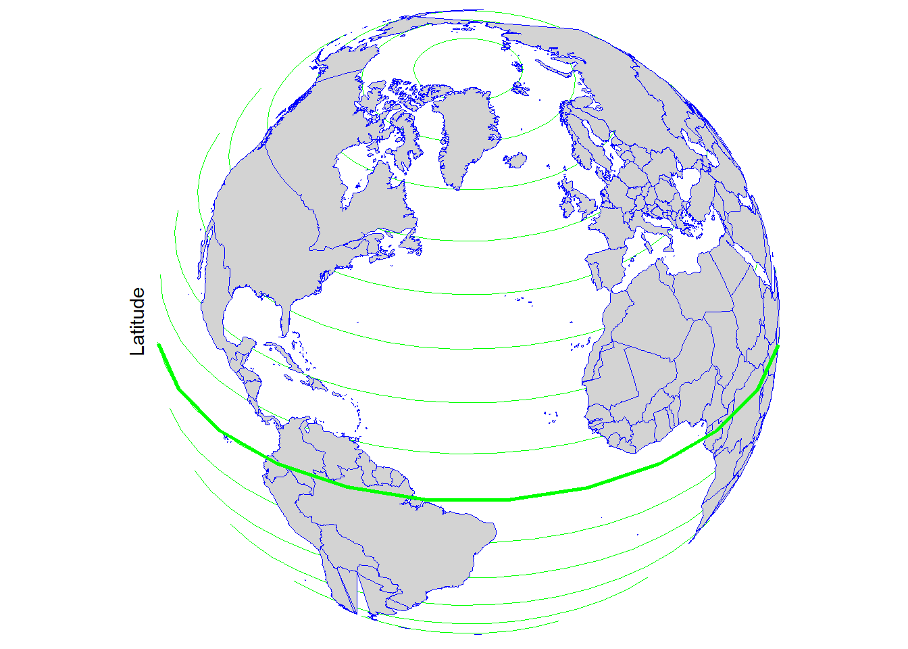
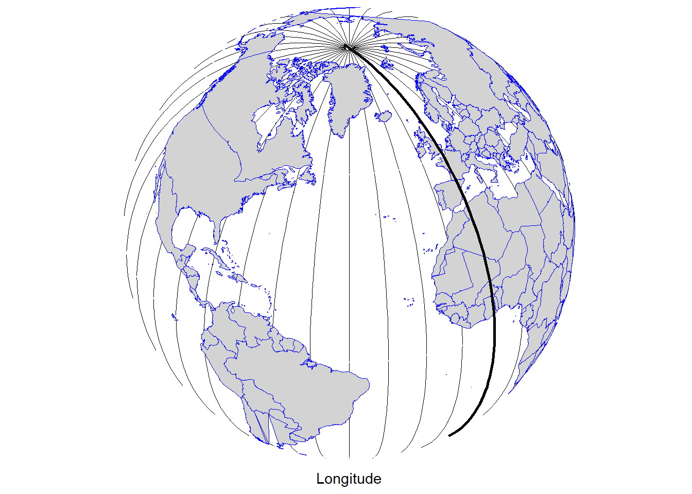
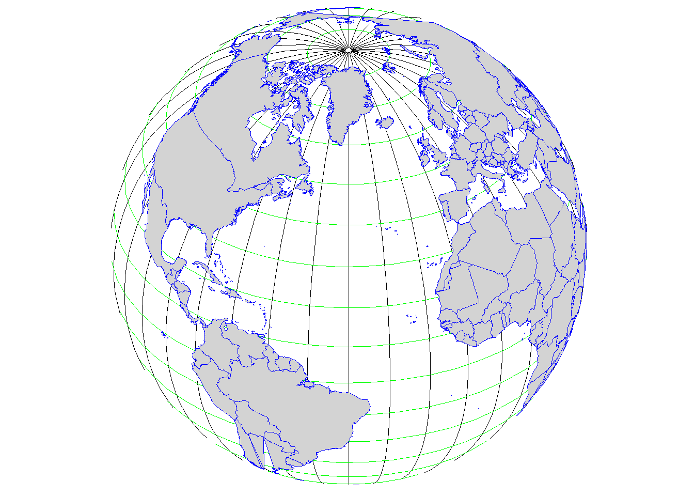
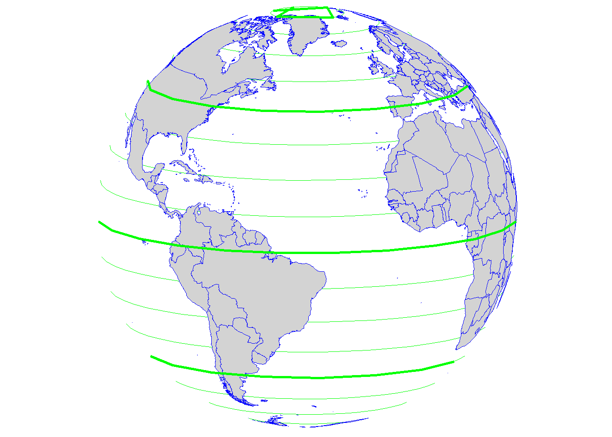
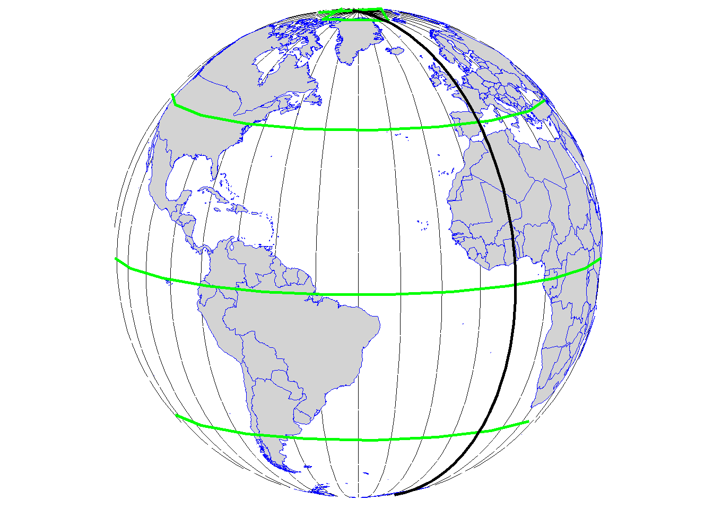
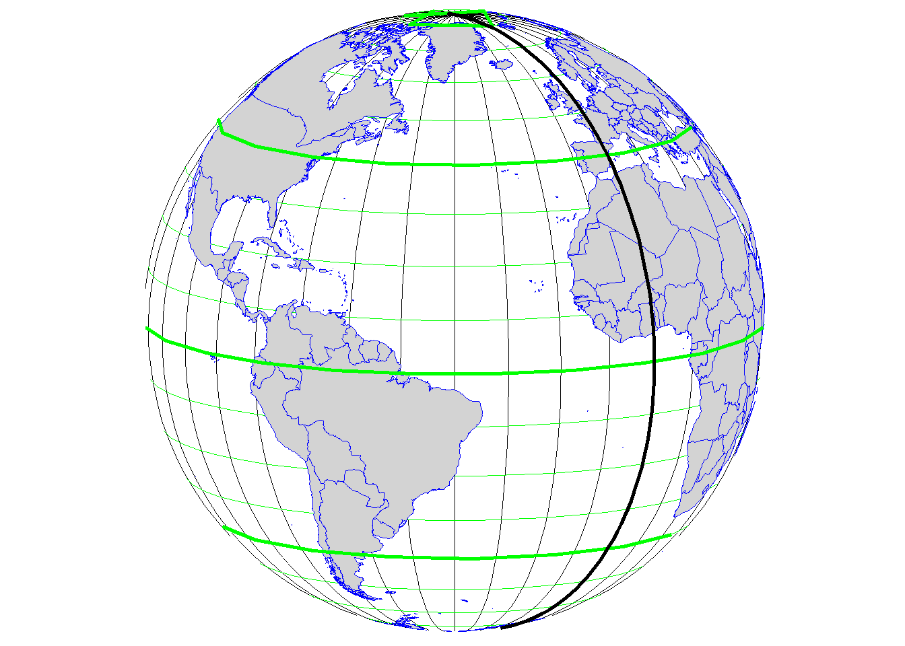
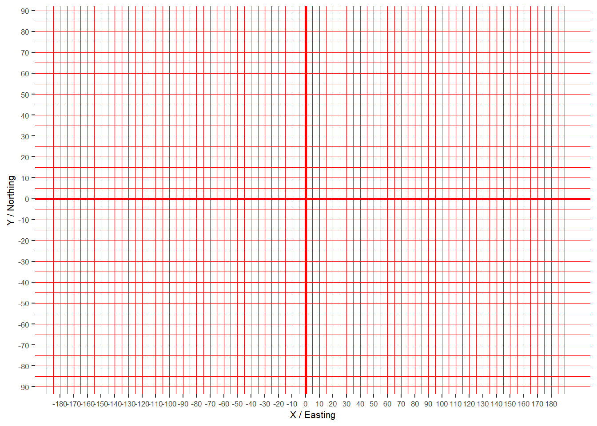
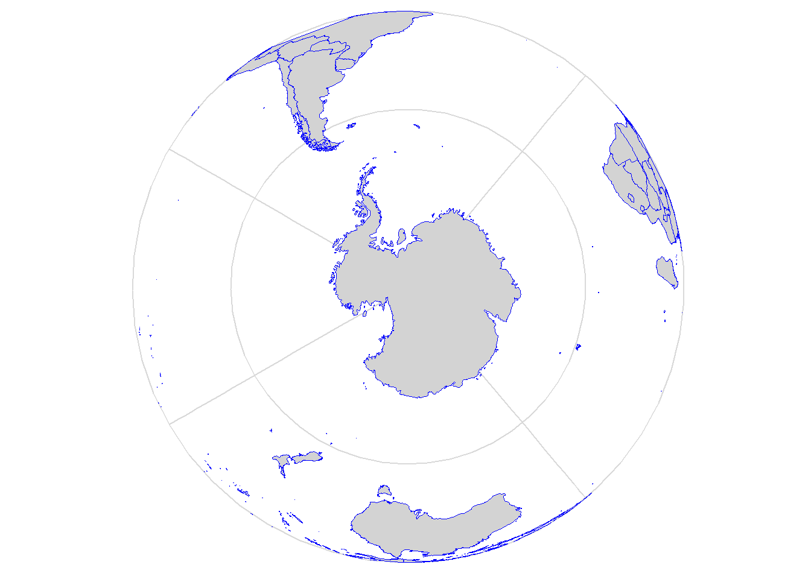
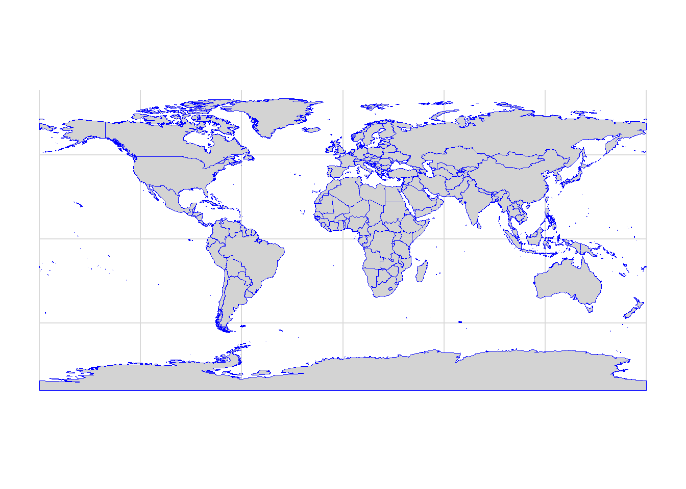

# Introduction to Coordinate Reference System {-}


The coordinate reference system (CRS) is one of the most important functions of GIS. It is a coordinate-based local, regional or global system used to locate geographical features that occupy a position in space, and it allows users to analyse geographic data using accurate locations and measurements.

(Coordinate reference systems and spatial reference system (SRS) are synonyms and are commonly interchanged.)

The two types of coordinate reference system in GIS are: 

- [Geographic coordinate system](https://thamesestuarypartnership.github.io/booklet/introduction-to-coordinate-reference-system.html#geographic-coordinate-system){target="_blank"} (GCS)

- [Projected coordinate system](https://thamesestuarypartnership.github.io/booklet/introduction-to-coordinate-reference-system.html#projected-coordinate-system){target="_blank"} (PCS)

For example in ArcMap, when a spatial data is created or added, the coordinate or spatial references may need to be set. 

<center></center>
<center>Spatial reference properties window in ArcMap</center>
<br>

Both geographic coordinate and projected coordinate systems will come with many options. 

<center></center>
<center>Coordinate reference systems in ArcMap</center>
<br>

So let's discuss what these are separately. 

## Geographic coordinate system {-}

Geographic coordinate system is used to define locations on the three-dimensional Earth. GCS shows *where* a certain location is on the surface of the Earth.

<center></center>
<center>Geographic coordinate system definew locations on the three-dimensional Earth</center>
<br>

Geographic coordinate system is defined by:  

- [Ellipsoid](https://bookdown.org/tep/gisbooklet/introduction-to-coordinate-reference-systems.html#ellipsoid){target="_blank"}

- [Datum](https://bookdown.org/tep/gisbooklet/introduction-to-coordinate-reference-systems.html#datum){target="_blank"}

- [Prime meridian](https://bookdown.org/tep/gisbooklet/introduction-to-coordinate-reference-systems.html#angular-units){target="_blank"}

- [Angular units](https://bookdown.org/tep/gisbooklet/introduction-to-coordinate-reference-systems.html#angular-units){target="_blank"} (degrees)

### Geodesy {-}

Geodesy is the science associated with the measurement and portrayal of the Earth. Geodesy is used to determine the size and shape of the Earth, as well its features (e.g. mountains) and elements (e.g. terrestrial gravity and tides). 

#### Ellipsoid {-}

Geodesists build simple mathematical models to be able to capture the shape of the Earth and its features. For this, they have adopted the **ellipsoid** (or spheroid) as the most basic model. This is also referred to as *geometric model*. 

<center></center>
<center>Ellipsoid</center>
<br>

The ellipsoid is an idealised representation of the physical Earth, with a completely smooth, uninterrupted surface.

:::note
**<i class="fa fa-exclamation"></i> Note**

Since the Earth is spinning around its axis, there is a slight flattening at the poles and a slight bulging at the equator, hence the ellipsoid is used as a model.

<center><iframe src="https://giphy.com/embed/1zlU57Bawc50fi3AwJ" width="100%" height="300" frameBorder="0"></iframe></center>
<br>

The **ellipsoid** has a longer semi-major axis (a) and a shorter semi-minor axis (b). The difference between the ellipsoid and the sphere is measured by its flattening (*f = (a-b)/a*), or the reduction in the minor axis relative to the major axis.

The circumference of the earth is about 1/300th smaller around the poles. This translates to the Earth being around 44km wider than it is tall.

<center></center>
<center>Ellipsoid with the semi-major (a) and semi-minor axis (b)</center>
<br>
:::

In addition to the flattening and bulging, the different topological features are also account for Earth's irregular, lumpy shape.  

<center></center>
<center>Irregular shape of the Earth *(simplified illustration)*</center>
<br>

So let's imagine the modeling process using the ellipsoid.

The ellipsoid placed on top of this lumpy shape won't be able to perfectly model the surface all around. It will only "fit" with the surface at a particular area. This is why the ellipsoid can only be applied at one part of the Earth at the time. 

<center></center>
<center>Ellipsoid used to model the Earth *(simplified illustration)*</center>
<br>

To be able to specify at which part of the planet the ellipsoid is applied to, **datums** are used.

#### Datum {-}

*Horizontal datums* model positions on the surface of the Earth using latitude (y) and longitude (x), while *vertical datums* are used to model elevations (z) accounting for terrain, bathymetry, water level and man-made structures. 

##### Horizontal datum {-}

A horizontal datum uses a reference ellipsoid that is "pinned" to the Earth at a fixed surface location. This reference location is called *marker* or *benchmark*.

<center></center>
<center>Ellipsoid with a marker *(simplified illustration)* <br> and a marker location in Kansas, USA (Source: Wikipedia)</center>
<br>

This marker is then used to assign angular units of longitude and latitude to locations at that particular area of the Earth. 

<center></center>
<center>Datum *(simplified illustration)*</center>
<br>

There are different datums designed for different parts of the world. In fact, almost every country has its own datum (*local datum*). For example, the datum NAD83 (North American Datum 1983) is used to model the North American continent and the NZGD2000 (New Zealand Geodetic Datum 2000) is used for New Zealand and its offshore islands.

<center></center>
<center>NAD83 and NZGD2000 *(simplified illustration)*</center>
<br>

The ellipsoid known as WGS84 or World Geodetic System 84 is the most widely used and well-known datum. 

WGS84 is *global datum* format. It uses the centre of the Earth to connect the ellipsoid and provides a generalised model for the whole of the planet.

<center></center>
<center>Local and global datum (WGS 84) *(simplified illustration)*</center>
<br>

##### Vertical datum {-}

As previously discussed, the shape of the Earth is not perfectly round and its surface is quite uneven: there are different topographic features (e.g. mountains, valleys, trenches). This uneven surface has an effect on Earth's gravity: higher density rocks will pull water creating a bulge, while water is drawn away from lower density rocks. Thus, gravity is different at different parts of the Earth. 

To overcome these gravitational differences, geodesists use the **geoid** to measure surface elevation. The geoid is also known as *gravity-related model*. 

<center><embed src="https://www.g-red.eu/geoid/geoidViewer.html" style="width:100%; height: 600px;"></center>
<center>This 3D model shows the variations in Earth's gravity and the elevation differences <br> (Source: [Geoid viewer](https://www.g-red.eu/geoid/geoidViewer.html){target="_blank"}) <br> *Use the tools on the left to interact with the model*</center>
<br>

Removing the effects of the winds and tides, and in fact land masses that cause gravitational differences, the geoid takes the global mean sea level as a base (as if the sea would uniformly cover the planet) to measure surface elevations. 

<center></center>
<center>Contrast of the geoid model with an ellipsoid *(modified)* (Source: USGS)</center>
<br>

At a certain location, vertical height will be given in reference to the geoid. 

The above mentioned WGS84 is used by Global Positioning System (GPS) satellites and can be used globally to obtain latitude, longitude and elevation coordinates at any location. However, at specific areas local datums can still provide better coverage than WGS84. For example, [OSGB36](https://bookdown.org/tep/gisbooklet/introduction-to-coordinate-reference-systems.html#british-national-grid-osgb-1936){target="_blank"} (Ordnance Survey National Grid reference system) is a better approximation to the geoid covering the British Isles than the global WGS84. 

:::note
**<i class="fa fa-exclamation"></i> Note**

Maps made using different datums will give different coordinates for the same position. This is called **'datum shift'**. 

The **GPS** consists of a system of 24 satellites, each orbiting the Earth every 12 hours on distinct orbits at a height of 20,200km and transmitting radio pulses at precisely timed intervals. To determine position, a receiver must make exact calculations from the signals, the known positions of the satellites and the velocity of light. Positioning in three dimensions (y,x,z) requires that at least four satellites are above the horizon and accuracy depends on the number of such satellites and their positions. 

GPS is very useful for locating objects that move and for direct capture of the location of fixed objects. However, accuracy will depend on the amount of satellites contributing. 

<center><iframe src="https://maps.esri.com/rc/sat2/index.html" width="100%" height="500" frameBorder="0"></iframe></center>
<center>Satellite map (Source: Esri) <br> *Zoom in and use the tools on the left to interact with the map*</center>
<br>
:::

### Angular units {-}

GCS use angular units to describe locations on the Earth's surface. *(Remember, this is based on the ellipsoid and the geoid.)* These are the latitude (φ) and longitude (λ) displayed on a spherical coordinate system and are measured in degrees.

<center></center>
<center>Latitude and longitude on an elipsoid (Source: Esri)</center>
<br>

Latitude lines run parallel to the equator and divide the Earth into 180 equally spaced sections from north to south. 



<center>Latitude lines running from east to west</center>
<br>

Longitude lines run perpendicular to the equator and converge at the poles. Longitudes are measured from zero to 180 degrees east or west of the **prime meridian** (0 degrees running through Greenwich, UK). 



<center>Longitude or meridian lines running from north to south</center>
<br>

This network of lines representing meridians and parallels are also known as *graticules*. 



<center>Graticular network</center>
<br>

The classic representation of latitude and longitude coordinates is in degrees, minutes and seconds (DMS). 

The example below shows London on the map with the coordinates displayed in degrees, minutes and seconds. 


```{=html}
<div class="leaflet html-widget html-fill-item" id="htmlwidget-8b22802543a7fef33602" style="width:100%;height:480px;"></div>
<script type="application/json" data-for="htmlwidget-8b22802543a7fef33602">{"x":{"options":{"crs":{"crsClass":"L.CRS.EPSG3857","code":null,"proj4def":null,"projectedBounds":null,"options":{}}},"calls":[{"method":"addTiles","args":["https://{s}.tile.openstreetmap.org/{z}/{x}/{y}.png",null,null,{"errorTileUrl":"","noWrap":false,"detectRetina":false,"minZoom":3,"maxZoom":3,"attribution":"&copy; <a href=\"https://openstreetmap.org/copyright/\">OpenStreetMap<\/a>,  <a href=\"https://opendatacommons.org/licenses/odbl/\">ODbL<\/a>"}]},{"method":"addMarkers","args":[51.509865,0.11809,null,null,null,{"interactive":true,"draggable":false,"keyboard":true,"title":"","alt":"","zIndexOffset":0,"opacity":1,"riseOnHover":false,"riseOffset":250},null,null,null,null,"51° 30' 35.5140'' N, 0° 7' 5.1312'' W",{"interactive":false,"permanent":true,"direction":"auto","opacity":1,"offset":[0,0],"textsize":"15px","textOnly":false,"className":"","sticky":true},null]},{"method":"addMiniMap","args":[null,null,"bottomright",150,150,19,19,-5,false,false,false,false,false,false,{"color":"#ff7800","weight":1,"clickable":false},{"color":"#000000","weight":1,"clickable":false,"opacity":0,"fillOpacity":0},{"hideText":"Hide MiniMap","showText":"Show MiniMap"},[]]},{"method":"addScaleBar","args":[{"maxWidth":100,"metric":true,"imperial":true,"updateWhenIdle":true,"position":"topright"}]},{"method":"addGraticule","args":[20,false,{"color":"#333","weight":1},null,null,{"interactive":false,"pointerEvents":"none","className":""}]}],"setView":[[51.509865,0.11809],3,[]],"limits":{"lat":[51.509865,51.509865],"lng":[0.11809,0.11809]}},"evals":[],"jsHooks":[]}</script>
```


<center>London</center>
<br>

The degrees, minutes and seconds format uses the sexagesimal (base 60) system which is difficult to use in the digital world. Instead, the decimal degrees format (base 10 system) is used. So let's see how to convert degrees, minutes and seconds to decimal degrees, and decimal degrees to degrees, minutes and seconds. 

**DMS to DD**

| Location   | DMS (degrees, minutes and seconds)      | DD (decimal degrees) |
| :---------:|:---------------------------------------:| :-------------------:|
| London, UK | 51° 30' 35.5140'' N, 0° 7' 5.1312'' W   | ???                  |

Leaving the degree value untouched, divide the minute with 60 and the second with 3600. Then, add them up (degree + minute + second). The final value will be the decimal degrees format. 

Let's take the latitude and latitude values separately from the above example. 

Latitude: 51 degrees <span style="color:red;">30</span> minutes <span style="color:green;">35.5140</span> seconds

D (51 degrees) + M (<span style="color:red;">30</span>/60) + S (<span style="color:green;">35.5140</span>/3600) = 51.509865°

Longitude: 0 degrees <span style="color:red;">7</span> minutes <span style="color:green;">5.1312</span> seconds

D (0 degrees) + M (<span style="color:red;">7</span>/60) + S (<span style="color:green;">5.1312</span>/3600) = 0.118092°

| Location   | DMS (degrees, minutes and seconds)    | DD (decimal degrees)      |
| :---------:|:-------------------------------------:| :------------------------:|
| London, UK | 51° 30' 35.5140'' N, 0° 7' 5.1312'' W | 51.509865°, 0.11809°      |
<br>

**DD to DMS**

Here, let's take the latitude example only. 

Latitude: 51.<span style="color:blue;">509865</span>

1, The degree value remains the same:

Degrees = 51

2, The decimal value gets multiplied by 60 and the minute will be the number before the decimal separator: 

<span style="color:blue;">0.509865</span> x 60 = <span style="color:red;">30</span>.<span style="color:green;">5919</span>

Minutes = <span style="color:red;">30</span>

3, The remaining number after the decimal separator gets multiplied by 60 as well. This will give the second. 

<span style="color:green;">0.5919</span> x 60 = 35.514

Seconds = <span style="color:green;">35.514</span>

51° 30' 35.514''

When using DMS and DD, directions are specified by using N, E, S and W or +/-, respectively (i.e. y above the equator and x east of the prime meridian are positive, and y below the equator and x west of the prime meridian are negative).

Apart from DMS and DD, there is also a third format to display locations. This is called degrees decimal minutes (DDM). 

Degrees, minutes and seconds can also be converted to degrees decimal minutes.

**DMS to DDM**

Using the same example, starting from the back: 

Latitude: 51 degrees <span style="color:red;">30</span> minutes <span style="color:green;">35.5140</span> seconds

1, Divide the seconds by 60:

<span style="color:green;">35.5140</span>/60 = 0.5919

2, Add the minute: 

<span style="color:red;">30</span> + 0.5919 = 30.5919

3, The degree value remains the same: 

51°<span style="color:purple;">30.5919'</span>

Longitude: 0 degrees <span style="color:red;">7</span> minutes <span style="color:green;">5.1312</span> seconds

0°<span style="color:purple;">7.08552'</span>

| Location   | DMS (degrees, minutes and seconds)    | DD (decimal degrees)  | DDM (degrees decimal minutes) |
| :---------:|:-------------------------------------:| :--------------------:|:------------------------------:|
| London, UK | 51° 30' 35.5140'' N, 0° 7' 5.1312'' W | 51.509865°, 0.11809° | 51°30.5919', 0°7.08552'        |

<br>

:::note
**<i class="fa fa-lightbulb-o" aria-hidden="true"></i> Tip**

The website [PGC Coordinate Converter](){target="_blank"} is useful to convert all three formats.

[Batch Convert Tool](https://gridreferencefinder.com/batchConvert/batchConvert.php){target="_blank"} allows to convert UK Grid Reference, easting and northing, and decimal degrees formats. 

[Google Earth Pro](https://www.google.co.uk/earth/download/gep/agree.html){target="_blank"} also gives the option to display and convert all formats (Tools --> Options). 

<center></center>
<center>Screenshot of Google Earth Pro</center>
:::

#### Distance {-}

As mentioned before, latitude and longitude are applied to the three-dimensional Earth to describe location. However, they are not very useful to measure linear distances. This is because of the oblate spheroid shape of the Earth.

<span style="color:green;">Latitude</span> lines are concentric circles that become smaller near the poles while the distance between them remains roughly the same. (The distance between two degrees is slightly bigger at the poles than at the equator because of the flattening. The average distance between two latitude degrees is 111km. One minute of latitude is 1.86km which equals one nautical mile.)

| Latitude | Poles | 80° N/S | 40° N/S | Equator |
|:-:|:-----------:|:---------:|:---------:|:----:|
| Distance between two degrees | 111.69km | 111.66km | 111.03km | 110.57km |



<center>Latitude lines, the thicker lines mark the degrees at 40° N/S and at the equator</center>
<br>

<span style="color:black;">Longitude</span> lines converge at the poles and thus the distance between two meridians is different at every parallel. 

| Longitude | Poles | 80° N/S | 40° N/S | Equator |
|:-:|:-----------:|:---------:|:---------:|:----:|
| Distance between two degrees | - | 19.39km | 85.39km | 111.32km |



<center>Longitude lines, green parallels mark the degrees at 40° N/S and at the equator</center>
<br>

The equator is the only place where the linear distance corresponding to one degree latitude is approximately equal the distance corresponding to one degree longitude. *(Note that the illustration below shows the latitude and longitude lines at every 10° for easier visualisation.)*




<center>Distances are almost equal between the latitudes and longitudes at the equator</center>
<br>

:::note
**<i class="fa fa-exclamation"></i> Note**

Formula to calculate distances at one minute latitude and at one second latitude at the equator: 

1°= 110.57km

1' = 110.57/60 = 1.84283km

1'' = 1.84283/60 = 30.7138m

The same formula applies at one degree/minute/second at all latitude and longitude lines, except at the poles where the longitude lines converge. 

**Interesting fact**

<iframe src="https://www.linkedin.com/embed/feed/update/urn:li:share:6782609165647958017" height="700" width="100%" frameborder="0" allowfullscreen="" title="Embedded post"></iframe>
:::

##### Measuring distance on the sky {-}

When holding out one hand at arm’s length with one eye closed: 

- The little finger at an arms length is about 1° wide.

- Three middle fingers spans about 5°.

- The width of a fist is approximately 10°.

- The tip-to-tip span between the index and little finger is 15°.

- The tip-to-tip span between the thumb and little finger is 25°.

<center></center>
<center>A handy way to measure distances in the sky (Source: timeanddate.com)</center>
<br>

:::note
**<i class="fa fa-exclamation"></i> Note**

- 24 hours equals with Earth's full rotation around its axis (360°). 

- In one hour, Earth turns 15°. 

- In every four minutes, Earth turns one degree. 
:::

#### Direction {-}

Maps tend to show a straight line as a shortest distance between two points. 

<center><iframe src='https://thamesestuarypartnership.github.io/booklet/Figures/sl.html' frameborder='0' scrolling='no' style='width:100%;height:500px;' sandbox='allow-same-origin allow-forms allow-scripts allow-downloads allow-popups allow-popups-to-escape-sandbox allow-top-navigation-by-user-activation'></iframe></center>

<br>

However, on spherical Earth this is not the case. Instead, this is better illustrated with an arced line, called *great circle*, that shows the shortest distance between two points on a sphere.

<center><iframe src='https://thamesestuarypartnership.github.io/booklet/Figures/gc.html' frameborder='0' scrolling='no' style='width:100%;height:500px;' sandbox='allow-same-origin allow-forms allow-scripts allow-downloads allow-popups allow-popups-to-escape-sandbox allow-top-navigation-by-user-activation'></iframe></center>

<br>

Long-distance air traffic uses great circle routes routinely, plotting great circles to fly the shortest distance between two locations. 

<center><iframe src="https://thamesestuarypartnership.github.io/booklet/Figures/map.html" width="100%" height="500" frameBorder="0"></iframe></center>
<center>Flight path between London and Tokyo</center>
<br>

The video below explains and visualises the concept of great circles and straight lines really well. 

<center><iframe width="100%" height="450" src="https://www.youtube.com/embed/T41niy7sbgA" frameborder="0" allow="accelerometer; autoplay; clipboard-write; encrypted-media; gyroscope; picture-in-picture" allowfullscreen></iframe></center>
<center>Great Circles are Straight Lines - video</center>

<br>

This issue of distance and direction at different latitude and longitude is bridged and accounted for by most GIS software and discussed in the projected coordinate system section below. 

## Projected coordinate system {-}

Whilst GCS shows where a certain location is on the Earth’s surface, the projected coordinate system (PCS) shows *how the three-dimensional Earth should be projected on a two-dimensional flat surface* to accurately display that same location.

<center></center>
<center>Projected coordinate system</center>
<br>

### Map projection {-}

The transformation used to convert the three-dimensional spherical Earth onto a two-dimensional flat surface is referred to as a map [projection](https://bookdown.org/tep/gisbooklet/introduction-to-cartography.html#projection){target="_blank"}. A map projection uses mathematical formulas to relate spherical coordinates on the globe to planar coordinates using the Cartesian coordinate system.

#### Cartesian coordinate system {-}



<center>Cartesian coordinate system</center>
<br>

The Cartesian coordinate system assigns two coordinates to every point on a flat surface by measuring distances from an origin parallel to two axes drawn at right angles: 

- Horizontal (X / Easting) axis runs from east to west, ranging from +180° to -180°. 

- Vertical (y / Northing) axis runs from north to south, ranging from +90° to -90°.

The point at which the axes intersect is called the origin (0,0). Locations are defined relative to the origin, using the notation (x,y). 

When working with data in a geographic coordinate system, longitude values are equated with the X axis and the latitude values are equated with the Y axis.

#### Projection types {-}

As it was discussed in the [Introduction to Cartography](https://bookdown.org/tep/gisbooklet/introduction-to-cartography.html#projection){target="_blank"} chapter, during the map projection process distortion occurs affecting shape, area, distance and direction. Depending on the on the map’s content and purpose, different projection types and methods are used to minimalise distortion.

The three projection types are: 

- Cylindrical (normal, transverse, oblique)

These projections are used for the entire earth and for areas at the equator. 

- Conical (secant, tangent)

These projections are used for the mid-latitudes. 

- Planar/Azimuthal (Gnomonic, Stereographic, Orthographic)

These projections are used for the poles. 

<center></center>
<center>Projection types (Source: Wikipedia)</center>
<br>

#### Projection methods {-}

Within the projection types, there are different kind of methods used. The most commons are: 

##### Lambert Conformal Conic {-}

Lambert Conformal Conic is used for aeronautical charts, portions of the State Plane Coordinate System, and many national and regional mapping systems. It is also one of the best projection methods for middle latitudes. 

<center></center>
<center>Lambert Conformal Conic projection</center>

##### Azimuthal Equal Area {-}

This projection maintains land features at their true relative sizes while simultaneously maintaining a true sense of direction from the center. It is best suited for individual land masses that are symmetrically proportioned, either round or square.



<center>Azimuthal Equal Area</center>

##### Equidistant Cylindrical (Plate Carrée) {-}

This projection is neither equal-area nor conformal. One of the simplest of all map projections and one of the oldest. 



<center>Equidistant Cylindrical projection</center>

<br> 

There are also projection methods that use their own coordinate system.

##### Universal Transverse Mercator (UTM) {-}

UTM is based on the Mercator projection, but in the transverse rather than equatorial aspect: like wrapping a cylinder around the poles rather than around the equator.

<center></center>
<center>Transverse Mercator projection (Source: GISGeography)</center>
<br>

UTM divides the world into 60 grids that are all 6 degrees wide in longitude. 

Each grid has a central meridian of 500,000m and each is segmented into 20 latitude bands that are 8 degrees high.

Along the latitude lines, each grid lettered starting from *C* at 80°S, increasing until *X* (English alphabet), omitting the letters *I* and *O*. The last latitude band, *X* is extended an extra 4 degrees ending at 84°N latitude, thus covering the northernmost land on Earth. Latitude bands *A* and *B*, and *Y* and *Z* bands cover the western and eastern sides of the Antarctic and Arctic regions respectively.

Each grid is also divided into north (N) and south (S) depending on its location from the equator.

<center></center>
<center>UTM zones (Source: modified after [dmap.co.uk](http://www.dmap.co.uk/utmworld.htm){target="_blank"})</center>
<br>

<center><iframe src='https://thamesestuarypartnership.github.io/booklet/Figures/utm.html' frameborder='0' scrolling='no' style='width:100%;height:500px;' sandbox='allow-same-origin allow-forms allow-scripts allow-downloads allow-popups allow-popups-to-escape-sandbox allow-top-navigation-by-user-activation'></iframe></center>
<center>UTM zones <br> *Hover over the map*</center>

<br>

Using the UTM coordinate system, a location will be defined by the following parameters: 

- UTM zone number and letter

- Northing (Y) value which is the distance of the point from the equator, given in metres. 

- Easting (X) value which is the distance from the central meridian (longitude) of the used UTM zone, given in metres. 

Using again London as an example, the UTM is given as: 

| Location   | DMS (degrees, minutes and seconds)   | UTM                                 |      
| :---------:|:------------------------------------:|:-----------------------------------:|
| London, UK | 51° 30' 35.5140'' N, 0° 7' 5.1312'' W| 30U 699,978.99 mE / 5,710,464.32 mN |
<br>

##### State Plane Coordinate System {-}

This is the standard coordinate system for the United States and it is based on the Mercator and the Lambert Conformal Conic projections. The State Plane Coordinate System specifies positions in the Cartesian coordinate system for each state.

<center><iframe src='https://thamesestuarypartnership.github.io/booklet/Figures/state.html' frameborder='0' scrolling='no' style='width:100%;height:500px;' sandbox='allow-same-origin allow-forms allow-scripts allow-downloads allow-popups allow-popups-to-escape-sandbox allow-top-navigation-by-user-activation'></iframe></center>
<center>State Plane Coordinate System <br> *The map has labels and popups*</center>

##### British National Grid / OSGB 1936 {-}

The British National Grid reference system (also known as [Ordnance Survey National Grid](https://www.ordnancesurvey.co.uk/){target="_blank"}) is a system of geographic grid references used in Great Britain.

The British National Grid uses Transverse Mercator projected on the Airy spheroid.

This video below explains really well what the National Grid is.

<center><iframe width="100%" height="450" src="https://www.youtube.com/embed/yTTcMqsJ4CY" frameborder="0" allow="accelerometer; autoplay; clipboard-write; encrypted-media; gyroscope; picture-in-picture" allowfullscreen></iframe></center>
<center>What is the National Grid? - video</center>
<br>
<center></center>
<center>British National Grid</center>

<br>

Using the British National Grid, the London location example is given as: 

| Location   | DMS (degrees, minutes and seconds)   | NGR          |      
| :---------:|:------------------------------------:|:------------:|
| London, UK | 51° 30' 35.5140'' N, 0° 7' 5.1312'' W| TQ4708481119 |

<br> 

Special projection method for web-mapping: 

##### Web Mercator {-}

Web Mercator (aka Google projection, WGS 84/Pseudo-Mercator, Spherical Mercator or Mercator Auxiliary Sphere) is a special projection made for web-mapping programs (e.g. OpenStreetMap, Esri or CartoDB).

Web Mercator satisfies several specific requirements: 

- It supports simple kinds of analysis, such as calculation of distances.

- It computes fast. 

- It is conformal: local scale is the same in all directions.

<center><iframe src='https://thamesestuarypartnership.github.io/booklet/Figures/mercator.html' frameborder='0' scrolling='no' style='width:100%;height:500px;' sandbox='allow-same-origin allow-forms allow-scripts allow-downloads allow-popups allow-popups-to-escape-sandbox allow-top-navigation-by-user-activation'></iframe></center>
<center>Web Mercator projection <br> *Use the layer control on the topleft to change the basemap*</center>

#### Projection parameters {-}

The projection type and method are not enough to define a projected coordinate system. Parameters are also need to be set and these are specific to the projection.

The parameters specify the origin and customise a projection for the area of interest. Angular parameters use the geographic coordinate system units, while linear parameters use the projected coordinate system units

The best way to explain what projection parameters are is to look at how GCS and PCS works in practice using the London boroughs [shapefile](https://data.london.gov.uk/dataset/statistical-gis-boundary-files-london){target="_blank"} as an example. 

##### ArcMap {-}

With a right click on the layer, the *Layer Properties* can be viewed. And on the second tab, under *Source*, the *Projected Coordinate System* and the *Geographic Coordinate System* can be accessed. 

Under **Projected Coordinate System** the following parameters are given: 

- Projected Coordinate System: It is set as Transverse Mercator. 

- Projection: This is the projection method used. It is set as Transverse Mercator. 

- False Easting: False easting is a linear value applied to the origin of the x-coordinates. False easting values are usually applied to ensure that all x-values are positive. 

- False Northing: False northing is a linear value applied to the origin of the y-coordinates. False northing values are usually applied to ensure that all y-values are positive. False northing parameters can also be used to reduce the range of y-coordinate values. For example, if all y-values are greater than 5,000,000 meters, a false northing of -5,000,000 could be applied.

- Central Meridian: This defines the origin of the x-coordinates. 

- Scale Factor: This is a unitless value applied to the center point or line of a map projection and is usually slightly less than one. 

- Latitude Of Origin: This defines the origin of the y coordinates. 

- Linear Unit: PCS uses linear measurement for coordinates on the plane (e.g. metres, feet). 
<center></center>
<center>Projected Coordinate System in ArcMap</center>
<br> 

Under **Geographic Coordinate System** the following parameters are given: 

- Geographic Coordinate System: It is also set as British National Grid (OSGB 1936). 

- Datum: The datum that corresponds with the British National Grid (OSGB 1936). 

- Prime Meridian: Set at Greenwich.

- Angular Unit: Set in degrees.

<center></center>
<center>Geographic Coordinate System in ArcMap</center>
<br>

##### ArcGIS Pro {-}

In addition to the what is under **Projected Coordinate System** in ArcMap, in ArcGIS Pro there are also: 

- WKID: Well-known ID (WKID) is a unique identifier number. In PCS, the WKID for the British National Grid is 27700. 

- Authority: European Petroleum Survey Group ([EPSG](https://epsg.org/home.html){target="_blank"}) was a scientific organisation that carried out oil exploration surveys and compiled datums, spatial reference systems, Earth ellipsoids, coordinate transformations and related units of measurement with their own EPSG code (e.g. for British National Grid EPSG:27700). 

<center></center>
<center>Projected Coordinate System in ArcGIS Pro</center>
<br> 

The additional parameters in **Geographic Coordinate System** are: 

- WKID: In GCS, the well-known ID (WKID) for the British National Grid is 4277.

- Angular Unit: Angles are typically measured in radians rather than degrees. Since a geographic coordinate system uses degrees, a conversion factor must be provided. There are 2*pi radians in 360 degrees and 1 degree equals 0.0174532925199433 radians.

- Spheroid: This is the reference spheroid for the coordinate transformation. For the British National Grid this is [Airy 1830](https://www.ordnancesurvey.co.uk/newsroom/blog/ostn15-new-geoid-britain){target="_blank"}. 

- Semi-major axis: This is the radius from the center of the earth to the equator (see [ellipsoid](https://bookdown.org/tep/gisbooklet/introduction-to-coordinate-reference-systems.html#ellipsoid){target="_blank"}). 

- Semi-minor axis: This is the radius from the center of the earth to the pole (see [ellipsoid](https://bookdown.org/tep/gisbooklet/introduction-to-coordinate-reference-systems.html#ellipsoid){target="_blank"}).

- Inverse flattening: 1/f (see [ellipsoid](https://bookdown.org/tep/gisbooklet/introduction-to-coordinate-reference-systems.html#ellipsoid){target="_blank"}), this is the amount of flattening at each pole, relative to the radius at the equator.

<center></center>
<center>Geographic Coordinate System in ArcGIS Pro</center>
<br> 

:::note
**<i class="fa fa-exclamation"></i> Note** 

The projection method and parameters for the British National Grid is explained [here](https://desktop.arcgis.com/en/arcmap/10.3/guide-books/map-projections/great-britain-national-grid.htm){target="_blank"}. 

Each projection method has its own [projection parameter](https://www.bluemarblegeo.com/knowledgebase/global-mapper-21/projections.htm?TocPath=Supported%20Coordinate%20Systems%7C_____1){target="_blank"}. 

List of WKID for [geographic coordinate systems](https://desktop.arcgis.com/en/arcmap/10.3/guide-books/map-projections/pdf/geographic_coordinate_systems.pdf){target="_blank"} and [projected coordinate systems](https://desktop.arcgis.com/en/arcmap/10.3/guide-books/map-projections/pdf/projected_coordinate_systems.pdf){target="_blank"} in Esri. 
:::


## what3words {-}

[what3words](https://what3words.com/){target="_blank"} divided the world into 3 metre squares and gave each square a unique combination of three words. Unlike coordinates recorded using GPS devices, these three words will never change providing an accurate location at all times. 

<center></center>
<center>what3words</center>


## Summary {-}

:::note
**<i class="fa fa-edit fa-2x"></i>**

- Two types of coordinate reference systems (CRS) in GIS are: Geographic Coordinate Systems (GCS) and Projected Coordinate Systems (PCS). 

- GCS shows where a certain location is on the surface of the three-dimensional Earth.

- GCS is defined by: datum, prime meridian and angular units.

- A datum is the mathematical frame of reference that approximates the three-dimensional shape of the Earth for the purpose of measurement. It is based on an ellipsoid (geometric model used to capture the shape of the Earth). 

- Angular units (latitude (φ) and longitude (λ)) are used to describe locations on the Earth’s surface.

- Latitude and longitude can be expressed in three formats: degrees, minutes and seconds (DMS), decimal degrees (DD) and degrees decimal minutes (DDM). 

- PCS shows how the three-dimensional Earth should be projected on a two-dimensional flat surface. 

- A map projection uses mathematical formulas to relate spherical coordinates on the globe to planar coordinates using the Cartesian coordinate system.

- Map projections can be grouped by types (Cylindrical, Conical, Planar/Azimuthal). 

- Map projection types can be further grouped by methods (e.g. Lambert Conformal Conic, Albers Equal Area Conic or Equidistant Cylindrical). 

- Some projection methods use their own coordinate system (e.g. UTM, State Plane or British National Grid). 

- Web Mercator is a special projection made for web-mapping programs. 

- Each projection method has its own projection parameters for both GCS and PCS (e.g. false easting, false northing, central meridican, scale factor and so on) in a GIS software. 

- Coordinate systems can be specifically identified with a WKID. Apart from ESPG, [Esri](https://developers.arcgis.com/web-map-specification/objects/spatialReference/){target="_blank"} also defines coordinate systems with its own set of numbers. 
:::

<hr>

## Reference resources {-}

### Books {-}

- [Geographic Information Science and Systems](https://www.wiley.com/en-gb/Geographic+Information+Science+and+Systems%2C+4th+Edition-p-9781119031307){target="_blank"}
- [Map Projections: A Reference Manual](https://www.amazon.co.uk/Map-Projections-Reference-Manual-Bugayevskiy/dp/0748403043){target="_blank"}

### Free courses and tutorials {-}

- [Choose the right projection](https://learn.arcgis.com/en/projects/choose-the-right-projection/#){target="_blank"}
- [Coordinate Reference System and Spatial Projection](https://www.earthdatascience.org/courses/earth-analytics/spatial-data-r/intro-to-coordinate-reference-systems/){target="_blank"}
- [Introduction to Coordinate Systems](https://www.esri.com/training/catalog/5d8258be55cf937306d3bd63/introduction-to-coordinate-systems/){target="_blank"}
- [Map Projections](http://michaelminn.net/tutorials/gis-projections/){target="_blank"}
- [Navigation Basics: Fundamental Concepts in Aeronautical Navigation](http://www.free-online-private-pilot-ground-school.com/navigation-basics.html){target="_blank"}
- [The Nature of Geographic Information](https://www.e-education.psu.edu/natureofgeoinfo/){target="_blank"}

### Videos {-}

- [ArcGIS - Coordinate systems](https://www.youtube.com/watch?v=poQaom5Ql0Q){target="_blank"} - video series
- [Introducing Coordinate Systems and Map Projections](https://youtu.be/PICwxT0fTHQ){target="_blank"}
- [Introducing Coordinate Systems and Transformations](https://www.youtube.com/watch?v=6tmDxTAjux0){target="_blank"}

### Other {-}

- [A guide to coordinate systems in
Great Britain](https://www.bnhs.co.uk/2019/technology/grabagridref/OSGB.pdf){target="_blank"}
- [A Handy Guide to Measuring the Sky](https://www.timeanddate.com/astronomy/measuring-the-sky-by-hand.html){target="_blank"}
- [A Quick Guide to Using UTM Coordinates](https://www.maptools.com/tutorials/utm/quick_guide){target="_blank"}
- [Coordinate Systems: What's the Difference?](https://www.esri.com/arcgis-blog/products/arcgis-pro/mapping/coordinate-systems-difference/){target="_blank"}
- [Geographic coordinate systems](https://desktop.arcgis.com/en/arcmap/latest/map/projections/pdf/geographic_coordinate_systems.pdf){target="_blank"}
- [Geographic vs Projected Coordinate Systems](https://www.esri.com/arcgis-blog/products/arcgis-pro/mapping/gcs_vs_pcs/){target="_blank"}
- [Great Circle Mapper](http://www.gcmap.com/){target="_blank"}
- [How to measure Latitude & Longitude](https://www.longitudestore.com/how-big-is-one-gps-degree.html){target="_blank"}
- [Interactive Album of Map Projections 2.0](https://projections.mgis.psu.edu/){target="_blank"}
- [Latitude and Longitude Finder](https://www.latlong.net/){target="_blank"}
- [List of supported map projections in ArcGIS Desktop](https://desktop.arcgis.com/en/arcmap/latest/map/projections/list-of-supported-map-projections.htm){target="_blank"}
- [Map Projections](https://help.arcgis.com/en/geodatabase/10.0/sdk/arcsde/concepts/geometry/coordref/coordsys/projected/mapprojections.htm){target="_blank"}
- [Map Projection Parameters](https://www.fs.fed.us/r6/icbemp/spatial/fgdc/spatial_reference/map_Projection_Parameters.html){target="_blank"}
- [National Geodetic Survey Data Explorer](https://www.ngs.noaa.gov/NGSDataExplorer/){target="_blank"}
- [PROJ](https://proj.org/index.html){target="_blank"}
- [Projections and Coordinate Systems](https://courses.washington.edu/gis250/lessons/projection/){target="_blank"}
- [Projection parameters](http://www.geography.hunter.cuny.edu/~jochen/GTECH361/lectures/lecture04/concepts/Map%20coordinate%20systems/Projection%20parameters.htm){target="_blank"}
- [Spatial reference](https://spatialreference.org/){target="_blank"}
- [Spatial referencing and coordinate systems](https://www.geos.ed.ac.uk/~gisteac/gis_book_abridged/files/ch30.pdf){target="_blank"}
- [UTM Grid Zones of the World](http://www.dmap.co.uk/utmworld.htm){target="_blank"}
- [What is the geoid?](https://oceanservice.noaa.gov/facts/geoid.html){target="_blank"}
- [What is the Prime Meridian and why is it in Greenwich?](https://www.rmg.co.uk/discover/explore/prime-meridian-greenwich){target="_blank"}
